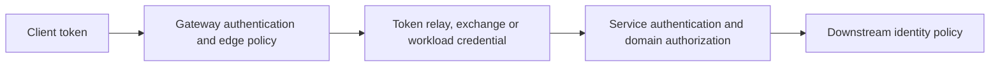

# Spring Cloud Security Identity And Trust Boundaries

An internal network is not an identity boundary. Every request crosses a trust transition:
external client to gateway, gateway to service, service to service, and workload to data or
messaging infrastructure.

## Identity Types

| Identity | Represents | Typical evidence |
|---|---|---|
| end user | human or external client acting on a resource | OIDC/OAuth2 subject and scopes/claims |
| client application | machine client authorized for an API | client credentials or signed assertion |
| workload | running service instance | mTLS certificate or platform workload identity |
| operator | administrative actor | privileged identity, MFA and audit trail |

Do not collapse all four into a shared client secret.

## Gateway Boundary



The gateway can authenticate, normalize selected headers and enforce coarse policies, but
the resource-owning service must enforce domain authorization. A downstream service should
not blindly trust user/tenant headers supplied by the external client.

## Token Propagation Choices

- **Relay original token:** preserves user context but broadens token audience/exposure.
- **Token exchange/on-behalf-of:** obtains a narrower downstream token where supported.
- **Client credentials:** represents the calling workload, not the original user.
- **mTLS/workload identity:** authenticates the service connection; application claims may
  still be needed for user-level authorization.

Validate issuer, audience, signature, expiry/not-before and required claims at every
resource server. Avoid logging bearer tokens.

## TLS And mTLS

TLS authenticates the server and protects transport. mTLS also authenticates the client
certificate. Define certificate authority, SAN/identity mapping, issuance, revocation,
rotation, trust-bundle distribution and expiry alerting.

A certificate can be valid yet rejected because the hostname/audience is wrong, an
intermediate is missing, clocks differ, the old trust bundle remains cached or policy maps
the principal incorrectly.

## Gateway Header Policy

At the edge:

- remove untrusted forwarded identity, tenant and role headers;
- reconstruct trusted context from validated credentials;
- apply explicit proxy-forwarding rules only from trusted hops;
- prevent hop-by-hop and routing-header abuse;
- cap headers/body sizes and reject malformed ambiguity;
- preserve trace/correlation identifiers without treating them as authorization evidence.

## Multi-Tenancy

Tenant identity must come from a trusted credential or server-owned association. Enforce it
in authorization and data access, not only URL routing. Include tenant context in audit
records but control metric/log cardinality and PII.

## Secret And Certificate Rotation

Use overlap where possible:

```text
publish new trust/credential -> deploy clients capable of both -> switch issuer/key
-> verify all callers -> revoke old -> remove old trust
```

For single-secret protocols, coordinate restart/reload and failure fallback explicitly.
Test rotation before emergency expiry.

## Incident Diagnosis

| Status/symptom | Investigate |
|---|---|
| TLS handshake failure | DNS/SNI, chain, truststore, protocol/cipher, clock, mTLS client cert |
| 401 | missing/invalid token, issuer, audience, signature, expiry or authentication mapping |
| 403 | authenticated principal lacks resource/domain authorization |
| gateway succeeds, service rejects | token relay/exchange, downstream audience and claim mapping |
| only one pod fails | stale secret mount/cache, time drift, sidecar/trust bundle or deployment version |
| rotation causes outage | overlap order, cached connections, old trust removal or missed consumer |

## Interview Questions

**Is mTLS a replacement for OAuth2?** No. mTLS can authenticate workloads and encrypt the
connection; OAuth2 tokens commonly represent delegated client/user authorization and
resource scopes. They can complement each other.

**Should services trust authorization performed by the gateway?** They may rely on a
well-defined trusted gateway contract for coarse controls, but the service owning the
resource must protect domain authorization and must authenticate the gateway/context.

**What is the difference between 401 and 403?** 401 means valid authentication is absent or
failed; 403 means an authenticated identity is not authorized for the operation.

## Official References

- [Spring Security OAuth2](https://docs.spring.io/spring-security/reference/servlet/oauth2/index.html)
- [Spring Cloud Gateway reference](https://docs.spring.io/spring-cloud-gateway/reference/)

