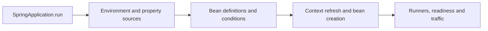

# Spring Boot And Container Interview Questions

<DocLabels items={[
  {label: 'Intermediate', tone: 'intermediate'},
  {label: 'Spring Boot 4', tone: 'foundation'},
  {label: '24 expandable answers', tone: 'production'},
]} />

<DocCallout type="tip" title="Answer before expanding">

State the container phase or extension point, the object identity being published, one
failure symptom and the diagnostic evidence you would inspect before opening the answer.

</DocCallout>

Use the answers for revision, then trace the full behavior in
[Dependency Injection And Bean Resolution](../../development/spring-boot-internals/DEPENDENCY-INJECTION-BEAN-RESOLUTION.md),
[Bean Scopes And Lifecycle](../../development/spring-boot-internals/BEAN-SCOPES-LIFECYCLE.md),
and [Startup Extension Points](../../development/spring-boot-internals/STARTUP-EXTENSION-POINTS.md).

## Spring Boot

<ExpandableAnswer title="What are the main features of Spring Boot?">

Boot supplies opinionated auto-configuration, focused starter dependencies and dependency
management, embedded servers, externalized/type-safe configuration, executable packaging,
Actuator, observability integration, graceful shutdown and test support. It builds on
Spring Framework; it does not replace the container, MVC, transaction or data mechanisms.

</ExpandableAnswer>

<ExpandableAnswer title="How does a Spring Boot application start?">

`SpringApplication.run` determines the application type, prepares the environment,
creates an `ApplicationContext`, applies initializers and listeners, loads bean definitions,
refreshes the context, creates non-lazy singletons, starts the embedded server, invokes
runners and publishes availability events. A production diagnosis uses startup steps and
the condition report instead of assuming this is one opaque operation.

</ExpandableAnswer>

<ExpandableAnswer title="What does `@SpringBootApplication` contain?">

It combines `@SpringBootConfiguration`, `@EnableAutoConfiguration` and `@ComponentScan`.
The primary class should normally sit in a root application package so scanning is narrow
and predictable. Auto-configuration imports conditional infrastructure; component scanning
discovers application definitions. They are different registration mechanisms.

</ExpandableAnswer>

<ExpandableAnswer title="What is a Spring Boot starter?">

A starter is a curated dependency descriptor for one capability. Boot 4 introduced more
focused main and test starters, so choose the starter that owns the technology and allow
the Boot BOM to select compatible transitive versions. A starter adds classpath candidates;
conditions still decide which auto-configuration becomes active.

</ExpandableAnswer>

<ExpandableAnswer title="How do you disable an auto-configuration?">

Exclude the class through `@SpringBootApplication(exclude = ...)` or the
`spring.autoconfigure.exclude` property. First inspect why it matched using the condition
report. Exclusion is appropriate when the capability is intentionally absent, but it can
hide a missing property or accidental dependency.

</ExpandableAnswer>

<ExpandableAnswer title="How does auto-configuration back off?">

Auto-configuration uses conditions such as `@ConditionalOnClass`,
`@ConditionalOnMissingBean`, `@ConditionalOnProperty` and web-application conditions.
A default guarded by `@ConditionalOnMissingBean` is created only when the application has
not supplied a compatible bean. Back-off is a contract that custom starters should verify
with isolated application-context tests.

</ExpandableAnswer>

## Dependency Injection And Bean Selection

<ExpandableAnswer title="What is the difference between BeanFactory and ApplicationContext?">

`BeanFactory` is the foundational registry, lookup, scope and dependency-creation
contract. `ApplicationContext` is the normal application container built on it and
adds automatic processor discovery, lifecycle coordination, events, resources,
messages and environment integration. A bare bean factory requires explicit
bootstrap for facilities such as annotation processing and AOP.

</ExpandableAnswer>

<ExpandableAnswer title="How do FactoryBean, BeanFactory and @Bean differ?">

`BeanFactory` is the container contract. `FactoryBean<T>` is a container extension
that produces an object: lookup by `name` returns the product and `&name` returns the
factory. `@Bean` marks a Java configuration method whose return value is registered
as a bean. Similar names do not imply interchangeable roles.

</ExpandableAnswer>

<ExpandableAnswer title="Constructor injection or setter injection?">

Use constructor injection for required dependencies: it makes invalid construction
impossible, supports final fields and makes plain-Java testing direct. Setter injection is
reasonable for truly optional reconfiguration. A long constructor is design feedback,
not a reason to hide dependencies with field injection.

</ExpandableAnswer>

<ExpandableAnswer title="How does Spring select a constructor when several exist?">

A single constructor is used without `@Autowired`. With several constructors, one
required annotated constructor wins. Multiple constructors may be optional
candidates with `@Autowired(required = false)`; Spring selects the greediest
satisfiable candidate and can fall back to a primary/default constructor. Prefer one
unambiguous constructor so optionality is expressed in parameters, not overloads.

</ExpandableAnswer>

<ExpandableAnswer title="How do @Autowired, @Inject and @Resource differ?">

`@Autowired` is Spring-specific and resolves primarily by type with qualifier and
candidate-ranking support. Jakarta `@Inject` provides similar type-oriented
injection without Spring's `required` attribute. Jakarta `@Resource` is name-oriented
and supports fields or setter methods, not constructor injection. Constructor
injection without an annotation remains the normal default for one constructor.

</ExpandableAnswer>

<ExpandableAnswer title="What is the difference between `@Bean` and `@Component`?">

`@Component` makes an application-owned class discoverable by scanning. `@Bean` registers
the result of a factory method, which is useful for third-party types or explicit
infrastructure construction. Both produce container-managed beans and can be processed or
proxied; how their definitions are discovered differs.

</ExpandableAnswer>

<ExpandableAnswer title="How do you resolve bean ambiguity?">

Use a semantic `@Qualifier` when the injection point needs a specific strategy, `@Primary`
when one candidate is the genuine default, or inject a `List`/`Map` when all strategies are
part of the design. Avoid resolving business policy through accidental bean names.

</ExpandableAnswer>

<ExpandableAnswer title="What is the difference between `@Primary` and `@Order`?">

`@Primary` resolves one candidate for single-value injection. `@Order` or `Ordered`
controls the sequence of a collection or a framework chain when that consumer honors
ordering. It does not generally control bean initialization; express lifecycle dependencies
explicitly.

</ExpandableAnswer>

<ExpandableAnswer title="Constructor dependency, @DependsOn or @Order—which controls creation?">

Use a constructor parameter for a real object dependency; Spring must obtain that
dependency before constructing the dependent bean. Use `@DependsOn` for the unusual
case where initialization side effects must precede another bean. `@Order` sorts
supported collections, chains and runners; it does not guarantee singleton creation
order. For singleton shutdown, a `depends-on` relationship destroys the dependent
before its prerequisite.

</ExpandableAnswer>

<ExpandableAnswer title="How should a circular dependency be resolved?">

First redesign ownership: extract coordination, publish an event, reverse a dependency
through a focused interface, or pass required data as an argument. Constructor cycles fail
because neither instance can exist first. `ObjectProvider` or lazy lookup is acceptable
only for a deliberate lifecycle relationship, not as a default escape hatch.

</ExpandableAnswer>

<ExpandableAnswer title="Can a prototype bean injected into a singleton remain prototype-scoped?">

The scope still describes how the container obtains instances, but ordinary injection into
a singleton resolves once during singleton creation. Use an `ObjectProvider`, method
injection or a scoped proxy when each use needs a fresh/shorter-lived target, and define
who destroys resources because prototype destruction is not fully managed after creation.

</ExpandableAnswer>

<ExpandableAnswer title="When would you use @Lookup instead of ObjectProvider?">

Both can obtain a fresh or differently scoped bean from a singleton. `ObjectProvider`
makes lookup explicit and is usually easier to unit test. `@Lookup` asks Spring to
generate a subclass overriding a lookup method; the class/method cannot be final and
it does not work for instances returned by `@Bean` factory methods. Use either only
when repeated lookup is the real scope contract.

</ExpandableAnswer>

## Lifecycle And Extension Points

<ExpandableAnswer title="What is the Spring bean initialization callback order?">

After instantiation and dependency population, Spring invokes aware callbacks and
before-initialization post-processors. It then invokes `@PostConstruct`,
`InitializingBean.afterPropertiesSet()`, a configured custom init method, and
after-initialization processors that may return a proxy. On orderly destruction the
callback styles run as `@PreDestroy`, `DisposableBean.destroy()`, then a configured
custom destroy method.

</ExpandableAnswer>

<ExpandableAnswer title="What are Spring Aware interfaces and when should they be used?">

Interfaces such as `BeanNameAware`, `BeanFactoryAware` and
`ApplicationContextAware` receive container infrastructure after dependency
population and before initialization. They deliberately couple a bean to Spring.
Use them for infrastructure that genuinely needs container metadata; inject ordinary
application collaborators through constructors.

</ExpandableAnswer>

<ExpandableAnswer title="How do BeanDefinitionRegistryPostProcessor, BeanFactoryPostProcessor and BeanPostProcessor differ?">

A `BeanDefinitionRegistryPostProcessor` can add definitions. A
`BeanFactoryPostProcessor` changes definitions or factory metadata before normal
instances exist. A `BeanPostProcessor` acts on instances before and after
initialization and may publish a proxy. Creating application beans during the factory
post-processor phase can make them miss later injection or proxy processors.

</ExpandableAnswer>

<ExpandableAnswer title="What exactly does @Lazy defer?">

Definition-level `@Lazy` delays singleton creation until it is requested, but an
eager direct dependent can request it during startup. Injection-point `@Lazy` uses a
proxy that resolves the target on first use. Laziness moves initialization cost and
failure to first use; it does not fix a dependency cycle, broken configuration or
unsafe initialization.

</ExpandableAnswer>

<ExpandableAnswer title="How do parent and child ApplicationContexts resolve beans?">

A child can normally look up beans from its parent; the parent cannot see child-only
beans. Each context has a separate singleton registry, lifecycle and processor set.
A child may shadow a parent bean name, creating two identities, and a post-processor
in one factory does not automatically process beans owned by the other.

</ExpandableAnswer>

<ExpandableAnswer title="SmartInitializingSingleton, SmartLifecycle or runner—which should you use?">

Use `SmartInitializingSingleton` after regular non-lazy singletons exist, not as an
application-readiness signal. Use `SmartLifecycle` for phased start/stop of
long-running infrastructure. Use `ApplicationRunner` or `CommandLineRunner` for a
bounded Boot task after context refresh and before readiness. `@Order` on runners
orders their invocation, not bean construction.

</ExpandableAnswer>

## Shopverse Drill

If two payment providers implement the same interface, explain whether Shopverse needs a
default (`@Primary`), a named provider (`@Qualifier`) or a policy over all providers
(`Map<String, Provider>`). Include configuration validation and what happens when the
selected provider is disabled during a rolling deployment.

## Official References

- [Spring Boot auto-configuration](https://docs.spring.io/spring-boot/reference/using/auto-configuration.html)
- [Spring container overview](https://docs.spring.io/spring-framework/reference/core/beans/basics.html)
- [Spring BeanFactory API](https://docs.spring.io/spring-framework/reference/core/beans/beanfactory.html)
- [Spring autowired resolution](https://docs.spring.io/spring-framework/reference/core/beans/annotation-config/autowired.html)
- [Spring bean lifecycle callbacks](https://docs.spring.io/spring-framework/reference/core/beans/factory-nature.html)
- [Spring container extension points](https://docs.spring.io/spring-framework/reference/core/beans/factory-extension.html)

## Recommended Next

Continue with [Web And Data Questions](./SPRING-WEB-DATA-INTERVIEW.md).
