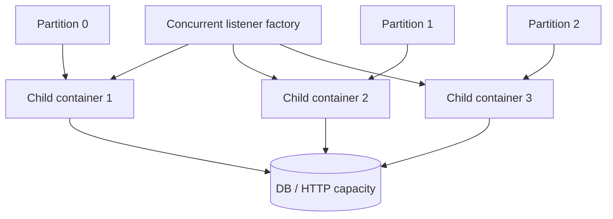

# Spring Kafka Listener Concurrency And Capacity

<DocLabels items={[
  {label: 'Advanced', tone: 'advanced'},
  {label: 'Listener capacity', tone: 'foundation'},
  {label: 'Rebalance safety', tone: 'production'},
  {label: 'Shopverse current baseline', tone: 'shopverse'},
]} />

Spring concurrency creates child listener containers. Useful parallelism is still
bounded by assigned partitions and by the database, HTTP, and CPU capacity used by
each listener.



## Effective Consumer Count

```text
group consumers = service replicas x listener concurrency
useful active consumers <= assigned topic partitions
```

Multiple `@KafkaListener` endpoints create separate containers. `@RetryableTopic`
also creates retry and DLT container infrastructure. Count all consumer threads,
not only the primary listener annotation.

### What `concurrency = "2"` Means

`concurrency` is a Spring Kafka container setting, not a broker-wide Kafka
setting. This listener creates two child `KafkaMessageListenerContainer`
instances, each with its own `KafkaConsumer` and consumer thread, inside **each
application instance**:

```java
@KafkaListener(
    topics = "order-events",
    groupId = "inventory-service",
    concurrency = "2"
)
public void consume(OrderEvent event) {
    process(event);
}
```

With three Inventory pods, the group has up to six primary consumers:

```text
3 replicas x concurrency 2 = 6 group members
```

Kafka, not the application, assigns and reassigns partitions among them:

| Topic partitions | Replicas x concurrency | Active consumers | Result |
|---:|---:|---:|---|
| 4 | 3 x 2 = 6 | 4 | two child consumers are idle |
| 6 | 3 x 2 = 6 | 6 | one processing lane per partition |
| 12 | 3 x 2 = 6 | 6 | each consumer owns about two partitions, subject to the assignor |

If one pod stops, Kafka rebalances its partitions to surviving group members. If
a new pod starts with the same group ID, it joins the group and Kafka rebalances
again. Do not manually map partitions to ordinary replicas.

The listener bean may be invoked concurrently by different child containers, so
it must be stateless or thread-safe. One partition still has only one owner in a
traditional consumer group at a time; concurrency does not make records from one
partition execute in parallel.

### Capacity Is Per Consumer Group, Not Global

There is normally no global consumer-count manager across all microservices.
Inventory, Payment, Analytics, and Notification have different group IDs,
processing costs, dependencies, SLOs, and scaling limits. Kafka independently
assigns partitions within each group, and every distinct group receives its own
logical copy of subscribed records.

Capacity-plan and operate each consuming responsibility separately:

1. measure sustainable processing rate and downstream cost per consumer;
2. choose topic partitions from peak throughput, ordering, skew, recovery, and
   broker constraints;
3. configure modest per-pod concurrency;
4. set replica limits from partitions and downstream capacity;
5. let Kafka perform assignment and rebalancing;
6. monitor and autoscale the deployment from that group's evidence when needed.

For one topic:

```text
replicas needed to expose every partition lane
  = ceiling(topic partitions / concurrency per replica)

replicas with every child consumer assigned
  <= floor(topic partitions / concurrency per replica)
```

When the partition count is not divisible by concurrency, the last replica needed
for full partition coverage has idle child consumers. These formulas are planning
bounds, not desired replica counts. A hot partition, database pool, CPU limit,
retry storm, multiple-topic assignment, or slow external API can set a lower
useful limit.

<DocCallout type="shopverse" title="Current baseline">

Shared Shopverse configuration defaults listener concurrency to one and
`max.poll.records` to 50. This is a conservative baseline, not a measured optimum
for every topic. Capacity changes should be tested against current partition count,
key skew, database pool size, and retry traffic.

</DocCallout>

## Capacity Model

Approximate one sequential listener's sustainable service rate:

```text
records per second per child
  = 1 / average end-to-end processing seconds
```

At 50 ms per record, the idealized ceiling is 20 records/second before poll,
commit, network, lock, and retry overhead. Size from p95/p99 and peak bursts, not
only an average.

```text
required active children
  = ceiling(target records/second / measured records per child)
```

Then verify that partitions and downstream resources can support that number.

<DocCallout type="production" title="The smallest pool is the real bulkhead">

If six listener children call a five-connection datasource while HTTP traffic uses
the same pool, increasing Kafka concurrency can raise both lag and request latency.
Reserve or isolate capacity based on workload ownership.

</DocCallout>

## Poll Budget

The time to process records from a poll plus any deliberate delay must remain below
the consumer's poll interval budget. Large `max.poll.records`, slow downstream
calls, GC pauses, lock waits, or unbounded retries can cause the consumer to lose
its assignment and receive duplicate work.

Controls include:

- reduce records returned per poll;
- bound remote/database timeouts and retry attempts;
- use batch listeners only when batch failure semantics are designed;
- pause the container or partitions for controlled backpressure;
- keep CPU-heavy work off consumer threads only through an explicit bounded
  ownership design, not casual `@Async`.

## Retry Capacity

Retry topics shift delayed work to additional containers and partitions. Set retry
concurrency independently when failure traffic should not consume the full primary
capacity. Include retry and DLT rates in broker, connection-pool, and recovery
budgets.

<DocCallout type="mistake" title="More retry concurrency can amplify an outage">

When the dependency is still unhealthy, faster retry consumers create more failed
calls and more DLT traffic. Bound recovery rate and observe downstream saturation.

</DocCallout>

## Lag-Based Replica Autoscaling

For variable traffic, keep listener concurrency modest and scale pod replicas
from the consumer group's lag and event age. KEDA is one Kubernetes option; it
creates scaling metrics from Kafka group lag and normally avoids replicas beyond
the relevant partition count. KEDA scales **replicas**, while Spring concurrency
creates several consumers per replica, so configure `maxReplicaCount` with both
numbers in mind.

```yaml
apiVersion: keda.sh/v1alpha1
kind: ScaledObject
metadata:
  name: inventory-kafka-scaler
spec:
  scaleTargetRef:
    name: inventory-service
  minReplicaCount: 2
  maxReplicaCount: 12
  pollingInterval: 30
  cooldownPeriod: 300
  triggers:
    - type: kafka
      metadata:
        bootstrapServers: kafka:9092
        consumerGroup: inventory-service
        topic: shopverse.order.created
        lagThreshold: "1000"
        allowIdleConsumers: "false"
```

This is an illustrative manifest, not a ShopVerse deployment file. Derive the
threshold from acceptable event age, per-consumer throughput, startup time, and
backlog recovery SLO. Set authentication through Kubernetes secrets and KEDA
authentication resources rather than embedding credentials.

Autoscaling must also account for:

- partition count and partitions that actually have lag;
- `replicas x concurrency`, including retry containers;
- pod startup and group rebalance time;
- stabilization/cooldown to avoid scaling churn;
- database connections, provider rate limits, CPU, memory, and broker capacity;
- minimum replicas or explicit topic discovery when scaling from zero;
- scale-down behavior while records are in flight.

Lag alone can mislead: one poison record or hot key can create persistent lag that
additional replicas cannot divide. Alert on oldest-event age and per-partition lag
alongside the total.

## Rebalance And Rolling Deployment

A rolling deployment temporarily runs old and new replicas in the same group.
Partitions are revoked and reassigned; processing pauses and work not durably
committed may be delivered again.

Spring Kafka 4.0 can use Kafka's newer consumer rebalance protocol through
`group.protocol=consumer`, subject to compatible brokers and clients. Assignment is
server-driven under that protocol; client-side custom assignors are not applied in
the same way. Shopverse does not currently enable this property, so adopting it is
a proposed compatibility-tested rollout.

Safe rollout sequence:

1. prove old and new event contracts are mutually readable;
2. ensure duplicate delivery is safe;
3. verify readiness does not route traffic before listener dependencies are ready;
4. stop containers and drain bounded in-flight work on termination;
5. watch rebalance duration, assignment, lag, and error rate;
6. roll back without changing group identity or requiring a new schema.

## Hot Partitions And Ordering

One hot key can dominate a partition while other children are idle. Increasing
concurrency does not split a partition. Diagnose records/bytes and processing time
per partition, then decide whether the key, partition count, or workload design can
change without violating ordering.

## ShopVerse Kafka Capacity Gap Matrix

The guidance above describes a production target. Repository evidence currently
shows a deliberately small baseline, not a completed capacity-management system.

| Capability | Current ShopVerse evidence | Closure acceptance criteria |
|---|---|---|
| consumer concurrency | shared configuration exposes `KAFKA_LISTENER_CONCURRENCY` and defaults to `1`; Compose keeps independent overrides for Order, Inventory, and Payment | document a measured value per consumer group and prove it stays within partition and downstream limits |
| poll size | shared default is `max.poll.records=50`; Compose currently overrides the three Saga services to `25` | load-test each listener and prove the worst-case poll completes within its poll budget |
| topic capacity | no version-controlled topic provisioning or explicit partition-count declaration was found | add a reviewed topic manifest/bootstrap step with topic, partitions, replication, retention, key, owner, and compatibility checks |
| retry timing | Saga listeners declare three attempts through `@RetryableTopic`; explicit exception classification, exponential backoff, jitter, and drain-rate limits are not declared at the listener | prove transient/permanent classification, bounded retry timing, DLT behavior, and controlled replay under dependency failure |
| lag observability | Prometheus alerts cover outbox publication failure and DLT arrival | expose and dashboard lag and oldest-event age per group/partition; alert on sustained growth, poll violations, and rebalance storms without high-cardinality labels |
| replica autoscaling | no KEDA `ScaledObject` or equivalent lag scaler is deployed | if variable load justifies it, add a security-reviewed scaler with measured threshold, min/max replicas, stabilization, scale-down, partition, and downstream-capacity tests |
| capacity evidence | Kafka infrastructure tests prove broker connectivity and publication boundaries | add repeatable load, backlog catch-up, hot-key, dependency-saturation, and retention-headroom evidence |
| multi-instance recovery | no focused test currently proves assignment, instance loss, rebalance, duplicate safety, and ordering together | run at least two consumers in one group, terminate one owner, and prove reassignment, contiguous progress, idempotent effects, and per-key order |

Do not close these rows by adding configuration alone. Store the workload shape,
command, environment, raw measurements, conclusion, owner, and review date so a
future change can reproduce the decision.

### Recommended Closure Order

1. Provision topics explicitly so partition and retention assumptions are
   reproducible.
2. Add lag, oldest-age, assignment, rebalance, poll, retry, DLT, and dependency
   saturation visibility.
3. Establish one-consumer throughput and safe downstream concurrency with a
   production-shaped workload.
4. Exercise multiple instances, instance loss, rolling restart, retry traffic,
   hot keys, and backlog recovery.
5. Tune poll/fetch settings and static concurrency from the evidence.
6. Add lag-based autoscaling only when fixed capacity cannot meet the workload
   economically and the partition/dependency ceilings are enforced.

Saga timeout, status-probe, reconciliation, and inbox/version gaps are tracked in
[Saga Liveness, Timeout, And Recovery](../../reliability/SAGA-LIVENESS-TIMEOUT-RECOVERY.md)
and [Inbox Pattern](../../reliability/INBOX-PATTERN.md). They remain correctness
prerequisites even when consumer capacity is sufficient.

## Evidence Checklist

- container and child count by listener ID;
- assigned partitions and rebalance duration;
- records consumed, processing time, error rate, and poll age;
- lag and catch-up time by partition;
- datasource/HTTP pool pending and timeout metrics;
- primary, retry, and DLT throughput;
- graceful-stop duration and duplicate effects during a rolling restart.

## Interview Questions

<ExpandableAnswer title="Why can listener concurrency exceed useful parallelism?">

Each child needs an assigned partition. Extra consumers remain idle when the group
has fewer available partitions, while still adding lifecycle and rebalance cost.

</ExpandableAnswer>

<ExpandableAnswer title="Why can lowering max.poll.records improve stability?">

It reduces the worst-case work between polls, helping the consumer stay within its
poll interval and limiting the redelivery batch after failure. Throughput must still
be measured.

</ExpandableAnswer>

<ExpandableAnswer title="What must be included when calculating Spring retry-topic capacity?">

Count the primary listener containers plus retry and DLT containers, their
partitions and concurrency, and the downstream work each delivery repeats.

</ExpandableAnswer>

<ExpandableAnswer title="Why can a rolling deployment cause duplicate business work?">

Rebalances revoke and reassign partitions. A record whose effect committed before
its offset was durably committed can be delivered to the new owner.

</ExpandableAnswer>

<ExpandableAnswer title="What changes with the Kafka 4.0 consumer rebalance protocol?">

Partition assignment becomes server-driven and incremental. Custom client-side
assignors are not used in the same way, so broker/client compatibility and rollout
evidence are required before enabling it.

</ExpandableAnswer>

## Official References

- [Concurrent message listener containers](https://docs.spring.io/spring-kafka/reference/4.0/kafka/receiving-messages/message-listener-container.html)
- [Listener container properties](https://docs.spring.io/spring-kafka/reference/4.0/kafka/container-props.html)
- [Rebalancing listeners and Kafka 4.0 protocol](https://docs.spring.io/spring-kafka/reference/4.0/kafka/receiving-messages/rebalance-listeners.html)
- [Pausing and resuming listener containers](https://docs.spring.io/spring-kafka/reference/4.0/kafka/pause-resume.html)
- [KEDA Apache Kafka scaler](https://keda.sh/docs/2.20/scalers/apache-kafka/)

## Recommended Next

Continue with [Retry, DLT And Recovery](./SPRING-KAFKA-RETRY-DLT-RECOVERY.md).
