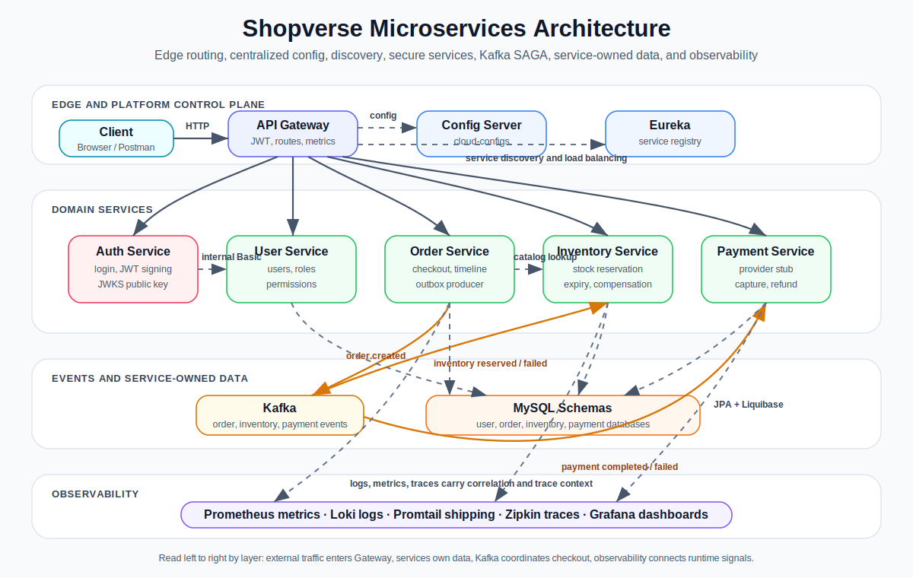
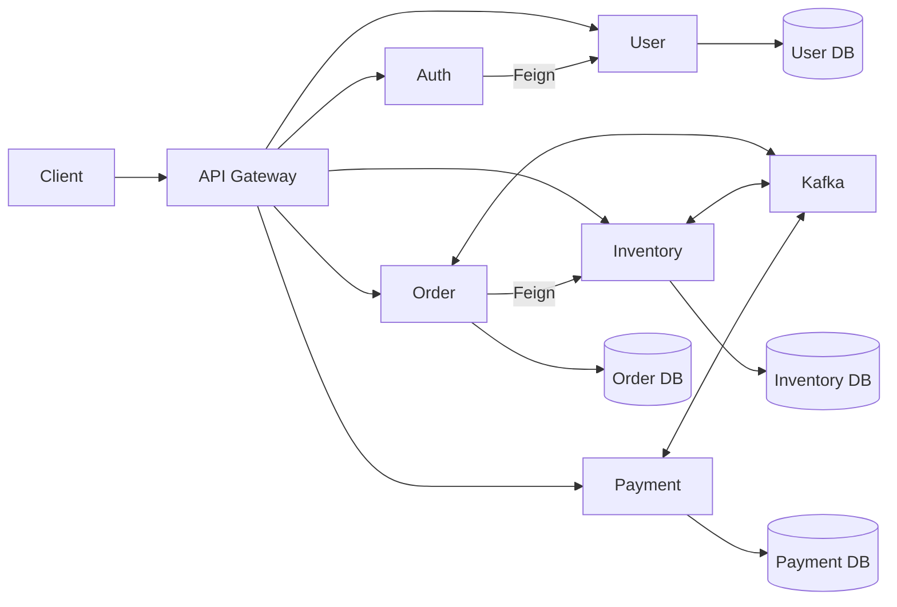

# Shopverse

Shopverse is an observable, failure-aware commerce microservices POC. It demonstrates secure, idempotent checkout across independently persisted Order, Inventory, and Payment services using Kafka choreography, transactional outbox, compensation, and end-to-end observability.



## Architecture



The Config Server centralizes runtime configuration, Eureka provides service discovery, and the observability stack combines Prometheus, Grafana, Loki, Promtail, Micrometer Tracing, and Zipkin.

## Core Capabilities

- RSA-signed JWT access tokens, JWKS, expiry validation, roles, permissions, and ownership authorization
- API Gateway routing, service discovery, Spring Cloud LoadBalancer, and Feign clients
- independent MySQL schemas managed by Liquibase and Spring Data JPA
- idempotent checkout with persistent order timeline
- optimistic inventory locking, reservation expiry, and payment compensation
- Kafka choreography with retries, DLT persistence, replay audit, and transactional outbox
- annotation-based Resilience4j RateLimiter, Bulkhead, Retry, CircuitBreaker, and fallback
- structured JSON logs, correlation propagation, Prometheus metrics, Grafana dashboards, and Zipkin traces
- JUnit, Mockito, Spring test slices, Testcontainers, and bounded verification modes
- Docker Compose, GitHub Actions, and Jenkins pipelines

Run the POC with the [complete Shopverse demo](documentation/docs/case-study/COMPLETE-DEMO.mdx).
The exact implementation matrix is in [Features and demonstrations](documentation/docs/reference/FEATURES-AND-DEMOS.md).

## Services

| Service | Port | Responsibility |
|---|---:|---|
| API Gateway | 8080 | routing, edge security, correlation, metrics |
| Auth Service | 8081 | login, JWT signing, JWKS |
| User Service | 8082 | users, roles, permissions, internal authentication |
| Order Service | 8083 | checkout, ownership, SAGA timeline |
| Payment Service | 8084 | payment state, simulation, reconciliation, refund |
| Inventory Service | 8086 | stock, reservations, expiry, compensation |
| Discovery Server | 8761 | Eureka registry |
| Config Server | 8888 | centralized configuration |

## Quick Start

Prerequisites:

- Docker Desktop with Docker Compose v2
- Git
- Java 21 and Node.js 20+ only when running services or documentation outside Docker
- at least 8 GB memory available to Docker for the complete local stack

Create a local `.env` from the repository template, validate the Compose model,
then start:

```powershell
Copy-Item .env.example .env
docker compose config
docker compose build
docker compose up -d
docker compose ps
```

Replace placeholder values in `.env` before exposing the stack beyond a local
POC. Wait until Config Server, Discovery Server, MySQL, and application
containers report healthy before testing checkout.

Use the API Gateway for application requests:

```text
http://localhost:8080
```

Key interfaces:

| Tool | URL |
|---|---|
| Eureka | `http://localhost:8761` |
| Config Server | `http://localhost:8888` |
| Grafana | `http://localhost:3000` |
| Prometheus | `http://localhost:9090` |
| Zipkin | `http://localhost:9411` |

Docker configuration and command explanations are in [docker/README.md](docker/README.md).

## Checkout Example

First obtain a token from `POST /auth/login`, then call:

```http
POST /api/v1/orders/checkout
Authorization: Bearer <token>
Idempotency-Key: checkout-user-42-cart-9001
X-Correlation-Id: demo-checkout-9001
Content-Type: application/json

{
  "items": [
    {
      "productId": 101,
      "quantity": 1
    }
  ]
}
```

The request persists Order state and an outbox event in one transaction. Kafka then drives Inventory and Payment asynchronously. Query `/api/v1/orders/{id}/timeline` to inspect the business journey.

## Documentation

Start with the [documentation index](documentation/docs/README.mdx).

The same Markdown is rendered as a reusable backend engineering Docusaurus
portal from `documentation/`, with Shopverse organized as a case study.
Run it locally with:

```powershell
cd documentation
npm install
npm start
```

| Area | Guide |
|---|---|
| Complete demo | [End-to-end Shopverse runbook](documentation/docs/case-study/COMPLETE-DEMO.mdx) |
| Architecture | [System design](documentation/docs/architecture/SYSTEM-DESIGN.md) |
| Distributed systems | [Fundamentals](documentation/docs/architecture/DISTRIBUTED-SYSTEMS-GENERIC.md), [CAP and consistency](documentation/docs/architecture/DISTRIBUTED-CONSISTENCY-CAP.md), and [interview questions](documentation/docs/reference/DISTRIBUTED-SYSTEMS-INTERVIEW.md) |
| Features | [Features and demos](documentation/docs/reference/FEATURES-AND-DEMOS.md) |
| APIs | [Shopverse API guide](documentation/docs/development/API-GUIDE.md) and [REST design](documentation/docs/development/REST-API-GENERIC.md) |
| Security | [JWT, OAuth2, and Spring Security](documentation/docs/security/JWT-OAUTH2-SPRING-SECURITY.md) |
| Messaging | [Apache Kafka](documentation/docs/integration/APACHE-KAFKA.md), [Spring Kafka](documentation/docs/spring/SPRING-KAFKA.md), and [SAGA/outbox](documentation/docs/reliability/SAGA-OUTBOX.md) |
| Observability | [Observability architecture](documentation/docs/observability/OBSERVABILITY.md) and [operations](documentation/docs/observability/SHOPVERSE-OBSERVABILITY-OPERATIONS.md) |
| Data | [Database engineering](documentation/docs/data/DATABASE-ENGINEERING.md), [Hibernate](documentation/docs/data/HIBERNATE.md), [Liquibase](documentation/docs/data/LIQUIBASE-GENERIC.md), [Spring transactions](documentation/docs/spring/SPRING-TRANSACTIONS.md), and [caching principles](documentation/docs/architecture/CACHING-GENERIC.md) |
| Testing | [Shopverse testing](documentation/docs/development/TESTING.md) and [Spring Boot testing](documentation/docs/spring/SPRING-BOOT-TESTING.md) |
| Troubleshooting | [Debugging guide](documentation/docs/development/DEBUGGING.md) |

Service-specific APIs and configuration remain in each service README. Operational guides remain beside their deployment files:

- [Centralized configuration](config-server/README.md)
- [Observability deployment](observability/README.md)
- [Docker](docker/README.md)
- [Jenkins](jenkins/README.md)
- [GitHub Actions](.github/workflows/README.md)
