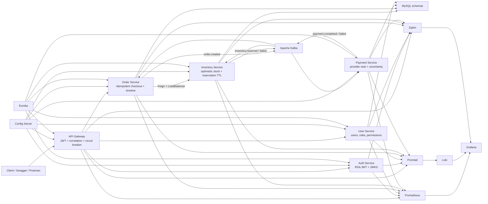

# Shopverse

Shopverse is a Spring Boot microservices proof of concept for an e-commerce backend. It demonstrates centralized configuration, service discovery, API gateway routing, asymmetric JWT security, service-to-service communication, choreography SAGA with Kafka, distributed tracing, centralized logging, metrics, Docker Compose, and GitHub Actions CI/CD.

## Contents

- [Architecture](#architecture)
- [Project Structure](#project-structure)
- [Quick Start](#quick-start)
- [Useful URLs](#useful-urls)
- [Important APIs](#important-apis)
- [Authentication](#authentication)
- [Choreography SAGA](#choreography-saga)
- [Docker](#docker)
- [Observability](#observability)
- [Centralized Config](#centralized-config)
- [GitHub Actions CI/CD](#github-actions-cicd)
- [Jenkins Pipeline](#jenkins-pipeline)
- [Future Roadmap](#future-roadmap)
- [Component Glossary](#component-glossary)
- [More Docs](#more-docs)

## Architecture



| Component | Port | Responsibility |
| --- | ---: | --- |
| Config Server | `8888` | Serves centralized config from `cloud-configs/`. |
| Discovery Server | `8761` | Eureka registry for service discovery. |
| API Gateway | `8080` | JWT-secured, load-balanced routing with correlation, tracing, circuit breaker, and GET retry. |
| Auth Service | `8081` | Receives login requests, delegates credential validation to User Service, signs JWTs, exposes JWKS. |
| User Service | `8082` | Manages users, roles, permissions, passwords, and DB-backed Basic credential validation for Auth Service. |
| Order Service | `8083` | Persistent orders, validated checkout, Inventory Feign client, and SAGA coordination. |
| Payment Service | `8084` | Persistent idempotent payment outcomes and SAGA events. |
| Inventory Service | `8086` | Persistent stock, optimistic locking, reservations, and compensation. |
| Kafka | `9092` | Event broker for the choreography SAGA demo. |
| MySQL | `3307` | Separate User, Order, Inventory, and Payment schemas. |
| Grafana | `3000` | Dashboards and Explore UI for logs/metrics/traces. |
| Prometheus | `9090` | Scrapes and stores metrics. |
| Loki | `3100` | Stores centralized logs. |
| Zipkin | `9411` | Stores distributed traces. |

Request flow:

```text
Client
  -> API Gateway
  -> Target service discovered through Eureka
  -> Service validates JWT through Auth Service JWKS
  -> Service handles request
  -> Order/Inventory/Payment coordinate through Kafka events
  -> Logs go to Loki through Promtail
  -> Metrics are scraped by Prometheus
  -> Traces are exported to Zipkin
  -> Grafana visualizes logs, metrics, and traces
```

## Implementation Coverage

| Capability | Shopverse implementation |
| --- | --- |
| Validation | Jakarta annotations on API records; `@Valid` at controller boundaries |
| Persistence | Spring Data JPA, transactional services, Liquibase, audit timestamps, entity graphs, optimistic locking |
| Caching | Read caching in Order, Inventory, and Payment with explicit eviction on writes |
| Central config | Config Server plus service-specific files in `cloud-configs/` |
| Discovery/load balancing | Eureka, Gateway `lb://` routes, and load-balanced OpenFeign clients |
| Gateway | Reactive routing, JWT validation, correlation propagation, tracing, circuit breaker, GET retry |
| Sync communication | OpenFeign for Auth -> User and Order -> Inventory |
| Async communication | Kafka choreography with idempotent producer settings and idempotent consumers |
| Resilience | Gateway circuit breaker/retry plus service `@CircuitBreaker`, `@Retry`, `@RateLimiter`, and `@Bulkhead` |
| Security | Asymmetric JWT/JWKS, resource-server validation, roles, method/API authorization, internal Basic authentication |
| Logs | Logstash JSON to stdout and rolling files, Promtail, Loki, Grafana |
| Metrics | Actuator/Micrometer, Prometheus, Grafana |
| Traces | Micrometer Tracing with Brave, W3C propagation, Zipkin |
| Delivery | Production-style Dockerfiles, Docker Compose, GitHub Actions, and Jenkins pipelines |

Logging is placed at request boundaries, external calls, state transitions,
fallbacks, compensation, and failures. Logging every method is deliberately
avoided because it creates noise and risks exposing credentials or tokens.

## Reliability Features

- Checkout requires `Idempotency-Key`; repeated requests return the existing
  order for the same customer.
- A database unique constraint is the final cross-instance duplicate guard.
- Kafka producer idempotence and consumer-side unique order records make event
  redelivery safe.
- Inventory uses `@Version` optimistic locking to prevent overselling.
- Reservations expire after five minutes and release stock automatically.
- Order timeline persists each SAGA state and is queryable by API.
- Payment models authorization, capture, decline, timeout, reconciliation, and
  refund through a provider abstraction and local stub.
- Payment listener failures retry and move to a DLT; persisted failures can be
  inspected and replayed through admin APIs.
- Grafana provisions a `Shopverse Commerce Operations` dashboard.

Redis and a distributed lock are intentionally not used for stock ownership.
The inventory database is the source of truth, and optimistic compare-and-swap
plus unique constraints provide correctness across service instances. A Redis
lock would add lock expiry and split-brain risks without replacing the required
database constraint.

## Project Structure

```text
shopverse/
  api-gateway/          Spring Cloud Gateway
  config-server/        Spring Cloud Config Server
  discovery-server/     Eureka Server
  auth-service/         Auth/JWT service
  user-service/         User, role, permission APIs
  order-service/        Persistent checkout, order, and timeline APIs
  payment-service/      Payment APIs
  inventory-service/    Inventory APIs
  saga/                 Choreography SAGA documentation
  cloud-configs/        Centralized service YAML config
  observability/        Prometheus, Loki, Promtail, Grafana, Zipkin config
  docker/               Docker commands and Compose/Dockerfile guide
  assets/               Shared README diagrams and images
  jenkins/              Local Jenkins pipeline and Docker setup
  .github/workflows/    GitHub Actions CI/CD
  docker-compose.yml    Full local stack
```

## Naming Convention

Shopverse uses two naming styles intentionally:

| Area | Convention | Example |
| --- | --- | --- |
| Folder names | lowercase kebab-case | `auth-service` |
| Docker Compose services | lowercase kebab-case | `auth-service` |
| Docker images | lowercase kebab-case | `shopverse/auth-service:local` |
| Docker containers | `shopverse-` + lowercase kebab-case | `shopverse-auth-service` |
| Spring application names | uppercase kebab-case | `AUTH-SERVICE` |
| Eureka service IDs | uppercase kebab-case | `AUTH-SERVICE` |
| Config Server files | uppercase Spring application name | `AUTH-SERVICE.yml` |
| Log/metric application labels | uppercase Spring application name | `AUTH-SERVICE` |

Auth service uses `auth-service` for folder, Docker, and deployment names. Its Spring/Eureka application name is `AUTH-SERVICE`.

## Quick Start

Create a local environment file:

```powershell
Copy-Item .env.example .env
```

The root `.env` is the intended place for local POC credentials and overrides.
It is excluded by `.gitignore`; `.env.example` contains only placeholders.
Do not commit real passwords, tokens, private keys, or copied production
configuration. A deployed environment should replace `.env` with a secret
manager or platform-managed secrets.

POC exception: the repository currently contains a known demo administrator
credential (`admin` / `Admin@123`) and local RSA signing keys so a fresh clone
can demonstrate login immediately. They are not production secrets. Do not
reuse them outside this POC; replace the bootstrap credential and mount managed
keys before any shared deployment.

Build images:

```powershell
docker compose build
```

Start the full stack:

```powershell
docker compose up -d
```

Check containers:

```powershell
docker compose ps
```

Smoke test:

```powershell
curl.exe http://localhost:8888/actuator/health
curl.exe http://localhost:8761/actuator/health
curl.exe http://localhost:8082/actuator/health
curl.exe http://localhost:8081/actuator/health
curl.exe http://localhost:8083/actuator/health
curl.exe http://localhost:8084/actuator/health
curl.exe http://localhost:8086/actuator/health
curl.exe http://localhost:8080/actuator/health
curl.exe http://localhost:8080/api/v1/orders/public/health
curl.exe http://localhost:8080/api/v1/payments/public/health
curl.exe http://localhost:8080/api/v1/inventory/public/health
```

Trigger the authenticated checkout SAGA after login:

```powershell
curl.exe -X POST http://localhost:8080/api/v1/orders/checkout `
  -H "Authorization: Bearer <token>" `
  -H "Idempotency-Key: checkout-user-42-cart-9001" `
  -H "X-Correlation-Id: checkout-demo-101" `
  -H "Content-Type: application/json" `
  -d '{\"items\":[{\"productId\":101,\"quantity\":1}]}'
```

Stop the stack:

```powershell
docker compose down
```

Stop and delete volumes:

```powershell
docker compose down -v
```

Use `down -v` carefully because it deletes MySQL data, Loki logs, Prometheus data, Grafana data, and service log volumes.

## Useful URLs

| Tool/API | URL |
| --- | --- |
| API Gateway | `http://localhost:8080` |
| Eureka Dashboard | `http://localhost:8761` |
| Auth Swagger UI | `http://localhost:8081/swagger-ui/index.html` |
| User Swagger UI | `http://localhost:8082/swagger-ui/index.html` |
| Order Swagger UI | `http://localhost:8083/swagger-ui/index.html` |
| Payment Swagger UI | `http://localhost:8084/swagger-ui/index.html` |
| Inventory Swagger UI | `http://localhost:8086/swagger-ui/index.html` |
| Grafana | `http://localhost:3000` |
| Prometheus | `http://localhost:9090` |
| Prometheus Targets | `http://localhost:9090/targets` |
| Loki | `http://localhost:3100` |
| Zipkin | `http://localhost:9411` |

Grafana login:

```text
admin / value from GRAFANA_ADMIN_PASSWORD
```

Use the value configured in the local `.env` file.

## Important APIs

Call application APIs through the Gateway at `http://localhost:8080`. Direct
service ports are useful for local Swagger and diagnostics.

| Method | Path | Access | Purpose |
| --- | --- | --- | --- |
| `POST` | `/auth/login` | Public | Validate DB credentials and return an RSA-signed JWT |
| `GET` | `/auth/.well-known/jwks.json` | Public | Publish the JWT verification key |
| `POST` | `/api/v1/orders/checkout` | Customer/Admin | Idempotently create an order and start the Kafka SAGA |
| `GET` | `/api/v1/orders/{id}/timeline` | Authenticated | Read the persisted business timeline |
| `GET` | `/api/v1/inventory/public/items` | Public | Read the product catalog and stock |
| `PUT` | `/api/v1/inventory/admin/items` | Admin | Create or replace product stock |
| `GET` | `/api/v1/payments/orders/{orderNumber}` | Customer/Admin | Read a payment outcome |
| `POST` | `/api/v1/payments/admin/simulation?mode=TIMEOUT` | Admin | Select the payment stub result |
| `POST` | `/api/v1/payments/admin/orders/{orderNumber}/reconcile` | Admin | Resolve a timed-out payment |
| `GET` | `/api/v1/payments/admin/dead-letters` | Admin | Inspect persisted payment DLT records |

Login request and response:

```http
POST /auth/login
Content-Type: application/json

{"username":"admin","password":"Admin@123"}
```

```json
{"token":"<signed-jwt>"}
```

Checkout request:

```http
POST /api/v1/orders/checkout
Authorization: Bearer <token>
Idempotency-Key: checkout-user-42-cart-9001
X-Correlation-Id: checkout-demo-101
Content-Type: application/json

{"items":[{"productId":101,"quantity":1}]}
```

Representative checkout response:

```json
{
  "id": 42,
  "orderNumber": "ORD-10042",
  "correlationId": "checkout-demo-101",
  "idempotencyKey": "checkout-user-42-cart-9001",
  "customerUsername": "admin",
  "status": "PENDING_INVENTORY",
  "totalAmount": 2499.00,
  "items": [{"productId": 101, "productName": "Wireless Keyboard", "quantity": 1, "unitPrice": 2499.00}],
  "createdAt": "2026-06-11T08:30:00Z"
}
```

Responses contain generated identifiers and timestamps, so exact values vary.
Detailed validation, authorization, and failure behavior is documented in each
service README.

## Authentication

The Auth Service uses asymmetric JWT:

- Auth Service receives `username` and `password` from `/auth/login`.
- Auth Service calls User Service through OpenFeign using `GET /api/v1/internal/users/authenticated`.
- Auth Service sends the submitted credentials to User Service with HTTP Basic for this internal login validation call.
- User Service validates the credentials against its user database using a DB-backed `UserDetailsService`, `DaoAuthenticationProvider`, and `DelegatingPasswordEncoder`.
- User Service returns authenticated user details and roles without returning the password hash.
- Auth Service signs tokens with an RSA private key.
- Resource services validate tokens using the public JWKS endpoint.
- JWKS endpoint: `http://localhost:8081/auth/.well-known/jwks.json`

Role names are aligned across seed data, JWT claims, and resource-service rules: customer APIs accept `ROLE_CUSTOMER`, and administrator APIs accept `ROLE_ADMIN`.

Login through the API Gateway:

```powershell
Invoke-RestMethod -Method Post `
  -Uri http://localhost:8080/auth/login `
  -Body (@{username='admin'; password='Admin@123'} | ConvertTo-Json) `
  -ContentType 'application/json'
```

Use the returned `token`:

```powershell
curl.exe http://localhost:8080/api/v1/orders `
  -H "Authorization: Bearer <token>"
```

Swagger authorization:

1. Open `http://localhost:8082/swagger-ui/index.html`.
2. Click **Authorize**.
3. Paste only the JWT token value.
4. Do not manually add `Bearer `; Swagger adds it.

## Choreography SAGA

Shopverse uses a simple choreography SAGA between Order Service, Inventory Service, and Payment Service. There is no central orchestrator. Each service listens for an event, does its local work, logs the action, and publishes the next event.

Success flow:

```text
POST /api/v1/orders/checkout
  -> Order Service publishes shopverse.order.created
  -> Inventory Service reserves stock
  -> Inventory Service publishes shopverse.inventory.reserved
  -> Payment Service completes payment
  -> Payment Service publishes shopverse.payment.completed
  -> Order Service logs the final confirmed status
```

Failure and compensation flow:

```text
Inventory failure
  -> Inventory Service publishes shopverse.inventory.failed
  -> Order Service logs order rejected

Payment failure
  -> Payment Service publishes shopverse.payment.failed
  -> Inventory Service releases the persisted reservation
  -> Order Service persists payment failure
```

Kafka topics:

```text
shopverse.order.created
shopverse.inventory.reserved
shopverse.inventory.failed
shopverse.payment.completed
shopverse.payment.failed
```

Follow demo logs:

```powershell
docker compose logs -f order-service inventory-service payment-service kafka
```

Useful Loki query:

```logql
{application=~"ORDER-SERVICE|INVENTORY-SERVICE|PAYMENT-SERVICE"} |= "Choreography saga"
```

Detailed SAGA event flow, payloads, and testing steps are in [saga/README.md](saga/README.md).

## Docker

Docker commands, Docker flags, Dockerfile explanations, and Docker Compose service breakdowns are maintained in [docker/README.md](docker/README.md).

## Observability

The observability stack uses:

- Prometheus for metrics.
- Loki for centralized logs.
- Promtail for log shipping.
- Grafana for dashboards and Explore.
- Zipkin for distributed traces.

Centralized logging flow:

```text
Spring Boot logs
  -> /app/logs/*.log and Docker stdout
  -> Promtail
  -> Loki
  -> Grafana
```

Metrics flow:

```text
Spring Boot Actuator /actuator/prometheus
  -> Prometheus
  -> Grafana
```

Tracing flow:

```text
Spring Boot Micrometer tracing
  -> Zipkin
  -> traceId appears in logs
```

Useful Loki queries in Grafana Explore:

```logql
{application="USER-SERVICE"}
{application="ORDER-SERVICE"}
{application="PAYMENT-SERVICE"}
{application="INVENTORY-SERVICE"}
{application="AUTH-SERVICE"}
{application=~".+"} | json | traceId="paste-trace-id-here"
```

Useful Prometheus queries:

```promql
up
sum by (application) (rate(http_server_requests_seconds_count[1m]))
sum by (service, outcome) (increase(shopverse_service_requests_logged_total[5m]))
```

More details are in [observability/README.md](observability/README.md).

## Distributed Tracing With Zipkin


Zipkin helps us follow one request across multiple services. When a request enters Shopverse through the API Gateway, Spring Boot observability creates or continues a trace. The same `traceId` is propagated to downstream services, while each service operation gets its own `spanId`.

In this POC:

- Gateway, Auth Service, User Service, Order Service, Payment Service, and Inventory Service create spans.
- Services export spans to Zipkin using the configured `ZIPKIN_ENDPOINT`.
- Structured JSON logs include `application`, `traceId`, `spanId`, and MDC fields, so a Zipkin trace can be connected back to Loki logs.
- Grafana can be used with Loki logs and Zipkin traces side by side.

Useful debug flow:

```text
Call API through Gateway
  -> open Zipkin at http://localhost:9411
  -> find the trace
  -> copy traceId
  -> search Loki logs with {application=~".+"} | json | traceId="..."
```

## Centralized Config

Runtime configuration is maintained in:

```text
cloud-configs/
```

Config Server runs with the native profile in Docker and mounts this folder as `/config`.

Shared settings live in:

```text
cloud-configs/application.yml
```

Service-specific settings live in:

```text
cloud-configs/API-GATEWAY.yml
cloud-configs/AUTH-SERVICE.yml
cloud-configs/USER-SERVICE.yml
cloud-configs/ORDER-SERVICE.yml
cloud-configs/PAYMENT-SERVICE.yml
cloud-configs/INVENTORY-SERVICE.yml
cloud-configs/DISCOVERY-SERVER.yml
```

Local service `application.yaml` files should mostly contain bootstrap config that imports Config Server.

Important: Config Server can provide runtime properties, but dependencies still belong in each service `build.gradle`.

## GitHub Actions CI/CD

Shopverse has three workflows:

```text
.github/workflows/ci.yml               validates, builds, tests, and smoke-tests the stack
.github/workflows/deploy.yml           builds/pushes GHCR images and optionally deploys over SSH
.github/workflows/jenkins-trigger.yml  optionally triggers local/on-prem Jenkins after CI
```

The detailed CI, deploy, secrets, variables, and troubleshooting guide is in [.github/workflows/README.md](.github/workflows/README.md).

At a high level, `Shopverse CI` runs on every push and pull request. `Shopverse Deploy` runs after CI succeeds on `main`, or manually from GitHub Actions. The Jenkins trigger workflow is optional and is useful when you want GitHub to hand off a successful build to your local or company-hosted Jenkins server.

## Jenkins Pipeline

Shopverse includes a Dockerized Jenkins setup in [jenkins/](jenkins/). It can build and test all services, build Docker images, optionally push images, and optionally run a Docker Compose smoke test.

Start Jenkins:

```powershell
docker compose -f jenkins/docker-compose.yml up -d
```

Open:

```text
http://localhost:8085
```

Default local login:

```text
admin / admin
```

Pipeline script path:

```text
jenkins/Jenkinsfile
```

Detailed setup, stages, one-service build demo, and official Jenkins docs links are in [jenkins/README.md](jenkins/README.md).

## Future Roadmap

### Current Delivery Status

The original roadmap is retained as the design record, but several phases are
now implemented:

| Capability | Status |
| --- | --- |
| Persistent Order, Inventory, Reservation, and Payment state | Implemented |
| Idempotent checkout and duplicate-event handling | Implemented |
| Optimistic stock locking and five-minute reservation expiry | Implemented |
| Payment uncertainty, reconciliation, and refund | Implemented |
| Queryable SAGA timeline | Implemented |
| Payment failure simulation API | Partial; API exists, browser console and broader fault injection remain |
| Retry, payment DLT persistence, and replay | Partial; extend the same recovery model to all Kafka consumers |
| Grafana commerce operations dashboard | Implemented baseline; alerts and SLOs remain |
| Last-item race demonstration | Planned automated scenario |
| AI Incident Investigator | Planned |

The most important next engineering work is a transactional outbox, automated
concurrency and end-to-end tests, and multi-replica-safe reservation expiry.

### Next Implementation Priorities

1. **Resource ownership authorization:** ensure a customer can read only their
   own order timeline and payment record; administrators retain cross-customer
   access. Add method-level tests for both allowed and denied cases.
2. **Transactional outbox:** persist each domain change and its outgoing event
   in one MySQL transaction, then publish the outbox record to Kafka. This
   closes the current failure window between database commit and
   `KafkaTemplate.send(...)`.
3. **Testcontainers integration tests:** run MySQL and Kafka in automated tests
   for duplicate checkout, last-item contention, retries, compensation, DLT,
   and replay. Keep unit tests, but make these distributed invariants executable.
4. **Multi-replica expiry ownership:** claim expired reservations in bounded
   batches so multiple Inventory instances do not perform duplicate scans and
   work. Preserve the current idempotent state transition as the final guard.
5. **Idempotency request fingerprint:** store a hash of the checkout payload
   with the key. Return the original response for the same request and reject
   reuse of the key with a different payload. Add retention/cleanup.
6. **External payment contract stub:** move the provider stub behind HTTP and
   use WireMock for timeout, malformed response, delayed callback, and retry
   tests. This exercises Feign/HTTP resilience rather than only an in-process
   strategy.
7. **Recovery and operations:** extend DLT persistence/replay to Order and
   Inventory consumers, add replay audit fields, Prometheus alerts, SLOs, and
   Grafana links from correlation ID to logs and traces.
8. **Security hardening after the POC:** remove the `{noop}` bootstrap password,
   move RSA keys and passwords to managed secrets, add refresh-token
   rotation/revocation through a proper authorization server, and remove demo
   credentials.

Relevant official references:

- [Spring Kafka transactions](https://docs.spring.io/spring-kafka/reference/kafka/transactions.html)
- [Testcontainers JUnit 5](https://java.testcontainers.org/quickstart/junit_5_quickstart/)
- [WireMock Docker](https://wiremock.org/docs/standalone/docker/)

### Product Direction

The long-term direction is to evolve Shopverse from a standard commerce microservices POC into a **resilient commerce simulator**:

> Shopverse is an observable, failure-aware commerce platform demonstrating reliable checkout across distributed services.

Order, Inventory, and Payment services are common in commerce systems. The project should stand out through the distributed-system problems it demonstrates: concurrency, stock contention, payment uncertainty, idempotency, retries, compensation, event recovery, and end-to-end observability.

The roadmap deliberately prioritizes depth over adding more generic services.

### Phase 1: Persistent Commerce State - Implemented

Orders, inventory, reservations, and payments are persisted so checkout state survives service restarts and can be inspected later.

Implemented domain state:

- Persist orders, order items, status transitions, and totals.
- Persist products, available stock, reserved stock, and reservation expiry.
- Persist payment attempts, provider references, status, and failure reasons.
- Give each checkout a stable `orderNumber`, `correlationId`, and idempotency key.
- Record domain timestamps and optimistic-lock versions.

Target outcome: restarting a service does not lose the checkout or SAGA state.

### Phase 2: Idempotent Checkout - Implemented

Retries with the same customer and idempotency key return the existing order, while database uniqueness and idempotent consumers prevent duplicate domain work.

Implemented header:

```http
POST /api/v1/orders/checkout
Idempotency-Key: checkout-123
```

Implemented behavior:

- Repeating the same request and key returns the original result.
- A duplicate request does not create another order.
- Inventory is not reserved twice.
- Payment is not charged twice.

Remaining: store a request fingerprint so reuse with a different payload is
rejected, and add an idempotency-record retention policy.

Target outcome: retries from clients, gateways, or networks are safe.

### Phase 3: Inventory Reservation And Expiry - Implemented

Temporarily reserve stock while payment is pending and release it automatically when the reservation expires. Optimistic locking and idempotent operations prevent overselling during concurrent checkouts.

Implemented reservation lifecycle:

```text
AVAILABLE
  -> RESERVED
  -> CONFIRMED

RESERVED
  -> EXPIRED
  -> RELEASED
```

Capabilities:

- Reserve stock during checkout instead of immediately reducing final stock.
- Add an expiry time, such as five minutes.
- Release expired reservations when payment is incomplete.
- Use optimistic locking to prevent overselling.
- Make reservation and release operations idempotent.
- Publish reservation success/failure and compensation events used by the SAGA.

Target outcome: two customers cannot successfully purchase the last available item.

### Phase 4: Payment Uncertainty - Implemented

Model payment as a stateful process instead of a simple success/failure decision. This demonstrates how the platform handles authorization, timeouts, delayed provider responses, reconciliation, and refunds.

Implemented payment states:

```text
PENDING
AUTHORIZED
CAPTURED
DECLINED
TIMED_OUT
REFUNDED
```

Capabilities:

- Separate authorization from capture.
- Simulate deterministic success, decline, and timeout outcomes.
- Reconcile a payment that timed out locally but completed at the provider.
- Prevent duplicate charges with a payment idempotency key.
- Refund captured payments.

Remaining: external delayed callbacks and a separate immutable payment-attempt
history.

Target outcome: Shopverse demonstrates that a timeout does not necessarily mean a payment failed.

### Phase 5: SAGA Timeline - Implemented

Order Service persists a business-level history of checkout transitions received across the SAGA.

Implemented queryable timeline:

```text
ORDER_CREATED
INVENTORY_RESERVATION_REQUESTED
INVENTORY_RESERVED
PAYMENT_PROCESSING
PAYMENT_COMPLETED
ORDER_CONFIRMED
```

Current entries include:

- timestamp
- order number
- correlation ID
- stage
- transition detail

Implemented API:

```http
GET /api/v1/orders/{id}/timeline
```

Target outcome: one API explains the complete business journey without manually reading logs from multiple services.

Remaining: persist service, trace/span IDs, Kafka topic/partition/offset, retry
count, and structured failure metadata with each timeline event.

### Phase 6: Failure Simulation - Partially Implemented

The payment simulation API supports success, decline, and timeout. Broader fault injection remains planned.

Add controlled failure scenarios for demonstrations and testing:

```text
PAYMENT_TIMEOUT
PAYMENT_DECLINED
INVENTORY_UNAVAILABLE
DUPLICATE_EVENT
KAFKA_PROCESSING_DELAY
SERVICE_UNAVAILABLE
```

The simulator should:

- Be enabled only in a dedicated demo/test profile.
- Support a failure type, affected service, delay, probability, and duration.
- Record which failure was injected.
- Show the resulting retry and compensation actions.
- Expose reset controls so every demo starts from a known state.

Target outcome: architecture behavior can be demonstrated on demand instead of waiting for accidental failures.

### Phase 7: Dead-Letter Topics And Replay - Partially Implemented

Payment consumer failures use retry topics, a DLT handler, persisted failure records, and admin replay. Order and Inventory still need the same recovery model.

Improve Kafka failure recovery:

- Configure bounded retries with backoff.
- Send exhausted messages to dead-letter topics.
- Preserve original topic, partition, offset, exception, and retry count.
- Add an admin API to inspect failed events.
- Add controlled replay after the underlying issue is fixed.
- Make consumers idempotent so replay cannot duplicate business actions.
- Audit who initiated a replay and what happened.

Target outcome: failed asynchronous work is recoverable and explainable.

### Phase 8: Operational Dashboard - Baseline Implemented

The provisioned `Shopverse Commerce Operations` dashboard is the baseline operational view. Additional panels, alert rules, SLOs, and data links remain planned.

Build a Grafana dashboard showing:

- active, completed, failed, and compensated SAGAs
- payment success, decline, timeout, and refund rates
- inventory reservation conflicts and expirations
- Kafka producer and consumer latency
- retry and dead-letter counts
- checkout latency percentiles
- top failure reasons
- links from an order to its Loki logs and Zipkin trace

Target outcome: the health of the checkout workflow is visible from one operational view.

### Distinctive Demo: Last Item Race

Use one remaining product and two concurrent customers to demonstrate stock contention, payment timeout, compensation, and successful retry. This scenario presents the major distributed-system capabilities of Shopverse in one understandable workflow.

The primary demonstration scenario should be:

1. A product has one unit remaining.
2. Two users submit checkout concurrently.
3. Inventory safely reserves the unit for only one user.
4. The winning user's payment times out.
5. The reservation expires or compensation releases it.
6. The second user retries successfully.
7. The complete journey is visible through the SAGA timeline, Kafka events, Loki logs, Prometheus metrics, and Zipkin traces.

This demonstrates concurrency control, distributed transactions, idempotency, compensation, asynchronous processing, and observability in one scenario.

### Phase 9: AI Operations Investigator

Use AI to investigate failed or slow checkout workflows using actual Shopverse telemetry rather than unsupported guesses. The investigator explains the root cause, cites evidence, identifies affected services, and recommends a recovery action.

#### Best Idea: AI Incident Investigator

The AI Incident Investigator analyzes failed or slow checkout SAGAs using real evidence from the order timeline, Kafka events, Loki logs, Prometheus metrics, and Zipkin traces. It returns a structured root-cause explanation, affected services, supporting evidence, and a recommended recovery action.

The recommended first AI capability is not a generic shopping chatbot. It is an **AI Commerce Operations Investigator** that explains failed or slow checkout workflows.

Suggested API:

```http
POST /api/v1/ai/incidents/analyze
```

Example request:

```json
{
  "correlationId": "checkout-demo-101"
}
```

The AI service should collect evidence from read-only tools:

```text
getOrder(orderNumber)
getSagaTimeline(correlationId)
getLogsByCorrelationId(correlationId)
getMetricsForService(service, timeRange)
getTrace(traceId)
getDeadLetterEvent(eventId)
```

Example structured response:

```json
{
  "status": "PAYMENT_TIMED_OUT",
  "rootCause": "The payment provider did not respond before the local timeout.",
  "affectedServices": ["ORDER-SERVICE", "PAYMENT-SERVICE"],
  "evidence": [
    "Inventory reservation succeeded.",
    "Payment remained pending after the configured timeout.",
    "Inventory compensation released the reservation."
  ],
  "recommendedAction": "Run payment reconciliation before retrying payment.",
  "confidence": 0.94
}
```

Implementation approach:

- Add a separate `ai-operations-service`.
- Use Spring AI so the model provider can be configured.
- Start with a hosted model or local Ollama instance.
- Require structured output mapped to a validated Java record.
- Give the model read-only tools first.
- Keep event replay, refunds, stock changes, and other mutations behind explicit human approval.
- Redact passwords, JWTs, API keys, payment data, and personal information before sending context to a model.
- Record model, prompt version, latency, token usage, evidence, and output for auditing.
- Provide a deterministic non-AI fallback when the model is unavailable.

Target outcome: an operator supplies an order or correlation ID and receives an evidence-based explanation of the distributed failure.

### Additional AI Ideas

After the operations investigator is reliable:

1. **Natural-language observability**

   Allow operators to ask questions such as "show payment timeouts in the last 30 minutes." The AI translates them into controlled Loki or Prometheus queries with restricted labels, time ranges, and datasources.

2. **Runbook assistant with RAG**

   Search Shopverse architecture documentation, known errors, runbooks, SAGA recovery procedures, and security guidance. Responses cite the internal documents used to produce the answer.

3. **Failure pattern summarization**

   Group similar failed SAGAs and identify recurring causes such as inventory contention, provider latency, malformed events, or configuration errors. This helps operators recognize systemic problems instead of investigating every failure independently.

4. **Semantic product search**

   Understand customer intent in requests such as "a laptop for Java development under INR 70,000" instead of relying only on exact keywords. This should be added only after Shopverse has a real product catalog.

5. **Fraud decision explanation**

   Explain which signals caused a transaction to be flagged and what a reviewer should inspect. Deterministic rules or a trained risk model make the decision; generative AI only explains the evidence.

6. **Inventory risk explanation**

   Explain unusual demand, reservation conflicts, and possible stockout risks using historical metrics. Forecasting claims should be avoided until the project contains sufficient validated historical data.

### AI Learning Path

The AI work can be learned incrementally:

1. Call one model from Spring Boot and return text.
2. Request structured JSON and map it to a Java record.
3. Add prompt templates and validation.
4. Add one read-only Spring AI `@Tool`.
5. Add the remaining observability tools.
6. Add evaluation cases with known incidents and expected findings.
7. Add RAG only after tool-based incident analysis works.
8. Add human-approved actions only after read-only behavior is secure and reliable.

No model training is required for the first version. The initial implementation uses an existing model and supplies Shopverse data through prompts and controlled tools.

Official starting references:

- [Spring AI ChatClient](https://docs.spring.io/spring-ai/reference/api/chatclient.html)
- [Spring AI structured output](https://docs.spring.io/spring-ai/reference/api/structured-output-converter.html)
- [Spring AI tool calling](https://docs.spring.io/spring-ai/reference/api/tools.html)
- [Ollama tool calling](https://docs.ollama.com/capabilities/tool-calling)

### Roadmap Success Criteria

Shopverse should eventually demonstrate:

- safe concurrent checkout
- persistent and idempotent distributed workflows
- realistic inventory and payment state machines
- observable SAGA state and compensation
- controlled failure injection
- dead-letter recovery and event replay
- measurable service and business-level reliability
- AI-assisted incident investigation grounded in actual system evidence

Avoid adding Cart, Shipping, Notification, Recommendation, or other services only to increase the service count. Add a service when it enables a specific scenario, reliability property, or demonstrable business capability.

## Component Glossary

| Component | What it does in this POC |
| --- | --- |
| Spring Boot | Framework used to build each service. |
| Spring Cloud Config | Centralizes runtime YAML config. |
| Eureka | Service registry and discovery. |
| Spring Cloud Gateway | Routes external traffic to backend services. |
| Spring Security | Secures APIs and validates JWTs. |
| JWKS | Exposes public keys for JWT signature validation. |
| OpenFeign | Declarative service-to-service HTTP client. |
| Actuator | Provides health, info, and Prometheus endpoints. |
| Micrometer | Produces metrics and tracing context. |
| Kafka | Event broker used by Order, Inventory, and Payment services for choreography SAGA events. |
| Prometheus | Scrapes and stores metrics. |
| Loki | Stores centralized logs. |
| Promtail | Ships logs to Loki. |
| Grafana | Queries and visualizes logs, metrics, and traces. |
| Zipkin | Stores and displays distributed traces. |
| Docker Compose | Runs the full local stack. |
| GitHub Actions | Runs CI and deployment automation. |

## More Docs

| Area | Doc |
| --- | --- |
| API Gateway | [api-gateway/README.md](api-gateway/README.md) |
| Config Server | [config-server/README.md](config-server/README.md) |
| Discovery Server | [discovery-server/README.md](discovery-server/README.md) |
| Auth Service | [auth-service/README.md](auth-service/README.md) |
| User Service | [user-service/README.md](user-service/README.md) |
| Order Service | [order-service/README.md](order-service/README.md) |
| Payment Service | [payment-service/README.md](payment-service/README.md) |
| Inventory Service | [inventory-service/README.md](inventory-service/README.md) |
| Choreography SAGA | [saga/README.md](saga/README.md) |
| Docker | [docker/README.md](docker/README.md) |
| Centralized Config | [cloud-configs/README.md](cloud-configs/README.md) |
| Observability | [observability/README.md](observability/README.md) |
| Jenkins | [jenkins/README.md](jenkins/README.md) |
| GitHub Actions | [.github/workflows/README.md](.github/workflows/README.md) |
