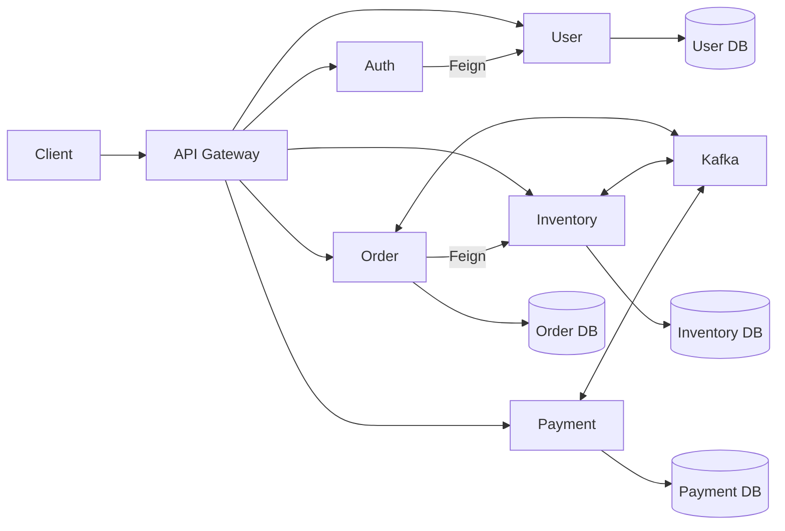

# Shopverse

[](https://github.com/taukhir/shopverse/actions/workflows/ci.yml)
[](https://github.com/taukhir/shopverse/actions/workflows/docs-site.yml)


Shopverse is an observable, failure-aware commerce microservices POC. It demonstrates secure, idempotent checkout across independently persisted Order, Inventory, and Payment services using Kafka choreography, transactional outbox, compensation, and end-to-end observability.

Runtime claims in this README describe the current local POC unless a section
explicitly says otherwise. The exact status of each capability is maintained in
the [Features and demonstrations](documentation/docs/reference/FEATURES-AND-DEMOS.md)
matrix using `Implemented`, `Implemented baseline`, `Partial`, and `Planned`
labels. Production hardening notes are roadmap or design guidance, not claims
that the current Compose stack is production-ready.


## Why This Repository Matters

Shopverse is the main proof artifact behind my portfolio. It is built to show
how I reason about backend architecture, not only how I write service code.

| Signal | What to inspect |
| --- | --- |
| **System design** | Gateway, discovery, config, service boundaries, database ownership, and event flow |
| **Reliability** | Idempotent checkout, outbox, Kafka retries, DLT persistence, replay audit, and compensation |
| **Security** | RSA-signed JWTs, JWKS validation, role/permission checks, and ownership authorization |
| **Operations** | Docker Compose, CI gates, structured logs, metrics, traces, dashboards, and runbooks |
| **Engineering maturity** | Service READMEs, documentation portal, ADRs, bounded tests, and failure-mode demos |

## Status Model

| Label | Meaning |
|---|---|
| `Implemented` | Code and configuration exist and are demonstrable in the local POC. |
| `Implemented baseline` | A working baseline exists, with known scale, automation, or hardening gaps. |
| `Partial` | The core behavior exists, but important correctness, automation, or production-readiness work remains. |
| `Planned` | Roadmap, study material, or target design; not current runtime behavior. |

When this README summarizes a broad capability, treat the implementation
matrix as the source of truth for the precise status and evidence.

## Fast Reviewer Path

If you only have a few minutes, review these in order:

1. [Architecture diagram](documentation/static/img/diagrams/shopverse-architecture-flow.svg)
2. [Checkout example](#checkout-example)
3. [Architecture decisions](#architecture-decisions)
4. [Features and demonstrations](documentation/docs/reference/FEATURES-AND-DEMOS.md)
5. [End-to-end demo runbook](documentation/docs/case-study/COMPLETE-DEMO.mdx)
6. [GitHub Actions workflow guide](.github/workflows/README.md)

## What This Demonstrates

- Designing service boundaries around ownership and failure isolation
- Handling distributed checkout without a single shared transaction
- Making asynchronous work queryable through order timelines and audit tables
- Using security and observability as part of the architecture, not as add-ons
- Keeping local development repeatable through Compose, seeded data, and runbooks
- Validating behavior through unit, integration, container, and smoke-test layers

## Architecture



The Config Server centralizes runtime configuration, Eureka provides service discovery, and the observability stack combines Prometheus, Grafana, Loki, Promtail, Micrometer Tracing, and Zipkin.

## Architecture Decisions

| Decision | Why it matters | ADR |
| --- | --- | --- |
| API Gateway, Eureka, and Config Server | Keeps edge routing, discovery, and runtime configuration explicit and reviewable | [ADR 001](documentation/docs/architecture/adr/001-gateway-discovery-config.md) |
| Kafka choreography SAGA | Avoids distributed transactions while keeping checkout failure paths observable | [ADR 002](documentation/docs/architecture/adr/002-kafka-choreography-saga.md) |
| JWT and JWKS security model | Lets services validate tokens without sharing signing secrets | [ADR 003](documentation/docs/architecture/adr/003-jwt-jwks-security.md) |
| Observability by default | Makes local POC and production-shaped behavior diagnosable across services | [ADR 004](documentation/docs/architecture/adr/004-observability-stack.md) |

## Core Capabilities

The list below is intentionally high level. Some items are complete in the POC,
some are implemented baselines, and some have hardening work documented in the
implementation matrix.

- RSA-signed JWT access tokens, JWKS, expiry validation, roles, permissions, and ownership authorization
- API Gateway routing, service discovery, Spring Cloud LoadBalancer, and Feign clients
- independent MySQL schemas managed by Liquibase and Spring Data JPA
- idempotent checkout with immutable shipping-address snapshots and persistent order timeline
- optimistic inventory locking, reservation expiry, cancellation release, and payment compensation
- customer account address book and persisted customer cart
- customer/admin order cancellation, payment retry/refund APIs, return request, and fulfillment transitions
- public inventory catalog, product detail, category, related-product, and MinIO image metadata APIs
- Kafka choreography with retries, DLT persistence, replay audit, and transactional outbox
- annotation-based Resilience4j RateLimiter, Bulkhead, Retry, CircuitBreaker, and fallback
- structured JSON logs, correlation propagation, Prometheus metrics, Grafana dashboards, and Zipkin traces
- JUnit, Mockito, Spring test slices, Testcontainers, and bounded verification modes
- Docker Compose, GitHub Actions, and Jenkins pipelines

Run the POC with the [complete Shopverse demo](documentation/docs/case-study/COMPLETE-DEMO.mdx).
The exact implementation matrix is in [Features and demonstrations](documentation/docs/reference/FEATURES-AND-DEMOS.md).

## Services

| Service | Port | Responsibility |
|---|---:|---|
| API Gateway | 8080 | routing, edge security, correlation, metrics |
| Auth Service | 8081 | login, JWT signing, JWKS |
| User Service | 8082 | users, roles, permissions, account addresses, persisted carts, internal authentication |
| Order Service | 8083 | checkout, ownership, SAGA timeline, cancellation, fulfillment, returns |
| Payment Service | 8084 | payment state, intent, retry, reconciliation, refund, webhook baseline |
| Inventory Service | 8086 | public catalog, product detail, stock, reservations, expiry, cancellation compensation |
| Discovery Server | 8761 | Eureka registry |
| Config Server | 8888 | centralized configuration |
| Angular Storefront | 4200 | customer/admin web UI served by nginx in Docker |
| Documentation | 3001 | Docusaurus documentation portal served by nginx in Docker |

## Quick Start

Prerequisites:

- Docker Desktop with Docker Compose v2
- Git
- Java 21 and Node.js 20+ only when running services or documentation outside Docker
- at least 8 GB memory available to Docker for the complete local stack

Create a local `.env` from the repository template, validate the Compose model,
then start:

```powershell
Copy-Item .env.example .env
docker compose --profile apps --profile assets config --quiet
docker compose --profile apps --profile assets up --build -d
docker compose ps
```

Replace placeholder values in `.env` before exposing the stack beyond a local
POC. Wait until Config Server, Discovery Server, MySQL, and application
containers report healthy before testing checkout.

Use the API Gateway for application requests:

```text
http://localhost:8080
```

Key interfaces:

| Tool | URL |
|---|---|
| Eureka | `http://localhost:8761` |
| Config Server | `http://localhost:8888` |
| Grafana | `http://localhost:3000` |
| Prometheus | `http://localhost:9090` |
| Zipkin | `http://localhost:9411` |

Docker configuration and command explanations are in [docker/README.md](docker/README.md).

## Docker Compose Modes

The root [docker-compose.yml](docker-compose.yml) remains the backend platform
compose file. The optional [docker-compose.full-stack.yml](docker-compose.full-stack.yml)
overlay adds the Angular storefront and Docusaurus documentation containers.

Backend platform only:

```powershell
Copy-Item .env.example .env
docker compose --profile apps --profile assets config --quiet
docker compose --profile apps --profile assets up --build
```

Full stack with Angular, Docusaurus, backend services, and MinIO product assets:

```powershell
Copy-Item .env.example .env
docker compose --profile apps --profile assets -f docker-compose.yml -f docker-compose.full-stack.yml config --quiet
docker compose --profile apps --profile assets -f docker-compose.yml -f docker-compose.full-stack.yml up --build
```

Full stack plus observability:

```powershell
docker compose --profile apps --profile assets --profile observability -f docker-compose.yml -f docker-compose.full-stack.yml config --quiet
docker compose --profile apps --profile assets --profile observability -f docker-compose.yml -f docker-compose.full-stack.yml up --build
```

Useful URLs:

| Interface | URL | Notes |
|---|---|---|
| Angular storefront/admin | `http://localhost:4200` | nginx serves Angular and proxies `/api` and `/auth` to `api-gateway:8080` |
| Documentation | `http://localhost:3001` | static Docusaurus build |
| API Gateway | `http://localhost:8080` | backend entry point |
| MinIO Console | `http://localhost:9001` | enabled by the `assets` profile |
| Eureka | `http://localhost:8761` | service registry |
| Grafana | `http://localhost:3000` | enabled by the `observability` profile |
| Prometheus | `http://localhost:9090` | enabled by the `observability` profile |
| Zipkin | `http://localhost:9411` | traces |

Optional frontend/docs port overrides in `.env`:

```dotenv
SHOPVERSE_WEB_PORT=4200
SHOPVERSE_DOCS_PORT=3001
```

Compose profiles:

| Profile | Adds |
|---|---|
| `apps` | Spring Boot application services and API Gateway |
| `assets` | MinIO and product-image seeding |
| `observability` | Prometheus, Grafana, Loki, and Promtail |

Troubleshooting:

- If `http://localhost:4200` loads but catalog/auth calls fail, check that
  `api-gateway` is healthy: `docker compose ps api-gateway`.
- If product images are missing, start with `--profile assets` and verify
  `minio-init` completed successfully.
- If Angular route refreshes return `404`, confirm the container is using
  [shopverse-web/nginx.conf](shopverse-web/nginx.conf); it falls back to
  `index.html` for client-side routes.
- If documentation is unavailable, rebuild only the docs image:
  `docker compose --profile apps --profile assets -f docker-compose.yml -f docker-compose.full-stack.yml build documentation`.

## Five-Minute Local Evaluation

Use this path when you want to verify the architecture without reading every
service first:

```powershell
Copy-Item .env.example .env
docker compose --profile apps --profile assets config --quiet
docker compose --profile apps --profile assets up -d mysql mysql-bootstrap kafka minio minio-init config-server discovery-server user-service auth-service order-service payment-service inventory-service api-gateway
docker compose ps
```

Then:

1. Open Eureka at `http://localhost:8761` and confirm services are registered.
2. Log in through `POST /auth/login`.
3. Submit the [checkout request](#checkout-example) through the gateway.
4. Query the order timeline to observe SAGA state changes.
5. Open Zipkin/Grafana/Prometheus to inspect traces, metrics, and service health.

## MySQL Local Data

Compose exposes MySQL on host port `3307`; containers use `mysql:3306`.
Shopverse maintains separate schemas:

| Schema | Owner |
|---|---|
| `user_service` | users, roles, permissions, authentication support |
| `order_service` | orders, line items, timeline, outbox, DLT recovery |
| `inventory_service` | catalog, stock, reservations, outbox, DLT recovery |
| `payment_service` | payments, outbox, DLT recovery |

Liquibase and the local API seeder create a realistic baseline data set:

- `admin`, `customer1`, and `customer2` from Liquibase;
- realistic catalog products `101` through `120` with brand, model, category,
  descriptions, stock, pricing, and MinIO-backed image references;
- optional API-seeded customer accounts and orders for dashboard/order-history
  testing.

Reset the local stack to clean volumes and seed the current baseline through
the APIs:

```powershell
powershell -NoProfile -ExecutionPolicy Bypass -File .\scripts\Reset-ShopverseLocalData.ps1 `
  -CustomerCount 20 -ProductCount 20 -OrderCount 50
```

The reset removes local Compose volumes, starts a fresh stack, waits for
`/actuator/shopverse-readiness`, then creates 20 customer accounts, upserts 20
catalog products, and creates 50 idempotent checkout orders.

Local account passwords are in the Git-ignored
`shopverse-local-credentials.md`. Customer passwords are stored as delegated BCrypt
hashes. Production credentials still belong in managed secret and identity
systems rather than repository documentation.

Order Service uses a bounded Caffeine cache for the browse catalog. The default
TTL is 60 seconds and can be overridden with
`ORDER_SERVICE_CACHE_TTL_SECONDS`. After admin product upserts, refresh the
Order catalog view with `POST /api/v1/orders/admin/catalog-cache/evict`; the
API seed script does this automatically. Checkout validates requested products
through a direct Inventory lookup rather than relying on the cached browse
catalog. Checkout also stores a shipping address snapshot on the order so
later account-address edits do not mutate historical order records.

Inspect all schemas:

```powershell
docker compose exec mysql sh -lc '
  MYSQL_PWD="$MYSQL_ROOT_PASSWORD" mysql -uroot -e "
    SHOW DATABASES LIKE \"%_service\";
  "
'
```

The [complete Shopverse demo](documentation/docs/case-study/COMPLETE-DEMO.mdx)
contains SAGA, timeline, outbox, inventory, payment, and correlation queries.

## Checkout Example

First obtain a token from `POST /auth/login`, then call:

```http
POST /api/v1/orders/checkout
Authorization: Bearer <token>
Idempotency-Key: checkout-user-42-cart-9001
X-Correlation-Id: demo-checkout-9001
Content-Type: application/json

{
  "shippingAddress": {
    "recipientName": "Ahmed Khan",
    "phoneNumber": "+919876543210",
    "line1": "42 Market Road",
    "line2": "Apt 5",
    "city": "Bangalore",
    "state": "Karnataka",
    "postalCode": "560001",
    "country": "India"
  },
  "items": [
    {
      "productId": 101,
      "quantity": 1
    }
  ]
}
```

The request persists Order state, the shipping snapshot, and an outbox event in
one transaction. Kafka then drives Inventory and Payment asynchronously. Query
`/api/v1/orders/{id}/timeline` to inspect the business journey.

## Current Customer and Operations APIs

Recently implemented runtime surfaces include:

| Area | Endpoints |
|---|---|
| Customer account | `GET/PUT/PATCH /api/v1/users/me`, `GET/POST/PUT/DELETE /api/v1/users/me/addresses` |
| Persisted cart | `GET /api/v1/cart`, `PUT /api/v1/cart`, `POST /api/v1/cart/merge`, `POST /api/v1/cart/validate`, `DELETE /api/v1/cart/items/{productId}` |
| Public catalog | `GET /api/v1/inventory/public/items`, `GET /api/v1/inventory/public/items/{productId}`, `GET /api/v1/inventory/public/categories`, `GET /api/v1/inventory/public/items/{productId}/related`; admin image upload through `POST /api/v1/inventory/admin/items/{productId}/image` |
| Order actions | `POST /api/v1/orders/{id}/cancel`, `POST /api/v1/orders/{id}/return-request` |
| Admin fulfillment | `POST /api/v1/orders/admin/{id}/pack`, `POST /api/v1/orders/admin/{id}/ship`, `POST /api/v1/orders/admin/{id}/deliver`, `POST /api/v1/orders/admin/{id}/cancel`, `POST /api/v1/orders/admin/catalog-cache/evict` |
| Payments | `POST /api/v1/payments/intent`, `POST /api/v1/payments/orders/{orderNumber}/retry`, `POST /api/v1/payments/orders/{orderNumber}/refund`, `GET /api/v1/payments/orders/{orderNumber}`, `POST /api/v1/payments/webhooks/provider` |
| Admin audit | `GET /api/v1/admin/audit-events`, `GET /api/v1/admin/audit-events/{id}` |

Cross-service audit event publishing, payment provider webhook signature
verification, refund audit depth, and inventory-aware cart validation remain
hardening items.

## Documentation

Start with the [documentation index](documentation/docs/README.mdx).

The same Markdown is rendered as a reusable backend engineering Docusaurus
portal from `documentation/`, with Shopverse organized as a case study.
Generic engineering guides explain reusable production practices; Shopverse
case-study pages state which practices are implemented in this repository and
which remain planned.
Run it locally with:

```powershell
cd documentation
npm install
npm start
```

## Frontend And Documentation Automation

Run the Angular storefront and Docusaurus documentation gates from the
repository root:

```powershell
.\scripts\Test-ShopverseSites.ps1 -Target All -Mode Full -TimeoutMinutes 30
```

Common focused runs:

```powershell
.\scripts\Test-ShopverseSites.ps1 -Target Web -Mode Full
.\scripts\Test-ShopverseSites.ps1 -Target Docs -Mode Quick
.\scripts\Test-ShopverseSites.ps1 -Target Docs -Mode Full -SkipBrowsers
.\scripts\Test-ShopverseSites.ps1 -Target All -Mode Full -Install
```

Run real Docker-backed integration only when you need release confidence:

```powershell
.\scripts\Test-ShopverseFullStack.ps1 -Mode Smoke -TimeoutMinutes 35
.\scripts\Test-ShopverseFullStack.ps1 -Mode Full -TimeoutMinutes 45 -KeepStack
```

API Gateway also exposes a stronger production readiness contract:

```powershell
curl.exe http://localhost:8080/actuator/shopverse-readiness
```

It returns HTTP `200` only when required discovery registrations, gateway
routes, downstream service health, baseline catalog data, and configured MiniIO
product image objects are ready. The full-stack smoke gate validates this
endpoint automatically.

Run the structured go-live checklist when you want one release report:

```powershell
.\scripts\Test-ShopverseRelease.ps1 -Mode Full -TimeoutMinutes 60
```

For a faster orchestration check without Docker:

```powershell
.\scripts\Test-ShopverseRelease.ps1 -Mode Quick -SkipFullStack -SkipBrowsers
```

If PowerShell script execution is locked down locally, use:

```powershell
powershell -NoProfile -ExecutionPolicy Bypass -File .\scripts\Test-ShopverseSites.ps1 -Target All -Mode Quick -SkipBrowsers
```

The web gate runs Angular development and production builds, Angular
unit/component tests, mocked Playwright E2E flows, axe accessibility checks, and
a Lighthouse budget against the production build. The documentation gate runs
type-checking, document validation, Docusaurus build, performance budget, and
Playwright rendering/accessibility tests unless `-SkipBrowsers` is used.
The release checklist combines the frontend/documentation gate and the
Docker-backed full-stack gate, then writes a JSON report to
`testing/reports/shopverse-release-report.json`.
The GitHub Actions workflow
[frontend-sites.yml](.github/workflows/frontend-sites.yml) runs the same root
automation on relevant frontend and documentation changes.
The full-stack gate starts an isolated Compose project, publishes API Gateway
on `http://127.0.0.1:18080`, Angular on `http://127.0.0.1:14200`, and
documentation on `http://127.0.0.1:13001`, then runs API SAGA smoke plus a real
browser smoke through the nginx-served Angular app.

| Area | Guide |
|---|---|
| Complete demo | [End-to-end Shopverse runbook](documentation/docs/case-study/COMPLETE-DEMO.mdx) |
| Architecture | [System design](documentation/docs/architecture/SYSTEM-DESIGN.md) |
| Distributed systems | [Fundamentals](documentation/docs/architecture/DISTRIBUTED-SYSTEMS-GENERIC.md), [CAP and consistency](documentation/docs/architecture/DISTRIBUTED-CONSISTENCY-CAP.md), and [interview questions](documentation/docs/reference/DISTRIBUTED-SYSTEMS-INTERVIEW.md) |
| Features | [Features and demos](documentation/docs/reference/FEATURES-AND-DEMOS.md) |
| APIs | [Shopverse API guide](documentation/docs/development/API-GUIDE.md) and [REST design](documentation/docs/development/REST-API-GENERIC.md) |
| Security | [JWT, OAuth2, and Spring Security](documentation/docs/security/JWT-OAUTH2-SPRING-SECURITY.md) |
| Messaging | [Apache Kafka](documentation/docs/integration/APACHE-KAFKA.md), [Spring Kafka](documentation/docs/spring/SPRING-KAFKA.md), and [SAGA/outbox](documentation/docs/reliability/SAGA-OUTBOX.md) |
| Observability | [Observability architecture](documentation/docs/observability/OBSERVABILITY.md) and [operations](documentation/docs/observability/SHOPVERSE-OBSERVABILITY-OPERATIONS.md) |
| Data | [Database engineering](documentation/docs/data/DATABASE-ENGINEERING.md), [Hibernate](documentation/docs/data/HIBERNATE.md), [Liquibase](documentation/docs/data/LIQUIBASE-GENERIC.md), [Spring transactions](documentation/docs/spring/SPRING-TRANSACTIONS.md), and [caching principles](documentation/docs/architecture/CACHING-GENERIC.md) |
| Testing | [Shopverse testing](documentation/docs/development/TESTING.md) and [Spring Boot testing](documentation/docs/spring/SPRING-BOOT-TESTING.md) |
| Troubleshooting | [Debugging guide](documentation/docs/development/DEBUGGING.md) |

Service-specific APIs and configuration remain in each service README. Operational guides remain beside their deployment files:

- [Centralized configuration](config-server/README.md)
- [Observability deployment](observability/README.md)
- [Docker](docker/README.md)
- [Jenkins](jenkins/README.md)
- [GitHub Actions](.github/workflows/README.md)
