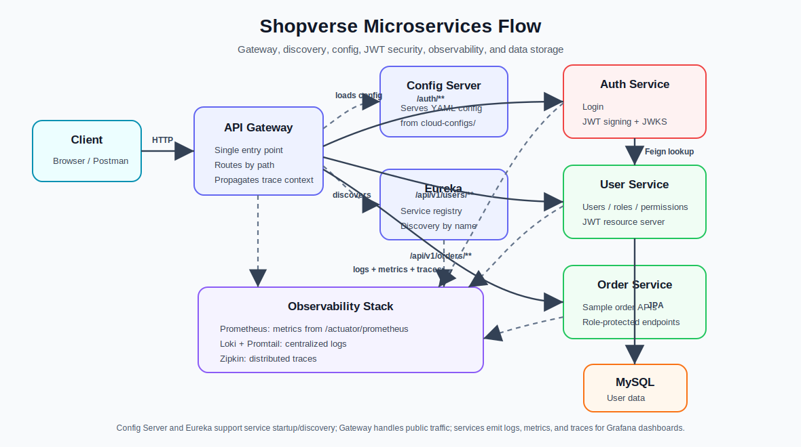

# Shopverse

Shopverse is a Spring Boot microservices proof of concept for an e-commerce backend. It demonstrates centralized configuration, service discovery, API gateway routing, asymmetric JWT security, service-to-service communication, choreography SAGA with Kafka, distributed tracing, centralized logging, metrics, Docker Compose, and GitHub Actions CI/CD.

## Contents

- [Architecture](#architecture)
- [Project Structure](#project-structure)
- [Quick Start](#quick-start)
- [Useful URLs](#useful-urls)
- [Authentication](#authentication)
- [Choreography SAGA](#choreography-saga)
- [Docker](#docker)
- [Observability](#observability)
- [Centralized Config](#centralized-config)
- [GitHub Actions CI/CD](#github-actions-cicd)
- [Jenkins Pipeline](#jenkins-pipeline)
- [Component Glossary](#component-glossary)
- [More Docs](#more-docs)

## Architecture



| Component | Port | Responsibility |
| --- | ---: | --- |
| Config Server | `8888` | Serves centralized config from `cloud-configs/`. |
| Discovery Server | `8761` | Eureka registry for service discovery. |
| API Gateway | `8080` | Public entry point and route forwarder. |
| Auth Service | `8081` | Authenticates users, signs JWTs, exposes JWKS. |
| User Service | `8082` | Manages users, roles, permissions, and passwords. |
| Order Service | `8083` | Sample order APIs protected by JWT roles. |
| Payment Service | `8084` | Payment API placeholder with JWT security and observability. |
| Inventory Service | `8086` | Inventory API placeholder with JWT security and observability. |
| Kafka | `9092` | Event broker for the choreography SAGA demo. |
| MySQL | `3307` | User service database. |
| Grafana | `3000` | Dashboards and Explore UI for logs/metrics/traces. |
| Prometheus | `9090` | Scrapes and stores metrics. |
| Loki | `3100` | Stores centralized logs. |
| Zipkin | `9411` | Stores distributed traces. |

Request flow:

```text
Client
  -> API Gateway
  -> Target service discovered through Eureka
  -> Service validates JWT through Auth Service JWKS
  -> Service handles request
  -> Order/Inventory/Payment coordinate through Kafka events
  -> Logs go to Loki through Promtail
  -> Metrics are scraped by Prometheus
  -> Traces are exported to Zipkin
  -> Grafana visualizes logs, metrics, and traces
```

## Project Structure

```text
shopverse/
  api-gateway/          Spring Cloud Gateway
  config-server/        Spring Cloud Config Server
  discovery-server/     Eureka Server
  auth-service/         Auth/JWT service
  user-service/         User, role, permission APIs
  order-service/        Sample order APIs
  payment-service/      Payment APIs
  inventory-service/    Inventory APIs
  cloud-configs/        Centralized service YAML config
  observability/        Prometheus, Loki, Promtail, Grafana, Zipkin config
  docker/               Docker commands and Compose/Dockerfile guide
  assets/               Shared README diagrams and images
  jenkins/              Local Jenkins pipeline and Docker setup
  .github/workflows/    GitHub Actions CI/CD
  docker-compose.yml    Full local stack
```

## Naming Convention

Shopverse uses two naming styles intentionally:

| Area | Convention | Example |
| --- | --- | --- |
| Folder names | lowercase kebab-case | `auth-service` |
| Docker Compose services | lowercase kebab-case | `auth-service` |
| Docker images | lowercase kebab-case | `shopverse/auth-service:local` |
| Docker containers | `shopverse-` + lowercase kebab-case | `shopverse-auth-service` |
| Spring application names | uppercase kebab-case | `AUTH-SERVICE` |
| Eureka service IDs | uppercase kebab-case | `AUTH-SERVICE` |
| Config Server files | uppercase Spring application name | `AUTH-SERVICE.yml` |
| Log/metric application labels | uppercase Spring application name | `AUTH-SERVICE` |

Auth service uses `auth-service` for folder, Docker, and deployment names. Its Spring/Eureka application name is `AUTH-SERVICE`.

## Quick Start

Create a local environment file:

```powershell
Copy-Item .env.example .env
```

Build images:

```powershell
docker compose build
```

Start the full stack:

```powershell
docker compose up -d
```

Check containers:

```powershell
docker compose ps
```

Smoke test:

```powershell
curl.exe http://localhost:8888/actuator/health
curl.exe http://localhost:8761/actuator/health
curl.exe http://localhost:8082/actuator/health
curl.exe http://localhost:8081/actuator/health
curl.exe http://localhost:8083/actuator/health
curl.exe http://localhost:8084/actuator/health
curl.exe http://localhost:8086/actuator/health
curl.exe http://localhost:8080/actuator/health
curl.exe http://localhost:8080/api/v1/orders/public/health
curl.exe http://localhost:8080/api/v1/payments/public/health
curl.exe http://localhost:8080/api/v1/inventory/public/health
```

Trigger the authenticated checkout SAGA after login:

```powershell
curl.exe -X POST http://localhost:8080/api/v1/orders/checkout `
  -H "Authorization: Bearer <token>"
```

Stop the stack:

```powershell
docker compose down
```

Stop and delete volumes:

```powershell
docker compose down -v
```

Use `down -v` carefully because it deletes MySQL data, Loki logs, Prometheus data, Grafana data, and service log volumes.

## Useful URLs

| Tool/API | URL |
| --- | --- |
| API Gateway | `http://localhost:8080` |
| Eureka Dashboard | `http://localhost:8761` |
| User Swagger UI | `http://localhost:8082/swagger-ui/index.html` |
| Grafana | `http://localhost:3000` |
| Prometheus | `http://localhost:9090` |
| Prometheus Targets | `http://localhost:9090/targets` |
| Loki | `http://localhost:3100` |
| Zipkin | `http://localhost:9411` |

Grafana login:

```text
admin / value from GRAFANA_ADMIN_PASSWORD
```

The default local value is `admin`.

## Authentication

The Auth Service uses asymmetric JWT:

- Auth Service signs tokens with an RSA private key.
- Resource services validate tokens using the public JWKS endpoint.
- JWKS endpoint: `http://localhost:8081/auth/.well-known/jwks.json`

Login through the API Gateway:

```powershell
Invoke-RestMethod -Method Post `
  -Uri http://localhost:8080/auth/login `
  -Body (@{username='admin'; password='Admin@123'} | ConvertTo-Json) `
  -ContentType 'application/json'
```

Use the returned `token`:

```powershell
curl.exe http://localhost:8080/api/v1/orders `
  -H "Authorization: Bearer <token>"
```

Swagger authorization:

1. Open `http://localhost:8082/swagger-ui/index.html`.
2. Click **Authorize**.
3. Paste only the JWT token value.
4. Do not manually add `Bearer `; Swagger adds it.

## Choreography SAGA

Shopverse uses a simple choreography SAGA between Order Service, Inventory Service, and Payment Service. There is no central orchestrator. Each service listens for an event, does its local work, logs the action, and publishes the next event.

Success flow:

```text
POST /api/v1/orders/checkout
  -> Order Service publishes shopverse.order.created
  -> Inventory Service reserves stock
  -> Inventory Service publishes shopverse.inventory.reserved
  -> Payment Service completes payment
  -> Payment Service publishes shopverse.payment.completed
  -> Order Service logs the final confirmed status
```

Failure and compensation flow:

```text
Inventory failure
  -> Inventory Service publishes shopverse.inventory.failed
  -> Order Service logs order rejected

Payment failure
  -> Payment Service publishes shopverse.payment.failed
  -> Inventory Service logs inventory release compensation
  -> Order Service logs payment failed
```

Kafka topics:

```text
shopverse.order.created
shopverse.inventory.reserved
shopverse.inventory.failed
shopverse.payment.completed
shopverse.payment.failed
```

Follow demo logs:

```powershell
docker compose logs -f order-service inventory-service payment-service kafka
```

Useful Loki query:

```logql
{application=~"ORDER-SERVICE|INVENTORY-SERVICE|PAYMENT-SERVICE"} |= "Choreography saga"
```

## Docker

Docker commands, Docker flags, Dockerfile explanations, and Docker Compose service breakdowns are maintained in [docker/README.md](docker/README.md).

## Observability

The observability stack uses:

- Prometheus for metrics.
- Loki for centralized logs.
- Promtail for log shipping.
- Grafana for dashboards and Explore.
- Zipkin for distributed traces.

Centralized logging flow:

```text
Spring Boot logs
  -> /app/logs/*.log and Docker stdout
  -> Promtail
  -> Loki
  -> Grafana
```

Metrics flow:

```text
Spring Boot Actuator /actuator/prometheus
  -> Prometheus
  -> Grafana
```

Tracing flow:

```text
Spring Boot Micrometer tracing
  -> Zipkin
  -> traceId appears in logs
```

Useful Loki queries in Grafana Explore:

```logql
{application="USER-SERVICE"}
{application="ORDER-SERVICE"}
{application="PAYMENT-SERVICE"}
{application="INVENTORY-SERVICE"}
{application="AUTH-SERVICE"}
{traceId="paste-trace-id-here"}
```

Useful Prometheus queries:

```promql
up
sum by (application) (rate(http_server_requests_seconds_count[1m]))
sum by (service, outcome) (increase(shopverse_service_requests_logged_total[5m]))
```

More details are in [observability/README.md](observability/README.md).

## Distributed Tracing With Zipkin


Zipkin helps us follow one request across multiple services. When a request enters Shopverse through the API Gateway, Spring Boot observability creates or continues a trace. The same `traceId` is propagated to downstream services, while each service operation gets its own `spanId`.

In this POC:

- Gateway, Auth Service, User Service, Order Service, Payment Service, and Inventory Service create spans.
- Services export spans to Zipkin using the configured `ZIPKIN_ENDPOINT`.
- Logs include `[service,traceId,spanId]`, so a Zipkin trace can be connected back to Loki logs.
- Grafana can be used with Loki logs and Zipkin traces side by side.

Useful debug flow:

```text
Call API through Gateway
  -> open Zipkin at http://localhost:9411
  -> find the trace
  -> copy traceId
  -> search Loki logs in Grafana with {traceId="..."}
```

## Centralized Config

Runtime configuration is maintained in:

```text
cloud-configs/
```

Config Server runs with the native profile in Docker and mounts this folder as `/config`.

Shared settings live in:

```text
cloud-configs/application.yml
```

Service-specific settings live in:

```text
cloud-configs/API-GATEWAY.yml
cloud-configs/AUTH-SERVICE.yml
cloud-configs/USER-SERVICE.yml
cloud-configs/ORDER-SERVICE.yml
cloud-configs/PAYMENT-SERVICE.yml
cloud-configs/INVENTORY-SERVICE.yml
cloud-configs/DISCOVERY-SERVER.yml
```

Local service `application.yaml` files should mostly contain bootstrap config that imports Config Server.

Important: Config Server can provide runtime properties, but dependencies still belong in each service `build.gradle`.

## GitHub Actions CI/CD

Shopverse has three workflows:

```text
.github/workflows/ci.yml               validates, builds, tests, and smoke-tests the stack
.github/workflows/deploy.yml           builds/pushes GHCR images and optionally deploys over SSH
.github/workflows/jenkins-trigger.yml  optionally triggers local/on-prem Jenkins after CI
```

The detailed CI, deploy, secrets, variables, and troubleshooting guide is in [.github/workflows/README.md](.github/workflows/README.md).

At a high level, `Shopverse CI` runs on every push and pull request. `Shopverse Deploy` runs after CI succeeds on `main`, or manually from GitHub Actions. The Jenkins trigger workflow is optional and is useful when you want GitHub to hand off a successful build to your local or company-hosted Jenkins server.

## Jenkins Pipeline

Shopverse includes a Dockerized Jenkins setup in [jenkins/](jenkins/). It can build and test all services, build Docker images, optionally push images, and optionally run a Docker Compose smoke test.

Start Jenkins:

```powershell
docker compose -f jenkins/docker-compose.yml up -d
```

Open:

```text
http://localhost:8085
```

Default local login:

```text
admin / admin
```

Pipeline script path:

```text
jenkins/Jenkinsfile
```

Detailed setup, stages, one-service build demo, and official Jenkins docs links are in [jenkins/README.md](jenkins/README.md).

## Component Glossary

| Component | What it does in this POC |
| --- | --- |
| Spring Boot | Framework used to build each service. |
| Spring Cloud Config | Centralizes runtime YAML config. |
| Eureka | Service registry and discovery. |
| Spring Cloud Gateway | Routes external traffic to backend services. |
| Spring Security | Secures APIs and validates JWTs. |
| JWKS | Exposes public keys for JWT signature validation. |
| OpenFeign | Declarative service-to-service HTTP client. |
| Actuator | Provides health, info, and Prometheus endpoints. |
| Micrometer | Produces metrics and tracing context. |
| Kafka | Event broker used by Order, Inventory, and Payment services for choreography SAGA events. |
| Prometheus | Scrapes and stores metrics. |
| Loki | Stores centralized logs. |
| Promtail | Ships logs to Loki. |
| Grafana | Queries and visualizes logs, metrics, and traces. |
| Zipkin | Stores and displays distributed traces. |
| Docker Compose | Runs the full local stack. |
| GitHub Actions | Runs CI and deployment automation. |

## More Docs

| Area | Doc |
| --- | --- |
| API Gateway | [api-gateway/README.md](api-gateway/README.md) |
| Config Server | [config-server/README.md](config-server/README.md) |
| Discovery Server | [discovery-server/README.md](discovery-server/README.md) |
| Auth Service | [auth-service/README.md](auth-service/README.md) |
| User Service | [user-service/README.md](user-service/README.md) |
| Order Service | [order-service/README.md](order-service/README.md) |
| Payment Service | [payment-service/README.md](payment-service/README.md) |
| Inventory Service | [inventory-service/README.md](inventory-service/README.md) |
| Docker | [docker/README.md](docker/README.md) |
| Centralized Config | [cloud-configs/README.md](cloud-configs/README.md) |
| Observability | [observability/README.md](observability/README.md) |
| Jenkins | [jenkins/README.md](jenkins/README.md) |
| GitHub Actions | [.github/workflows/README.md](.github/workflows/README.md) |
