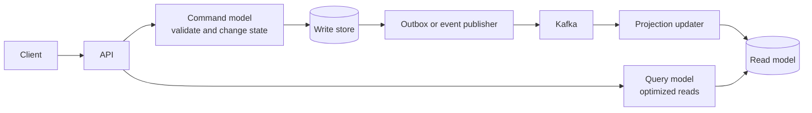

# Command Query Responsibility Segregation

CQRS separates operations that change state (**commands**) from operations
that return state (**queries**). It does not require microservices, Kafka, event
sourcing, or separate databases.



## Why Use CQRS?

Use CQRS when the write model and read model have meaningfully different
requirements:

- writes enforce domain invariants and transactions;
- reads need denormalized projections, search, aggregation, or different scale;
- several consumers need different views of the same events;
- complex write entities should not be exposed as API response models;
- read traffic is much higher than write traffic.

Do not introduce separate databases and asynchronous projections for a simple
CRUD service. A useful first step is only separating command and query code:

```java
public interface OrderCommandService {
    OrderResponse checkout(CheckoutRequest request, String idempotencyKey);
}

public interface OrderQueryService {
    OrderResponse findOwnedOrder(long orderId, String username);
    List<OrderTimelineEntry> timeline(long orderId, String username);
}
```

## Command Side

A command expresses intent:

```java
public record ReserveInventoryCommand(
        UUID commandId,
        String orderNumber,
        long productId,
        int quantity
) {}
```

The command handler should:

1. authenticate and authorize the caller;
2. validate syntax and business rules;
3. enforce concurrency and uniqueness constraints;
4. update authoritative state in one local transaction;
5. persist an outgoing event through an outbox when other components must react;
6. return an accepted result or the committed state.

Commands should not be named like setters. `ReserveInventory` communicates
business intent better than `UpdateInventory`.

## Query Side

A query must not change business state:

```java
public record OrderSummaryView(
        String orderNumber,
        String status,
        BigDecimal total,
        Instant updatedAt
) {}
```

Read models can use:

- JPA projections;
- read-only SQL;
- materialized views;
- Elasticsearch/OpenSearch;
- Redis;
- a separate relational schema;
- an analytics database.

Keep authorization on the query path. A denormalized read model is not a reason
to bypass resource ownership checks.

## Projection Consistency

When projections are updated asynchronously, the read model is eventually
consistent:

```text
T0 command commits
T1 event becomes available
T2 projection consumes event
T3 query sees new state
```

The lag is:

```text
projection lag = projection applied time - event committed time
```

APIs should make this behavior explicit. Common options are:

- return the committed command-side representation;
- return `202 Accepted` with an operation identifier;
- allow the client to poll operation state;
- provide a read-your-write token/version;
- update a small synchronous read model when immediate consistency is required.

## Idempotent Projections

At-least-once delivery means a projection can receive an event more than once.
Store an immutable event ID:

```sql
create table projection_inbox (
    event_id varchar(36) primary key,
    processed_at timestamp not null
);
```

Process the inbox marker and projection update in one transaction:

```java
@Transactional
public void project(OrderConfirmedEvent event) {
    if (!projectionInboxRepository.insertIfAbsent(event.eventId())) {
        return;
    }
    orderSummaryRepository.markConfirmed(
            event.orderNumber(),
            event.confirmedAt()
    );
}
```

Database uniqueness provides the final race-safe duplicate check.

## CQRS And Event Sourcing

| CQRS | Event sourcing |
|---|---|
| Separates command and query responsibilities | Stores domain events as authoritative state |
| Can use ordinary mutable tables | Rebuilds state by replaying events |
| Can be synchronous or asynchronous | Requires event versioning and replay discipline |
| Can use one database | Commonly uses an event store plus projections |

They work together, but neither requires the other.

## Failure Handling

| Failure | Response |
|---|---|
| Projection consumer is down | retain events, monitor lag, resume from offset |
| Poison event | bounded retry, DLT/recovery record, operator replay |
| Duplicate event | event-ID inbox uniqueness |
| Events arrive out of order | aggregate version and stale-update rejection |
| Projection schema changes | versioned events and rebuild strategy |
| Read model is unavailable | truthful `503`, cache only when correctness permits |

## Shopverse Application

Shopverse already contains CQRS-like separation:

- checkout and SAGA handlers change authoritative service state;
- order timeline and catalog endpoints are query-oriented;
- outbox events propagate committed changes;
- Kafka consumers build state in other bounded contexts.

A complete CQRS implementation is **planned**, not currently claimed. A
practical next step is a denormalized order-operation view keyed by
`orderNumber` and `correlationId`, populated from SAGA events. It could power
the operational dashboard without joining service-owned databases.

## Production Checklist

1. Start with logical command/query separation.
2. Add separate storage only for a measured need.
3. Define authoritative ownership.
4. Make commands idempotent.
5. Make projection consumers idempotent.
6. Version event contracts.
7. Measure projection lag and failed events.
8. Preserve query-side authorization.
9. Provide projection rebuild and replay procedures.
10. Document consistency visible to API clients.

## Related Guides

- [Distributed Systems Fundamentals](DISTRIBUTED-SYSTEMS-GENERIC.md)
- [SAGA And Outbox](../reliability/SAGA-GENERIC.md)
- [Spring Kafka](../spring/SPRING-KAFKA.md)
- [Spring Data JPA](../spring/SPRING-DATA-JPA.md)

