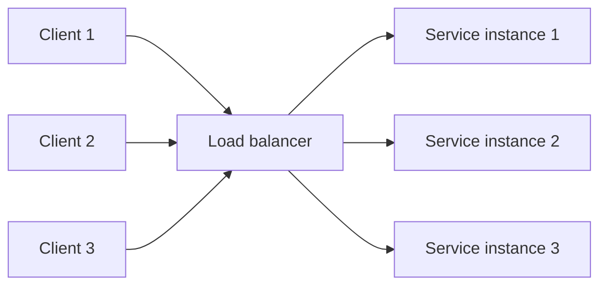
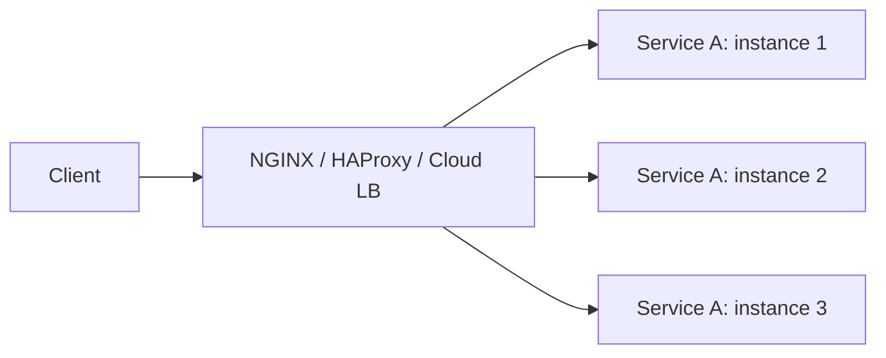
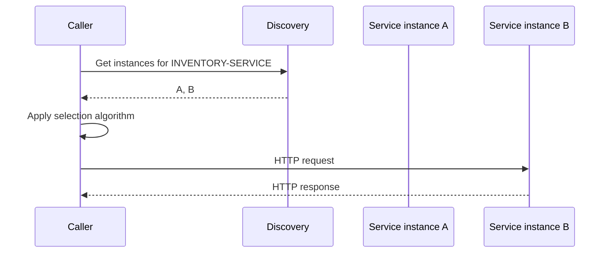
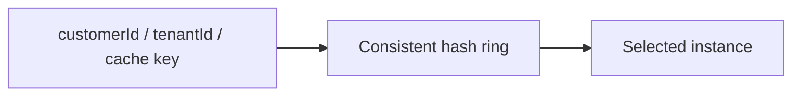
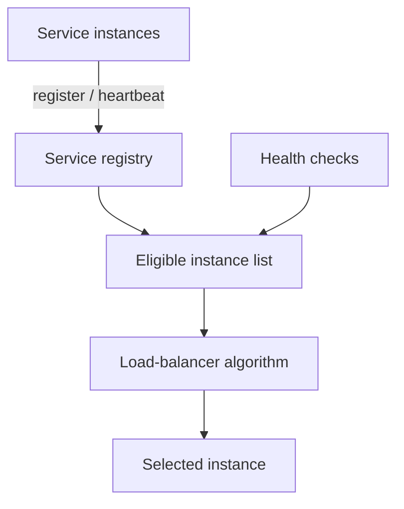
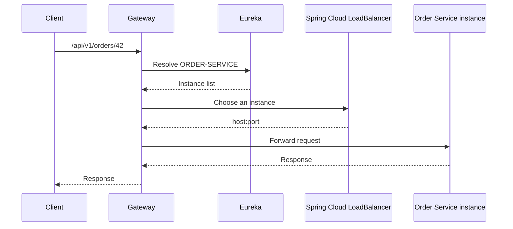
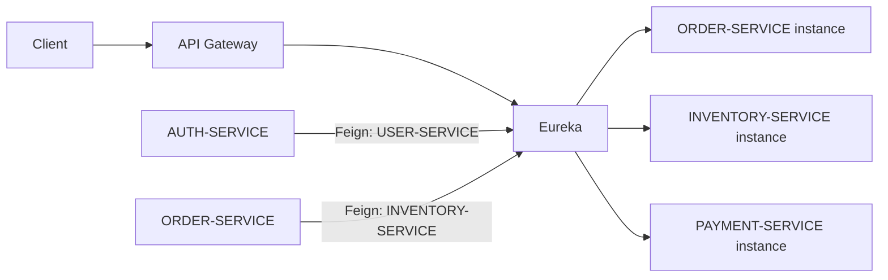

# Load Balancing

Load balancing distributes work across multiple service instances so one
instance does not receive all traffic. It improves availability, throughput,
maintenance flexibility, and horizontal scaling.



A load balancer should select only instances considered available. Selection
and health detection are separate concerns: an algorithm decides *which*
instance to use, while discovery and health checks decide *which instances are
eligible*.

## Why Load Balancing Matters

- spreads requests across available capacity;
- removes failed or draining instances from selection;
- permits rolling deployments;
- supports horizontal scaling;
- reduces dependence on one host;
- provides a stable logical destination for changing instances.

Load balancing does not make an application stateless, idempotent, or
resilient automatically. Shared state, retries, timeouts, database capacity,
and failure isolation still require explicit design.

## Server-Side Load Balancing

Clients connect to a dedicated proxy or managed load balancer:



Advantages:

- clients know one stable endpoint;
- policies and certificates are centralized;
- works with clients that do not understand service discovery.

Trade-offs:

- adds a network hop;
- the load-balancer tier must itself be redundant;
- centralized capacity and configuration must be managed.

## Client-Side Load Balancing

The calling application obtains service instances from discovery and selects
one locally:



Advantages:

- no separate proxy hop between services;
- integrates naturally with logical service names;
- each caller can apply dependency-specific policy.

Trade-offs:

- every client runtime needs compatible discovery and balancing support;
- stale discovery caches can temporarily select an unavailable instance;
- observability and policy are distributed across callers.

Spring Cloud LoadBalancer is a client-side load balancer.

## Layer 4 And Layer 7

| Type | Operates on | Typical decisions |
|---|---|---|
| Layer 4 | TCP/UDP connection data | IP, port, connection count |
| Layer 7 | HTTP/application data | path, host, header, method, cookie |

Layer 4 is protocol-light and efficient. Layer 7 can make API-aware decisions
but performs more processing and must understand the application protocol.

Spring Cloud Gateway performs Layer 7 routing. A cloud or ingress load
balancer may sit in front of gateway replicas.

## Selection Algorithms

### Round Robin

Selects instances in sequence:

```text
A -> B -> C -> A -> B -> C
```

Best when instances have similar capacity and requests have roughly similar
cost. It is simple and predictable but does not consider current load.

### Weighted Round Robin

Instances receive traffic proportional to configured weights:

```text
A weight 3, B weight 1 -> A, A, A, B
```

Useful when instance sizes differ or during gradual rollout. Incorrect weights
can overload smaller instances.

### Random

Selects a random healthy instance. It is simple and performs reasonably with
large request volumes, but short windows can be uneven.

### Least Connections

Selects the instance with the fewest active connections. It suits
long-lived or uneven requests better than basic Round Robin.

It requires accurate connection-state tracking and does not account for
different instance capacities unless weighted.

### Weighted Least Connections

Combines active connections with instance capacity. Larger instances can
accept more concurrent work.

### Least Response Time

Selects based on observed latency, often combined with active connections.
This can adapt to slow instances, but measurements need smoothing to avoid
rapidly shifting traffic.

### Consistent Hashing

Hashes a stable key onto a ring of instances. When instances change, only part
of the key space moves.



Useful for cache locality, sharded ownership, or sticky workloads. It can
create hot spots when keys are uneven and should not replace durable shared
state.

### IP Hash

Hashes the source IP to choose an instance. It provides weak affinity but can
be skewed by NAT, proxies, or mobile network changes.

### Power Of Two Choices

Randomly samples two instances and selects the less loaded one. It achieves
good balancing with less global coordination than scanning every instance.

### Sticky Sessions

Routes a client to the same instance using a cookie, source property, or hash.
Affinity can help legacy session-based applications but reduces even
distribution and complicates failover.

Prefer stateless services and shared session storage when possible.

## Algorithm Comparison

| Algorithm | Strength | Limitation | Typical use |
|---|---|---|---|
| Round Robin | simple and fair over time | ignores current load | similar stateless instances |
| Weighted Round Robin | handles unequal capacity | weights need maintenance | mixed instance sizes, canary rollout |
| Random | low coordination | short-term imbalance | large homogeneous pools |
| Least Connections | reacts to active work | needs connection tracking | long-lived connections |
| Least Response Time | reacts to latency | measurement oscillation | variable backend performance |
| Consistent Hashing | preserves key locality | hot keys and rebalancing complexity | caches and partition ownership |
| Power of Two Choices | good balance at low cost | needs load signal | large dynamic pools |
| Sticky Sessions | session affinity | weaker failover and balance | legacy stateful applications |

There is no universally best algorithm. Choose using request duration,
instance capacity, state locality, health signal quality, and operational
complexity.

## Health And Discovery



Common mechanisms:

- active health checks sent by a proxy;
- passive failure detection from real requests;
- registry heartbeats and lease expiry;
- readiness probes;
- connection draining during shutdown;
- cached discovery results with a bounded lifetime.

Readiness should remove an instance before shutdown so in-flight requests can
finish without new traffic arriving.

## Spring Cloud LoadBalancer

Spring Cloud LoadBalancer provides client-side service-instance selection for
Spring Cloud clients.

Typical dependencies:

```gradle
implementation 'org.springframework.cloud:spring-cloud-starter-loadbalancer'
```

For Eureka-backed discovery:

```gradle
implementation 'org.springframework.cloud:spring-cloud-starter-netflix-eureka-client'
```

For declarative HTTP clients:

```gradle
implementation 'org.springframework.cloud:spring-cloud-starter-openfeign'
```

Spring Cloud Gateway's starter integrates load-balanced `lb://` routes. Some
starters bring LoadBalancer transitively; declaring the dedicated starter
explicitly can make intent clearer in service applications.

## Gateway `lb://` Routing

```yaml
routes:
  - id: order-service
    uri: lb://ORDER-SERVICE
    predicates:
      - Path=/api/v1/orders/**
```

The flow is:



## OpenFeign Integration

```java
@FeignClient(name = "INVENTORY-SERVICE")
public interface InventoryClient {

    @GetMapping("/api/v1/inventory/public/items")
    List<InventoryItem> getItems();
}
```

Because the client specifies a logical service name rather than a URL, the
Feign integration asks Spring Cloud LoadBalancer to select an instance from
discovery.

## Default And Custom Selection

Spring Cloud LoadBalancer commonly uses a Round Robin implementation unless
configuration or a custom load-balancer bean selects another strategy. Do not
assume least-connections or latency-aware balancing without implementing it.

A custom random strategy can be selected per service:

```java
@Configuration
public class InventoryLoadBalancerConfiguration {

    @Bean
    ReactorLoadBalancer<ServiceInstance> randomLoadBalancer(
            Environment environment,
            LoadBalancerClientFactory factory
    ) {
        String serviceId = environment.getProperty(
                LoadBalancerClientFactory.PROPERTY_NAME
        );

        return new RandomLoadBalancer(
                factory.getLazyProvider(
                        serviceId,
                        ServiceInstanceListSupplier.class
                ),
                serviceId
        );
    }
}
```

Attach it to a client with service-specific load-balancer configuration. Use a
custom algorithm only when measurements justify the additional behavior.

## Retry Interaction

A load balancer selects an instance; retry decides whether another attempt is
allowed. Important rules:

- retry only safe or idempotent operations;
- use a strict attempt and time budget;
- avoid retry storms when many clients see the same outage;
- prefer another healthy instance when retrying connection failures;
- do not hide a system-wide outage behind long retries;
- coordinate gateway, Feign, and service-level retry counts.

## Shopverse Implementation

Shopverse currently uses:

- Eureka as the service registry;
- `lb://SERVICE-NAME` routes in API Gateway;
- logical service names in Feign clients;
- Spring Cloud LoadBalancer integration;
- stateless service instances at the application layer;
- circuit-breaker and bounded `GET` retry behavior at the gateway.



The local Docker Compose POC normally runs one instance of each service, so
instance distribution is not visibly demonstrated until additional replicas
register under the same application name.

Shopverse does not currently define a custom load-balancing algorithm,
weighted instances, sticky sessions, or consistent hashing.

## Production Practices

1. Make services stateless where practical.
2. use readiness and graceful shutdown.
3. keep discovery caches bounded and observable.
4. set connection and response timeouts.
5. coordinate retries with idempotency and deadlines.
6. monitor instance count, selection failures, latency, and error rate.
7. avoid sticky sessions unless the state model requires them.
8. account for unequal instance capacity before using plain Round Robin.
9. protect the registry and service network.
10. test instance loss, scale-out, draining, and rolling deployment.

## Related Guides

- [API Gateway](../development/API-GATEWAY-GENERIC.md)
- [Spring Cloud OpenFeign](../spring/SPRING-OPENFEIGN.md)
- [System design](SYSTEM-DESIGN.md)
- [Resilience4j](../reliability/RESILIENCE4J.md)
