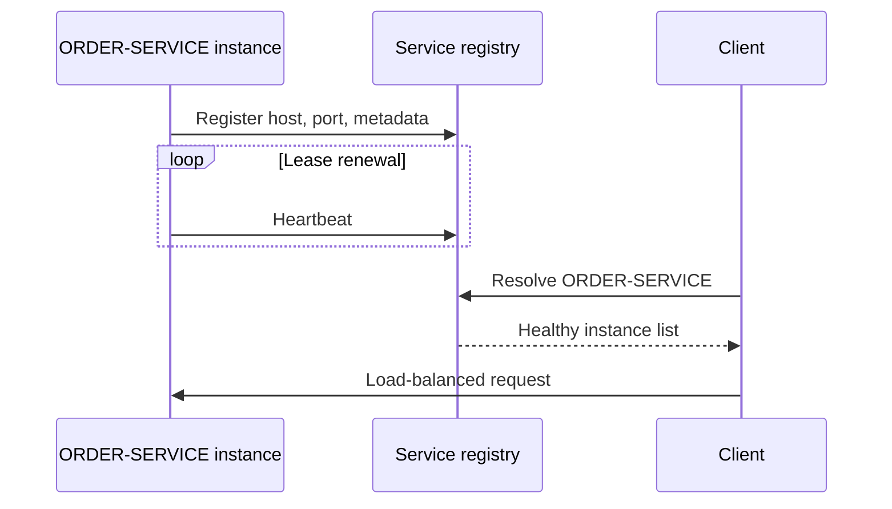

# Service Discovery

Service discovery maps a stable logical service name to changing network
instances.



## Why It Is Needed

Container and cloud instances restart, scale, move, and receive new addresses.
Hard-coded URLs become stale and prevent horizontal scaling.

Discovery provides:

- logical names;
- registration and deregistration;
- instance metadata;
- heartbeat/lease management;
- client or router lookup;
- integration with load balancing.

## Client-Side And Server-Side Discovery

| Client-side | Server-side |
|---|---|
| caller queries registry and selects instance | proxy/router queries registry |
| Spring Cloud LoadBalancer + Eureka | Kubernetes Service, ingress, cloud LB |
| fewer proxy hops | simpler clients and centralized policy |
| discovery logic in every client | proxy tier must scale and remain available |

## Registration Models

### Self-Registration

The application registers and renews its own lease. Eureka clients commonly
use this model.

### Third-Party Registration

An orchestrator, sidecar, or registrar registers instances. This separates
application logic from platform lifecycle and is common in Kubernetes.

## Eureka

Dependencies:

```gradle
implementation "org.springframework.cloud:spring-cloud-starter-netflix-eureka-server"
```

Client:

```gradle
implementation "org.springframework.cloud:spring-cloud-starter-netflix-eureka-client"
implementation "org.springframework.cloud:spring-cloud-starter-loadbalancer"
```

Server:

```java
@SpringBootApplication
@EnableEurekaServer
public class DiscoveryServerApplication {
    public static void main(String[] args) {
        SpringApplication.run(DiscoveryServerApplication.class, args);
    }
}
```

Client configuration:

```yaml
spring:
  application:
    name: ORDER-SERVICE

eureka:
  client:
    service-url:
      defaultZone: http://discovery-server:8761/eureka/
  instance:
    prefer-ip-address: true
```

Spring Boot/Spring Cloud auto-configuration creates the discovery client and
registration lifecycle when the starter and configuration are present.

## Lease And Stale Instances

A registry lease indicates recent heartbeats, not guaranteed request success.
An instance can fail between selection and connection. Clients still need:

- connection and response timeouts;
- safe bounded retries;
- circuit breakers;
- readiness and graceful deregistration;
- monitoring of registration count and lookup failures.

Eureka's self-preservation behavior can retain registrations during widespread
heartbeat loss to avoid mass eviction caused by a network problem. This trades
fast removal for availability and can temporarily expose stale entries.

## DNS And Kubernetes Discovery

DNS maps service names to addresses and is widely available, but clients must
respect TTL and connection behavior.

Kubernetes normally provides:

```text
order-service.namespace.svc.cluster.local
```

A Kubernetes Service selects ready pods and provides a stable virtual endpoint.
External Eureka is often unnecessary when all workloads use Kubernetes-native
discovery.

## Service Discovery Versus Load Balancing

```text
discovery: which instances exist?
health/readiness: which are eligible?
load balancing: which eligible instance should receive this request?
```

They are connected but separate responsibilities.

## Security

- authenticate registry administration;
- restrict network access;
- use TLS where required;
- do not put secrets in instance metadata;
- validate who can register a logical service name;
- monitor unexpected instance count/location changes.

## Shopverse

Shopverse uses Eureka self-registration, logical uppercase application names,
Spring Cloud LoadBalancer, Gateway `lb://SERVICE-NAME` routes, and OpenFeign
clients without fixed service URLs.

Exact commands and operational behavior remain in the
[Discovery Server README](https://github.com/taukhir/shopverse/tree/main/discovery-server).

## Interview Questions

### What Happens If Eureka Is Down?

Existing clients may temporarily use cached instance lists, but new
registration and fresh discovery fail. The registry needs redundancy in a
production architecture, and clients need bounded failure behavior.

### Eureka Versus Load Balancer?

Eureka stores/distributes instance information. A load balancer selects one
eligible instance.

### Why Not Hard-Code Service URLs?

Addresses change during scaling, restart, deployment, and failover. Hard-coded
URLs couple configuration to individual instances.

## Related Guides

- [Load Balancing](LOAD-BALANCING-GENERIC.md)
- [Spring Cloud OpenFeign](../spring/SPRING-OPENFEIGN.md)
- [API Gateway](../development/API-GATEWAY-GENERIC.md)

