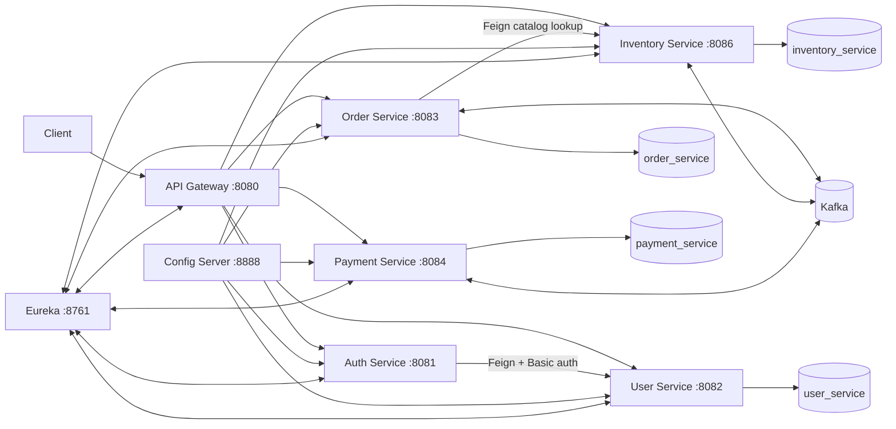
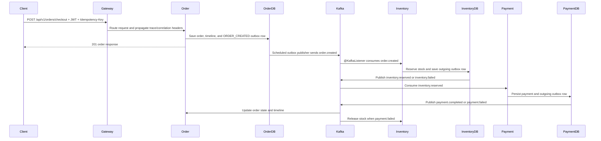
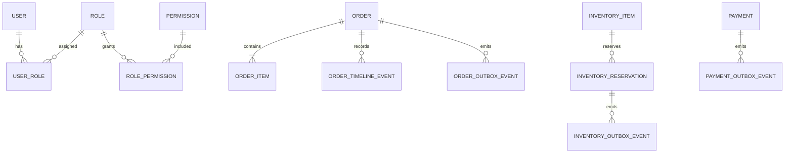

# Shopverse System Design

Shopverse is an observable, failure-aware commerce POC. It demonstrates authenticated checkout across independently persisted services using synchronous discovery-based calls and asynchronous Kafka choreography.

## Runtime Architecture



Each stateful service owns a separate MySQL schema. Services do not join across another service's tables.

## Checkout Flow



## Services

| Component | Responsibility |
|---|---|
| API Gateway | Routing, JWT enforcement, correlation handling, gateway metrics |
| Auth Service | Credential authentication through User Service and RSA-signed JWT issuance |
| User Service | Users, roles, permissions, internal Basic-auth lookup, method security |
| Order Service | Idempotent checkout, order ownership, timeline, SAGA state |
| Inventory Service | Stock, optimistic locking, reservations, expiry, compensation |
| Payment Service | Payment state machine, provider stub, timeout reconciliation, refunds |
| Config Server | Centralized configuration backed by the local or Git repository |
| Discovery Server | Eureka registration and logical service discovery |
| Kafka | Asynchronous domain event transport |
| MySQL | Independent persistence schemas and Liquibase metadata |
| Prometheus | Metric scraping, recording rules, and alert evaluation |
| Loki/Promtail | Central log storage and collection |
| Zipkin | Trace storage and visualization |
| Grafana | Dashboards and exploration across metrics, logs, and traces |

## Domain Events

| Event | Producer | Consumers | Purpose |
|---|---|---|---|
| `shopverse.order.created` | Order | Inventory | Begin reservation |
| `shopverse.inventory.reserved` | Inventory | Order, Payment | Advance to payment |
| `shopverse.inventory.failed` | Inventory | Order | Reject checkout |
| `shopverse.payment.completed` | Payment | Order | Confirm order |
| `shopverse.payment.failed` | Payment | Order, Inventory | Fail order and compensate stock |

Events carry an order identifier, order number, and business `correlationId`. Kafka keys use the order number to preserve per-order partition ordering.

## State Models

Order states:

```text
ORDER_CREATED -> PENDING_INVENTORY -> INVENTORY_RESERVED
              -> PAYMENT_PROCESSING -> CONFIRMED
              -> INVENTORY_REJECTED | PAYMENT_FAILED | CANCELLED
```

Payment states:

```text
PENDING -> AUTHORIZED -> CAPTURED
        -> DECLINED | TIMED_OUT -> CAPTURED after reconciliation
CAPTURED -> REFUNDED
```

Inventory reservation states:

```text
RESERVED -> RELEASED
         -> EXPIRED
```

## Data Model



The diagram expresses logical relationships. The schemas remain isolated and there are no cross-service foreign keys.

## Current Boundaries

- Checkout accepts one item because `CheckoutRequest` currently has `@Size(max = 1)`.
- Cache providers are local in-memory caches, not a distributed Redis cache.
- Payment integration is a configurable stub with `SUCCESS`, `DECLINE`, and `TIMEOUT`.
- Kafka processing is at-least-once. Database uniqueness, state checks, and idempotency keys are therefore essential.
