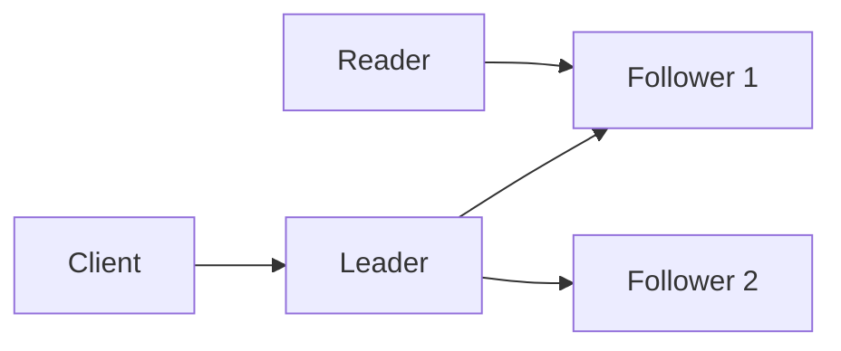

# Distributed Databases

A distributed database stores and processes data across multiple networked
nodes while presenting a coordinated data service to clients.

A traditional single-node database has one primary failure and coordination
domain. A distributed database introduces replication, partitioning,
membership, consensus, cross-node queries, and distributed recovery.

## Why Distribute A Database?

- exceed one machine's storage or throughput;
- survive node failure;
- serve multiple regions;
- isolate tenants or workloads;
- scale reads through replicas;
- scale writes through partitioning.

The cost is increased operational and consistency complexity.

## Replication

Replication copies data to multiple nodes.

### Leader-Follower



Writes go to the leader. Followers replicate and may serve reads.

Trade-offs:

- simple conflict model;
- follower reads can be stale;
- leader failover requires election and fencing;
- replication lag affects recovery and read freshness.

### Multi-Leader

Several leaders accept writes, commonly in different regions. It improves local
write availability but requires conflict detection and resolution.

### Leaderless

Clients or coordinators write to/read from replica quorums. The system uses
versions, read repair, anti-entropy, and conflict resolution.

## Synchronous Versus Asynchronous Replication

| Model | Benefit | Cost |
|---|---|---|
| Synchronous | acknowledged data exists on required replicas | higher latency and lower availability |
| Asynchronous | low write latency and regional independence | acknowledged data can lag or be lost on failover |

Semi-synchronous designs wait for a subset of replicas.

## Sharding

Sharding horizontally partitions rows across nodes:

```text
shard 1: customer IDs 1-1,000,000
shard 2: customer IDs 1,000,001-2,000,000
```

Benefits:

- larger total storage;
- parallel read/write capacity;
- smaller indexes per shard;
- failure/load isolation when designed well.

Costs:

- cross-shard queries and transactions;
- rebalancing;
- hot shards;
- global uniqueness;
- shard routing and operational complexity.

## Sharding Strategies

### Range

```text
A-F -> shard 1
G-M -> shard 2
N-Z -> shard 3
```

Efficient range queries but susceptible to hotspots and uneven growth.

### Hash

```text
shard = hash(customerId) mod shardCount
```

Usually distributes load better but makes range queries harder and naive shard
count changes expensive.

### Directory

A lookup service maps keys or tenants to shards. It supports flexible movement
but becomes critical metadata infrastructure.

### Geographic Or Tenant

Place data according to region or tenant. Useful for locality, isolation, and
compliance, but large tenants can create imbalance.

## Consistent Hashing

Consistent hashing maps nodes and keys onto a ring. Adding/removing a node moves
only a portion of keys instead of most keys.

Virtual nodes improve distribution and make capacity weighting possible.
Consistent hashing helps routing but does not solve replication, transactions,
or hotspots caused by one popular key.

## Choosing A Shard Key

A good key:

- has high cardinality;
- distributes write/read load;
- supports common query locality;
- avoids monotonically increasing hotspots;
- remains stable;
- minimizes cross-shard transactions.

For commerce, `customerId` can colocate a customer's orders but makes global
order-number lookup require an index/router. `orderId` distributes orders but
may separate customer queries.

## Rebalancing

When capacity changes:

1. assign new shard/range ownership;
2. copy historical data;
3. capture writes during migration;
4. validate consistency;
5. switch routing;
6. remove old ownership.

Rebalancing consumes disk, network, and CPU. Throttle and observe it.

## Hot Partitions

Causes:

- celebrity tenant/key;
- timestamp-leading key;
- uneven ranges;
- one product/event dominating traffic.

Controls:

- better shard key;
- key salting for suitable write workloads;
- isolate large tenants;
- adaptive splitting;
- cache reads;
- queue or rate-limit hot writers.

Salting makes reads and ordering more complex.

## Distributed Queries

Scatter-gather:

```text
query coordinator
  -> shard 1
  -> shard 2
  -> shard 3
  -> merge/sort results
```

It increases latency and resource use. Prefer:

- shard-key queries;
- denormalized read models;
- search/analytics systems;
- precomputed aggregates;
- bounded fan-out.

Global joins and pagination are difficult across shards.

## Global Constraints

A local unique index cannot enforce uniqueness across independent shards.
Options:

- route the unique key to one owner shard;
- centralized allocation/index service;
- globally unique generated IDs;
- consensus-backed metadata;
- accept provisional state and resolve conflicts.

## Distributed Database Transactions

A transaction touching one shard can remain local. Cross-shard transactions
require coordination such as two-phase commit or database-specific consensus
protocols.

Keep strongly related data colocated to reduce cross-shard transactions.

## Failover

Safe failover requires:

- failure detection;
- leader election;
- replica freshness decision;
- fencing the previous leader;
- client/router update;
- recovery and reintegration.

Promoting a stale replica can lose acknowledged writes. Allowing both leaders
to write creates split-brain.

## Backup And Disaster Recovery

Replication is not backup. Replicas copy:

- accidental deletion;
- corrupt writes;
- malicious changes;
- schema mistakes.

Use point-in-time recovery, immutable backups, restore testing, and documented
RPO/RTO.

## Distributed Databases Versus Microservice Databases

These are different dimensions:

- database per service defines domain ownership;
- a service's database may itself be a distributed cluster;
- services should not bypass ownership because replicas/shards are reachable.

## Cloud Challenges

- region and zone failure;
- cross-zone/region data-transfer cost;
- variable network latency;
- managed-service quotas;
- automated failover behavior;
- backup ownership;
- encryption and key management;
- autoscaling lag;
- noisy neighbors;
- observability across provider layers;
- schema migration during rolling deployment.

## Interview Questions

### How Does A Distributed Database Differ From A Traditional Database?

It coordinates storage and processing across networked nodes, so replication,
partitioning, membership, failure detection, and distributed consistency are
part of normal operation.

### How Does Sharding Improve Scale?

It divides data and work across nodes, allowing storage and throughput to grow
horizontally. It complicates cross-shard queries, transactions, and balancing.

### Is Replication The Same As Sharding?

No. Replication copies the same data for availability/read scale. Sharding
divides different data across nodes for capacity.

### How Do You Prevent Split-Brain?

Use quorum/consensus for leadership, leases with fencing, and prevent an old
leader from committing after a new leader is elected.

### What Is Replication Lag?

The delay between a write being accepted by the source/leader and becoming
visible on a replica. It affects stale reads and failover data loss.

## Related Guides

- [Database Engineering](DATABASE-ENGINEERING.md)
- [Consistency And CAP](../architecture/DISTRIBUTED-CONSISTENCY-CAP.md)
- [Transactions And Locks](../reliability/DISTRIBUTED-TRANSACTIONS-LOCKS.md)

