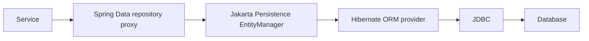
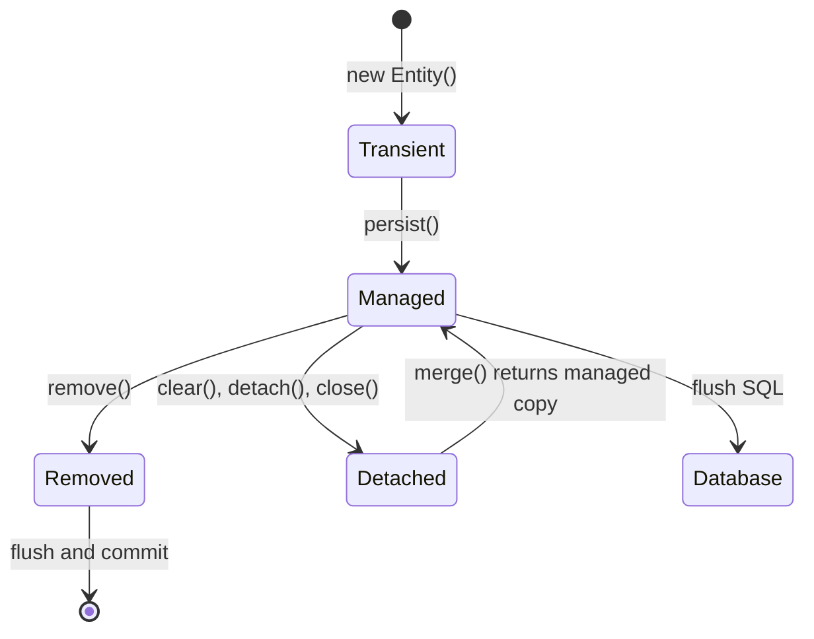
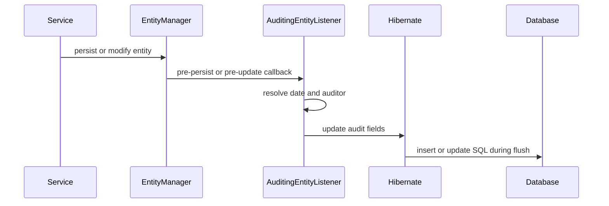

# Hibernate ORM

Hibernate is an object-relational mapping (ORM) framework and a widely used
implementation of Jakarta Persistence. It maps Java entities and relationships
to relational tables, tracks changes to managed objects, generates SQL, binds
parameters, coordinates persistence contexts, and integrates with transactions.

Spring Data JPA sits above JPA:



Hibernate reduces mapping and persistence boilerplate. It does not remove the
need to understand SQL, indexes, transactions, locking, query plans, and
database constraints.

## Dependencies In Spring Boot

```gradle
implementation 'org.springframework.boot:spring-boot-starter-data-jpa'
runtimeOnly 'com.mysql:mysql-connector-j'
```

The JPA starter supplies Spring Data JPA, Hibernate ORM, transaction
integration, and connection-pool support through Spring Boot dependency
management.

```yaml
spring:
  jpa:
    hibernate:
      ddl-auto: validate
    open-in-view: false
```

Use Liquibase or Flyway for production migrations. `ddl-auto=validate` checks
mapping compatibility without letting Hibernate mutate the production schema.

## Main Hibernate Components

| Component | Responsibility |
|---|---|
| `SessionFactory` | thread-safe factory and metadata holder; normally one per persistence unit |
| `Session` | Hibernate persistence context and unit-of-work API |
| `EntityManagerFactory` | standard JPA equivalent of the factory boundary |
| `EntityManager` | standard JPA persistence-context API |
| Persistence context | identity map and managed-entity change tracker |
| `Transaction` / transaction manager | commit and rollback coordination |
| Mapping metadata | entity, table, column, association, identifier, and type mappings |
| Dialect | database-specific SQL capabilities |
| JDBC connection provider | obtains and releases database connections |
| Query engine | parses HQL/JPQL, criteria, and native SQL |
| First-level cache | mandatory session-scoped entity cache |
| Second-level cache | optional shared cache across sessions |

In Spring applications, code normally injects repositories or an
`EntityManager`; Spring manages the underlying factory, session binding, and
transaction lifecycle.

## Persistence Context

A persistence context guarantees one managed Java object per entity identity:

```java
@Transactional
public void demonstrateIdentity(Long id) {
    ProductEntity first = entityManager.find(ProductEntity.class, id);
    ProductEntity second = entityManager.find(ProductEntity.class, id);

    assert first == second;
}
```

The second lookup can be satisfied by the first-level cache without another
database query. This cache is scoped to the persistence context and cannot be
disabled.

Do not treat a persistence context as a general application cache. It should
usually live for one transaction or bounded request use case.

## Hibernate Object Lifecycle



### Transient

A newly created entity not associated with a persistence context:

```java
ProductEntity product = new ProductEntity("SKU-1", "Keyboard");
```

No SQL is generated merely because the object exists.

### Managed Or Persistent

An entity associated with the current persistence context:

```java
entityManager.persist(product);
```

Hibernate tracks managed state. Changes can be written through dirty checking:

```java
@Transactional
public void rename(Long id, String name) {
    ProductEntity product =
            entityManager.find(ProductEntity.class, id);
    product.rename(name);
}
```

Hibernate detects the changed field and issues an `UPDATE` at flush time.

### Detached

An entity with database identity that is no longer managed:

```java
ProductEntity product =
        entityManager.find(ProductEntity.class, id);
entityManager.detach(product);
```

It can also become detached when the persistence context is cleared or closed.

### Removed

An entity scheduled for deletion:

```java
entityManager.remove(product);
```

The SQL `DELETE` normally occurs during flush.

## What Happens If A Detached Object Changes?

Changing a detached object does not trigger dirty checking:

```java
ProductEntity detached = loadOutsideCurrentContext();
detached.rename("New name");
```

No update occurs merely because the field changed.

To copy detached state into a managed instance:

```java
@Transactional
public ProductEntity updateDetached(ProductEntity detached) {
    ProductEntity managed = entityManager.merge(detached);
    return managed;
}
```

Important:

- `merge()` returns the managed instance;
- the argument remains detached;
- Hibernate copies state from the detached object;
- using the returned managed instance avoids later confusion.

```java
ProductEntity managed = entityManager.merge(detached);
assert managed != detached;
```

A safer web application pattern is to load the managed entity and apply
allowed request fields explicitly:

```java
@Transactional
public ProductResponse update(Long id, UpdateProductRequest request) {
    ProductEntity managed = repository.findById(id).orElseThrow();
    managed.rename(request.name());
    managed.changePrice(request.price());
    return mapper.toResponse(managed);
}
```

This prevents over-posting, stale detached graphs, and accidental relationship
replacement.

## `persist()`, `merge()`, `save()`, And `saveOrUpdate()`

This is frequently asked using older Hibernate terminology.

| Method | Meaning | Modern recommendation |
|---|---|---|
| `EntityManager.persist(entity)` | makes a new entity managed; the same object becomes managed | preferred for new JPA entities |
| `EntityManager.merge(entity)` | copies state into a managed instance and returns that instance | use selectively for detached state |
| legacy Hibernate `save(entity)` | historically scheduled insert and returned an identifier | not a modern JPA API |
| legacy Hibernate `saveOrUpdate(entity)` | historically chose insert or reattachment/update | avoid in new code; use explicit state semantics |
| `JpaRepository.save(entity)` | delegates to `persist` for new entities and `merge` otherwise | repository convenience, not Hibernate `save()` |

Modern example:

```java
@Transactional
public ProductEntity create(ProductEntity product) {
    entityManager.persist(product);
    return product;
}
```

Merge example:

```java
@Transactional
public ProductEntity attachChanges(ProductEntity detached) {
    return entityManager.merge(detached);
}
```

Spring Data JPA determines whether an entity is new using version/ID metadata
or `Persistable.isNew()`, then calls `persist()` or `merge()`. Therefore,
`repository.save()` should not be described as identical to Hibernate's old
`Session.save()`.

Do not call `save()` repeatedly on an already managed entity just to force an
update. Dirty checking is sufficient.

## `get()`, `load()`, `find()`, `getReference()`, And Fetching

Older interviews often compare Hibernate `get()` and `load()`. Modern
JPA-oriented equivalents are `find()` and `getReference()`.

| Operation | Result | Missing row |
|---|---|---|
| `EntityManager.find()` | initialized entity or managed instance | returns `null` |
| `Session.get()` / modern `find()` | initialized entity | returns `null` |
| `EntityManager.getReference()` | reference/proxy whose state may load later | may fail when accessed |
| older `Session.load()` terminology | proxy/reference semantics | commonly fails on initialization |

```java
ProductEntity product =
        entityManager.find(ProductEntity.class, id);
```

Use `find()` when entity data is required.

```java
ProductEntity reference =
        entityManager.getReference(ProductEntity.class, id);
order.assignProduct(reference);
```

Use `getReference()` when only an association reference or identifier is
needed and loading the row immediately would be unnecessary.

There is no general JPA entity retrieval method named `fetch()` equivalent to
`get()` or `load()`. "Fetch" usually refers to a fetch plan:

- lazy versus eager mapping;
- JPQL `join fetch`;
- entity graphs;
- batch fetching;
- explicit initialization.

```java
@Query("""
        select order
        from OrderEntity order
        join fetch order.items
        where order.id = :id
        """)
Optional<OrderEntity> findWithItems(Long id);
```

## Flush Versus Commit

Flush synchronizes persistence-context changes to SQL:

```java
entityManager.flush();
```

Commit makes the transaction durable. A flush can happen:

- before commit;
- before a query whose result might depend on pending changes;
- when explicitly requested;
- according to the flush mode.

```text
managed change
  -> dirty checking
  -> flush generates SQL
  -> database constraints execute
  -> commit makes transaction durable
```

An exception after flush can still roll back the transaction.

## Core Hibernate And JPA Annotations

| Annotation | Purpose |
|---|---|
| `@Entity` | persistent entity |
| `@Table` | table, index, and unique constraint mapping |
| `@Id` | primary key |
| `@GeneratedValue` | generated identifier strategy |
| `@Column` | column details |
| `@Transient` | excludes a field from ORM persistence |
| `@Enumerated` | enum storage strategy |
| `@Embedded` / `@Embeddable` | value object stored in owner table |
| `@EmbeddedId` / `@IdClass` | composite identifier |
| `@OneToOne` | one-to-one association |
| `@ManyToOne` | many rows reference one parent |
| `@OneToMany` | parent collection |
| `@ManyToMany` | join-table association |
| `@JoinColumn` | foreign-key column |
| `@Version` | optimistic locking |
| `@MappedSuperclass` | inherited persistent mappings without a table |
| `@EntityListeners` | lifecycle listener registration |
| `@PrePersist` / `@PostPersist` | insert lifecycle callbacks |
| `@PreUpdate` / `@PostUpdate` | update lifecycle callbacks |
| `@PreRemove` / `@PostRemove` | delete lifecycle callbacks |
| `@PostLoad` | callback after entity load |
| `@Convert` | attribute converter |

Hibernate also provides provider-specific annotations such as `@BatchSize`,
`@Fetch`, `@Formula`, `@CreationTimestamp`, and `@UpdateTimestamp`. Prefer
standard JPA annotations when they satisfy the requirement.

## `@Transient`

```java
@Transient
private BigDecimal displayTotal;
```

The field is not mapped to a database column.

Java's `transient` keyword and JPA `@Transient` are related but different:

- Java `transient` excludes a field from Java serialization;
- JPA `@Transient` excludes it from ORM persistence.

Do not use `@Transient` for business state that must survive a restart.

## `@GeneratedValue`

```java
@Id
@GeneratedValue(strategy = GenerationType.IDENTITY)
private Long id;
```

Strategies:

| Strategy | Description |
|---|---|
| `IDENTITY` | database identity/auto-increment column |
| `SEQUENCE` | database sequence, often with allocation optimization |
| `TABLE` | table-based ID allocation; usually less efficient |
| `UUID` | provider/JPA UUID generation where supported |
| `AUTO` | provider selects a strategy |

Sequence example:

```java
@Id
@GeneratedValue(
        strategy = GenerationType.SEQUENCE,
        generator = "order_seq"
)
@SequenceGenerator(
        name = "order_seq",
        sequenceName = "order_seq",
        allocationSize = 50
)
private Long id;
```

`IDENTITY` can reduce insert batching because Hibernate often needs each
generated key immediately. Select a strategy compatible with the database and
write-volume requirements.

## `@MappedSuperclass`

A mapped superclass contributes mappings to entity subclasses but has no table
and cannot be queried as an entity:

```java
@MappedSuperclass
public abstract class AuditedEntity {

    @CreatedDate
    @Column(nullable = false, updatable = false)
    private Instant createdAt;

    @LastModifiedDate
    @Column(nullable = false)
    private Instant updatedAt;
}
```

```java
@Entity
@Table(name = "orders")
public class OrderEntity extends AuditedEntity {
}
```

The `orders` table contains the inherited audit columns.

## Audit Metadata With Spring Data JPA

Enable auditing:

```java
@Configuration(proxyBeanMethods = false)
@EnableJpaAuditing
class JpaAuditingConfiguration {
}
```

Register the listener:

```java
@MappedSuperclass
@EntityListeners(AuditingEntityListener.class)
public abstract class AuditedEntity {

    @CreatedDate
    @Column(nullable = false, updatable = false)
    private Instant createdAt;

    @LastModifiedDate
    @Column(nullable = false)
    private Instant updatedAt;

    @CreatedBy
    @Column(updatable = false)
    private String createdBy;

    @LastModifiedBy
    private String updatedBy;
}
```

Supply the current principal:

```java
@Bean
AuditorAware<String> auditorAware() {
    return () -> Optional.ofNullable(
            SecurityContextHolder.getContext().getAuthentication()
    )
    .filter(Authentication::isAuthenticated)
    .map(Authentication::getName)
    .or(() -> Optional.of("SYSTEM"));
}
```

### Audit Lifecycle



`@CreatedDate` and `@LastModifiedDate` describe row metadata. They do not
provide a complete history of previous values.

## Audit Table Strategies

### Current-Row Audit Columns

```text
created_at
created_by
updated_at
updated_by
```

Best for operational metadata, but cannot reconstruct old states.

### Domain Audit Event Table

```text
audit_event
  event_id
  aggregate_type
  aggregate_id
  action
  actor
  correlation_id
  occurred_at
  metadata_json
```

Best for meaningful business actions such as `PAYMENT_REFUNDED`. Store events
transactionally when they must align with the domain change.

### Hibernate Envers

Envers creates revision tables and records entity changes:

```gradle
implementation 'org.hibernate.orm:hibernate-envers'
```

```java
@Entity
@Audited
class PaymentEntity {
}
```

Typical tables:

```text
payment
payment_AUD
REVINFO
```

Envers is useful for entity history and revision queries. It adds write,
storage, migration, and query complexity.

### Database Triggers Or CDC

Triggers can audit changes regardless of application path. Change Data Capture
can stream database changes. Both are operationally powerful but have weaker
domain meaning unless enriched elsewhere.

Choose according to the question:

| Requirement | Suitable strategy |
|---|---|
| who last changed this row? | audit columns |
| what business action occurred? | domain audit event |
| what was every historical entity state? | Envers/history table |
| capture changes from all writers | trigger or CDC |

Do not store passwords, bearer tokens, full payment credentials, or secrets in
audit records.

## Jakarta Bean Validation With Hibernate

Hibernate Validator is a common Jakarta Validation implementation. Validation
annotations can protect API DTOs, method parameters, and entities:

```gradle
implementation 'org.springframework.boot:spring-boot-starter-validation'
```

```java
public record CreateProductRequest(
        @NotBlank
        @Size(max = 120)
        String name,

        @NotNull
        @Positive
        BigDecimal price
) {
}
```

```java
@Entity
class ProductEntity {

    @NotBlank
    @Column(nullable = false, length = 120)
    private String name;
}
```

DTO validation gives good client errors. Entity validation is an additional
guard before persistence. Database constraints remain the final invariant:

```text
DTO validation
  -> service business validation
  -> entity validation
  -> database constraints
```

Use `@Valid` for nested validation:

```java
public record OrderRequest(
        @NotEmpty
        List<@Valid OrderItemRequest> items
) {
}
```

Use validation groups sparingly; separate request types are often clearer for
create and update contracts.

Do not perform remote calls or expensive database queries in ordinary
constraint validators. Stateful business rules belong in services.

## Fetching And `LazyInitializationException`

A lazy association is initialized only when accessed:

```java
@OneToMany(mappedBy = "order", fetch = FetchType.LAZY)
private List<OrderItemEntity> items;
```

This fails after the persistence context closes:

```java
OrderEntity detached = service.findOrder(id);
detached.getItems().size(); // LazyInitializationException
```

Solutions:

- map to DTOs inside the transaction;
- fetch required associations with a fetch join;
- use an entity graph;
- use projections;
- issue a separate bounded query.

Do not solve it globally with eager relationships or Open Session in View.
Those approaches hide query ownership and often cause unpredictable SQL.

## N+1 And Fetch Plans

```text
select all orders                         -- 1
select items where order_id = ?           -- N times
```

Use the smallest suitable solution:

```java
@EntityGraph(attributePaths = "items")
Optional<OrderEntity> findDetailedById(Long id);
```

```java
@Query("""
        select distinct order
        from OrderEntity order
        left join fetch order.items
        where order.id = :id
        """)
Optional<OrderEntity> findWithItems(Long id);
```

For paginated parent collections, prefer DTO projections or two-step loading
instead of paginating a collection fetch join.

## Performance Optimization

### Select Only Required Data

```java
public record OrderSummary(
        Long id,
        String orderNumber,
        OrderStatus status
) {
}
```

Use projections for read endpoints instead of loading full entity graphs.

### Enable JDBC Batching

```yaml
spring:
  jpa:
    properties:
      hibernate:
        jdbc:
          batch_size: 50
        order_inserts: true
        order_updates: true
```

Flush and clear bounded import chunks:

```java
if ((index + 1) % batchSize == 0) {
    entityManager.flush();
    entityManager.clear();
}
```

### Keep Transactions Short

Do not hold a transaction open during:

- HTTP calls;
- Kafka waits;
- file uploads;
- user interaction;
- long CPU work.

### Use Read-Only Transactions

```java
@Transactional(readOnly = true)
public OrderSummary getOrder(Long id) {
    // ...
}
```

This communicates intent and may enable optimizations. It is not a security
boundary.

### Tune Pagination

- cap page size;
- index filter and order columns;
- use a unique sort tie-breaker;
- use `Slice` if total count is unnecessary;
- use keyset pagination for deep traversal.

### Inspect SQL And Plans

In controlled development:

```yaml
logging:
  level:
    org.hibernate.SQL: DEBUG
```

Do not enable verbose bind-value logging in production because it can expose
sensitive data and generate substantial volume.

Use:

- Hibernate statistics in tests or diagnostics;
- datasource-proxy or P6Spy in development;
- database `EXPLAIN`;
- application metrics and traces;
- production-like data volumes.

### Use Appropriate Locking

Use optimistic locking for ordinary contention:

```java
@Version
private long version;
```

Use pessimistic locks only for short measured critical sections. Never hold a
database lock while waiting for a remote dependency.

### Understand Cache Levels

- first-level cache: mandatory, persistence-context scoped;
- second-level cache: optional, shared entity/collection data;
- query cache: optional query-result key cache;
- Spring Cache: application-method cache outside Hibernate semantics.

Do not enable second-level or query caching globally without defining
invalidation, staleness, memory, and measurement.

## Important Interview Questions

### Is Hibernate The Same As JPA?

No. Jakarta Persistence is a specification/API. Hibernate ORM is an
implementation with additional native features.

### Is Spring Data JPA The Same As Hibernate?

No. Spring Data JPA generates repository implementations and integrates with
JPA. Hibernate is commonly the provider below the `EntityManager`.

### What Is Dirty Checking?

Hibernate snapshots or otherwise tracks managed state and generates updates
for changed persistent attributes at flush time.

### Is `flush()` The Same As `commit()`?

No. Flush executes/synchronizes SQL within the current transaction. Commit
makes the transaction durable. Flushed work may still roll back.

### Why Is `repository.save()` Sometimes Unnecessary?

An entity loaded in the current transaction is managed. Changing it is enough
for dirty checking. `save()` is needed for repository semantics around new or
detached instances, not every managed update.

### Why Can `merge()` Be Dangerous?

It copies detached state, potentially including stale or unauthorized fields
and relationships. Loading a managed entity and applying allowed changes is
often safer.

### What Is The First-Level Cache?

The persistence-context identity map. It ensures one managed object per entity
identity and can avoid repeated identifier lookups in the same context.

### What Is The Difference Between First-Level And Second-Level Cache?

First-level cache is mandatory and session-scoped. Second-level cache is
optional and shared across sessions for configured entities or collections.

### What Causes `LazyInitializationException`?

Code accesses an uninitialized lazy association after its persistence context
has closed. Fix the use-case fetch plan, not the symptom.

### Why Is `FetchType.EAGER` Not An N+1 Solution?

Eager defines a requirement to load data, not necessarily one efficient SQL
join. Hibernate may execute secondary selects, and large eager graphs can
create cartesian products.

### What Is The Owning Side Of A Relationship?

The side responsible for the foreign-key or join-table update. In a
bidirectional one-to-many/many-to-one relationship, the child `@ManyToOne`
with `@JoinColumn` normally owns it; `mappedBy` identifies the inverse side.

### What Is The Difference Between Cascade And Database Cascade?

JPA cascade propagates entity lifecycle operations in the object model.
Database `ON DELETE` or `ON UPDATE` rules execute inside the database. They are
configured and observed differently.

### Why Avoid Lombok `@Data` On Entities?

Generated equality, hash code, and `toString()` can traverse lazy relationships,
recurse through bidirectional associations, or change hash behavior after ID
assignment.

### What Is The Difference Between `remove()` And Bulk Delete?

`remove()` manages individual entity lifecycle, cascades, and callbacks. Bulk
JPQL/native delete executes directly and bypasses managed entity state and
per-entity callbacks.

### Why Can An `IDENTITY` ID Reduce Batching?

Hibernate commonly needs each inserted row's generated identity immediately,
which prevents grouping inserts as effectively as preallocated sequence IDs.

### What Does `orphanRemoval=true` Do?

Removing a privately owned child from the parent's collection schedules the
child row for deletion. It is not appropriate for shared entities.

### How Do You Prevent Lost Updates?

Use `@Version`, conditional updates, database uniqueness, or carefully scoped
locks according to the invariant. A normal read followed by write without
versioning can overwrite concurrent changes.

### Why Disable Open Session In View?

It prevents web serialization and controllers from silently issuing queries
outside the service transaction, making query ownership and failure boundaries
explicit.

### Can Hibernate Prevent SQL Injection?

Bound JPQL/HQL and native-query parameters prevent values from changing query
structure. String-concatenated SQL, JPQL, sort expressions, or identifiers can
still be vulnerable.

### How Should Hibernate Performance Be Diagnosed?

Measure query count and latency, inspect generated SQL and bind behavior,
analyze database plans, detect N+1, check indexes and connection pools, and
test with realistic data. Do not optimize mappings by intuition alone.

## Tricky Scenarios

### A Managed Entity Is Changed Outside `@Transactional`

Whether an update occurs depends on whether a persistence context and
transaction are active. Do not rely on incidental context lifetime. Put writes
inside explicit service transactions.

### A Detached Entity Is Passed To `persist()`

`persist()` is for new entities. Passing detached identity can cause an entity
existence or persistence exception. Use explicit managed updates or `merge()`
when detached-state copying is genuinely required.

### Two Objects With The Same ID Are Associated With One Session

The persistence context maintains one managed instance per identity. Trying to
associate a different instance with the same identity can cause conflicts.
Use the managed instance or merge carefully.

### `equals()` Uses A Generated ID

Before persistence, IDs may be null; after persistence, the hash code can
change while the entity is inside a `HashSet`. Use carefully designed equality,
often based on a stable natural key, or identity semantics appropriate to the
aggregate.

### Bulk Update Then Read Managed Entity

A bulk update bypasses the persistence context, so an already managed object
can remain stale:

```java
repository.bulkUpdateStatus(...);
entityManager.clear();
```

Use `clearAutomatically`, clear explicitly, or refresh affected entities.

### Multiple Bag Fetch

Fetching several unordered list/bag collections in one query can create a
cartesian product and may be rejected by Hibernate. Use separate queries,
sets where semantically correct, batch/subselect fetching, or a dedicated DTO
query.

## Production Do And Do Not

| Do | Do not |
|---|---|
| Use explicit service transactions | Depend on accidental session lifetime |
| Keep associations lazy by default | Mark every relationship eager |
| Load managed entities and apply allowed changes | Bind API payloads directly to detached entities |
| Use database constraints and `@Version` | Rely only on application checks |
| Inspect generated SQL and plans | Assume ORM-generated SQL is efficient |
| Use projections for read models | Return entities from REST APIs |
| Batch bounded writes and clear the context | Retain millions of managed objects |
| Use migration tools | Use `ddl-auto=update` in production |
| Keep remote calls outside DB transactions | Hold locks while waiting on networks |
| Audit according to the actual requirement | Claim timestamps provide full history |
| Bind query parameters | Concatenate untrusted SQL or HQL |
| Test with the production database engine | Assume an in-memory database behaves like MySQL |

## Related Guides

- [Spring Data JPA](../spring/SPRING-DATA-JPA.md)
- [Spring Transactions](../spring/SPRING-TRANSACTIONS.md)
- [Database Engineering](DATABASE-ENGINEERING.md)
- [Liquibase](LIQUIBASE-GENERIC.md)
- [Spring Boot Testing](../spring/SPRING-BOOT-TESTING.md)

## Official References

- [Hibernate ORM User Guide](https://docs.hibernate.org/orm/7.1/userguide/html_single/)
- [Hibernate Session API](https://docs.hibernate.org/orm/7.1/javadocs/org/hibernate/Session.html)
- [Spring Data JPA Auditing](https://docs.spring.io/spring-data/jpa/reference/auditing.html)

