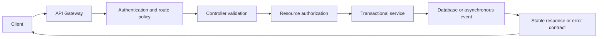

# REST API Design

REST APIs expose resources through stable HTTP contracts. A good contract is
predictable for clients, independent of database entities, secure by default,
and observable when requests fail.

This guide contains reusable REST design guidance. Shopverse endpoints and
demonstration steps are documented in the [Shopverse API guide](API-GUIDE.md).

## Resource-Oriented URLs

Use nouns for resources and HTTP methods for operations:

```http
GET    /api/v1/orders
GET    /api/v1/orders/42
POST   /api/v1/orders
PATCH  /api/v1/orders/42
DELETE /api/v1/orders/42
```

Prefer:

```text
/orders/42/payments
/orders/42/timeline
```

Avoid RPC-style paths when a resource model is clear:

```text
/getOrder
/createNewOrder
/deleteOrderById
```

An action endpoint is reasonable when the action represents a domain command
that does not map cleanly to CRUD:

```http
POST /api/v1/payments/orders/ORD-1001/refund
```

Use lowercase paths, plural resource names, and consistent naming. Do not
expose implementation terms such as table names or Java class names.

## HTTP Method Semantics

| Method | Typical purpose | Safe | Idempotent |
|---|---|---:|---:|
| `GET` | Read a resource | Yes | Yes |
| `HEAD` | Read response metadata | Yes | Yes |
| `POST` | Create or execute a command | No | Not inherently |
| `PUT` | Replace a resource at a known URI | No | Yes |
| `PATCH` | Partially update a resource | No | Depends on operation |
| `DELETE` | Remove a resource | No | Yes |

Safe means the request should not change business state. Idempotent means
repeating the same request has the same intended effect, although response
metadata can differ.

`POST` operations that create orders, payments, or other irreversible effects
should support an idempotency key:

```http
POST /api/v1/orders/checkout
Idempotency-Key: checkout-user-42-cart-9001
```

Store the key with the result and enforce uniqueness in the database. An
in-memory existence check alone does not prevent concurrent duplicates.

## Status Codes

| Status | Use |
|---|---|
| `200 OK` | Successful read or command with a response body |
| `201 Created` | Resource created; include `Location` when practical |
| `202 Accepted` | Asynchronous work accepted but not completed |
| `204 No Content` | Successful operation without a response body |
| `400 Bad Request` | Malformed request or invalid syntax |
| `401 Unauthorized` | Authentication is missing or invalid |
| `403 Forbidden` | Identity is valid but lacks access |
| `404 Not Found` | Resource does not exist or must be concealed |
| `409 Conflict` | State conflict, duplicate key, or version conflict |
| `422 Unprocessable Content` | Semantically invalid request |
| `429 Too Many Requests` | Rate limit exceeded |
| `500 Internal Server Error` | Unexpected server failure |
| `503 Service Unavailable` | Temporary dependency or capacity failure |

Do not return `200` with an error object. The HTTP status must describe the
result so clients, gateways, and monitoring systems can interpret it.

## Requests, Responses, And DTOs

Expose stable request and response DTOs rather than JPA entities. This prevents
lazy-loading leaks, accidental field exposure, recursive serialization, and
tight coupling between database and API schemas.

```java
public record CheckoutRequest(
        @NotEmpty @Size(max = 20) List<@Valid CheckoutItemRequest> items
) {
}

public record CheckoutItemRequest(
        @NotNull @Positive Long productId,
        @Positive int quantity
) {
}
```

Use Jakarta Validation for structural validation and service/domain code for
business rules. Validation errors should identify the field, rejected rule,
and correlation ID without exposing internals.

Keep response shapes consistent. Avoid returning unrelated shapes from the
same endpoint based on success or failure.

## Error Contract

A shared error model makes client and operational behavior predictable:

```json
{
  "timestamp": "2026-06-11T10:00:00Z",
  "status": 409,
  "code": "DUPLICATE_REQUEST",
  "message": "The idempotency key belongs to another request",
  "path": "/api/v1/orders/checkout",
  "correlationId": "demo-checkout-9001",
  "fieldErrors": []
}
```

Use a stable machine-readable `code`; human-readable messages can change.
Never return stack traces, SQL, secrets, internal hosts, or dependency
credentials. Spring's `ProblemDetail` can be used to implement a consistent
problem response while adding application-specific properties.

## Query Design

Use query parameters for optional selection:

```http
GET /api/v1/orders?status=CONFIRMED&sort=createdAt,desc&page=0&size=20
```

Production list APIs should define:

- a maximum page size;
- stable sorting with a unique tie-breaker;
- indexed filter fields;
- an explicit default sort;
- cursor pagination for large or frequently changing datasets;
- allow-listed fields rather than arbitrary query construction.

Return pagination metadata or navigation links consistently. Do not load an
unbounded table into memory.

## Concurrency And Conditional Requests

Use an entity version, timestamp, or ETag to prevent lost updates:

```http
GET /api/v1/inventory/101
ETag: "7"

PUT /api/v1/inventory/101
If-Match: "7"
```

If another update has changed the version, return `409 Conflict` or
`412 Precondition Failed`. Database optimistic locking remains the final
concurrency control even when HTTP preconditions are used.

## Asynchronous Operations

When processing continues after the HTTP request, return a durable operation
or business resource instead of implying completion:

```http
HTTP/1.1 202 Accepted
Location: /api/v1/operations/8bce
```

Clients can poll the operation or receive an event/webhook. For Shopverse,
checkout creates an order synchronously and the SAGA advances asynchronously,
so `201 Created` describes creation of the order, not completion of payment.

## Versioning And Compatibility

Shopverse uses URI versioning:

```text
/api/v1/orders
```

Within a version:

- add optional response fields without changing existing meaning;
- avoid renaming or changing field types;
- do not make optional request fields mandatory;
- define deprecation and removal dates;
- use consumer contract tests for important clients;
- evolve asynchronous event schemas separately from REST schemas.

Create a new major API version only for incompatible contract changes.

## Security

- Authenticate at the gateway and again in each resource service.
- Authorize the resource, not only the route.
- Enforce ownership for customer data.
- Use method-level authorization for sensitive operations.
- Validate input size, type, range, and allow-listed values.
- Use parameterized persistence APIs; never concatenate untrusted SQL.
- Restrict CORS to trusted origins and required methods.
- Apply request-size, rate, timeout, and concurrency limits.
- Redact tokens, passwords, payment data, and personal information from logs.
- Return generic authentication errors to avoid account enumeration.

An API gateway is a policy and routing layer, not a replacement for service
authorization.

## Caching

Cache only data with a clear freshness policy. Define:

- cache key;
- TTL;
- invalidation event;
- behavior during cache failure;
- whether data is safe to share between users.

Use `Cache-Control`, `ETag`, and conditional GET where appropriate. Never cache
user-specific responses in a shared cache without a correctly partitioned key.

## Rate Limits And Resilience

Return `429 Too Many Requests` when a client exceeds an explicit rate policy
and include `Retry-After` when possible. Separate client throttling from
dependency resilience:

- rate limiter controls request admission;
- bulkhead limits concurrent work;
- timeout bounds waiting;
- retry handles selected transient failures;
- circuit breaker avoids repeatedly calling an unhealthy dependency.

Retries require idempotency. Do not retry validation failures, authorization
failures, or non-idempotent commands without a durable idempotency key.

## Documentation And Observability

Publish OpenAPI documentation from the implemented controllers and DTOs.
Document authentication, status codes, validation rules, idempotency, examples,
and error responses.

For each request, record:

- service, method, route template, status, and duration;
- correlation ID and distributed trace context;
- a bounded error code;
- metrics without high-cardinality values such as user ID or order number.

Correlation IDs help operators search logs. Trace IDs identify one distributed
trace. Neither value is an authentication mechanism.

## Production Checklist

1. Use resource-oriented, versioned paths.
2. Match HTTP method and status semantics.
3. Validate all external input.
4. Keep persistence entities out of API contracts.
5. Use one stable error model.
6. require authentication and resource-level authorization.
7. make retried commands idempotent.
8. bound list queries and request sizes.
9. document and test compatibility.
10. emit low-cardinality metrics and correlated logs.
11. define timeouts, rate limits, and dependency failure behavior.
12. never expose secrets or implementation details in responses.

## Request Flow



## Related Guides

- [Shopverse API guide](API-GUIDE.md)
- [API Gateway](API-GATEWAY-GENERIC.md)
- [Spring Security](../security/SPRING-SECURITY-GENERIC.md)
- [Transactions](../reliability/TRANSACTIONS-GENERIC.md)
- [Distributed systems](../architecture/DISTRIBUTED-SYSTEMS.md)
