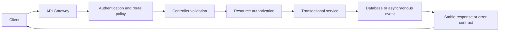

# REST API Design

REST APIs expose resources through stable HTTP contracts. A good contract is
predictable for clients, independent of database entities, secure by default,
and observable when requests fail.

This guide contains reusable REST design guidance. Shopverse endpoints and
demonstration steps are documented in the [Shopverse API guide](API-GUIDE.md).

## Core REST Design Principles

The following principles should be decided before controllers and DTOs are
implemented. They make an API predictable for clients and easier to secure,
operate, and evolve.

### 1. Model Resources And Use Consistent Names

URLs identify resources, while HTTP methods describe the operation. Use
lowercase, plural nouns and hyphens for multi-word path segments.

| Prefer | Avoid | Reason |
|---|---|---|
| `GET /api/v1/orders` | `GET /api/v1/getOrders` | The HTTP method already expresses the action |
| `GET /api/v1/orders/42` | `GET /api/v1/order?id=42` | The resource identifier belongs in the path |
| `POST /api/v1/orders` | `POST /api/v1/createOrder` | Use a noun-based collection |
| `GET /api/v1/order-items` | `GET /api/v1/orderItems` | Keep path naming lowercase and consistent |
| `GET /api/v1/orders/42/items` | `GET /api/v1/itemsForOrder/42` | Represent relationships through resource hierarchy |

Use query parameters for filtering, sorting, searching, and pagination:

```http
GET /api/v1/orders?status=CONFIRMED&page=0&size=20&sort=createdAt,desc
```

Do not expose database table names, Java class names, implementation details,
or verbs such as `get`, `create`, and `delete` when normal resource semantics
are sufficient. Domain commands such as `refund`, `cancel`, or `checkout` are
acceptable when they cannot be represented clearly as ordinary CRUD.

### 2. Version Public Contracts

Version APIs so incompatible changes can be introduced without unexpectedly
breaking existing clients. URI versioning is explicit and easy to operate:

```http
GET /api/v1/orders/42
GET /api/v2/orders/42
```

Do:

- keep compatible additions, such as optional fields, within the same version;
- publish deprecation and removal dates;
- support old and new versions during an agreed migration period;
- use contract tests for important consumers.

Do not create a new version for every implementation change. A new major
version is normally required when fields are removed or renamed, types change,
or request and response semantics become incompatible.

### 3. Require HTTPS

Use HTTPS for every external API and for internal service communication when
the deployment environment supports service TLS or mTLS. HTTPS provides
encryption in transit, server identity verification, and message integrity.

Do:

- redirect or reject plain HTTP at the ingress;
- use valid, automatically rotated certificates;
- use mTLS when services must authenticate each other;
- mark security cookies `Secure`, `HttpOnly`, and with an appropriate
  `SameSite` policy.

HTTPS does not replace authentication, authorization, input validation, or
safe secret handling.

### 4. Respect HTTP Method Semantics

Choose methods according to their defined meaning:

| Method | Intended use | Safe | Idempotent |
|---|---|---:|---:|
| `GET` | Read a representation | Yes | Yes |
| `HEAD` | Read headers without a body | Yes | Yes |
| `OPTIONS` | Discover communication options | Yes | Yes |
| `POST` | Create a resource or submit a command | No | No, by default |
| `PUT` | Replace a resource at a known URI | No | Yes |
| `PATCH` | Apply a partial change | No | Depends on the patch |
| `DELETE` | Remove a resource | No | Yes |

A **safe** method is read-only from the client's perspective. Logging and
metrics may occur, but a `GET` request must not create an order, charge a
payment, or change inventory.

An **idempotent** method can be repeated with the same intended server-side
effect. The response may differ; for example, a repeated `DELETE` can return
`404` after the resource has already been removed.

### 5. Design Idempotency For Retried Commands

Networks can lose responses even after a server successfully commits work.
Clients, gateways, and message consumers can therefore repeat requests.
Non-idempotent commands such as checkout and payment creation should accept a
stable idempotency key:

```http
POST /api/v1/orders/checkout
Idempotency-Key: checkout-customer-42-cart-9001
```

The server should persist the key, request identity, and result in durable
storage. Repeating the same request returns the original result without
creating another order or charge. Reusing the key for a different request
should return `409 Conflict`.

Database uniqueness is the final concurrency guarantee. A check such as
`existsByIdempotencyKey(...)` without a unique constraint is vulnerable to
race conditions.

### 6. Return Accurate HTTP Status Codes

Use status codes to describe the protocol-level result:

| Situation | Recommended status |
|---|---|
| Successful read or update with a body | `200 OK` |
| Resource created | `201 Created` |
| Asynchronous work accepted | `202 Accepted` |
| Successful request without a body | `204 No Content` |
| Malformed request | `400 Bad Request` |
| Missing or invalid authentication | `401 Unauthorized` |
| Authenticated but not permitted | `403 Forbidden` |
| Resource not found | `404 Not Found` |
| Duplicate, state, or version conflict | `409 Conflict` |
| Structurally valid but semantically invalid input | `422 Unprocessable Content` |
| Rate limit exceeded | `429 Too Many Requests` |
| Unexpected server failure | `500 Internal Server Error` |
| Temporary dependency or capacity failure | `503 Service Unavailable` |

Do not return `200 OK` with an error payload. Include `Location` with
`201 Created` or `202 Accepted` when clients can follow a resource or operation.

### 7. Keep APIs Stateless

Each request should contain the authentication and request context needed to
process it. A service instance should not depend on in-memory state created by
a previous request. Stateless APIs can be load balanced and scaled more
reliably.

Durable business state belongs in a database, cache, or message system. A
server-side login session is valid when deliberately designed, but it must be
stored or replicated so another instance can continue the interaction.

### 8. Use Stable DTOs And Representations

Do not expose JPA entities directly. Define request and response DTOs so API
contracts can evolve independently from persistence schemas. Use consistent:

- field naming and date formats, preferably ISO 8601 with a timezone;
- money representation, including currency and decimal precision;
- identifier types;
- null and optional-field behavior;
- content types such as `application/json`.

Support content negotiation through `Accept` and `Content-Type` where multiple
representations are genuinely needed.

### 9. Validate At The Boundary

Validate structure, size, ranges, formats, and nested objects before business
processing. Use Jakarta Validation for request shape and domain services for
rules requiring current business state.

```java
public record CreateOrderRequest(
        @NotBlank @Size(max = 100) String customerUsername,
        @NotEmpty @Size(max = 20) List<@Valid OrderItemRequest> items
) {
}
```

Reject unknown or oversized input where appropriate. Validation must also
exist at database boundaries through constraints such as `NOT NULL`, unique
keys, foreign keys, and optimistic locking.

### 10. Standardize Error Responses

Return one machine-readable error shape across services. Include a stable
error code, useful message, request path, timestamp, and correlation ID.
Never expose stack traces, SQL, credentials, internal hostnames, or secrets.

Use Spring `ProblemDetail` or an equivalent RFC 9457 problem response and map
exceptions centrally with `@RestControllerAdvice`.

### 11. Bound Collection APIs

Every collection endpoint should define pagination, maximum page size, stable
sorting, and allow-listed filters. Use indexed fields for common queries.
Cursor pagination is preferable for large or rapidly changing datasets.

Never expose an endpoint that can load an unbounded table into memory.

### 12. Secure And Operate The Contract

- Authenticate requests and authorize both the operation and resource owner.
- Apply rate limits, request-size limits, timeouts, and concurrency limits.
- Restrict CORS to required origins, headers, and methods.
- Never log passwords, tokens, secrets, or sensitive payment data.
- Emit correlated logs, traces, request counts, error counts, and latency.
- Publish OpenAPI documentation with examples and error responses.
- Preserve backward compatibility and test important consumer contracts.

The following sections explain these principles and their implementation in
more detail.

## Resource-Oriented URLs

Use nouns for resources and HTTP methods for operations:

```http
GET    /api/v1/orders
GET    /api/v1/orders/42
POST   /api/v1/orders
PATCH  /api/v1/orders/42
DELETE /api/v1/orders/42
```

Prefer:

```text
/orders/42/payments
/orders/42/timeline
```

Avoid RPC-style paths when a resource model is clear:

```text
/getOrder
/createNewOrder
/deleteOrderById
```

An action endpoint is reasonable when the action represents a domain command
that does not map cleanly to CRUD:

```http
POST /api/v1/payments/orders/ORD-1001/refund
```

Use lowercase paths, plural resource names, and consistent naming. Do not
expose implementation terms such as table names or Java class names.

## HTTP Method Semantics

| Method | Typical purpose | Safe | Idempotent |
|---|---|---:|---:|
| `GET` | Read a resource | Yes | Yes |
| `HEAD` | Read response metadata | Yes | Yes |
| `POST` | Create or execute a command | No | Not inherently |
| `PUT` | Replace a resource at a known URI | No | Yes |
| `PATCH` | Partially update a resource | No | Depends on operation |
| `DELETE` | Remove a resource | No | Yes |

Safe means the request should not change business state. Idempotent means
repeating the same request has the same intended effect, although response
metadata can differ.

`POST` operations that create orders, payments, or other irreversible effects
should support an idempotency key:

```http
POST /api/v1/orders/checkout
Idempotency-Key: checkout-user-42-cart-9001
```

Store the key with the result and enforce uniqueness in the database. An
in-memory existence check alone does not prevent concurrent duplicates.

## Status Codes

| Status | Use |
|---|---|
| `200 OK` | Successful read or command with a response body |
| `201 Created` | Resource created; include `Location` when practical |
| `202 Accepted` | Asynchronous work accepted but not completed |
| `204 No Content` | Successful operation without a response body |
| `400 Bad Request` | Malformed request or invalid syntax |
| `401 Unauthorized` | Authentication is missing or invalid |
| `403 Forbidden` | Identity is valid but lacks access |
| `404 Not Found` | Resource does not exist or must be concealed |
| `409 Conflict` | State conflict, duplicate key, or version conflict |
| `422 Unprocessable Content` | Semantically invalid request |
| `429 Too Many Requests` | Rate limit exceeded |
| `500 Internal Server Error` | Unexpected server failure |
| `503 Service Unavailable` | Temporary dependency or capacity failure |

Do not return `200` with an error object. The HTTP status must describe the
result so clients, gateways, and monitoring systems can interpret it.

## Requests, Responses, And DTOs

Expose stable request and response DTOs rather than JPA entities. This prevents
lazy-loading leaks, accidental field exposure, recursive serialization, and
tight coupling between database and API schemas.

```java
public record CheckoutRequest(
        @NotEmpty @Size(max = 20) List<@Valid CheckoutItemRequest> items
) {
}

public record CheckoutItemRequest(
        @NotNull @Positive Long productId,
        @Positive int quantity
) {
}
```

Use Jakarta Validation for structural validation and service/domain code for
business rules. Validation errors should identify the field, rejected rule,
and correlation ID without exposing internals.

Keep response shapes consistent. Avoid returning unrelated shapes from the
same endpoint based on success or failure.

## Error Contract

A shared error model makes client and operational behavior predictable:

```json
{
  "timestamp": "2026-06-11T10:00:00Z",
  "status": 409,
  "code": "DUPLICATE_REQUEST",
  "message": "The idempotency key belongs to another request",
  "path": "/api/v1/orders/checkout",
  "correlationId": "demo-checkout-9001",
  "fieldErrors": []
}
```

Use a stable machine-readable `code`; human-readable messages can change.
Never return stack traces, SQL, secrets, internal hosts, or dependency
credentials. Spring's `ProblemDetail` can be used to implement a consistent
problem response while adding application-specific properties.

## Query Design

Use query parameters for optional selection:

```http
GET /api/v1/orders?status=CONFIRMED&sort=createdAt,desc&page=0&size=20
```

Production list APIs should define:

- a maximum page size;
- stable sorting with a unique tie-breaker;
- indexed filter fields;
- an explicit default sort;
- cursor pagination for large or frequently changing datasets;
- allow-listed fields rather than arbitrary query construction.

Return pagination metadata or navigation links consistently. Do not load an
unbounded table into memory.

## Concurrency And Conditional Requests

Use an entity version, timestamp, or ETag to prevent lost updates:

```http
GET /api/v1/inventory/101
ETag: "7"

PUT /api/v1/inventory/101
If-Match: "7"
```

If another update has changed the version, return `409 Conflict` or
`412 Precondition Failed`. Database optimistic locking remains the final
concurrency control even when HTTP preconditions are used.

## Asynchronous Operations

When processing continues after the HTTP request, return a durable operation
or business resource instead of implying completion:

```http
HTTP/1.1 202 Accepted
Location: /api/v1/operations/8bce
```

Clients can poll the operation or receive an event/webhook. For Shopverse,
checkout creates an order synchronously and the SAGA advances asynchronously,
so `201 Created` describes creation of the order, not completion of payment.

## Versioning And Compatibility

Shopverse uses URI versioning:

```text
/api/v1/orders
```

Within a version:

- add optional response fields without changing existing meaning;
- avoid renaming or changing field types;
- do not make optional request fields mandatory;
- define deprecation and removal dates;
- use consumer contract tests for important clients;
- evolve asynchronous event schemas separately from REST schemas.

Create a new major API version only for incompatible contract changes.

## Security

- Authenticate at the gateway and again in each resource service.
- Authorize the resource, not only the route.
- Enforce ownership for customer data.
- Use method-level authorization for sensitive operations.
- Validate input size, type, range, and allow-listed values.
- Use parameterized persistence APIs; never concatenate untrusted SQL.
- Restrict CORS to trusted origins and required methods.
- Apply request-size, rate, timeout, and concurrency limits.
- Redact tokens, passwords, payment data, and personal information from logs.
- Return generic authentication errors to avoid account enumeration.

An API gateway is a policy and routing layer, not a replacement for service
authorization.

## Caching

Cache only data with a clear freshness policy. Define:

- cache key;
- TTL;
- invalidation event;
- behavior during cache failure;
- whether data is safe to share between users.

Use `Cache-Control`, `ETag`, and conditional GET where appropriate. Never cache
user-specific responses in a shared cache without a correctly partitioned key.

## Rate Limits And Resilience

Return `429 Too Many Requests` when a client exceeds an explicit rate policy
and include `Retry-After` when possible. Separate client throttling from
dependency resilience:

- rate limiter controls request admission;
- bulkhead limits concurrent work;
- timeout bounds waiting;
- retry handles selected transient failures;
- circuit breaker avoids repeatedly calling an unhealthy dependency.

Retries require idempotency. Do not retry validation failures, authorization
failures, or non-idempotent commands without a durable idempotency key.

## Documentation And Observability

Publish OpenAPI documentation from the implemented controllers and DTOs.
Document authentication, status codes, validation rules, idempotency, examples,
and error responses.

For each request, record:

- service, method, route template, status, and duration;
- correlation ID and distributed trace context;
- a bounded error code;
- metrics without high-cardinality values such as user ID or order number.

Correlation IDs help operators search logs. Trace IDs identify one distributed
trace. Neither value is an authentication mechanism.

## Production Checklist

1. Use resource-oriented, versioned paths.
2. Match HTTP method and status semantics.
3. Validate all external input.
4. Keep persistence entities out of API contracts.
5. Use one stable error model.
6. require authentication and resource-level authorization.
7. make retried commands idempotent.
8. bound list queries and request sizes.
9. document and test compatibility.
10. emit low-cardinality metrics and correlated logs.
11. define timeouts, rate limits, and dependency failure behavior.
12. never expose secrets or implementation details in responses.

## Request Flow



## Related Guides

- [Shopverse API guide](API-GUIDE.md)
- [API Gateway](API-GATEWAY-GENERIC.md)
- [Spring Security](../security/SPRING-SECURITY-GENERIC.md)
- [Spring Transactions](../spring/SPRING-TRANSACTIONS.md)
- [Distributed systems](../architecture/DISTRIBUTED-SYSTEMS.md)
