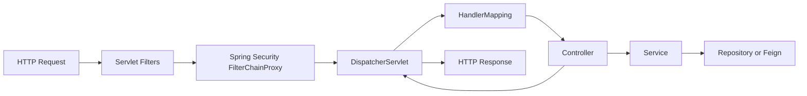

# Spring Boot Request And Observation Internals

## Servlet Request Path



The service `RequestLoggingFilter` runs once per request, establishes correlation MDC, records duration, and increments an HTTP outcome counter. Spring Security authenticates before protected controller methods execute.

## Gateway Path

The API Gateway is reactive:

```text
WebFilter / GlobalFilter -> route lookup -> security -> load-balanced downstream call
                           -> reactive completion callback -> response/log/metric
```

Reactive work may move between threads, so Reactor Context and Micrometer context propagation are more important than relying only on thread-local state.

See [API Gateway](API-GATEWAY-GENERIC.md) for generic gateway concepts and the
detailed `chain.filter(...)` lifecycle, correlation handling, `doFinally`,
duration measurement, metrics, and termination signals.

## Security Path

For a bearer request:

1. `BearerTokenAuthenticationFilter` resolves the token.
2. `JwtAuthenticationProvider` calls the configured `JwtDecoder`.
3. Nimbus verifies the RSA signature through the JWKS endpoint.
4. validators check timestamps and any explicitly configured issuer/audience rules.
5. `JwtAuthenticationConverter` maps claims to authorities.
6. the resulting `Authentication` is stored in `SecurityContextHolder`.
7. URL and `@PreAuthorize` rules evaluate those authorities.

## Observation Path

Micrometer Observation wraps supported operations. Tracing handlers create spans, propagation injectors/extractors transfer headers, logging correlation adds trace fields, and the Zipkin reporter exports completed spans. Prometheus metrics use a separate registry and `/actuator/prometheus`; logs are not converted into metrics by Prometheus.

## Configuration Binding

Shopverse uses centralized YAML and typed property records for Kafka topics and payment settings. `@ConfigurationProperties` is preferable to scattered `@Value` fields when several related values form one contract because it supports immutable records, validation, and metadata.
