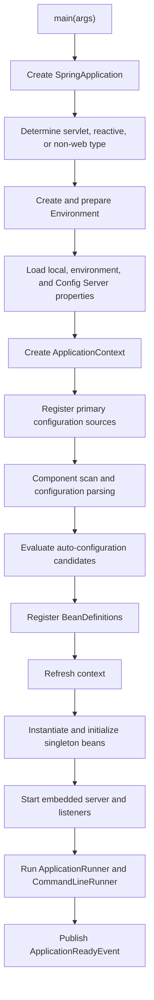
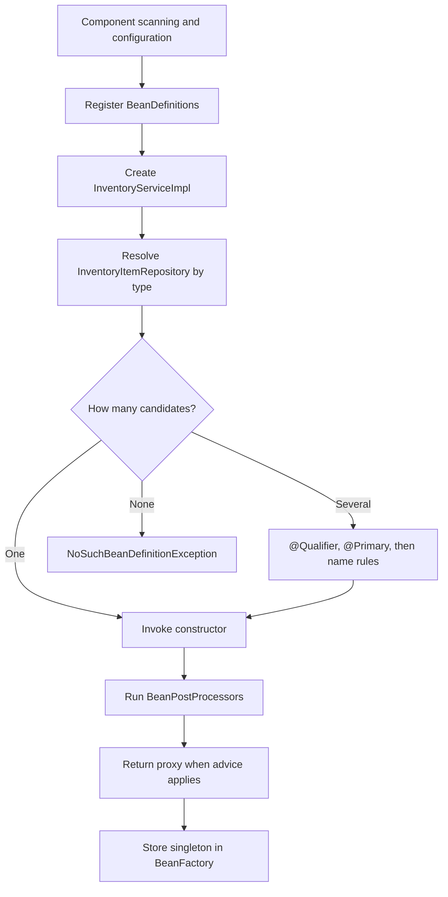
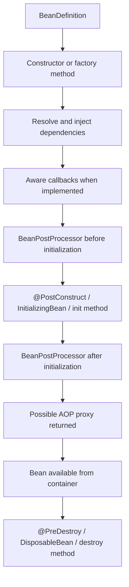
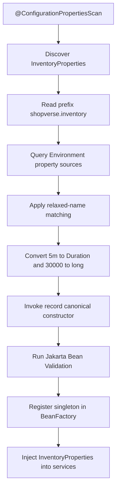
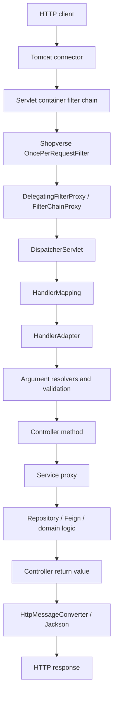
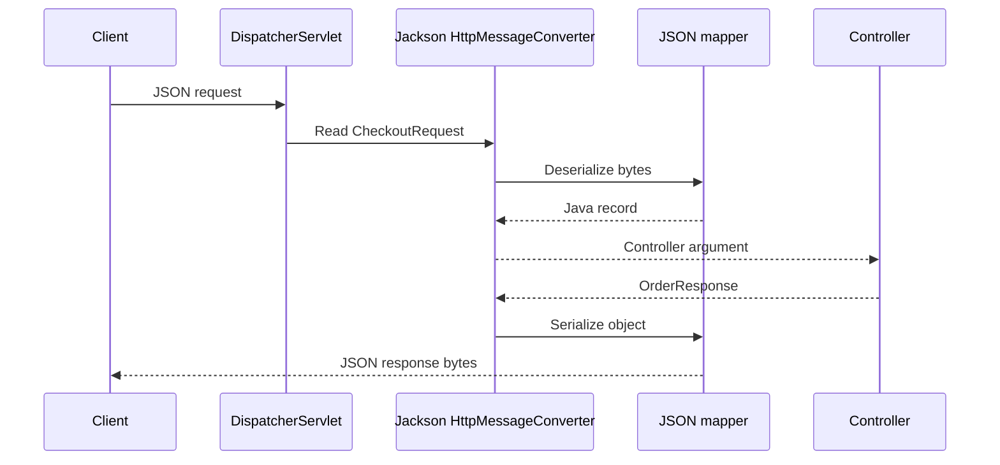

# Spring Boot Internal Working

Spring Boot is an opinionated layer over the Spring Framework. It creates and
configures an application context from:

- application code and annotations;
- classpath dependencies;
- external configuration;
- auto-configuration metadata;
- explicitly declared application beans.

This guide explains the generic lifecycle and uses Inventory Service as the
main Shopverse example.

## Shopverse Entry Point

```java
@SpringBootApplication
@ConfigurationPropertiesScan
@EnableJpaAuditing
@EnableCaching
@EnableScheduling
public class InventoryServiceApplication {

    public static void main(String[] args) {
        SpringApplication.run(InventoryServiceApplication.class, args);
    }
}
```

`main(...)` is the Java process entry point. `SpringApplication.run(...)`
bootstraps Spring, returns the application context, and keeps the process alive
through the embedded web server and non-daemon framework threads.

## `@SpringBootApplication`

`@SpringBootApplication` combines three concerns:

```text
@SpringBootConfiguration
@EnableAutoConfiguration
@ComponentScan
```

### `@SpringBootConfiguration`

Marks the class as the primary Boot configuration source. It is a specialized
`@Configuration`, so it can contribute `@Bean` definitions.

### `@EnableAutoConfiguration`

Imports candidate auto-configuration classes. Conditions decide which
configurations actually apply.

### `@ComponentScan`

Scans the application's package and subpackages for stereotypes such as:

```text
@Component
@Service
@Repository
@Controller
@RestController
@Configuration
```

Inventory's entry point is in `io.shopverse.inventory_service`, so that
package is the natural component-scan root. Placing the entry point too deep
can leave required components undiscovered; placing it too high can scan
unrelated code.

## Startup Lifecycle



Simplified startup steps:

1. Java invokes `main`.
2. `SpringApplication` infers the application type from the classpath.
3. Boot creates an `Environment`.
4. Property sources and profiles are resolved.
5. Spring creates the appropriate application context.
6. Configuration classes are parsed.
7. Component scanning registers bean definitions.
8. Boot evaluates auto-configuration conditions.
9. The context refresh creates singleton beans.
10. The embedded server and listener containers start.
11. runners execute.
12. readiness is published when startup completes.

An exception in configuration binding, validation, Liquibase, bean creation,
or server startup prevents the application from becoming ready.

## Environment And Property Sources

Spring's `Environment` provides:

- active and default profiles;
- property lookup;
- ordered property sources;
- type conversion support used by binding.

Shopverse properties can come from:

- command-line arguments;
- Java system properties;
- operating-system environment variables;
- `.env` values passed into Docker Compose;
- Config Server property sources;
- local `application.yml` or profile files;
- defaults written in placeholders or code.

Higher-precedence sources override lower-precedence values. For example:

```yaml
shopverse:
  inventory:
    reservation-ttl: ${INVENTORY_RESERVATION_TTL:5m}
```

`INVENTORY_RESERVATION_TTL=10m` overrides the fallback `5m`.

Centralized configuration changes do not imply every bean updates
automatically. Infrastructure created during startup commonly requires a
restart unless its refresh behavior is explicitly supported and designed.

## Auto-Configuration

Auto-configuration is conditional configuration supplied by Spring Boot and
integrations.

Conceptually:

```java
@AutoConfiguration
@ConditionalOnClass(DataSource.class)
@ConditionalOnMissingBean(DataSource.class)
class DataSourceAutoConfiguration {
    // create a DataSource only when the required conditions match
}
```

Boot discovers modern auto-configuration candidates from metadata such as:

```text
META-INF/spring/org.springframework.boot.autoconfigure.AutoConfiguration.imports
```

This file contains auto-configuration class names. Importing a candidate does
not guarantee that it creates beans; its conditions must match.

## Common Conditional Annotations

| Annotation | Condition |
|---|---|
| `@ConditionalOnClass` | required class exists on the classpath |
| `@ConditionalOnMissingClass` | class is absent |
| `@ConditionalOnBean` | another bean exists |
| `@ConditionalOnMissingBean` | application has not supplied a bean |
| `@ConditionalOnProperty` | property has the expected value |
| `@ConditionalOnWebApplication` | application has the expected web type |
| `@ConditionalOnResource` | required resource exists |
| `@ConditionalOnExpression` | expression evaluates to true |

`@ConditionalOnMissingBean` is how many Boot defaults back off:

```text
no application ObjectMapper bean -> Boot provides/configures one
application ObjectMapper bean    -> Boot default backs off
```

Providing a replacement bean transfers responsibility for its complete
configuration to the application.

## Dependency-Driven Configuration

Inventory Service dependencies activate different infrastructure:

| Dependency | Typical infrastructure |
|---|---|
| `spring-boot-starter-web` | Tomcat, Spring MVC, DispatcherServlet, Jackson |
| `spring-boot-starter-data-jpa` | EntityManagerFactory, transaction manager, repositories |
| `spring-boot-starter-liquibase` | Liquibase startup migration |
| `spring-boot-starter-security` | servlet security infrastructure |
| OAuth2 Resource Server | bearer-token and JWT support |
| `spring-boot-starter-kafka` | producer factory, KafkaTemplate, listener factory |
| `spring-boot-starter-cache` | cache abstraction |
| `spring-boot-starter-actuator` | health, metrics, management endpoints |
| Prometheus registry | Prometheus meter registry and exposition |
| Config Client | Config Server property-source loading |
| Eureka Client | registration and service discovery |
| Zipkin starter | tracing bridge/export integration |

Dependencies provide capabilities, but properties and conditions determine
whether individual beans are created.

## Bean Definitions Versus Bean Instances

A `BeanDefinition` is metadata describing how Spring can create and configure
an object. It can contain:

- bean class or factory method;
- scope;
- constructor arguments;
- qualifiers;
- lifecycle methods;
- lazy/eager behavior;
- role and source metadata.

During context setup, Spring first registers definitions. During refresh, it
normally instantiates non-lazy singleton beans.

```text
@Service class discovered
  -> BeanDefinition registered
  -> dependencies resolved
  -> object instantiated
  -> initialized and possibly proxied
  -> singleton stored in BeanFactory
```

## Dependency Injection

Dependency injection (DI) means an object receives its dependencies from the
Spring container instead of constructing them itself. It is the practical
implementation of inversion of control (IoC): application code declares what
it needs, while the container controls object creation, wiring, lifecycle, and
eligible proxy decoration.

Without DI:

```java
public class InventoryService {
    private final InventoryRepository repository = new JdbcInventoryRepository();
}
```

This class chooses the implementation, controls its lifecycle, and is difficult
to isolate in a unit test.

With DI:

```java
@Service
@RequiredArgsConstructor
public class InventoryServiceImpl {

    private final InventoryItemRepository itemRepository;
    private final InventoryProperties properties;
}
```

Lombok generates the constructor. Spring resolves constructor parameters by
type, qualifier, and bean name rules, then invokes it.

### How Spring Resolves A Dependency

At startup, Spring performs this conceptual flow:



More precisely:

1. component scanning, `@Bean` methods, imports, and auto-configuration
   register bean definitions;
2. `DefaultListableBeanFactory` identifies beans that match each constructor
   parameter;
3. Spring considers type, generic type, `@Qualifier`, `@Primary`, priority,
   and dependency name;
4. dependencies are created first when necessary;
5. Spring invokes the constructor or factory method;
6. bean post-processors apply lifecycle callbacks and may return an AOP proxy;
7. the resulting singleton is cached in the application context.

Spring injects the object registered in the container. For repositories,
transactions, caching, security, or asynchronous behavior, that object may be
a generated proxy rather than the concrete target instance.

### Constructor Injection

Constructor injection is the default choice for required dependencies:

```java
@Service
public class PaymentService {

    private final PaymentRepository paymentRepository;
    private final PaymentGateway paymentGateway;

    public PaymentService(
            PaymentRepository paymentRepository,
            PaymentGateway paymentGateway
    ) {
        this.paymentRepository = paymentRepository;
        this.paymentGateway = paymentGateway;
    }
}
```

When a class has one constructor, `@Autowired` is unnecessary. Lombok
`@RequiredArgsConstructor` can generate the constructor for `final` fields.

Constructor injection:

- makes dependencies explicit;
- supports immutable fields;
- exposes circular dependencies during startup;
- makes unit tests easy;
- avoids partially initialized field-injected objects.

```java
PaymentGateway gateway = mock(PaymentGateway.class);
PaymentRepository repository = mock(PaymentRepository.class);
PaymentService service = new PaymentService(repository, gateway);
```

The test does not need a Spring context because the dependency contract is
ordinary Java.

### Setter Injection

Setter injection is appropriate for a genuinely optional or reconfigurable
dependency:

```java
@Service
public class ReportService {

    private AuditPublisher auditPublisher = AuditPublisher.noOp();

    @Autowired(required = false)
    public void setAuditPublisher(AuditPublisher auditPublisher) {
        this.auditPublisher = auditPublisher;
    }
}
```

Required business dependencies should normally remain constructor parameters.
Setter injection makes mutability and the possibility of incomplete
initialization part of the class design.

### Field Injection

```java
@Autowired
private PaymentRepository paymentRepository;
```

Field injection is concise but should generally be avoided in production code:

- required dependencies are hidden from the constructor contract;
- fields cannot normally be `final`;
- plain unit tests require reflection or a Spring context;
- classes can accumulate too many dependencies without obvious constructor
  pressure;
- the object can be instantiated in an invalid state outside Spring.

### Multiple Implementations

If two beans implement the same interface, injection by type is ambiguous:

```java
public interface PaymentGateway {
    PaymentResult charge(PaymentCommand command);
}

@Component("cardGateway")
class CardPaymentGateway implements PaymentGateway {
    // ...
}

@Component("walletGateway")
class WalletPaymentGateway implements PaymentGateway {
    // ...
}
```

Choose explicitly with `@Qualifier`:

```java
@Service
public class CheckoutService {

    private final PaymentGateway paymentGateway;

    public CheckoutService(
            @Qualifier("cardGateway") PaymentGateway paymentGateway
    ) {
        this.paymentGateway = paymentGateway;
    }
}
```

Or define the application-wide default with `@Primary`:

```java
@Primary
@Component
class CardPaymentGateway implements PaymentGateway {
    // ...
}
```

Use `@Qualifier` when the caller requires a particular semantic implementation.
Use `@Primary` when one implementation is the normal default. Avoid depending
on accidental parameter-name matching.

### Injecting All Implementations

Spring can inject collections when an application must execute a strategy
chain:

```java
public interface FraudRule {
    FraudDecision evaluate(PaymentCommand command);
}

@Service
public class FraudEngine {

    private final List<FraudRule> rules;

    public FraudEngine(List<FraudRule> rules) {
        this.rules = List.copyOf(rules);
    }
}
```

Use `@Order` or implement `Ordered` when sequence is part of the contract:

```java
@Component
@Order(Ordered.HIGHEST_PRECEDENCE)
class BlockedAccountRule implements FraudRule {
    // ...
}
```

For keyed strategy selection, inject a map. Bean names become keys:

```java
public PaymentRouter(Map<String, PaymentGateway> gateways) {
    this.gateways = Map.copyOf(gateways);
}
```

### Optional And Lazy Dependencies

`ObjectProvider<T>` supports optional or deferred lookup without injecting the
entire application context:

```java
@Service
public class OptionalAuditService {

    private final ObjectProvider<AuditPublisher> publisherProvider;

    public OptionalAuditService(
            ObjectProvider<AuditPublisher> publisherProvider
    ) {
        this.publisherProvider = publisherProvider;
    }

    public void publish(AuditEvent event) {
        publisherProvider.ifAvailable(publisher -> publisher.publish(event));
    }
}
```

`@Lazy` delays bean creation or injects a lazy proxy:

```java
public ReportService(@Lazy ExpensiveReportClient reportClient) {
    this.reportClient = reportClient;
}
```

Use laziness for startup cost or an intentional deferred dependency, not to
hide an invalid architecture or routine circular dependency.

### Circular Dependencies

Constructor cycles cannot be created:

```text
OrderService -> PaymentService -> OrderService
```

Spring cannot finish constructing either object because each requires the
other first. The preferred fix is to change ownership:

```text
CheckoutCoordinator
  -> OrderService
  -> PaymentService
```

Other valid solutions include:

- publish an application or domain event instead of calling back;
- extract the shared responsibility into a third service;
- reverse one dependency behind a narrower interface;
- pass required data as a method argument;
- use `ObjectProvider` or `@Lazy` only when delayed resolution is genuinely
  part of the design.

Enabling circular references or switching to field injection hides the design
problem and can produce partially initialized beans. It is not a production
solution.

### `@Bean` Versus Component Scanning

Use component stereotypes for application-owned classes:

```java
@Service
class InventoryService {
}
```

Use `@Bean` when creating a third-party type, selecting construction
parameters, or centralizing infrastructure configuration:

```java
@Configuration(proxyBeanMethods = false)
class ClockConfiguration {

    @Bean
    Clock applicationClock() {
        return Clock.systemUTC();
    }
}
```

Both approaches register bean definitions in the same container. `@Bean`
describes how a bean is created; `@Component` marks the class itself as a
component-scan candidate.

### Dependency Injection Production Practices

- use constructor injection for mandatory dependencies;
- keep injected fields `final`;
- inject narrow interfaces instead of broad service locators;
- treat excessive constructor parameters as a design warning;
- use `@Qualifier` names that express business meaning;
- avoid mutable singleton state;
- do not perform remote calls in constructors;
- use conditional configuration for optional infrastructure;
- mock direct collaborators in unit tests and reserve context tests for
  wiring behavior;
- remember that self-invocation bypasses proxy-based advice such as
  `@Transactional`, `@Async`, and `@Cacheable`.

## Bean Lifecycle



Important extension points:

| Mechanism | Purpose |
|---|---|
| `BeanFactoryPostProcessor` | modify bean definitions before ordinary beans are created |
| `BeanPostProcessor` | inspect/wrap bean instances during creation |
| `@PostConstruct` | initialization after injection |
| `@PreDestroy` | cleanup during graceful context shutdown |
| AOP proxy creator | wrap beans for transactions, security, caching, async, resilience |

The object stored in the container can be a proxy rather than the raw class.
This is why calls must pass through the proxy for `@Transactional`,
`@Cacheable`, and method-security interception.

Avoid heavy network work in constructors or `@PostConstruct`; it delays startup
and complicates failure recovery.

## AOP Proxies

Annotations such as these are implemented through infrastructure and proxies:

```text
@Transactional
@Cacheable
@PreAuthorize
@Async
Resilience4j annotations
```

Conceptual call:

```text
Controller
  -> proxy
     -> transaction/security/cache interceptor
        -> target service method
```

A call such as `this.otherTransactionalMethod()` stays inside the target object
and normally bypasses the external proxy. Distinct propagation or security
boundaries should be placed on appropriately separated Spring beans.

## Configuration Properties Example

Shopverse Inventory configuration:

```yaml
shopverse:
  inventory:
    reservation-ttl: 5m
    expiry-scan-delay-ms: 30000
```

Immutable property contract:

```java
@Validated
@ConfigurationProperties(prefix = "shopverse.inventory")
public record InventoryProperties(
        @NotNull Duration reservationTtl,
        @Positive long expiryScanDelayMs
) {
}
```

Registration is enabled by:

```java
@ConfigurationPropertiesScan
public class InventoryServiceApplication {
}
```

## How Spring Creates `InventoryProperties`



Detailed flow:

1. `@ConfigurationPropertiesScan` discovers the annotated record.
2. Boot registers binding infrastructure and a bean definition for it.
3. The Binder selects properties under `shopverse.inventory`.
4. Relaxed binding matches configuration names to Java names:

```text
reservation-ttl       -> reservationTtl
expiry-scan-delay-ms  -> expiryScanDelayMs
```

5. Conversion services convert text:

```text
5m    -> Duration.ofMinutes(5)
30000 -> long 30000
```

6. Because this is a record, binding invokes the canonical constructor:

```java
new InventoryProperties(Duration.ofMinutes(5), 30000L);
```

7. `@Validated` triggers Jakarta Validation.
8. A missing TTL or non-positive delay fails startup with a binding/validation
   error.
9. The immutable object becomes an injectable singleton bean.

The conceptual Binder API resembles:

```java
Binder.get(environment)
        .bind(
                "shopverse.inventory",
                Bindable.of(InventoryProperties.class)
        );
```

Application code normally does not invoke `Binder` directly. Boot's
configuration-properties infrastructure owns that process.

## Using The Bound Bean

```java
@Service
@RequiredArgsConstructor
public class InventoryService {

    private final InventoryProperties properties;

    public void reserveItem() {
        Duration ttl = properties.reservationTtl();
        long delay = properties.expiryScanDelayMs();
    }
}
```

The record is immutable. Consumers cannot accidentally change shared
configuration at runtime.

## Nested Configuration

Related settings can use nested records:

```java
@ConfigurationProperties("shopverse.payment")
public record PaymentProperties(
        BigDecimal approvalLimit,
        Provider provider
) {
    public record Provider(
            Duration connectTimeout,
            Duration readTimeout
    ) {
    }
}
```

```yaml
shopverse:
  payment:
    approval-limit: 5000
    provider:
      connect-timeout: 2s
      read-timeout: 5s
```

This keeps one configuration domain cohesive and testable.

## `@ConfigurationProperties` Versus `@Value`

`@Value`:

```java
@Value("${shopverse.inventory.reservation-ttl}")
private Duration reservationTtl;
```

It is reasonable for an isolated value or expression. It becomes difficult to
maintain when many related fields are scattered across classes.

`@ConfigurationProperties`:

```java
@ConfigurationProperties("shopverse.inventory")
public record InventoryProperties(...) {
}
```

| Capability | `@Value` | `@ConfigurationProperties` |
|---|---:|---:|
| one isolated value | good | possible |
| grouped configuration contract | weak | strong |
| immutable record binding | not the main model | supported |
| nested configuration | manual/scattered | supported |
| Jakarta Validation | manual | integrated |
| relaxed binding | limited/different behavior | designed for it |
| IDE metadata | limited | configuration processor |
| focused binding tests | awkward | straightforward |
| SpEL expressions | supported | intentionally not the model |

For production configuration domains, prefer typed
`@ConfigurationProperties`. Use `@Value` sparingly for genuinely isolated
values.

## Configuration Metadata

Add the configuration processor to generate metadata for IDE completion and
property documentation:

```gradle
annotationProcessor 'org.springframework.boot:spring-boot-configuration-processor'
```

It generates metadata under:

```text
META-INF/spring-configuration-metadata.json
```

This metadata improves tooling. It does not perform runtime binding.

Inventory Service currently has Lombok's annotation processor but does not
explicitly declare the Boot configuration processor. Adding it is a useful
developer-experience improvement, not a runtime requirement.

## Configuration Binding Practices

- Group one domain under one prefix.
- Use immutable records where appropriate.
- Validate required values and ranges at startup.
- Use `Duration`, `DataSize`, enums, and domain-relevant types.
- Supply safe local defaults where appropriate.
- Avoid secrets in metadata, logs, and actuator output.
- Do not create one giant properties class for unrelated systems.
- Test binding and invalid values.
- Document whether a change requires refresh or restart.

## Embedded Servlet Container

With `spring-boot-starter-web`, Boot detects a servlet application and
configures an embedded servlet container, normally Tomcat.

Simplified flow:

```text
ServletWebServerApplicationContext
  -> find ServletWebServerFactory
  -> create embedded Tomcat
  -> initialize ServletContext
  -> register DispatcherServlet and filters
  -> bind configured port
  -> start accepting requests
```

The application is packaged as an executable JAR; no separately installed
application server is required.

Tomcat assigns requests to worker threads. Those threads are reused, which is
why Shopverse request filters must clean MDC state.

## Servlet Request Lifecycle



Filter order depends on registration and security configuration. The diagram
shows concerns, not a universal numeric order for every Shopverse filter.

## `OncePerRequestFilter`

Shopverse servlet services use a request logging filter:

```java
public class RequestLoggingFilter extends OncePerRequestFilter {

    @Override
    protected void doFilterInternal(
            HttpServletRequest request,
            HttpServletResponse response,
            FilterChain filterChain
    ) throws ServletException, IOException {
        try (var ignored = MDC.putCloseable("correlationId", correlationId)) {
            filterChain.doFilter(request, response);
        }
    }
}
```

`filterChain.doFilter(...)` delegates to the next filter and eventually the
target servlet. Code after it runs while the response unwinds.

`OncePerRequestFilter` is designed to provide one execution per request
dispatch according to its dispatch configuration. Async and error dispatches
still require deliberate handling.

## `DispatcherServlet`

`DispatcherServlet` is Spring MVC's front controller. It coordinates rather
than implementing business logic.

Simplified dispatch:

1. receive servlet request;
2. find a handler through `HandlerMapping`;
3. find a compatible `HandlerAdapter`;
4. resolve controller arguments;
5. invoke the controller;
6. process the return value;
7. serialize the response or resolve a view;
8. map exceptions through exception resolvers.

Common MVC collaborators:

| Component | Responsibility |
|---|---|
| `RequestMappingHandlerMapping` | maps path/method conditions to controller methods |
| `RequestMappingHandlerAdapter` | invokes annotated controller methods |
| `HandlerMethodArgumentResolver` | creates method arguments |
| `HandlerMethodReturnValueHandler` | handles return types |
| `HttpMessageConverter` | reads/writes HTTP bodies |
| `HandlerExceptionResolver` | converts exceptions into responses |

## Controller Argument Resolution

For:

```java
public ResponseEntity<OrderResponse> checkout(
        @Valid @RequestBody CheckoutRequest request,
        @RequestHeader("Idempotency-Key") String key,
        Authentication authentication
) {
    // ...
}
```

Spring resolves:

- `@RequestBody` using an HTTP message converter;
- `@RequestHeader` from request headers;
- `Authentication` from the security context;
- path/query parameters using their argument resolvers;
- `@Valid` through Jakarta Validation.

Validation failure occurs before ordinary controller business logic and is
handled through MVC exception resolution.

## Jackson Auto-Configuration

With Spring MVC and Jackson on the classpath, Boot configures JSON support.
Spring Boot 4 uses Jackson 3 by default through `spring-boot-starter-jackson`.
Its mapper API is under `tools.jackson.*`. Boot 4 also provides deprecated
Jackson 2 compatibility modules under `com.fasterxml.jackson.*` for migration.

The central concept is a configured JSON mapper. Its exact Java type depends
on whether the application uses Jackson 3 or the Jackson 2 compatibility path.



Spring MVC selects the matching Jackson HTTP message converter for media types
such as `application/json`. With Boot 4's default Jackson 3 stack this is the
Jackson 3 converter; `MappingJackson2HttpMessageConverter` belongs to the
Jackson 2 compatibility path.

Boot's Jackson configuration commonly:

- discovers Jackson on the classpath;
- builds/configures the applicable Jackson mapper;
- registers available modules;
- integrates Java time types;
- registers the converter with MVC;
- applies `spring.jackson.*` properties.

Records work well as DTOs because Jackson can bind their constructor
components and serialize their accessors.

## Customizing Jackson

Prefer the customizer that matches the selected Jackson generation.

Boot 4 / Jackson 3:

```java
@Bean
JsonMapperBuilderCustomizer jsonCustomizer() {
    return builder -> {
        // configure application-wide JSON behavior
    };
}
```

Jackson 2 compatibility:

```java
@Bean
Jackson2ObjectMapperBuilderCustomizer jackson2Customizer() {
    return builder -> {
        // configure legacy Jackson 2 behavior
    };
}
```

Or provide a Jackson module for a specific domain type. Replacing the complete
mapper can discard Boot defaults and discovered modules.

Production practices:

- use stable DTOs rather than JPA entities;
- define date/time and timezone conventions;
- avoid polymorphic deserialization of untrusted arbitrary types;
- bound request size;
- decide unknown-field behavior intentionally;
- never serialize credentials or internal security objects;
- test backward compatibility.

Several current Shopverse Kafka/outbox classes import
`com.fasterxml.jackson.databind.ObjectMapper`, which is Jackson 2. Because the
services run Spring Boot 4, this is a compatibility path and should be audited
before removing Jackson 2 support or standardizing on Jackson 3. Do not assume
the MVC Jackson 3 mapper and an injected Jackson 2 `ObjectMapper` are the same
bean or configuration.

## Exception Handling

Exceptions can be handled by:

- controller-local `@ExceptionHandler`;
- global `@RestControllerAdvice`;
- Spring MVC's built-in resolvers;
- servlet container handling for failures outside MVC;
- Spring Security entry points/denied handlers before MVC.

An exception thrown in a security filter does not necessarily reach a
controller advice because it occurs before `DispatcherServlet`.

Use one stable error contract and avoid exposing stack traces or internal SQL.

## Spring Security Integration

Boot detects Spring Security and configures supporting infrastructure.
Application `SecurityFilterChain` beans define the actual request rules.

Servlet flow:

```text
Servlet container
  -> DelegatingFilterProxy
  -> Spring Security FilterChainProxy
  -> first matching SecurityFilterChain
  -> authentication and authorization filters
  -> DispatcherServlet
```

Bearer-token flow:

1. `BearerTokenAuthenticationFilter` resolves the token.
2. `JwtAuthenticationProvider` invokes `JwtDecoder`.
3. signature and configured claims are validated.
4. `JwtAuthenticationConverter` maps claims to authorities.
5. the authenticated object is stored in `SecurityContextHolder`.
6. URL authorization runs.
7. method-security proxies evaluate `@PreAuthorize` when invoked.

User Service has two chains because its internal endpoint uses Basic
authentication while normal APIs use bearer JWT authentication. The first
matching chain is selected.

Detailed security filters, providers, Basic authentication, JWT, method
security, and multiple chains are documented in
[Spring Security](../security/SPRING-SECURITY-GENERIC.md).

## Transaction Auto-Configuration

Spring Data JPA contributes an `EntityManagerFactory`, repositories, and a
transaction manager when datasource and JPA conditions match.

For:

```java
@Transactional
public void reserve(...) {
    // persistence work
}
```

a transaction proxy:

1. starts or joins a transaction;
2. binds persistence resources to the current execution;
3. invokes the target method;
4. flushes changes;
5. commits on success;
6. rolls back for configured failures.

See [Spring Transactions](../spring/SPRING-TRANSACTIONS.md) for propagation,
isolation, proxy limitations, and Kafka/database boundaries.

## Spring Data Repository Proxies

Repository interfaces do not need hand-written implementations for standard
operations:

```java
public interface InventoryItemRepository
        extends JpaRepository<InventoryItem, Long> {

    Optional<InventoryItem> findByProductId(Long productId);
}
```

Spring Data scans the interface and creates a proxy. Method names can be parsed
into queries; explicit `@Query` definitions are parsed and validated according
to their type.

The proxy delegates through JPA infrastructure and participates in the active
transaction.

## Liquibase And JPA Startup

For persistent Shopverse services:

```text
DataSource
  -> Liquibase migration
  -> EntityManagerFactory
  -> Hibernate schema validation
  -> repositories/services ready
```

Liquibase failure prevents normal startup. Hibernate validation checks that
entity mappings match the migrated schema. Shopverse does not use
`ddl-auto=update` as its migration strategy.

## JPA Auditing

`@EnableJpaAuditing` enables auditing infrastructure. Entity listeners populate
fields such as creation and modification timestamps when entities are
persisted or updated.

Auditing is not a complete business audit trail. Order timeline and DLT replay
records exist because business transitions and operator recovery need explicit
domain evidence.

## Caching

`@EnableCaching` imports cache interception infrastructure:

```java
@Cacheable(cacheNames = "payments", key = "#orderNumber")
public PaymentResponse getByOrderNumber(String orderNumber) {
    // method runs only on a cache miss
}
```

The proxy calculates the key, checks the selected cache, invokes the method on
a miss, and stores the result.

Shopverse currently uses local cache providers. Caches are not distributed
between replicas.

## Scheduling

`@EnableScheduling` registers scheduled-annotation processing:

```java
@Scheduled(fixedDelayString =
        "${shopverse.inventory.expiry-scan-delay-ms:60000}")
public int expireReservations() {
    // ...
}
```

The method is invoked by a scheduler after context startup. `fixedDelay`
measures the delay after the previous invocation completes.

Production concerns:

- avoid overlapping work unless designed;
- set transaction boundaries in an invoked service method;
- restore correlation/logging context for scheduled work;
- coordinate multi-replica jobs;
- bound batch size and duration;
- observe failure and last-success time.

Shopverse schedulers can run on every replica. A database claiming/locking
strategy is required where only one replica should process a row.

## OpenFeign

`@EnableFeignClients` discovers `@FeignClient` interfaces and creates proxies:

```java
@FeignClient(name = "INVENTORY-SERVICE")
public interface InventoryClient {

    @GetMapping("/api/v1/inventory/public/items")
    List<CatalogItemResponse> getItems();
}
```

At invocation:

1. the proxy builds an HTTP request from annotations;
2. request interceptors add headers;
3. service discovery resolves instances;
4. Spring Cloud LoadBalancer selects one;
5. the HTTP client sends the request;
6. response decoding creates the declared Java type.

See [Spring Cloud OpenFeign](../spring/SPRING-OPENFEIGN.md).

## Kafka Infrastructure

The Kafka starter and configuration create:

- producer factory;
- `KafkaTemplate`;
- consumer factory;
- listener container factory;
- serializer/deserializer configuration;
- observation/metrics integration.

`@KafkaListener` methods are registered as endpoints. Listener containers own
consumer polling threads and invoke application methods after startup.

```text
Kafka consumer poll
  -> listener adapter
  -> argument conversion
  -> listener method
  -> acknowledgment/error/retry handling
```

Listener methods do not run on the Java `main` thread. See
[Spring Kafka](../spring/SPRING-KAFKA.md) for concurrency, retries, DLT, and delivery
semantics.

## Actuator, Micrometer, And Tracing

Actuator contributes management endpoints and integrates Micrometer.

```text
application code/framework
  -> Micrometer meter or observation
  -> Prometheus registry exposes samples
  -> Prometheus scrapes /actuator/prometheus
```

Tracing handlers create spans for supported observations, inject/extract trace
headers, add trace fields to logging context, and export completed spans to
Zipkin.

Prometheus does not create metrics from application logs. Logs and metrics are
separate signals.

## Config Client And Eureka

Config Client loads remote property sources early enough for application bean
creation. Failure behavior depends on import and fail-fast configuration.

Eureka Client registers the running instance and periodically renews its lease.
Registration happens after enough local application infrastructure exists, but
registration alone does not prove every business path is healthy.

Feign and the gateway use logical service names resolved from discovery rather
than fixed instance URLs.

## Reactive Gateway Difference

API Gateway uses Spring WebFlux rather than the servlet stack:

```text
WebFilter / GlobalFilter
  -> SecurityWebFilterChain
  -> route lookup
  -> load-balanced downstream call
  -> reactive completion signal
```

There is no servlet `DispatcherServlet` for the gateway routing path. Reactive
execution can move between threads, so Reactor Context and Micrometer context
propagation are safer than relying only on thread-local MDC.

See [API Gateway](API-GATEWAY-GENERIC.md).

## Startup Diagnostics

Useful diagnostics include:

- condition evaluation report;
- startup failure analysis;
- bean-definition conflicts;
- configuration binding error details;
- Liquibase and datasource logs;
- embedded-server bind failures.

With appropriate exposure and security, Actuator can provide:

```text
/actuator/health
/actuator/beans
/actuator/configprops
/actuator/conditions
/actuator/env
/actuator/mappings
/actuator/prometheus
```

Do not expose sensitive diagnostic endpoints publicly. `env` and
`configprops` can reveal configuration structure or values and require careful
sanitization and access control.

Run with debug condition reporting when diagnosing auto-configuration:

```powershell
./gradlew bootRun --args='--debug'
```

The condition report explains which auto-configurations matched or did not
match and why.

## Graceful Shutdown

During context close:

1. readiness should stop advertising new work;
2. web requests receive a bounded drain period;
3. listener containers and schedulers stop;
4. lifecycle beans stop;
5. `@PreDestroy` and destroy callbacks run;
6. pools and the embedded server close.

Applications must bound shutdown time and avoid accepting Kafka/HTTP work that
cannot finish or be safely redelivered.

Forced process termination can skip application cleanup. Durable correctness
must not depend only on `@PreDestroy`.

## Production Practices

1. Keep the application class at a deliberate package root.
2. Prefer constructor injection.
3. Use immutable validated configuration records.
4. Keep configuration prefixes cohesive.
5. Let auto-configuration provide defaults, overriding only intentionally.
6. Avoid replacing core beans without preserving required modules/settings.
7. Keep startup initialization bounded.
8. Keep transactions and locks out of remote waits.
9. Understand proxy boundaries and self-invocation.
10. Disable public access to sensitive actuator endpoints.
11. Use graceful shutdown and readiness.
12. Test invalid configuration and missing dependency failures.
13. Inspect the condition report before adding unnecessary manual beans.
14. Treat servlet and reactive context propagation differently.

## Related Guides

- [Spring Security](../security/SPRING-SECURITY-GENERIC.md)
- [API Gateway](API-GATEWAY-GENERIC.md)
- [Spring Transactions](../spring/SPRING-TRANSACTIONS.md)
- [Liquibase](../data/LIQUIBASE-GENERIC.md)
- [Spring Cloud OpenFeign](../spring/SPRING-OPENFEIGN.md)
- [Spring Kafka](../spring/SPRING-KAFKA.md)
- [MDC and tracing](../observability/MDC-CORRELATION-TRACING.md)
- [Micrometer metrics](../observability/MICROMETER-METRICS.md)

## Official References

- [Spring Boot auto-configuration](https://docs.spring.io/spring-boot/reference/using/auto-configuration.html)
- [Spring Boot external configuration](https://docs.spring.io/spring-boot/reference/features/external-config.html)
- [Spring Boot JSON support](https://docs.spring.io/spring-boot/reference/features/json.html)
- [Spring Framework bean lifecycle](https://docs.spring.io/spring-framework/reference/core/beans/factory-nature.html)
- [Spring MVC DispatcherServlet](https://docs.spring.io/spring-framework/reference/web/webmvc/mvc-servlet.html)
