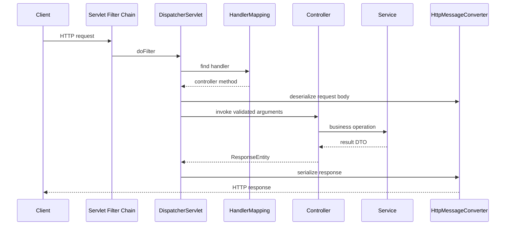
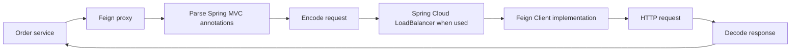

# Spring REST APIs

This guide focuses on implementing HTTP APIs with Spring MVC. General resource
design, status codes, versioning, idempotency, and security principles are in
[REST API Design](REST-API-GENERIC.md).

## Required Dependencies

```gradle
implementation 'org.springframework.boot:spring-boot-starter-web'
implementation 'org.springframework.boot:spring-boot-starter-validation'
implementation 'org.springdoc:springdoc-openapi-starter-webmvc-ui'
testImplementation 'org.springframework.boot:spring-boot-starter-test'
```

The web starter supplies Spring MVC, an embedded servlet server, JSON support,
and common web infrastructure. Validation provides Jakarta Bean Validation.
Use a Springdoc version compatible with the project's Spring Boot generation.

## Request Lifecycle



`DispatcherServlet` is the front controller. It coordinates handler mapping,
argument resolution, validation, controller invocation, exception resolution,
and response conversion.

## A Clean CRUD Structure

Keep controllers responsible for HTTP concerns and services responsible for
business behavior:

```text
ProductController
  -> ProductService
     -> ProductRepository
        -> database
```

### Request And Response Records

```java
public record CreateProductRequest(
        @NotBlank @Size(max = 120) String name,
        @NotNull @Positive BigDecimal price,
        @NotBlank @Size(min = 3, max = 3) String currency
) {
}

public record ProductResponse(
        Long id,
        String name,
        BigDecimal price,
        String currency,
        Instant createdAt
) {
}
```

Records are suitable for immutable API data carriers. Do not expose JPA
entities directly because persistence structure, lazy associations, and
internal fields should not become the public contract.

### Controller

```java
@RestController
@RequestMapping("/api/v1/products")
@RequiredArgsConstructor
public class ProductController {

    private final ProductService productService;

    @PostMapping
    public ResponseEntity<ProductResponse> create(
            @Valid @RequestBody CreateProductRequest request
    ) {
        ProductResponse created = productService.create(request);
        URI location = URI.create("/api/v1/products/" + created.id());
        return ResponseEntity.created(location).body(created);
    }

    @GetMapping("/{id}")
    public ProductResponse get(@PathVariable Long id) {
        return productService.get(id);
    }

    @GetMapping
    public Page<ProductResponse> findAll(
            @RequestParam(defaultValue = "0") @PositiveOrZero int page,
            @RequestParam(defaultValue = "20") @Min(1) @Max(100) int size
    ) {
        return productService.findAll(PageRequest.of(page, size));
    }

    @PutMapping("/{id}")
    public ProductResponse replace(
            @PathVariable Long id,
            @Valid @RequestBody CreateProductRequest request
    ) {
        return productService.replace(id, request);
    }

    @DeleteMapping("/{id}")
    public ResponseEntity<Void> delete(@PathVariable Long id) {
        productService.delete(id);
        return ResponseEntity.noContent().build();
    }
}
```

### Service Transaction Boundary

```java
@Service
@RequiredArgsConstructor
public class ProductService {

    private final ProductRepository repository;
    private final ProductMapper mapper;

    @Transactional
    public ProductResponse create(CreateProductRequest request) {
        ProductEntity saved = repository.save(mapper.toEntity(request));
        return mapper.toResponse(saved);
    }

    @Transactional(readOnly = true)
    public ProductResponse get(Long id) {
        return repository.findById(id)
                .map(mapper::toResponse)
                .orElseThrow(() -> new ProductNotFoundException(id));
    }
}
```

The service owns the transaction because it knows the complete business unit
of work. The controller should not coordinate repository calls.

## Mapping Request Data

### Path Variables

Use path variables to identify a resource:

```java
@GetMapping("/{orderId}")
OrderResponse get(@PathVariable Long orderId) {
    return orderService.get(orderId);
}
```

```http
GET /api/v1/orders/42
```

### Query Parameters

Use query parameters for optional filtering, sorting, pagination, and search:

```java
@GetMapping
Page<OrderResponse> search(
        @RequestParam(required = false) OrderStatus status,
        @RequestParam(defaultValue = "0") int page,
        @RequestParam(defaultValue = "20") int size
) {
    return orderService.search(status, PageRequest.of(page, size));
}
```

```http
GET /api/v1/orders?status=CONFIRMED&page=0&size=20
```

Allow-list sort and filter fields. Do not concatenate arbitrary client values
into SQL or dynamic expressions.

### Headers

Use headers for protocol and cross-cutting metadata:

```java
@PostMapping("/checkout")
OrderResponse checkout(
        @RequestHeader("Idempotency-Key") String idempotencyKey,
        @RequestHeader(
                name = "X-Correlation-Id",
                required = false
        ) String correlationId,
        @Valid @RequestBody CheckoutRequest request
) {
    return orderService.checkout(idempotencyKey, correlationId, request);
}
```

Authentication credentials, correlation IDs, conditional-request values, and
content negotiation belong in headers. Business fields normally belong in the
body.

### Request Bodies

Use `@RequestBody` for a structured representation:

```java
@PostMapping
ResponseEntity<UserResponse> create(
        @Valid @RequestBody CreateUserRequest request
) {
    // ...
}
```

A request has one body. Do not define multiple `@RequestBody` parameters; use
one request record containing the required fields.

### Form Data

HTML form or form-encoded requests can use `@ModelAttribute`:

```java
public record ProfileForm(
        @NotBlank String displayName,
        MultipartFile avatar
) {
}

@PostMapping(
        path = "/profile",
        consumes = MediaType.MULTIPART_FORM_DATA_VALUE
)
ProfileResponse update(@Valid @ModelAttribute ProfileForm form) {
    return profileService.update(form);
}
```

## Validation

### Body Validation

```java
public record CheckoutRequest(
        @NotEmpty
        @Size(max = 20)
        List<@Valid CheckoutItemRequest> items
) {
}

public record CheckoutItemRequest(
        @NotNull @Positive Long productId,
        @Positive @Max(100) int quantity
) {
}
```

`@Valid` triggers nested validation. Bean Validation checks structure; the
service checks business rules such as stock availability and ownership.

### Path And Query Validation

Enable method validation:

```java
@RestController
@Validated
class ProductController {

    @GetMapping("/{id}")
    ProductResponse get(@PathVariable @Positive Long id) {
        // ...
    }
}
```

### Custom Constraint

Create a custom validation annotation when a reusable structural rule cannot
be expressed by standard constraints:

```java
@Documented
@Constraint(validatedBy = CurrencyCodeValidator.class)
@Target({FIELD, PARAMETER, RECORD_COMPONENT})
@Retention(RUNTIME)
public @interface CurrencyCode {
    String message() default "must be a supported currency";
    Class<?>[] groups() default {};
    Class<? extends Payload>[] payload() default {};
}
```

Do not perform database queries from ordinary field validators. Cross-resource
business validation belongs in the transactional service.

## `ResponseEntity`

`ResponseEntity<T>` controls status, headers, and body:

```java
return ResponseEntity
        .status(HttpStatus.ACCEPTED)
        .header(HttpHeaders.LOCATION, operationUri.toString())
        .body(operation);
```

Use it when the method must set a non-default status or headers. Returning a
DTO directly is clear for a normal `200 OK` response:

```java
@GetMapping("/{id}")
ProductResponse get(@PathVariable Long id) {
    return productService.get(id);
}
```

Do not return `ResponseEntity<?>` everywhere without a reason. Strong generic
types improve documentation and client generation.

## Central Error Handling

```java
@RestControllerAdvice
public class ApiExceptionHandler {

    @ExceptionHandler(ProductNotFoundException.class)
    ProblemDetail handleNotFound(
            ProductNotFoundException exception,
            HttpServletRequest request
    ) {
        ProblemDetail problem = ProblemDetail.forStatusAndDetail(
                HttpStatus.NOT_FOUND,
                exception.getMessage()
        );
        problem.setTitle("Product not found");
        problem.setProperty("code", "PRODUCT_NOT_FOUND");
        problem.setProperty("path", request.getRequestURI());
        problem.setProperty("correlationId", MDC.get("correlationId"));
        return problem;
    }
}
```

Map known domain exceptions to stable statuses and error codes. Keep a final
handler for unexpected exceptions, log the full internal exception, and return
a generic `500` response without implementation details.

Validation failures should produce field-level errors:

```json
{
  "status": 400,
  "code": "VALIDATION_FAILED",
  "message": "Request validation failed",
  "fieldErrors": [
    {
      "field": "items[0].quantity",
      "message": "must be greater than 0"
    }
  ]
}
```

## Multipart File Upload

### Controller

```java
@PostMapping(
        path = "/documents",
        consumes = MediaType.MULTIPART_FORM_DATA_VALUE
)
public ResponseEntity<DocumentResponse> upload(
        @RequestPart("metadata") @Valid DocumentMetadata metadata,
        @RequestPart("file") MultipartFile file
) {
    DocumentResponse created = documentService.store(metadata, file);
    return ResponseEntity.status(HttpStatus.CREATED).body(created);
}
```

Example request:

```bash
curl -X POST http://localhost:8080/api/v1/documents \
  -H "Authorization: Bearer <token>" \
  -F 'metadata={"category":"INVOICE"};type=application/json' \
  -F "file=@invoice.pdf;type=application/pdf"
```

### Production File-Upload Rules

- enforce request and file size limits;
- allow-list media types and inspect file signatures, not only extensions;
- generate server-side storage names;
- prevent path traversal;
- scan untrusted files for malware;
- store large files in object storage rather than application memory or a
  relational BLOB by default;
- stream large content and avoid `file.getBytes()`;
- authorize both upload and later download;
- return an opaque document ID instead of a filesystem path;
- apply retention and deletion policies.

Configuration example:

```yaml
spring:
  servlet:
    multipart:
      max-file-size: 10MB
      max-request-size: 12MB
```

## File Download

```java
@GetMapping("/documents/{id}/content")
ResponseEntity<Resource> download(@PathVariable UUID id) {
    StoredDocument document = documentService.loadAuthorized(id);
    return ResponseEntity.ok()
            .contentType(MediaType.parseMediaType(document.contentType()))
            .header(
                    HttpHeaders.CONTENT_DISPOSITION,
                    ContentDisposition.attachment()
                            .filename(document.originalFileName())
                            .build()
                            .toString()
            )
            .body(document.resource());
}
```

Never construct a path directly from untrusted input.

## Pagination, Sorting, And Filtering

Spring Data can bind a `Pageable`, but production APIs should cap page size and
allow-list sorting:

```java
@GetMapping
Page<ProductResponse> search(
        @RequestParam(required = false) String query,
        @PageableDefault(size = 20, sort = "createdAt")
        Pageable pageable
) {
    return productService.search(query, bounded(pageable));
}
```

Offset pagination is simple but can become slow or inconsistent for deep,
frequently changing result sets. Use cursor or keyset pagination when the
dataset and access pattern require it.

## Conditional Requests And Optimistic Concurrency

Expose a resource version through an ETag:

```http
GET /api/v1/products/42
ETag: "7"
```

Require that version for updates:

```http
PUT /api/v1/products/42
If-Match: "7"
```

Return `412 Precondition Failed` when the representation changed. Keep a
database `@Version` column as the final protection against lost updates.

## Idempotent Commands

For checkout, payment, and similar commands:

```java
@PostMapping("/checkout")
ResponseEntity<OrderResponse> checkout(
        @RequestHeader("Idempotency-Key")
        @NotBlank @Size(max = 100) String key,
        @Valid @RequestBody CheckoutRequest request
) {
    OrderResponse result = orderService.checkout(key, request);
    return ResponseEntity.status(HttpStatus.CREATED).body(result);
}
```

Persist the key with the business result and enforce a unique database
constraint. Concurrent duplicate requests must resolve to the original result
or a deliberate `409`, not create duplicate side effects.

## OpenAPI Documentation

Document authentication, response codes, examples, validation, and errors:

```java
@Operation(summary = "Creates an idempotent checkout")
@ApiResponses({
        @ApiResponse(responseCode = "201", description = "Order created"),
        @ApiResponse(responseCode = "400", description = "Invalid request"),
        @ApiResponse(responseCode = "409", description = "Request conflict")
})
@PostMapping("/checkout")
ResponseEntity<OrderResponse> checkout(...) {
    // ...
}
```

Generated documentation does not replace API design review or contract tests.

## Calling Other REST APIs

Spring provides several client styles. Choose according to the application's
execution model, contract ownership, and infrastructure needs.

| Client | Programming model | Status | Typical use |
|---|---|---|---|
| `RestClient` | synchronous fluent API | preferred for new imperative code | direct HTTP integrations |
| `WebClient` | non-blocking reactive API | preferred for reactive or streaming code | WebFlux, high concurrency, streaming |
| `RestTemplate` | synchronous template API | maintenance mode | existing applications |
| Spring Cloud OpenFeign | declarative interface proxy | active Spring Cloud integration | internal service contracts |

Do not select `WebClient` only because it is newer. Blocking on it in an
imperative application removes most reactive benefits while adding a more
complex programming model.

### `RestClient`

Dependency:

```gradle
implementation 'org.springframework.boot:spring-boot-starter-web'
```

Create a client with shared base configuration:

```java
@Configuration(proxyBeanMethods = false)
class InventoryHttpConfiguration {

    @Bean
    RestClient inventoryRestClient(RestClient.Builder builder) {
        return builder
                .baseUrl("https://inventory.example.com")
                .defaultHeader(HttpHeaders.ACCEPT,
                        MediaType.APPLICATION_JSON_VALUE)
                .build();
    }
}
```

Use it from a focused adapter:

```java
@Component
@RequiredArgsConstructor
class InventoryHttpClient {

    private final RestClient inventoryRestClient;

    InventoryResponse getInventory(long productId) {
        return inventoryRestClient.get()
                .uri("/api/v1/inventory/{productId}", productId)
                .retrieve()
                .onStatus(
                        HttpStatusCode::is5xxServerError,
                        (request, response) -> {
                            throw new InventoryUnavailableException();
                        }
                )
                .body(InventoryResponse.class);
    }
}
```

Internally, `RestClient` uses Spring's `ClientHttpRequestFactory` abstraction.
The chosen request factory delegates to an underlying synchronous HTTP client.
The available implementation depends on classpath and configuration, such as a
JDK, Apache HttpComponents, or Jetty-based request factory.

Configure connection, response, and total operation deadlines explicitly. A
connect timeout alone does not bound how long the complete request can wait.

### `RestTemplate`

`RestTemplate` remains supported for existing synchronous applications, but
new imperative code should generally use `RestClient`.

```java
@Bean
RestTemplate restTemplate(RestTemplateBuilder builder) {
    return builder
            .connectTimeout(Duration.ofSeconds(2))
            .readTimeout(Duration.ofSeconds(3))
            .build();
}
```

```java
InventoryResponse response = restTemplate.getForObject(
        "https://inventory.example.com/api/v1/inventory/{id}",
        InventoryResponse.class,
        productId
);
```

Internally, `RestTemplate` also delegates request creation to a
`ClientHttpRequestFactory` and uses `HttpMessageConverter` instances for
serialization and deserialization.

Do not create a new `RestTemplate` for every call. Configure and inject one or
more purpose-specific clients so connections, timeouts, interceptors, and
observability are consistent.

### `WebClient`

Dependency:

```gradle
implementation 'org.springframework.boot:spring-boot-starter-webflux'
```

`WebClient` is non-blocking when used end to end with a non-blocking connector
and reactive processing:

```java
@Bean
WebClient inventoryWebClient(WebClient.Builder builder) {
    return builder
            .baseUrl("https://inventory.example.com")
            .build();
}
```

```java
Mono<InventoryResponse> getInventory(long productId) {
    return inventoryWebClient.get()
            .uri("/api/v1/inventory/{id}", productId)
            .retrieve()
            .onStatus(
                    HttpStatusCode::is5xxServerError,
                    response -> Mono.error(
                            new InventoryUnavailableException()
                    )
            )
            .bodyToMono(InventoryResponse.class)
            .timeout(Duration.ofSeconds(3));
}
```

`WebClient` delegates network operations to a `ClientHttpConnector`. Reactor
Netty is a common connector when present through WebFlux, while other
connectors can be configured. Reactive types do not make a blocking database
driver or blocking SDK non-blocking.

Avoid calling `.block()` on event-loop threads. In a normal Spring MVC service,
use `RestClient` unless reactive composition, streaming, or concurrency
requirements justify `WebClient`.

### Spring Cloud OpenFeign

Dependency:

```gradle
implementation 'org.springframework.cloud:spring-cloud-starter-openfeign'
```

Enable and declare a client:

```java
@SpringBootApplication
@EnableFeignClients
public class OrderServiceApplication {
}
```

```java
@FeignClient(
        name = "inventory-service",
        path = "/api/v1/inventory"
)
public interface InventoryClient {

    @GetMapping("/{productId}")
    InventoryResponse getInventory(
            @PathVariable long productId,
            @RequestHeader("X-Correlation-Id") String correlationId
    );
}
```

Spring Cloud OpenFeign creates a runtime proxy for the interface. Conceptually:



Feign itself defines a `Client` abstraction. Spring Cloud OpenFeign can
integrate it with:

- Spring Cloud LoadBalancer for logical service names;
- Apache HttpClient 5 when its implementation is available and enabled;
- OkHttp when its implementation is available and enabled;
- Feign's simpler default client when no specialized client is selected.

The exact client must be verified from dependencies and configuration rather
than assumed. Feign does not internally call `RestTemplate` or `WebClient` by
default; it uses its own proxy, contract, encoder, decoder, and selected
`feign.Client`.

Feign is useful when:

- the remote API has a stable, narrow Java-facing contract;
- Spring Cloud discovery and load balancing are required;
- common request interceptors propagate authentication and correlation data.

Avoid interfaces that mirror an entire remote service. Keep clients small and
owned by the consuming use case.

### HTTP Interface Clients

Spring can also generate clients from annotated interfaces backed by
`RestClient` or `WebClient`:

```java
public interface InventoryHttpService {

    @GetExchange("/api/v1/inventory/{productId}")
    InventoryResponse get(@PathVariable long productId);
}
```

```java
@Bean
InventoryHttpService inventoryHttpService(RestClient restClient) {
    RestClientAdapter adapter = RestClientAdapter.create(restClient);
    HttpServiceProxyFactory factory =
            HttpServiceProxyFactory.builderFor(adapter).build();
    return factory.createClient(InventoryHttpService.class);
}
```

This provides a declarative client without requiring Spring Cloud. OpenFeign
remains useful when Spring Cloud discovery, load balancing, and Feign-specific
extensions are part of the architecture.

### Client-Side Cross-Cutting Configuration

Propagate correlation and authentication through interceptors rather than
repeating headers at every call:

```java
@Bean
ClientHttpRequestInterceptor correlationInterceptor() {
    return (request, body, execution) -> {
        String correlationId = MDC.get("correlationId");
        if (correlationId != null) {
            request.getHeaders().set(
                    "X-Correlation-Id",
                    correlationId
            );
        }
        return execution.execute(request, body);
    };
}
```

For Feign:

```java
@Bean
RequestInterceptor correlationFeignInterceptor() {
    return template -> {
        String correlationId = MDC.get("correlationId");
        if (correlationId != null) {
            template.header("X-Correlation-Id", correlationId);
        }
    };
}
```

Micrometer Observation can instrument supported clients and propagate trace
context. Manual correlation IDs and distributed tracing serve related but
different operational purposes.

### REST Client Production Practices

- set connect, response, read, and total request deadlines;
- reuse configured clients and connection pools;
- validate response status before decoding;
- cap response and upload sizes;
- retry only selected transient failures and idempotent operations;
- combine retries with deadlines, backoff, jitter, and circuit breaking;
- do not retry `POST` commands without a durable idempotency strategy;
- propagate authentication, correlation, and trace context intentionally;
- record route-template, status, latency, and dependency metrics;
- avoid high-cardinality metrics such as complete URLs or resource IDs;
- use TLS and validate certificates;
- isolate third-party DTOs behind an adapter so their schema does not spread
  into the domain.

### REST Client Do And Do Not

| Do | Do not |
|---|---|
| Use `RestClient` for new imperative clients | Add `WebClient` only because it is newer |
| Use `WebClient` for reactive composition and streaming | Block an event-loop thread |
| Keep Feign interfaces small | Mirror every remote controller |
| Configure bounded timeouts | Use framework defaults without review |
| Reuse managed clients | Construct a client per request |
| Handle non-success statuses explicitly | Treat every body as a success |
| Retry safe/idempotent operations selectively | Retry all exceptions automatically |
| Test with a stub HTTP server | Mock only the Java method and ignore HTTP mapping |

## Controller Testing

Use `@WebMvcTest` for controller mapping, serialization, validation, security,
and exception handling:

```java
@WebMvcTest(ProductController.class)
class ProductControllerTest {

    @Autowired
    MockMvc mockMvc;

    @MockitoBean
    ProductService productService;

    @Test
    void rejectsInvalidProduct() throws Exception {
        mockMvc.perform(post("/api/v1/products")
                        .contentType(MediaType.APPLICATION_JSON)
                        .content("""
                                {
                                  "name": "",
                                  "price": -1,
                                  "currency": "USD"
                                }
                                """))
                .andExpect(status().isBadRequest());
    }
}
```

Use full integration tests when database behavior, security filters, message
publication, or real serialization configuration is part of the requirement.

## Do And Do Not

| Do | Do not |
|---|---|
| Use plural resource nouns | Put `get`, `create`, or `delete` in ordinary paths |
| Keep controllers thin | Put transactions and business workflows in controllers |
| Use records or DTOs | Return JPA entities |
| Validate boundary input | Trust client-provided IDs, sizes, or content types |
| Return accurate status codes | Return `200` for every result |
| Centralize error mapping | Repeat try/catch blocks in every controller |
| Cap page and upload sizes | Accept unbounded lists or files |
| Enforce ownership in services | Assume route authentication proves ownership |
| Record correlation and trace context | Log secrets or entire sensitive bodies |
| Test contract behavior | Test only private implementation methods |

## Lead Engineer Interview Questions

### Where Should Transaction Boundaries Be Placed?

Usually on public service methods that own a complete local business operation.
Avoid controller transactions and remote network waits inside database
transactions.

### How Do You Prevent A REST API From Leaking Persistence Details?

Use request and response DTOs, explicit mapping, service-owned fetch plans, and
central error contracts. Do not serialize entities, lazy proxies, internal
columns, or database-generated exception messages.

### How Do You Make A Create API Safe To Retry?

Accept a stable idempotency key, persist it atomically with the result, enforce
database uniqueness, compare request identity on reuse, and return the
original result for a valid duplicate.

### How Do You Design A Long-Running API?

Return `202 Accepted` with a durable operation resource and `Location` header.
Process asynchronously, expose status and failure details, and make submission
idempotent.

### When Would You Use `PUT` Instead Of `PATCH`?

Use `PUT` when the client supplies the complete replacement representation at
a known URI. Use `PATCH` for partial change semantics. Define whether omitted
and null fields differ, and ensure repeated patch operations behave safely.

### How Do You Handle Partial Failure Across Services?

Do not extend one database transaction across independent services. Use local
transactions, durable events through an outbox, idempotent consumers, SAGA
compensation, explicit timeouts, and observable recovery state.

### How Do You Avoid N+1 Queries In An API?

Define the response use case first, then use DTO projections, entity graphs, or
purpose-specific fetch joins. Verify generated SQL and avoid serializing lazy
entity graphs.

### How Do You Protect List APIs Under Heavy Load?

Enforce pagination and page limits, index common filters and sort keys, prefer
keyset pagination for deep traversal, use timeouts and rate limits, return only
required fields, and measure query and endpoint latency.

### How Do You Evolve An API Without Breaking Consumers?

Prefer additive optional changes, maintain field meaning, use consumer
contract tests, publish deprecations, support a migration window, and create a
new major version only for incompatible contracts.

### What Should Be Logged For A Request?

Log method, normalized route, status, duration, service, correlation ID, trace
context, and bounded error code. Avoid credentials, secrets, personal data,
payment data, and unbounded request or response bodies.

### Why Is Returning `Page<Entity>` A Concern?

It exposes persistence entities and couples the public pagination JSON to
framework internals. Prefer a stable response DTO with explicit content and
pagination metadata.

### Should A Controller Catch Every Exception?

No. Controllers should express the HTTP contract. Central exception handling
maps known exceptions consistently, while unexpected failures are logged once
and returned as generic server errors.

## Related Guides

- [REST API Design](REST-API-GENERIC.md)
- [Spring Boot Internals](SPRING-BOOT-INTERNALS.md)
- [Spring Ecosystem Interview Questions](../spring/SPRING-ECOSYSTEM-INTERVIEW.md)
- [Spring AOP](../spring/SPRING-AOP.md)
- [Spring Cache](../spring/SPRING-CACHE.md)
- [Spring Transactions](../spring/SPRING-TRANSACTIONS.md)
- [Spring Security](../security/SPRING-SECURITY-GENERIC.md)
- [Spring Data JPA](../spring/SPRING-DATA-JPA.md)
- [Spring Boot Testing](../spring/SPRING-BOOT-TESTING.md)
