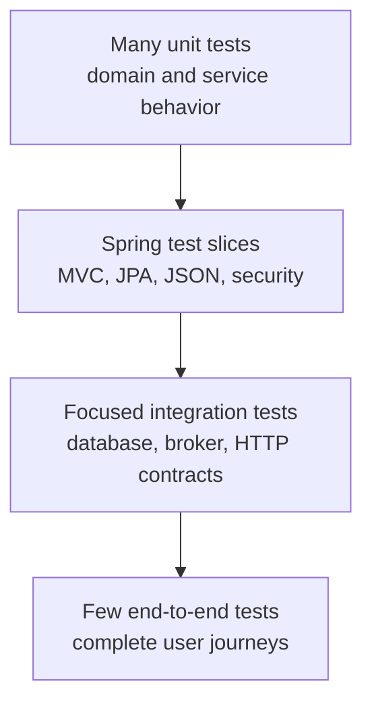
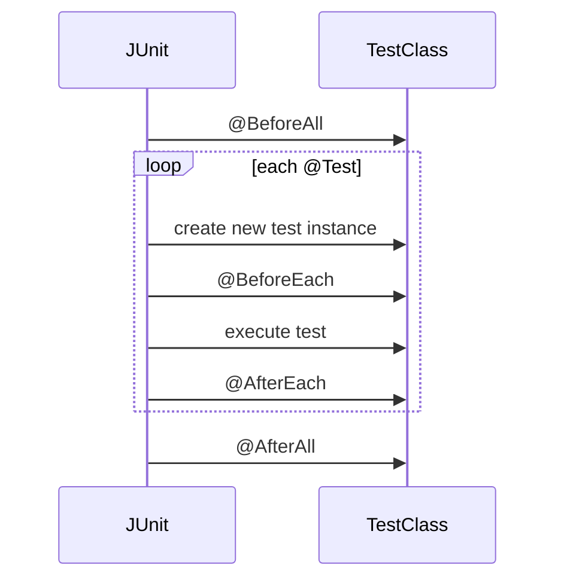
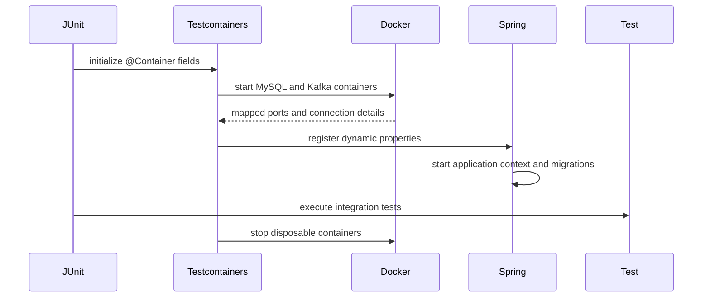

# Java And Spring Boot Testing

Testing provides evidence at different scopes. A reliable test suite uses the
smallest scope capable of proving a behavior and reserves full application or
container startup for contracts that require real infrastructure.

## Test Pyramid



| Level | Proves | Typical speed |
|---|---|---|
| Unit | one class or function in isolation | milliseconds |
| Slice | one Spring framework layer | fast to moderate |
| Integration | collaboration with real infrastructure | seconds to minutes |
| End to end | deployed-system user journey | minutes |

More scope means more realistic wiring, but also more startup time, possible
failure causes, and resource use.

## Dependencies

Spring Boot test starter:

```gradle
testImplementation 'org.springframework.boot:spring-boot-starter-test'
testRuntimeOnly 'org.junit.platform:junit-platform-launcher'
```

It normally provides JUnit Jupiter, AssertJ, Mockito, Spring Test, JSON testing,
and other testing support.

Security:

```gradle
testImplementation 'org.springframework.security:spring-security-test'
```

Testcontainers:

```gradle
integrationTestImplementation platform(
        "org.testcontainers:testcontainers-bom:<version>"
)
integrationTestImplementation 'org.testcontainers:testcontainers-junit-jupiter'
integrationTestImplementation 'org.testcontainers:testcontainers-mysql'
integrationTestImplementation 'org.testcontainers:testcontainers-kafka'
```

Use the repository's dependency management rather than independently choosing
incompatible versions.

## JUnit Jupiter Execution Model

JUnit Platform discovers and launches test engines. JUnit Jupiter is the
programming and extension model used by JUnit 5/6-era tests.

```text
Gradle test task
  -> JUnit Platform Launcher
  -> Jupiter TestEngine
  -> discover test classes and methods
  -> execute lifecycle callbacks and tests
  -> publish results to Gradle reports
```

## Important JUnit Annotations

| Annotation | Purpose |
|---|---|
| `@Test` | one test case |
| `@BeforeEach` | setup before every test |
| `@AfterEach` | cleanup after every test |
| `@BeforeAll` | setup once before the class |
| `@AfterAll` | cleanup once after the class |
| `@DisplayName` | readable test/class name |
| `@Nested` | group related scenarios |
| `@ParameterizedTest` | execute one test with several arguments |
| `@ValueSource` | simple parameter values |
| `@CsvSource` | tabular argument values |
| `@MethodSource` | arguments from a factory method |
| `@EnumSource` | enum values |
| `@Timeout` | fail a test exceeding its deadline |
| `@Tag` | categorize tests |
| `@Disabled` | temporarily skip with a reason |
| `@TestInstance` | configure test-instance lifecycle |
| `@ExtendWith` | register a Jupiter extension |

## JUnit Lifecycle

Default lifecycle:



By default, JUnit creates a new test instance for every test method. This
reduces accidental state sharing.

`@BeforeAll` and `@AfterAll` are normally static. With:

```java
@TestInstance(TestInstance.Lifecycle.PER_CLASS)
```

they can be instance methods, but shared mutable state can make tests
order-dependent.

Do not depend on test execution order. Each test should arrange its own state.

## Test Structure

A readable test follows Arrange, Act, Assert:

```java
@Test
void returnsUserWhenIdExists() {
    // Arrange
    when(repository.findById(1L)).thenReturn(Optional.of(user));

    // Act
    UserResponse response = service.getUser(1L);

    // Assert
    assertThat(response.username()).isEqualTo("ahmed");
}
```

Test names should express behavior:

```text
createUserHashesPasswordAndAssignsRoles
anotherCustomerCannotReadTimeline
outboxCommitAndRollbackShareTheTransactionBoundary
```

Avoid names such as `testMethod1`.

## Assertions

JUnit:

```java
assertEquals(expected, actual);
assertThrows(ResourceNotFoundException.class, () -> service.getUser(99L));
```

AssertJ:

```java
assertThat(response.username()).isEqualTo("ahmed");

assertThatThrownBy(() -> service.getUser(99L))
        .isInstanceOf(ResourceNotFoundException.class)
        .hasMessageContaining("99");
```

Assert business outcomes and relevant state. Avoid asserting every internal
field when it is not part of the behavior.

## Parameterized Tests

Use one parameterized test when several inputs prove the same rule:

```java
@ParameterizedTest
@ValueSource(strings = {"weak", "password", "12345678"})
void rejectsWeakPasswords(String password) {
    assertThat(validator.isValid(password, context)).isFalse();
}
```

```java
@ParameterizedTest
@CsvSource({
        "1, true",
        "0, false",
        "-1, false"
})
void quantityMustBePositive(int quantity, boolean expected) {
    assertThat(isValidQuantity(quantity)).isEqualTo(expected);
}
```

Do not combine unrelated behaviors merely to reduce the number of methods.

## Mockito

Mockito creates test doubles for collaborators:

```java
@ExtendWith(MockitoExtension.class)
class UserServiceTest {

    @Mock
    UserRepository repository;

    @Mock
    PasswordEncoder passwordEncoder;

    UserServiceImpl service;

    @BeforeEach
    void setUp() {
        service = new UserServiceImpl(repository, passwordEncoder, ...);
    }
}
```

### Stubbing

```java
when(repository.findById(1L))
        .thenReturn(Optional.of(user));

when(repository.save(any(User.class)))
        .thenAnswer(invocation -> invocation.getArgument(0));
```

Stub only behavior needed by the current test. Excess stubbing makes tests
hard to understand and can hide incorrect interactions.

### Verification

```java
verify(repository).save(any(User.class));
verify(repository, never()).delete(any(User.class));
verify(auditService).record(user, "USER_CREATED", "User account created");
```

Verify important side effects and absences. Do not verify every implementation
call, because that couples the test to harmless refactoring.

### Argument Matchers

Common matchers:

```java
any()
any(User.class)
eq("ADMIN")
isNull()
argThat(user -> user.getStatus() == UserStatus.ACTIVE)
```

`any(User.class)` means any non-null argument compatible with `User` for that
stub or verification. It is not an assertion by itself.

When one argument uses a matcher, all arguments in that method call should use
matchers:

```java
verify(repository).findByStatusAndName(eq(ACTIVE), anyString());
```

Avoid:

```java
verify(repository).findByStatusAndName(ACTIVE, anyString());
```

### Argument Captor

Capture an object when its constructed state matters:

```java
ArgumentCaptor<User> captor = ArgumentCaptor.forClass(User.class);

verify(repository).save(captor.capture());

assertThat(captor.getValue().getPassword()).isEqualTo("hashed-password");
assertThat(captor.getValue().getStatus()).isEqualTo(UserStatus.ACTIVE);
```

Prefer matchers for simple selection and captors for detailed post-call
assertions.

### `@InjectMocks`

```java
@InjectMocks
UserServiceImpl service;
```

Mockito attempts constructor, setter, or field injection. Explicit constructor
creation is often clearer when a service has important dependencies or test
fixtures.

### Mock, Spy, Fake, And Stub

| Type | Meaning |
|---|---|
| Mock | programmable object whose interactions can be verified |
| Stub | provides canned answers |
| Spy | wraps a real object and overrides selected behavior |
| Fake | working simplified implementation, such as an in-memory repository |

Use spies sparingly. They often indicate a class with too many responsibilities.

## Service Unit Tests

Service tests should cover:

- successful result;
- missing resource;
- duplicate/conflict paths;
- validation/business rule;
- state transition;
- important collaborator calls;
- no write when validation fails.

Shopverse-style example:

```java
@Test
void createUserHashesPasswordAndAssignsRoles() {
    when(repository.existsByUsername("ahmed")).thenReturn(false);
    when(passwordEncoder.encode("password123")).thenReturn("hashed-password");
    when(repository.save(any(User.class)))
            .thenAnswer(invocation -> invocation.getArgument(0));

    service.createUser(request);

    ArgumentCaptor<User> captor = ArgumentCaptor.forClass(User.class);
    verify(repository).save(captor.capture());
    assertThat(captor.getValue().getPassword())
            .isEqualTo("hashed-password");
}
```

Do not start Spring for pure business logic. Mockito and direct construction
give faster and more focused feedback.

## Controller Tests

Controller tests verify:

- route and HTTP method;
- request binding;
- Jakarta Validation;
- response status and JSON;
- exception mapping;
- security rules where included;
- delegation to the service boundary.

### Standalone MockMvc

Shopverse User Service currently demonstrates:

```java
@ExtendWith(MockitoExtension.class)
class UserControllerTest {

    @Mock
    UserService userService;

    MockMvc mockMvc;

    @BeforeEach
    void setUp() {
        mockMvc = MockMvcBuilders
                .standaloneSetup(new UserController(userService))
                .setControllerAdvice(new GlobalExceptionHandler())
                .setValidator(validator)
                .build();
    }
}
```

Advantages:

- very fast;
- explicit controller/advice/validator setup;
- no application context.

Limitations:

- does not prove normal MVC auto-configuration;
- filters and security are absent unless explicitly added;
- mapper configuration can differ from the application.

### MVC Slice

Use a Spring MVC test slice when framework wiring matters:

```java
@WebMvcTest(UserController.class)
class UserControllerWebMvcTest {

    @Autowired
    MockMvc mockMvc;

    @MockitoBean
    UserService userService;
}
```

`@WebMvcTest` loads MVC-related components rather than the entire application.
Use `@MockitoBean` to replace service collaborators in the Spring context.

Choose standalone setup for a narrow unit-style controller test and
`@WebMvcTest` for MVC configuration, converters, filters, or security behavior.

## MockMvc Example

```java
mockMvc.perform(post("/api/v1/users")
                .contentType(MediaType.APPLICATION_JSON)
                .content(objectMapper.writeValueAsString(request)))
        .andExpect(status().isCreated())
        .andExpect(jsonPath("$.success").value(true))
        .andExpect(jsonPath("$.data.username").value("ahmed"));

verify(userService).createUser(any(CreateUserRequest.class));
```

Invalid input:

```java
mockMvc.perform(post("/api/v1/users")
                .contentType(MediaType.APPLICATION_JSON)
                .content(invalidJson))
        .andExpect(status().isBadRequest());

verify(userService, never()).createUser(any());
```

## Repository Tests

Use `@DataJpaTest` for:

- entity mappings;
- derived/custom queries;
- constraints;
- entity graphs and fetch behavior;
- optimistic locking;
- auditing when imported/configured;
- database-specific behavior when paired with the right database.

```java
@DataJpaTest
class OrderRepositoryTest {

    @Autowired
    OrderRepository repository;

    @Test
    void findsOrderByIdempotencyKey() {
        repository.saveAndFlush(order);

        assertThat(repository.findWithItemsByIdempotencyKey("checkout-1"))
                .isPresent();
    }
}
```

An H2 repository test is useful for generic JPA behavior but cannot prove every
MySQL detail. Use Testcontainers for dialect, locking, migration, index, and
constraint behavior that matters in production.

Tests managed by Spring may roll back automatically. Call `flush()` when the
test must surface a database constraint before the test ends.

## Spring Test Annotations

| Annotation | Use |
|---|---|
| `@SpringBootTest` | full application context |
| `@WebMvcTest` | MVC/controller slice |
| `@DataJpaTest` | JPA/repository slice |
| `@JsonTest` | JSON mapper and serialization slice |
| `@RestClientTest` | HTTP client slice |
| `@JdbcTest` | JDBC-focused slice |
| `@AutoConfigureMockMvc` | add MockMvc to a Boot test |
| `@ActiveProfiles` | select test profiles |
| `@TestPropertySource` | add test property sources |
| `@DynamicPropertySource` | register runtime-generated properties |
| `@Sql` | execute SQL before/after tests |
| `@DirtiesContext` | discard a modified cached context |
| `@Transactional` | run test in a test-managed transaction |
| `@MockitoBean` | replace a Spring bean with a Mockito mock |
| `@WithMockUser` | establish a mock security identity |

Use `@SpringBootTest` only when full wiring is the behavior being tested.
Application contexts are cached between compatible tests, but differing
properties or `@DirtiesContext` reduce reuse and increase runtime.

## Context Load Tests

```java
@SpringBootTest(properties = {
        "spring.cloud.config.enabled=false",
        "eureka.client.enabled=false"
})
class ApplicationTests {

    @Test
    void contextLoads() {
    }
}
```

This proves that a configured context can start. It does not prove business
behavior and should not be the majority of the suite.

Disable or replace external dependencies deliberately. Do not let a context
test accidentally call Config Server, Eureka, JWKS, Kafka, or a real database.

## Security Tests

Spring Security test support:

```java
@Test
@WithMockUser(username = "alice", roles = "CUSTOMER")
void ownerCanReadTimeline() {
    assertThatNoException()
            .isThrownBy(() -> controller.getTimeline(orderId));
}
```

Required authorization scenarios:

- owner allowed;
- different customer denied;
- administrator allowed;
- missing authentication denied;
- invalid/expired token denied at resource-server boundary;
- authority/claim mapping tested separately.

Direct method tests prove method-security proxies only when the tested bean is
obtained from a Spring context. Calling `new Controller(...)` bypasses those
proxies.

## Integration Tests

Integration tests verify collaboration that mocks cannot prove:

- Liquibase migrations;
- real database constraints;
- transaction commit and rollback;
- optimistic/pessimistic locking;
- outbox persistence;
- Kafka producer/consumer behavior;
- serialization contracts;
- application context wiring.

Keep each test focused. A single integration class does not need to prove the
entire platform.

## Testcontainers

Testcontainers starts disposable dependencies in Docker for tests:



Advantages:

- uses the real database/broker product;
- clean, repeatable state;
- dynamic isolated ports;
- same pattern locally and in CI;
- no shared developer database;
- validates migrations and production dialect behavior.

Costs:

- requires Docker;
- image pulls and startup consume time/resources;
- poorly scoped containers can make suites slow;
- parallel suites can exhaust Docker or host memory.

## Testcontainers Example

```java
@Testcontainers(disabledWithoutDocker = true)
@SpringBootTest
class InfrastructureIntegrationTest {

    @Container
    static final MySQLContainer<?> MYSQL =
            new MySQLContainer<>("mysql:8.4");

    @Container
    static final KafkaContainer KAFKA =
            new KafkaContainer("apache/kafka-native:3.9.1");

    @DynamicPropertySource
    static void properties(DynamicPropertyRegistry registry) {
        registry.add("spring.datasource.url", MYSQL::getJdbcUrl);
        registry.add("spring.datasource.username", MYSQL::getUsername);
        registry.add("spring.datasource.password", MYSQL::getPassword);
        registry.add("spring.kafka.bootstrap-servers",
                KAFKA::getBootstrapServers);
    }
}
```

Static containers are shared by tests in that class, reducing startup cost.
The Jupiter extension manages their lifecycle.

`disabledWithoutDocker=true` is convenient for unit-only local work, but CI
must clearly require Docker. A skipped integration suite must not be mistaken
for successful infrastructure verification.

## Testing Transactions

To prove commit and rollback, use an explicit transaction:

```java
transactionTemplate.executeWithoutResult(status ->
        outboxService.enqueue(...)
);
assertThat(outboxCount(id)).isOne();

transactionTemplate.executeWithoutResult(status -> {
    outboxService.enqueue(...);
    status.setRollbackOnly();
});
assertThat(outboxCount(id)).isZero();
```

This verifies that the test observes committed state outside the transaction.

Be careful with `@Transactional` on test methods: automatic rollback is useful
for cleanup, but can hide commit callbacks, locking behavior, and visibility
from another connection.

## Kafka Integration Testing

Producer acknowledgement:

```java
var result = kafkaTemplate
        .send(topic, "order-key", payload)
        .get(10, TimeUnit.SECONDS);

assertThat(result.getRecordMetadata().topic()).isEqualTo(topic);
assertThat(result.getRecordMetadata().offset())
        .isGreaterThanOrEqualTo(0);
```

Consumer tests should:

- use unique topics or isolated groups;
- await with a strict deadline;
- assert the business side effect;
- handle duplicates;
- stop listeners/executors cleanly;
- avoid unbounded sleeps.

## End-To-End Testing

An E2E test treats the system as deployed:

```text
authenticate
  -> call gateway checkout
  -> await terminal SAGA state
  -> read timeline/payment
  -> verify security and recovery
```

It proves routing, security, databases, Kafka, and service collaboration.
Failures are slower to diagnose, so E2E tests should cover a few critical
journeys rather than every validation branch.

Use generated correlation and idempotency IDs for isolation.

## Awaiting Asynchronous Results

Use bounded polling:

```java
await()
        .atMost(Duration.ofSeconds(30))
        .pollInterval(Duration.ofMillis(500))
        .untilAsserted(() ->
                assertThat(orderRepository.findById(id).orElseThrow().getStatus())
                        .isEqualTo(CONFIRMED)
        );
```

Avoid:

```java
Thread.sleep(30000);
```

Fixed sleeps are slow when work completes early and flaky when it completes
slightly late.

Every wait needs:

- maximum duration;
- useful final assertion;
- bounded polling interval;
- diagnostics on timeout.

## Contract Testing

Microservices need compatibility tests for:

- REST requests/responses;
- Kafka event schemas;
- JWT claims and authority mapping;
- Config Server property names;
- database migrations versus entity mappings.

Consumer-driven contract tools can help when services deploy independently,
but simple schema fixtures and serialization tests are still valuable.

## Test Data

- Build the minimum object needed by the test.
- Use clear builders/factories for repeated valid objects.
- Generate unique business keys where constraints apply.
- Keep credentials and secrets fake.
- Do not share mutable fixtures between tests.
- Make timestamps controllable through `Clock` when business rules depend on
  time.

## Flaky Test Prevention

Common causes:

- shared database/topic state;
- fixed sleeps;
- dependence on execution order;
- random values without logging seeds;
- system clock/timezone dependence;
- asynchronous work not stopped;
- reused ports;
- external network calls;
- too much parallelism;
- one full context with uncontrolled background schedulers.

Fix the cause rather than rerunning until green.

## Parallel Execution

Parallel tests can improve speed only when tests and infrastructure are
isolated. Consider:

- database schemas and transactions;
- Kafka topic/group names;
- static state;
- file paths;
- container/CPU/memory limits;
- connection-pool capacity.

Start sequentially, measure, then enable bounded parallelism where isolation is
proven.

## Testing Guidelines

1. Test behavior, not private implementation.
2. Use the smallest sufficient scope.
3. Keep unit tests deterministic and infrastructure-free.
4. Use real MySQL/Kafka for database/broker contracts.
5. Give asynchronous tests deadlines.
6. Test success, denial, failure, duplicate, and rollback paths.
7. Keep test data isolated.
8. Do not mock the class under test.
9. Avoid over-verifying internal calls.
10. Make failures print actionable evidence.
11. Separate unit, integration, and E2E tasks.
12. Bound workers, containers, retries, and total runtime.

## Related Guides

- [Shopverse testing strategy](TESTING.md)
- [Transactions](../reliability/TRANSACTIONS-GENERIC.md)
- [Kafka](../integration/KAFKA.md)
- [Security](../security/SPRING-SECURITY-GENERIC.md)
- [Debugging](DEBUGGING.md)

## Official References

- [JUnit user guide](https://docs.junit.org/current/user-guide/)
- [Spring testing reference](https://docs.spring.io/spring-framework/reference/testing.html)
- [Testcontainers JUnit 5](https://java.testcontainers.org/test_framework_integration/junit_5/)
- [Mockito documentation](https://javadoc.io/doc/org.mockito/mockito-core/latest/org.mockito/org/mockito/Mockito.html)
