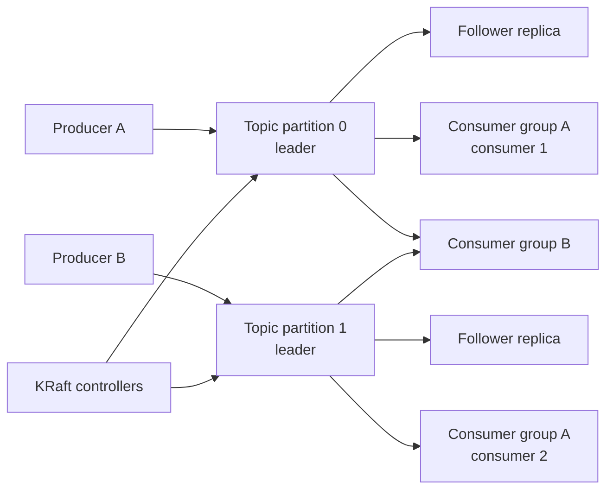

# Apache Kafka

Apache Kafka is a distributed event-streaming platform built around durable,
partitioned, append-only logs. Producers append records; consumers pull and
process them independently while Kafka retains records according to topic
policy.

Spring-specific implementation is documented in
[Spring Kafka](../spring/SPRING-KAFKA.md).

## What Kafka Offers

- high-throughput durable event storage;
- horizontal scaling through partitions;
- consumer replay through offsets;
- multiple independent consumer groups;
- ordering within a partition;
- replication and broker failover;
- retention independent of consumption;
- event-driven integration and stream processing.

Kafka is not a database transaction coordinator and does not automatically
make consumers idempotent.

## Architecture



## Core Concepts

| Concept | Meaning |
|---|---|
| Broker | server storing partitions and serving clients |
| Cluster | cooperating brokers and controllers |
| Topic | named stream of records |
| Partition | ordered append-only log and parallelism unit |
| Record | key, value, headers, timestamp, partition, offset |
| Producer | writes records |
| Consumer | polls records |
| Consumer group | consumers sharing topic work |
| Offset | record position in one partition |
| Group offset | committed progress for a consumer group |
| Replica | copy of a partition |
| Leader | replica serving reads/writes for a partition |
| ISR | in-sync replicas sufficiently caught up |
| KRaft | Kafka's metadata/controller quorum mode |

## Pull-Based Consumer Model

Consumers call `poll()`:

```text
consumer -> broker: fetch records after offset 120
broker   -> consumer: records 121..200
consumer: process
consumer -> broker: commit offset 200
```

Benefits:

- consumer controls batch size and processing rate;
- slow consumers do not require producers to wait;
- records remain available for replay;
- batching improves throughput.

Costs:

- applications must monitor lag;
- poll intervals and processing time must be coordinated;
- redelivery occurs when work completes but offset commit does not.

## Partitions And Ordering

Ordering exists only inside one partition:

```text
partition 0: A1 -> A2 -> A3
partition 1: B1 -> B2 -> B3
```

Use a stable key when related records require ordering:

```text
key = orderNumber
```

The producer hashes the key to a partition. Increasing partition count can
change key-to-partition assignment for future records and should be planned.

Partition count determines maximum active consumers in one group:

```text
useful group consumers <= partition count
```

## Consumer Groups

```text
topic: 3 partitions

inventory group:
  consumer A -> partition 0
  consumer B -> partition 1
  consumer C -> partition 2

analytics group:
  consumer X -> partitions 0, 1, 2
```

Each group receives its own logical copy through independent offsets. Members
inside one group divide partitions.

Membership changes trigger a rebalance. Cooperative assignment reduces
disruption but does not remove the need for idempotent processing.

## Offsets

An offset identifies a record's position within a partition. It is not a
global topic sequence.

```text
log-end offset:       10,000
committed offset:      9,200
consumer lag:            800
```

`auto.offset.reset` applies only when a group has no valid committed offset:

- `earliest`: begin at retained earliest records;
- `latest`: begin after current end;
- `none`: fail when no offset exists.

## Delivery Semantics

| Semantic | Meaning |
|---|---|
| At most once | offset can commit before processing; failures may lose work |
| At least once | process before commit; failures may redeliver |
| Exactly once in Kafka | transactional read-process-write and offsets within Kafka |

Database updates plus Kafka offsets are not automatically one transaction.
Use idempotent consumers, inbox tables, outbox, or carefully designed
transaction integration.

## Producer Durability

Important controls:

```text
acks=all
enable.idempotence=true
min.insync.replicas
replication.factor
```

- `acks=all` waits for required in-sync replicas;
- idempotence prevents supported duplicate writes from producer retries;
- `min.insync.replicas` defines minimum replica acknowledgement availability;
- replication protects against broker failure.

Producer idempotence does not deduplicate two separate application commands.

## Retention And Compaction

Delete retention removes records based on time or size.

Log compaction retains the latest value per key:

```text
product-101 -> stock=10
product-101 -> stock=7
product-101 -> stock=4

compacted result eventually retains stock=4
```

Compaction is asynchronous and tombstones represent deletion. Choose policy
according to whether the topic is an event history, state changelog, or both.

## Kafka Versus RabbitMQ

| Concern | Kafka | RabbitMQ |
|---|---|---|
| Core model | partitioned retained log | brokered queues and exchanges |
| Consumption | pull | commonly broker push with consumer prefetch |
| Retention | independent of consumption | message usually removed after acknowledgment |
| Replay | natural through offsets | requires deliberate republishing/storage |
| Ordering | per partition | per queue under constrained consumption |
| Routing | topic/key/partition | rich exchanges and routing keys |
| Throughput | strong for event streams and batching | strong for work queues and routing |
| Consumer scaling | bounded by partitions per group | competing consumers on queues |
| Typical use | event streaming, analytics, CDC, durable integration | commands, task queues, routing, request workflows |

Choose Kafka when durable replayable streams, high throughput, multiple
independent consumers, or partition ordering matter.

Choose RabbitMQ when flexible routing, per-message queue semantics, priority,
short-lived work distribution, or conventional task queues are the primary
need.

Do not choose by popularity. Evaluate delivery, replay, ordering, routing,
operations, latency, and team expertise.

## Consumer Lag

Lag grows when arrival rate exceeds committed processing rate:

```text
lag growth per second =
    produced records per second - committed records per second
```

Causes:

- slow database or remote calls;
- too few partitions or consumers;
- poison events and retries;
- hot keys concentrating one partition;
- rebalances;
- connection pool exhaustion;
- oversized batches;
- stopped consumers.

Response:

1. measure per-record and per-batch processing time;
2. inspect partition-level lag and key skew;
3. remove slow network calls from handlers where possible;
4. optimize database operations;
5. isolate poison events with bounded retry and DLT;
6. increase consumers only up to partition and downstream capacity;
7. add partitions when ordering and key behavior permit;
8. apply backpressure instead of unbounded executor queues.

Alert on lag trend and oldest unprocessed event age, not only one lag number.

## How Many Partitions And Consumers?

Approximate measured consumer capacity:

```text
consumer capacity =
    records processed / second under representative load

required consumers =
    ceiling(target throughput / consumer capacity)

partition count >= required active consumers
```

Also consider:

- future peak traffic;
- key distribution and hot partitions;
- broker disk/network capacity;
- recovery time after downtime;
- database connection and downstream limits;
- ordering requirements;
- operational cost of many partitions.

More partitions are not free. They increase metadata, files, replication work,
rebalance complexity, and recovery cost.

## Message Queues Versus Event Streams

A command says what should happen:

```text
ReserveInventory
```

An event states what happened:

```text
InventoryReserved
```

Kafka can transport both, but topic ownership, consumer count, replay behavior,
and idempotency differ. Multiple services independently reacting to the same
fact is a natural event-stream use case.

## Troubleshooting Apparent Message Loss

1. confirm producer acknowledgement;
2. verify topic, environment, key, and partition;
3. inspect broker leader and ISR state;
4. check retention and compaction;
5. inspect consumer group offsets and lag;
6. inspect retry and dead-letter topics;
7. check deserialization failures;
8. inspect rebalances and poll interval violations;
9. confirm business transaction and offset order;
10. understand duplicate impact before resetting offsets.

Do not reset offsets as the first response.

## Important Interview Questions

### Why Is Kafka Fast?

Sequential append-oriented storage, batching, compression, zero-copy and
efficient transfer paths, partition parallelism, and page-cache utilization.
Performance still depends on durability and workload settings.

### Can Kafka Guarantee Global Ordering?

No. Kafka guarantees ordering within one partition. Global ordering requires
one partition, which limits parallelism.

### What Happens When Consumers Exceed Partitions?

Extra consumers in the same group remain idle because one partition is
assigned to at most one group member.

### What Is A Rebalance?

Partition ownership is reassigned when group membership or subscribed
partitions change. Processing pauses or shifts and duplicates can occur around
uncommitted work.

### What Is Consumer Lag?

The difference between a partition's log-end offset and the consumer group's
committed offset.

### What Is A Hot Partition?

One partition receives disproportionate records or expensive work, commonly
because of a skewed key. Adding consumers does not split one partition.

### Does Kafka Remove A Record After Consumption?

No. Retention policy controls storage. Consumer groups only track offsets.

### What Is Idempotent Production?

The producer uses sequence information to prevent duplicates caused by
supported retries within its producer session. It does not provide end-to-end
business idempotency.

### What Are Kafka Transactions?

They atomically publish records and, for consume-process-produce, commit
consumed offsets within Kafka. They do not atomically commit a separate MySQL
database.

### How Do You Handle A Poison Record?

Classify the failure, use bounded retry, route terminal failures to a DLT,
preserve metadata, alert operators, and replay only after fixing the cause.

### Why Must Consumers Be Idempotent?

At-least-once delivery, crashes, rebalances, retry, and replay can deliver the
same event more than once.

### Kafka Or RabbitMQ?

Answer from requirements: retained replayable stream and partition scale favor
Kafka; rich routing and conventional work queues often favor RabbitMQ.

## Do And Do Not

| Do | Do not |
|---|---|
| Key records for required ordering | Assume topic-wide ordering |
| Make consumers idempotent | Treat offset commits as business deduplication |
| Monitor lag by partition and age | Look only at total lag |
| Size consumers from measured capacity | Set arbitrary concurrency |
| Use durable producer settings | Mark success before acknowledgement |
| Design retention and replay | Assume consumed records disappear |
| Use bounded retry and DLT | Retry poison events forever |
| Secure brokers and authorize topics | Run production Kafka as an open local broker |

## Related Guides

- [Spring Kafka](../spring/SPRING-KAFKA.md)
- [SAGA And Outbox](../reliability/SAGA-GENERIC.md)
- [Distributed Systems](../architecture/DISTRIBUTED-SYSTEMS.md)

