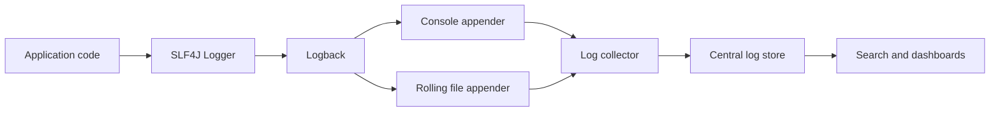
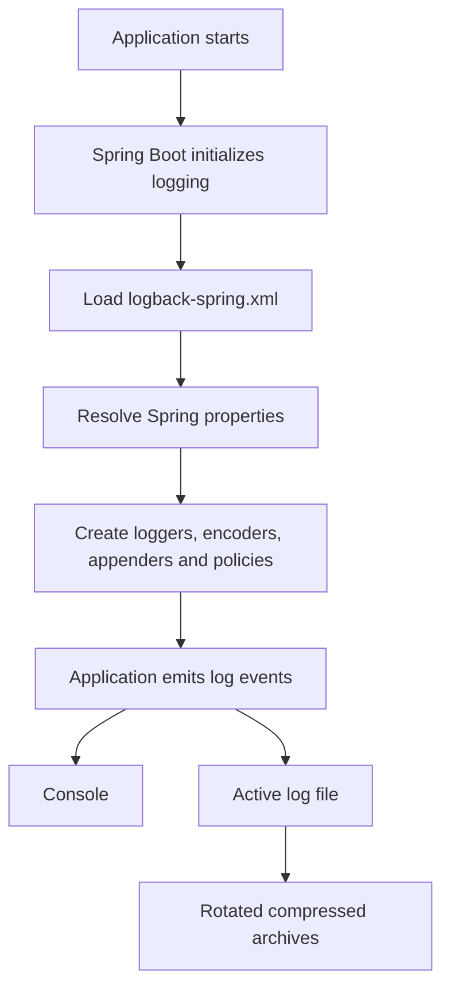

# Application Logging

Logging records events that explain what an application did, why it made a
decision, and where an operation failed. Production logging should create
searchable operational evidence without exposing secrets or overwhelming the
storage system.

## Logging Components

| Component | Responsibility |
|---|---|
| SLF4J | Logging API used by application code |
| Logback | Logging implementation commonly used by Spring Boot |
| Logger | Creates log events for a class or category |
| Appender | Sends events to a destination such as console or file |
| Encoder | Converts a log event into text or JSON |
| MDC | Adds scoped contextual fields such as a correlation ID |
| Collector | Reads and forwards logs, for example Promtail |
| Store | Persists and indexes logs, for example Loki |
| UI | Searches and visualizes logs, for example Grafana |

Application code should normally depend on SLF4J rather than calling a
specific Logback class.

## Logging Flow



## Dependencies

Spring Boot web starters normally include the logging starter, SLF4J, and
Logback transitively:

```gradle
implementation 'org.springframework.boot:spring-boot-starter-web'
```

Reactive applications commonly receive the same infrastructure from:

```gradle
implementation 'org.springframework.boot:spring-boot-starter-webflux'
```

A plain Java application can declare:

```gradle
implementation 'org.slf4j:slf4j-api'
runtimeOnly 'ch.qos.logback:logback-classic'
```

Use one SLF4J provider. Multiple providers can cause startup warnings and
unpredictable output.

## Traditional And Fluent SLF4J Logging

Traditional parameterized logging:

```java
log.info("Gateway request started method={} path={}", method, path);
```

SLF4J replaces `{}` placeholders when the event is enabled. This is preferable
to string concatenation.

SLF4J also provides a fluent event builder:

```java
log.atInfo()
        .addKeyValue("correlationId", correlationId)
        .addKeyValue("method", method)
        .addKeyValue("path", path)
        .log("Gateway request started");
```

### What `log.atInfo()` Means

`log.atInfo()` starts a log-event builder at the `INFO` level. It has the same
severity as `log.info(...)`, but supports structured fields, arguments,
markers, causes, and lazy values before emitting the event.

```java
log.atInfo()                           // Select INFO level
        .addKeyValue("method", method) // Add structured field
        .addKeyValue("path", path)     // Add structured field
        .log("Gateway request started"); // Emit event
```

The event is emitted only when `.log(...)` is called. If INFO is disabled, the
builder is effectively a no-op. Expensive diagnostic values should still be
supplied lazily where supported:

```java
log.atDebug()
        .addArgument(() -> expensiveDiagnostic())
        .log("Diagnostic state: {}");
```

### What `addKeyValue(...)` Does

`addKeyValue(key, value)` attaches a structured field to the event. A
compatible structured encoder can emit:

```json
{
  "message": "Gateway request started",
  "correlationId": "123",
  "method": "GET",
  "path": "/api/users"
}
```

Completion example:

```java
log.atInfo()
        .addKeyValue("correlationId", correlationId)
        .addKeyValue("method", method)
        .addKeyValue("path", path)
        .addKeyValue("status", status)
        .addKeyValue("durationMs", durationMs)
        .log("Gateway request completed");
```

Possible JSON output:

```json
{
  "message": "Gateway request completed",
  "correlationId": "123",
  "method": "GET",
  "path": "/api/users",
  "status": 200,
  "durationMs": 45
}
```

With a text encoder, key/value pairs may be rendered as text or may require
pattern/provider configuration. Fluent logging creates structured event data;
the final representation depends on the encoder.

## Log Levels

| Level | Typical use |
|---|---|
| `TRACE` | extremely detailed framework or algorithm execution |
| `DEBUG` | developer diagnostics disabled in normal production |
| `INFO` | important state transitions and successful outcomes |
| `WARN` | degraded behavior, rejection, retry, or recoverable failure |
| `ERROR` | operation failed and requires investigation or recovery |

Avoid logging every method entry and exit at INFO. Log meaningful boundaries,
state changes, external outcomes, and failures.

## Structured JSON Logging

Text logs are readable but require parsing:

```text
2026-06-11 INFO Order created orderNumber=ORD-101
```

JSON logs preserve independent fields:

```json
{
  "@timestamp": "2026-06-11T10:45:00Z",
  "level": "INFO",
  "message": "Order created",
  "orderNumber": "ORD-101",
  "correlationId": "abc-123"
}
```

Advantages include reliable machine parsing, field-based filtering, easier
aggregation, and consistent correlation across services. JSON does not
automatically make logs useful; field naming, event selection, context,
retention, and sensitive-data controls still matter.

## What Logstash Format Means

`logstash` is a structured JSON field convention supported by Spring Boot's
structured encoder. Selecting Logstash format does not mean a Logstash server
is running.

Possible pipelines include:

```text
Spring Boot JSON -> Logstash -> Elasticsearch -> Kibana
```

or:

```text
Spring Boot JSON -> Promtail -> Loki -> Grafana
```

The encoder controls the JSON representation. Collection and storage are
separate choices.

## How Spring Boot Loads Logback



Use `logback-spring.xml` instead of `logback.xml` when Spring-aware extensions
such as `<springProperty>` are required.

## Spring Boot Defaults

```xml
<include resource="org/springframework/boot/logging/logback/defaults.xml"/>
```

This imports Spring Boot's standard Logback properties, conversion rules, and
pattern support. It provides a baseline but does not attach application
appenders to the root logger by itself.

## Reading Spring Configuration

```xml
<springProperty
        scope="context"
        name="STRUCTURED_FORMAT"
        source="logging.structured.format.file"
        defaultValue="logstash"/>
```

- `source` is the Spring property;
- `name` is the Logback variable;
- `defaultValue` applies when the property is absent;
- `scope="context"` exposes it to the Logback context.

It can then be referenced as:

```xml
<format>${STRUCTURED_FORMAT}</format>
```

## Console Appender

```xml
<appender name="CONSOLE"
          class="ch.qos.logback.core.ConsoleAppender">
    <encoder class="org.springframework.boot.logging.logback.StructuredLogEncoder">
        <format>${STRUCTURED_FORMAT}</format>
    </encoder>
</appender>
```

An appender is a destination. `ConsoleAppender` writes to stdout, which is
visible through terminals, `docker logs`, container runtimes, and Kubernetes
logging agents. The encoder converts the Java event to final output.

## Rolling File Appender

```xml
<appender name="APP_FILE"
          class="ch.qos.logback.core.rolling.RollingFileAppender">
    <file>${LOG_FILE}</file>
    <rollingPolicy
            class="ch.qos.logback.core.rolling.SizeAndTimeBasedRollingPolicy">
        <fileNamePattern>${LOG_FILE}.%d{yyyy-MM-dd}.%i.gz</fileNamePattern>
        <maxFileSize>10MB</maxFileSize>
        <maxHistory>7</maxHistory>
        <totalSizeCap>256MB</totalSizeCap>
    </rollingPolicy>
</appender>
```

`<file>` identifies the active file.

`SizeAndTimeBasedRollingPolicy` rotates by date and size.

- `%d{yyyy-MM-dd}` is the date;
- `%i` is the size-roll index for that date;
- `.gz` compresses the archive.

Examples:

```text
user-service.log
user-service.log.2026-06-11.0.gz
user-service.log.2026-06-11.1.gz
```

`maxFileSize=10MB` rolls the active period at the size threshold.

`maxHistory=7` retains up to seven completed date periods, subject to cleanup
timing and the total cap.

`totalSizeCap=256MB` limits all archives governed by the policy. Old eligible
archives are removed when retention constraints are applied.

File retention and centralized-store retention are independent.

## Root Logger And Appenders

```xml
<root level="INFO">
    <appender-ref ref="CONSOLE"/>
    <appender-ref ref="APP_FILE"/>
</root>
```

The root logger accepts INFO and higher events unless a specific logger
overrides it. Every accepted event is sent to both appenders.

## Console Versus File Collection

Console path:

```text
Application -> stdout -> container runtime -> collector
```

File path:

```text
Application -> rolling file -> mounted volume -> collector
```

Collecting both may duplicate every event. Production platforms should define
one authoritative path unless duplication is intentional and queries select a
single source consistently.

## Centralized Logging Benefits

- one search interface for many services and replicas;
- correlation across gateway, HTTP clients, Kafka, and schedulers;
- retention independent of a container lifetime;
- dashboards and alert rules;
- access control and auditability;
- faster incident investigation.

The application must continue operating when the log backend is unavailable.

## Troubleshooting With Logs

1. identify the incident time range;
2. obtain a correlation ID, trace ID, order number, or stable business ID;
3. filter by service and severity;
4. inspect the first warning or error, not only the final failure;
5. follow state transitions across services;
6. compare logs with metrics for scale and traces for latency;
7. inspect retry, outbox, and DLT events when asynchronous progress stops.

Logs explain events. Metrics quantify frequency and impact. Traces show
distributed timing and call relationships.

## Production Practices

1. Use stable structured field names.
2. include application, environment, correlation, trace, and operation context
   where appropriate.
3. never log passwords, tokens, cookies, private keys, payment credentials, or
   unnecessary personal data.
4. sanitize control characters from untrusted text values.
5. keep INFO focused on meaningful events.
6. use parameterized or fluent logging instead of concatenation.
7. pass exceptions as throwable arguments so stack traces are retained.
8. configure bounded file and backend retention.
9. avoid full request and response bodies by default.
10. prevent accidental duplicate collection from stdout and files.
11. separate noisy probe logs when they hide business activity.
12. test that structured and correlation fields reach the central store.

## Related Guides

- [Shopverse structured logging](STRUCTURED-LOGGING.md)
- [MDC](MDC-GENERIC.md)
- [Loki](LOKI.md)
- [Promtail](PROMTAIL.md)
- [Grafana](GRAFANA.md)
