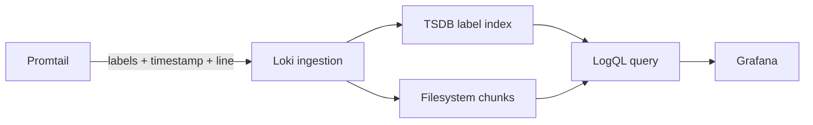

# Loki

Loki is Shopverse's centralized log store. It indexes a small set of labels and
stores compressed log content in chunks. Grafana queries Loki with LogQL.

Loki does not collect logs itself. Promtail discovers and pushes Shopverse log
streams.

## Storage Model



Shopverse uses:

```text
schema: v13 TSDB
object store: local filesystem
replication factor: 1
retention: 168 hours
```

This is suitable for a local POC, not a highly available production cluster.

## Labels Versus Parsed Fields

Current low-cardinality labels include:

```text
job, log_type, application, level, container, compose_service, stream
```

Structured JSON fields include:

```text
message, correlationId, traceId, spanId, timestamp
```

Correlation and trace IDs remain parsed fields, not labels. Turning unique IDs
into labels creates too many streams and increases index cost.

## LogQL Structure

A LogQL query starts with a stream selector:

```logql
{application="ORDER-SERVICE"}
```

Then applies parsing and filtering:

```logql
{application="ORDER-SERVICE"}
| json
| level="ERROR"
```

Use label filters first to reduce the scanned data, then parse JSON.

## Core Queries

All application file logs:

```logql
{log_type="application"}
```

One service:

```logql
{application="ORDER-SERVICE"}
```

One container:

```logql
{container="shopverse-order-service"}
```

Exclude health logs:

```logql
{job=~"shopverse-service-volume-files|shopverse-local-files|docker-containers"}
```

Health logs:

```logql
{log_type="health"}
```

Errors and warnings:

```logql
{application="PAYMENT-SERVICE"}
| json
| level=~"WARN|ERROR"
```

One correlation ID:

```logql
{job=~"shopverse-service-volume-files|shopverse-local-files|docker-containers"}
| json
| correlationId="CORRELATION_ID"
```

One trace ID:

```logql
{job=~"shopverse-service-volume-files|shopverse-local-files|docker-containers"}
| json
| traceId="TRACE_ID"
```

SAGA and outbox logs:

```logql
{log_type="application"}
| json
| message=~"(?i).*(saga|outbox).*"
```

Order number text search:

```logql
{log_type="application"} |= "ORD-1003"
```

JSON parse failures:

```logql
{log_type="application"}
| json
| __error__!=""
```

## Log Metrics

Error count over time:

```logql
sum by (application) (
  count_over_time(
    {log_type="application"}
    | json
    | level="ERROR"
    [5m]
  )
)
```

Error rate:

```logql
sum by (application) (
  rate(
    {log_type="application"}
    | json
    | level="ERROR"
    [5m]
  )
)
```

Use Prometheus application counters for primary alerting when available. Log
metrics are useful for exceptions or text-only evidence.

## Investigation Workflow

1. Select the incident time window.
2. Start with one `application` or `job`.
3. Parse JSON.
4. Filter by level, message, correlation ID, or trace ID.
5. Inspect surrounding lines.
6. Follow `traceId` to Zipkin.
7. Inspect timeline, outbox, or DLT for durable state.

## Duplicate Logs

The POC reads both rolling files and Docker stdout. The same log can appear in
two streams:

```text
shopverse-service-volume-files
docker-containers
```

Choose one job when counting. Production should generally select one canonical
collection path per workload.

## Retention And Deletion

Loki retention is seven days. Logback file retention is independent. Removing
the Loki Docker volume deletes local stored logs.

Production policy must define:

- retention by data class;
- legal/compliance requirements;
- tenant isolation;
- encryption and access control;
- deletion requests;
- backup or archive;
- query and ingestion limits.

## Troubleshooting

No results:

1. widen time range;
2. query `{job=~".+"}`;
3. confirm labels using Grafana's label browser;
4. remove JSON filters;
5. check Promtail and Loki readiness;
6. confirm retention did not remove the data.

Slow queries:

- narrow time and labels;
- avoid broad regex searches;
- keep label cardinality bounded;
- use recording/application metrics for aggregate dashboards;
- scale storage/query components in production.

## Production Practices

- Use object storage and replication for durable deployments.
- Authenticate and authorize tenants.
- Define ingestion/query limits.
- Avoid secrets and personal data in logs.
- Use structured fields and stable schemas.
- Keep labels bounded.
- Monitor ingestion failures, rejected lines, query latency, and storage.
- Test retention and restoration.

## Related Guides

- [Promtail](PROMTAIL.md)
- [Grafana](GRAFANA.md)
- [Structured logging](STRUCTURED-LOGGING.md)
- [MDC and tracing](MDC-CORRELATION-TRACING.md)
- [Official LogQL documentation](https://grafana.com/docs/loki/latest/query/)
