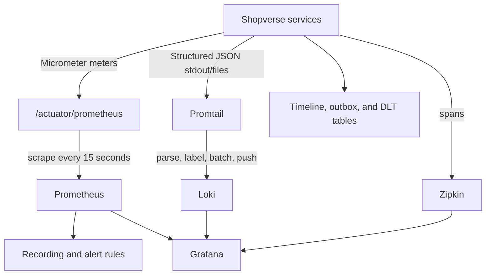

# Shopverse Observability Architecture

Observability answers questions about a running system using signals emitted by
the system. Shopverse combines metrics, logs, traces, and persistent business
state.

## Signals

| Signal | Produced by | Stored by | Investigated with |
|---|---|---|---|
| Metrics | Micrometer and Actuator | Prometheus | PromQL and Grafana |
| Logs | SLF4J and Logback JSON | Loki | LogQL and Grafana |
| Traces | Micrometer Observation/Tracing | Zipkin | Zipkin and Grafana links |
| Business timeline | Order Service | MySQL | Order timeline API |
| Recovery state | outbox and DLT services | MySQL | SQL/admin APIs and dashboards |

Metrics show aggregate behavior. Logs explain exact events. Traces show
technical call relationships and latency. Timeline/outbox/DLT records show
durable business and recovery state.

## End-To-End Flow



## Component Responsibilities

| Component | Does | Does not do |
|---|---|---|
| Micrometer | instruments counters, timers, gauges, observations | store time series |
| Actuator | exposes application and JVM endpoints | scrape services |
| Prometheus | scrapes and stores metrics, evaluates rules | store application logs |
| Logback | creates structured log events and files | aggregate multiple services |
| Promtail | discovers, parses, labels, and ships logs | provide long-term query UI |
| Loki | stores logs and indexes labels | scrape Prometheus metrics |
| Micrometer Tracing | creates/propagates trace context through supported instrumentation | provide business correlation identity |
| Zipkin | stores and visualizes traces | aggregate detailed logs |
| Grafana | queries datasources and renders dashboards/Explore | permanently store source telemetry |

Shopverse does not currently declare an explicit OpenTelemetry SDK/bridge.
Micrometer Tracing and the Spring Boot Zipkin integration are the implemented
tracing stack.

## Correlation Workflow

```text
Dashboard indicates payment failures
  -> narrow the incident time window
  -> identify order/correlation ID in Loki or timeline
  -> search all logs by correlation ID
  -> open trace by trace ID
  -> inspect outbox, DLT, and business state
```

Correlation ID identifies a business journey. Trace ID identifies one
technical distributed trace. A long-running Kafka SAGA can retain one
correlation ID across several traces.

## Implemented Metrics

Spring contributes:

- HTTP server request count and duration;
- JVM memory, GC, threads, classes;
- process CPU and uptime;
- datasource/pool metrics;
- Kafka client/listener metrics where available;
- executor and system metrics.

Shopverse records business meters for:

- gateway and service request outcomes;
- SAGA transitions;
- payment outcomes;
- inventory reservation conflicts and expiry;
- outbox publication outcomes;
- DLT persistence and replay.

See [Micrometer metrics](MICROMETER-METRICS.md) for meter internals and code.

## Recording Rules And Alerts

Current rules calculate:

- five-minute HTTP availability;
- per-service p95 request latency;
- checkout failure rate.

Current alerts cover:

- service scrape failure for two minutes;
- availability below 99%;
- p95 latency above one second;
- outbox publication failure;
- DLT activity.

These are POC thresholds. Production SLOs need traffic-volume safeguards,
maintenance handling, multi-window burn rates, ownership, runbook links, and a
notification destination such as Alertmanager.

## Retention

| Data | Current local retention |
|---|---|
| Application rolling files | seven days, 256 MB cap per service file set |
| Health rolling files | three days, 64 MB cap |
| Loki | seven days (`168h`) |
| Prometheus | controlled by runtime/default storage settings |
| Zipkin | controlled by the current Zipkin storage/runtime configuration |

Docker volumes preserve local data until retention removes it or the volume is
deleted. Production retention must account for compliance, cost, incident
response, backup, and deletion requirements.

## Cardinality

Good metric labels:

```text
application, method, status, outcome, stage, reason
```

Unsafe metric labels:

```text
orderNumber, username, correlationId, traceId, raw URL, exception message
```

Loki labels must also remain bounded. Shopverse keeps correlation and trace IDs
as parsed JSON fields rather than indexed labels.

## Interfaces

| Tool | URL |
|---|---|
| Grafana | `http://localhost:3000` |
| Prometheus | `http://localhost:9090` |
| Loki readiness | `http://localhost:3100/ready` |
| Zipkin | `http://localhost:9411` |

## Investigation By Question

| Question | Start with |
|---|---|
| Is a service down? | Prometheus `up` and container health |
| Is traffic failing? | HTTP error rate and availability |
| Is it slow? | p95/p99 metrics, then Zipkin |
| What happened to one order? | timeline and correlation-ID logs |
| Where did a SAGA stop? | timeline, outbox, Kafka lag, DLT |
| Why did a request fail? | Loki exception context and trace |
| Are consumers falling behind? | Kafka consumer lag |
| Are retries hiding an outage? | retry/DLT/outbox metrics and logs |

## Production Hardening

- Add Alertmanager and owned notification routes.
- Define SLOs with burn-rate alerts.
- Add Kafka consumer-lag and oldest-outbox-age metrics.
- Use durable, replicated telemetry storage.
- Secure datasource and telemetry endpoints.
- Add tenant/data-access controls and audit.
- Standardize event IDs and exemplars/links where supported.
- Sample traces by policy while retaining errors and critical business flows.
- Cap log volume and redact sensitive data.
- Test observability during dependency and telemetry-backend outages.

## Related Guides

- [Micrometer metrics](MICROMETER-METRICS.md)
- [Prometheus](PROMETHEUS.md)
- [Loki](LOKI.md)
- [Promtail](PROMTAIL.md)
- [Grafana](GRAFANA.md)
- [Structured logging](STRUCTURED-LOGGING.md)
- [MDC and tracing](MDC-CORRELATION-TRACING.md)
- [Operational deployment](../../observability/README.md)
