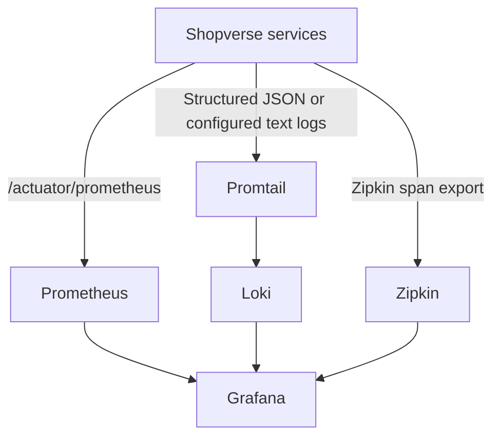

# Observability Architecture

Shopverse uses three complementary signals:

| Signal | Producer | Storage | User interface |
|---|---|---|---|
| Metrics | Micrometer/Actuator | Prometheus | Grafana |
| Logs | SLF4J + Logback JSON | Loki | Grafana |
| Traces | Spring Boot Zipkin starter and Micrometer Observation | Zipkin | Zipkin and Grafana links |

For a detailed explanation of `MeterRegistry`, counters, timers, tags, metric
export, and Prometheus scraping, see [Micrometer metrics](MICROMETER-METRICS.md).

## Internal Flow

Micrometer is the instrumentation facade. The Prometheus registry exposes metrics, while the Spring Boot Zipkin starter integrates observations and span export with Zipkin. The current Gradle files do not declare an explicit OpenTelemetry SDK/bridge dependency, so Shopverse should not be described as an OpenTelemetry deployment unless that dependency and exporter are added deliberately.

## Implemented Business Metrics

The code records metrics for HTTP outcomes, SAGA transitions, inventory conflicts and expirations, payment outcomes, outbox publication, DLT persistence, and replay. Spring also exposes JVM, process, datasource, Kafka, and HTTP server metrics.

## SLO And Alert Baseline

Prometheus rules include:

- service unavailable for two minutes;
- availability below 99%;
- p95 latency above one second;
- outbox publication failure;
- DLT activity.

These are POC defaults. Real SLOs require expected traffic, maintenance windows, and an alert delivery channel.

## Cardinality Rules

Metric labels must stay bounded. Good labels are service, outcome, stage, and status. Never use order number, trace ID, correlation ID, username, or raw URL as Prometheus labels. Those identifiers belong in logs and traces.

## Main Interfaces

| Tool | URL |
|---|---|
| Grafana | `http://localhost:3000` |
| Prometheus | `http://localhost:9090` |
| Loki readiness | `http://localhost:3100/ready` |
| Zipkin | `http://localhost:9411` |

Operational commands and deployment details remain in [observability/README.md](../../observability/README.md).
