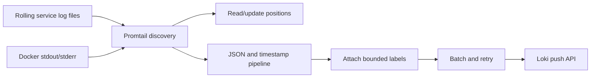

# Promtail

Promtail is the log collection agent in the Shopverse POC. It discovers log
sources, tails files and Docker streams, remembers read positions, parses JSON,
adds labels, and pushes batches to Loki.

Promtail reached upstream end of life on March 2, 2026. Grafana states that no
future support or updates will be provided and recommends migration to Grafana
Alloy or another supported client. Promtail remains the implemented agent in
this POC, but it should not be selected for a new production platform.

## Internal Flow



## Configuration

The client pushes to:

```yaml
clients:
  - url: http://loki:3100/loki/api/v1/push
```

Promtail stores offsets in:

```yaml
positions:
  filename: /tmp/positions.yml
```

The positions file prevents rereading every file from the beginning after a
normal restart. If it is lost, duplicated ingestion can occur depending on
source and startup behavior.

## Shopverse Collection Jobs

| Job | Source | Purpose |
|---|---|---|
| `shopverse-service-volume-files` | mounted service logs | application file logs |
| `local-service-log-files` | workspace logs | non-container development |
| `shopverse-health-log-files` | `*-health.log` | isolate probe noise |
| `docker-containers` | Docker socket | stdout, startup, infrastructure logs |

Application jobs exclude health files:

```yaml
__path__: /service-logs/*/*.log
__path_exclude__: /service-logs/*/*-health.log
```

## JSON Pipeline

```yaml
pipeline_stages:
  - json:
      expressions:
        timestamp: '"@timestamp"'
        level: level
        application: application
        traceId: traceId
        spanId: spanId
        correlationId: correlationId
        message: message
  - labels:
      level:
      application:
  - timestamp:
      source: timestamp
      format: RFC3339Nano
```

The JSON stage extracts fields from the structured Logback line. The labels
stage promotes only bounded fields. The timestamp stage uses the application's
event time instead of collection time.

Extracting a field does not automatically make it a Loki label.

## Docker Discovery

Promtail reads the Docker socket and maps metadata:

```yaml
relabel_configs:
  - source_labels: [__meta_docker_container_name]
    regex: /(.+)
    target_label: container
  - source_labels:
      [__meta_docker_container_label_com_docker_compose_service]
    target_label: compose_service
```

Docker socket access is powerful. In production, minimize agent privileges and
avoid exposing the socket beyond the collector.

## Why Read Files And Stdout?

The POC demonstrates both:

- stdout supports container-native inspection;
- files demonstrate rolling retention and health-log separation.

The trade-off is duplicate log ingestion. Production should choose a canonical
path unless redundancy is an explicit requirement with deduplication.

## Troubleshooting Missing Logs

1. Confirm the source contains the line:

```powershell
docker compose logs --tail=100 order-service
```

2. Inspect Promtail:

```powershell
docker compose logs --tail=200 promtail
```

3. Verify mounted paths match `__path__`.
4. Check file permissions.
5. Check positions and file rotation behavior.
6. Confirm the line is valid JSON.
7. Check timestamp parse errors.
8. Query Loki broadly by `job`.
9. Confirm Loki readiness and network resolution.

## Rotation And Positions

Logback renames/compresses old files and starts a new active file. Collectors
must track file identity and rotation without losing the unread tail or
rereading archives.

Do not configure Promtail to ingest compressed archives unless explicitly
supported and required. The active `.log` file is the intended source.

## Label Practices

Good labels:

```text
application, level, environment, job, container
```

Bad labels:

```text
correlationId, traceId, username, orderNumber, full path
```

High-cardinality labels create many Loki streams. Keep unique identifiers in
JSON fields and filter after `| json`.

## Sensitive Data

Promtail is not the ideal place to rely on redaction. Prevent sensitive values
from being logged in application code. Pipeline redaction can provide defense
in depth but cannot recover data already written to local files.

## Production Migration

For a production platform:

- evaluate Grafana Alloy or an organization-standard collector;
- preserve labels and parsing behavior during migration;
- persist positions on durable storage;
- secure transport to Loki;
- configure backpressure, retries, and resource limits;
- monitor dropped/rejected lines;
- avoid privileged Docker socket access where possible.

## Related Guides

- [Loki](LOKI.md)
- [Structured logging](STRUCTURED-LOGGING.md)
- [Operational configuration](../../observability/README.md)
- [Official Promtail status and Alloy migration](https://grafana.com/docs/loki/latest/send-data/promtail/)
