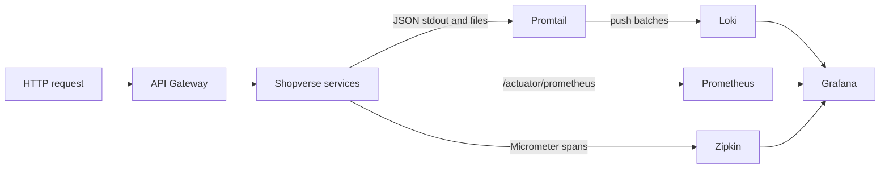

# Shopverse Observability Operations

This page is the operational reference for Shopverse telemetry. For reusable
theory, use the dedicated pages for [logging](LOGGING-GENERIC.md),
[MDC](MDC-GENERIC.md), [Micrometer](MICROMETER-METRICS.md),
[Prometheus](PROMETHEUS.md), [Loki](LOKI.md), [Promtail](PROMTAIL.md), and
[Grafana](GRAFANA.md).

## Runtime Flow



| Signal | Producer | Collection and storage | Primary use |
|---|---|---|---|
| Logs | SLF4J and Logback | Promtail to Loki | event details and troubleshooting |
| Metrics | Micrometer and Actuator | Prometheus | rates, latency, saturation, alerts |
| Traces | Micrometer Tracing | Zipkin | synchronous call path and span latency |
| Correlation | gateway, HTTP filters, Feign, Kafka MDC scopes | JSON log field and event payload | join HTTP and asynchronous business activity |

Prometheus does not store logs, and Loki does not calculate application
metrics. Grafana queries these separate data sources and presents them in one
interface.

## Service Logging

Each service uses SLF4J through Lombok:

```java
@Slf4j
@Service
public class OrderService {
    public void confirm(String orderNumber) {
        log.atInfo()
                .addKeyValue("orderNumber", orderNumber)
                .log("Order confirmed");
    }
}
```

`log.atInfo()` is SLF4J's fluent event builder. `addKeyValue` attaches
structured fields rather than hiding values inside a formatted message. Spring
Boot's `StructuredLogEncoder` serializes the event, MDC values, level, logger,
thread, and timestamp as JSON.

The common Logback design is:

```xml
<appender name="CONSOLE" class="ch.qos.logback.core.ConsoleAppender">
    <encoder class="org.springframework.boot.logging.logback.StructuredLogEncoder">
        <format>${STRUCTURED_FORMAT}</format>
    </encoder>
</appender>

<appender name="APP_FILE"
          class="ch.qos.logback.core.rolling.RollingFileAppender">
    <file>${LOG_FILE}</file>
    <rollingPolicy
        class="ch.qos.logback.core.rolling.SizeAndTimeBasedRollingPolicy">
        <fileNamePattern>${LOG_FILE}.%d{yyyy-MM-dd}.%i.gz</fileNamePattern>
        <maxFileSize>10MB</maxFileSize>
        <maxHistory>7</maxHistory>
        <totalSizeCap>256MB</totalSizeCap>
    </rollingPolicy>
</appender>
```

The active file and stdout receive the same structured events. Rotation limits
local disk use by date, file size, retention days, and total archive size.
Docker named volumes preserve service log files across container recreation.
Loki retention is configured separately in `observability/loki.yml`.

## Correlation And Trace Context

The gateway accepts or generates `X-Correlation-Id`. HTTP filters place it in
MDC, Feign interceptors copy it to downstream requests, and Kafka event
payloads carry it across asynchronous boundaries.

```java
CorrelationContext.run(
        event.correlationId(),
        () -> handleOrderCreated(event)
);
```

`CorrelationContext.run` temporarily places the event correlation ID in the
consumer thread's MDC, executes the listener logic, and removes the value in a
`finally`/try-with-resources scope. Cleanup matters because Kafka and servlet
threads are reused.

Trace IDs and correlation IDs solve different problems:

- `traceId` is generated by tracing instrumentation and primarily follows one
  synchronous trace;
- `correlationId` is a business/request identifier controlled by Shopverse and
  is copied into Kafka events, retries, DLT records, and timeline entries.

## Metrics

Shopverse exposes Micrometer meters through
`runtimeOnly 'io.micrometer:micrometer-registry-prometheus'` and Spring Boot
Actuator.

```java
meterRegistry.counter(
        "shopverse.gateway.requests.logged",
        "method", method,
        "status", String.valueOf(status),
        "outcome", outcome(status)
).increment();
```

A counter is a monotonically increasing total. Prometheus exports this name as
`shopverse_gateway_requests_logged_total`. Use `rate(...)` or `increase(...)`
to calculate activity over time; do not treat the raw total as requests per
second.

Latency should use a timer:

```java
Timer.builder("shopverse.gateway.request.duration")
        .tags("method", method, "outcome", outcome(status))
        .register(meterRegistry)
        .record(duration, TimeUnit.MILLISECONDS);
```

Timers publish count, sum, and configured histogram/percentile data. Keep tags
bounded. Never tag metrics with order number, user ID, correlation ID, trace
ID, or raw URL because those values create unbounded time-series cardinality.

## Start And Access

```powershell
docker compose up -d prometheus loki promtail zipkin grafana
docker compose ps
```

| Component | URL |
|---|---|
| Grafana | `http://localhost:3000` |
| Prometheus | `http://localhost:9090` |
| Zipkin | `http://localhost:9411` |
| Loki readiness | `http://localhost:3100/ready` |

Credentials come from `.env`; do not document or commit a fixed production
password.

## End-To-End Checkout Check

Obtain a customer JWT, then send a complete idempotent request:

```powershell
$token = "<customer-jwt>"
$correlationId = "checkout-observe-101"

curl.exe -X POST http://localhost:8080/api/v1/orders/checkout `
  -H "Authorization: Bearer $token" `
  -H "Content-Type: application/json" `
  -H "Idempotency-Key: checkout-observe-101" `
  -H "X-Correlation-Id: $correlationId" `
  -d '{"items":[{"productId":101,"quantity":1}]}'
```

Use the response order number and correlation ID to inspect business state,
logs, metrics, and traces.

## Loki Queries

Run these in Grafana Explore with the Loki data source:

```logql
# All application logs
{log_type="application"}

# One service
{log_type="application", application="ORDER-SERVICE"}

# One correlation ID in parsed JSON
{log_type="application"} | json | correlationId="checkout-observe-101"

# One trace ID
{log_type="application"} | json | traceId="6a1e660de4db49fe47911954296ecce5"

# Errors excluding noisy health traffic
{log_type="application"} | json | level="ERROR" != "/actuator/health"

# SAGA journey when fields vary by event
{log_type="application"} |= "checkout-observe-101"
```

If a parsed-field query returns nothing, first run the broad text query. It
distinguishes missing ingestion from a JSON parsing/label mismatch.

## Prometheus Queries

```promql
# Prometheus scrape health
up

# One target
up{job="order-service"}

# Request throughput
sum(rate(http_server_requests_seconds_count[5m])) by (application, method)

# 5xx request rate
sum(rate(http_server_requests_seconds_count{status=~"5.."}[5m])) by (application)

# Average latency
sum(rate(http_server_requests_seconds_sum[5m])) by (application)
/
sum(rate(http_server_requests_seconds_count[5m])) by (application)

# P95 latency when histograms are enabled
histogram_quantile(
  0.95,
  sum(rate(http_server_requests_seconds_bucket[5m])) by (le, application)
)

# JVM heap usage ratio
sum(jvm_memory_used_bytes{area="heap"}) by (application)
/
sum(jvm_memory_max_bytes{area="heap"}) by (application)

# Kafka consumer lag, when exported by the client binder
sum(kafka_consumer_fetch_manager_records_lag_max) by (application, topic)
```

Confirm the exact meter names in a service's `/actuator/prometheus` output
before creating a dashboard or alert because library versions and meter
configuration can change names.

## Troubleshooting Order

1. Check `docker compose ps` and the service health endpoint.
2. Check bounded container logs with `docker compose logs --tail=200 SERVICE`.
3. Confirm Promtail and Loki readiness.
4. Query all service logs before adding JSON filters.
5. Check Prometheus **Status > Targets** for scrape errors.
6. Search Zipkin by service and time range; a Kafka boundary may start a new
   trace while preserving the business correlation ID.
7. Inspect order timeline, outbox, and DLT tables when telemetry alone cannot
   prove durable state.

## Configuration Files

| File | Responsibility |
|---|---|
| `observability/prometheus.yml` | scrape targets |
| `observability/prometheus-rules.yml` | recording and alert rules |
| `observability/promtail.yml` | log discovery, JSON parsing, labels |
| `observability/loki.yml` | Loki storage and retention |
| `observability/grafana/provisioning` | data sources and dashboards |
| service `logback-spring.xml` files | console/file JSON encoding and rotation |

## Production Notes

- Use centralized secret management and authenticated/TLS-protected telemetry
  endpoints.
- Keep health checks at a lower log level or route them to a dedicated logger.
- Avoid passwords, tokens, card data, and full request bodies in logs.
- Set retention from compliance, incident-response, and storage requirements.
- Alert on symptoms tied to SLOs, not every transient exception.
- Run Promtail/Loki/Prometheus/Grafana with persistent storage and capacity
  limits appropriate to expected ingestion.
