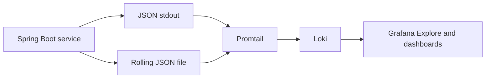

# Structured Logging

## Implemented Flow



Spring Boot's `StructuredLogEncoder` writes Logstash-compatible JSON. Common fields include timestamp, level, logger, message, application, environment, `traceId`, `spanId`, and MDC `correlationId`.

```xml
<encoder class="org.springframework.boot.logging.logback.StructuredLogEncoder">
    <format>${STRUCTURED_FORMAT}</format>
</encoder>
```

## Logback Configuration

User, Order, Inventory, and Payment define:

- `CONSOLE`: JSON to container stdout.
- `APP_FILE`: rolling application JSON file.
- `HEALTH_FILE`: separate health-check JSON file.
- `io.shopverse.health`: non-additive logger routed only to `HEALTH_FILE`.

Application file policy:

```xml
<fileNamePattern>${LOG_FILE}.%d{yyyy-MM-dd}.%i.gz</fileNamePattern>
<maxFileSize>10MB</maxFileSize>
<maxHistory>7</maxHistory>
<totalSizeCap>256MB</totalSizeCap>
```

Health file policy is smaller: 10 MB segments, 3 days, and 64 MB total. Auth, Gateway, Config, and Discovery currently do not route health logs through the dedicated `io.shopverse.health` logger.

## Paths

In Docker, each application writes under `/app/logs`, backed by a named volume. Examples:

```text
/app/logs/order-service.log
/app/logs/order-service-health.log
```

Local runs default to `<service>/logs/<application>.log`.

Promtail reads:

- `/service-logs/*/*.log` from Docker service volumes;
- `/workspace/*/logs/*.log` for local service files;
- Docker stdout through the Docker socket.

Health files are excluded from application jobs and collected with `log_type=health`.

## Why Read Files And Stdout

- stdout is the container-native source and captures startup output;
- files provide explicit rolling retention and survive container recreation through volumes;
- separate health files prevent probe traffic from hiding business logs.

Reading both can produce duplicate records. Queries should select the desired `job` or `log_type`. A production deployment should normally standardize on one collection path.

## Logging Practices

- `INFO`: state transitions, accepted commands, successful external outcomes.
- `WARN`: rejected business actions, retries, compensation, degraded fallback.
- `ERROR`: exhausted retries, failed outbox publication, unrecoverable operation.
- `DEBUG`: diagnostics that are too detailed for normal operation.

Prefer stable key/value fields:

```java
log.atInfo()
        .addKeyValue("orderNumber", orderNumber)
        .addKeyValue("correlationId", correlationId)
        .log("Order created");
```

Never log passwords, Basic headers, JWTs, private keys, payment credentials, or complete personal data.

## Troubleshooting

1. Start with `correlationId` for a business journey.
2. Use `traceId` to inspect one synchronous or messaging trace.
3. Filter by `application`, `level`, and time window.
4. Compare order, inventory, and payment state-transition logs.
5. Check outbox and DLT records when the timeline stops.

Logs explain events; Prometheus metrics quantify them; Zipkin explains latency and call structure.
