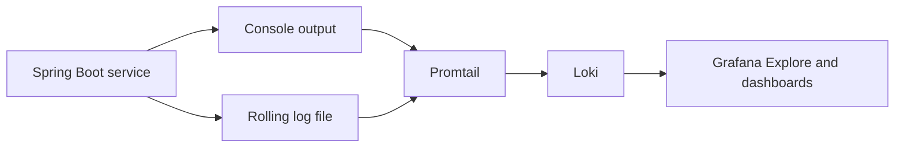

# Structured Logging

For generic SLF4J, Logback, `log.atInfo()`, appenders, encoders, JSON,
Logstash format, rotation, retention, and centralized logging concepts, see
[Application logging](LOGGING-GENERIC.md). This guide describes the current
Shopverse implementation.

## Implemented Flow



Order, Inventory, Payment, Auth, and API Gateway use Spring Boot's
`StructuredLogEncoder` to write Logstash-compatible JSON. Common fields can
include timestamp, level, logger, message, application, environment,
`traceId`, `spanId`, MDC fields, and fluent key/value fields.

```xml
<encoder class="org.springframework.boot.logging.logback.StructuredLogEncoder">
    <format>${STRUCTURED_FORMAT}</format>
</encoder>
```

## Logback Configuration

Order, Inventory, and Payment define:

- `CONSOLE`: JSON to container stdout.
- `APP_FILE`: rolling application JSON file.
- `HEALTH_FILE`: separate health-check JSON file.
- `io.shopverse.health`: non-additive logger routed only to `HEALTH_FILE`.

Application file policy:

```xml
<fileNamePattern>${LOG_FILE}.%d{yyyy-MM-dd}.%i.gz</fileNamePattern>
<maxFileSize>10MB</maxFileSize>
<maxHistory>7</maxHistory>
<totalSizeCap>256MB</totalSizeCap>
```

Health file policy is smaller: 5 MB segments, 3 days, and 64 MB total.

User Service has console, application-file, and health-file destinations, but
currently uses `SHOPVERSE_LOG_PATTERN` text encoding instead of
`StructuredLogEncoder`. Auth and Gateway use structured JSON without the
dedicated health logger. Config and Discovery also do not route health logs
through `io.shopverse.health`.

## Paths

In Docker, each application writes under `/app/logs`, backed by a named volume. Examples:

```text
/app/logs/order-service.log
/app/logs/order-service-health.log
```

Local runs default to `<service>/logs/<application>.log`.

Promtail reads:

- `/service-logs/*/*.log` from Docker service volumes;
- `/workspace/*/logs/*.log` for local service files;
- infrastructure Docker stdout through the Docker socket.

Health files are excluded from application jobs and collected with `log_type=health`.

## Why Read Files And Stdout

- infrastructure stdout captures startup and platform output;
- files provide explicit rolling retention and survive container recreation through volumes;
- separate health files prevent probe traffic from hiding business logs.

Application services are excluded from Docker discovery, so their rolling JSON
files are the canonical Loki source and normal application events are not
duplicated.

## Logging Practices

- `INFO`: state transitions, accepted commands, successful external outcomes.
- `WARN`: rejected business actions, retries, compensation, degraded fallback.
- `ERROR`: exhausted retries, failed outbox publication, unrecoverable operation.
- `DEBUG`: diagnostics that are too detailed for normal operation.

Prefer stable key/value fields:

```java
log.atInfo()
        .addKeyValue("orderNumber", orderNumber)
        .addKeyValue("correlationId", correlationId)
        .log("Order created");
```

`log.atInfo()` starts SLF4J's fluent INFO-level event builder,
`addKeyValue(...)` adds structured event fields, and `.log(...)` emits the
event. See
[Traditional and fluent SLF4J logging](LOGGING-GENERIC.md#traditional-and-fluent-slf4j-logging).

Never log passwords, Basic headers, JWTs, private keys, payment credentials, or complete personal data.

## Troubleshooting

1. Start with `correlationId` for a business journey.
2. Use `traceId` to inspect one synchronous or messaging trace.
3. Filter by `application`, `level`, and time window.
4. Compare order, inventory, and payment state-transition logs.
5. Check outbox and DLT records when the timeline stops.

Logs explain events; Prometheus metrics quantify them; Zipkin explains latency and call structure.
