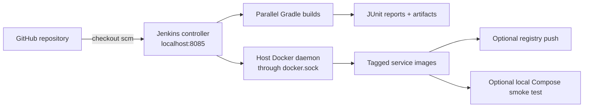
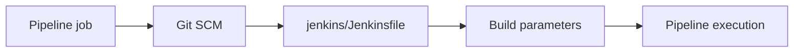
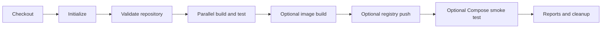

# Shopverse Jenkins Implementation

This page explains the actual Shopverse Jenkins deployment and pipeline. For
reusable Jenkins concepts, see [Jenkins](JENKINS.md).

## Architecture



The local POC executes builds on the Jenkins controller container. A production
installation should use isolated agents rather than running builds on the
controller.

## Files

| File | Purpose |
|---|---|
| `jenkins/Dockerfile` | builds Jenkins LTS with JDK 21, Docker CLI, Buildx, Compose, Git, and plugins |
| `jenkins/docker-compose.yml` | runs Jenkins on port `8085` and mounts the workspace/Docker socket |
| `jenkins/Jenkinsfile` | shared multi-service pipeline |
| `jenkins/plugins.txt` | plugins installed during image build |
| `jenkins/init.groovy.d/01-basic-security.groovy` | creates the local environment-driven admin account |
| service `Jenkinsfile` files | focused Order, User, and Discovery demonstrations |

## Jenkins Container Dockerfile

```dockerfile title="jenkins/Dockerfile"
FROM jenkins/jenkins:lts-jdk21

COPY plugins.txt /usr/share/ref/plugins.txt
RUN jenkins-plugin-cli --plugin-file /usr/share/ref/plugins.txt

USER root

RUN apt-get update \
    && apt-get install -y --no-install-recommends \
        ca-certificates curl docker-buildx docker-cli docker.io git \
    && (apt-get install -y --no-install-recommends docker-compose-plugin \
        || apt-get install -y --no-install-recommends docker-compose) \
    && mkdir -p /usr/local/lib/docker/cli-plugins \
    && if command -v docker-compose >/dev/null 2>&1; then \
         ln -sf "$(command -v docker-compose)" \
           /usr/local/lib/docker/cli-plugins/docker-compose; \
       fi \
    && rm -rf /var/lib/apt/lists/*

COPY init.groovy.d/ /usr/share/ref/init.groovy.d/

USER jenkins
```

The image temporarily switches to root only to install operating-system
packages, then returns to the standard `jenkins` user for runtime.

## Start Jenkins

```powershell
docker compose -f jenkins/docker-compose.yml build
docker compose -f jenkins/docker-compose.yml up -d
docker compose -f jenkins/docker-compose.yml logs -f jenkins
```

Open `http://localhost:8085`.

Credentials come from root `.env`:

```text
JENKINS_ADMIN_USER
JENKINS_ADMIN_PASSWORD
```

Do not assume `admin/admin` when `.env` supplies a different password.

## Create The Pipeline Job

1. Select **New Item**.
2. Choose **Pipeline**.
3. Select **Pipeline script from SCM**.
4. Select Git and enter the Shopverse repository URL.
5. Set the branch, for example `*/main`.
6. Use script path `jenkins/Jenkinsfile`.
7. Save and select **Build with Parameters**.



## Shared Jenkinsfile Structure

```groovy title="jenkins/Jenkinsfile"
pipeline {
    agent any

    options {
        disableConcurrentBuilds()
        buildDiscarder(logRotator(numToKeepStr: '10'))
    }

    parameters {
        booleanParam(
            name: 'BUILD_DOCKER_IMAGES',
            defaultValue: true,
            description: 'Build Docker images after Gradle build/test.'
        )
        booleanParam(
            name: 'RUN_COMPOSE_SMOKE_TEST',
            defaultValue: false,
            description: 'Run the local Compose smoke test.'
        )
    }

    environment {
        JAVA_VERSION = '21'
        COMPOSE_PROJECT_NAME = 'shopverse'
        DOCKER_BUILDKIT = '1'
        COMPOSE_DOCKER_CLI_BUILD = '1'
    }

    stages {
        stage('Checkout Latest Code') {
            steps {
                checkout scm
            }
        }

        stage('Build And Test Services') {
            steps {
                script {
                    parallel branches
                }
            }
        }

        stage('Build Docker Images') {
            when {
                expression { params.BUILD_DOCKER_IMAGES }
            }
            steps {
                script {
                    services.each { service ->
                        sh "docker build -t ${imageName(service)} ./${service}"
                    }
                }
            }
        }
    }
}
```

## Pipeline Blocks

| Block | Shopverse behavior |
|---|---|
| `pipeline` | top-level Declarative Pipeline |
| `agent any` | runs on any available executor; locally this is the controller |
| `options` | prevents conflicting runs and limits retained build history |
| `parameters` | enables image build, push, smoke test, registry, namespace, and tag choices |
| `environment` | enables BuildKit and assigns a stable Compose project name |
| `stages` | organizes visible delivery phases |
| `steps` | executes checkout, Gradle, Docker, and reporting actions |
| `script` | permits controlled Groovy loops/maps not expressible declaratively |
| `when` | skips optional image, push, or smoke stages |
| `post` | publishes results and performs diagnostics/cleanup |

## Why These Options Exist

```groovy
options {
    disableConcurrentBuilds()
    buildDiscarder(logRotator(numToKeepStr: '10'))
}
```

`disableConcurrentBuilds()` protects fixed local ports, Compose names, and
mutable local image tags from overlapping executions.

`buildDiscarder(...)` prevents the Jenkins home volume from retaining unlimited
local build history.

For scalable shared infrastructure, prefer isolated agents, workspaces,
Compose project names, and immutable tags rather than globally serializing all
unrelated work.

## Parameters And `when`

```groovy
parameters {
    booleanParam(name: 'BUILD_DOCKER_IMAGES', defaultValue: true)
    booleanParam(name: 'RUN_COMPOSE_SMOKE_TEST', defaultValue: false)
    booleanParam(name: 'PUSH_DOCKER_IMAGES', defaultValue: false)
    string(name: 'IMAGE_REGISTRY', defaultValue: '')
    string(name: 'IMAGE_NAMESPACE', defaultValue: 'shopverse')
    string(name: 'IMAGE_TAG', defaultValue: '')
}
```

```groovy
stage('Docker Compose Smoke Test') {
    when {
        expression { params.RUN_COMPOSE_SMOKE_TEST }
    }
    steps {
        sh 'docker compose up -d --build'
    }
}
```

The stage appears in the pipeline graph but executes only when the expression
is true.

## Checkout

```groovy
checkout scm
```

This checks out the exact revision provided by the Jenkins job SCM
configuration. The shared pipeline contains a local-workspace fallback for the
POC, but reproducible CI should prefer SCM checkout over `git pull`.

## Parallel Service Builds

```groovy
script {
    def branches = [:]

    services.each { service ->
        branches[service] = {
            gradleBuild(service)
        }
    }

    parallel branches
}
```

Each service builds in its own directory. Dockerfiles also use unique Gradle
BuildKit cache IDs to avoid cross-service lock contention.

## Test Reporting

```groovy
post {
    always {
        junit allowEmptyResults: true,
                testResults: '**/build/test-results/test/*.xml'

        archiveArtifacts allowEmptyArchive: true,
                artifacts: '**/build/reports/tests/test/**'
    }
}
```

`junit` converts Gradle XML into Jenkins test history. `archiveArtifacts`
retains HTML reports for that build. `always` runs even after a failed test
stage.

## Image Naming

When no explicit tag is provided:

```text
<build-number>-<short-git-sha>
```

Example:

```text
shopverse/order-service:42-a1b2c3d4
```

This is traceable and immutable compared with relying only on `latest`.

## Registry Push

The pipeline uses Jenkins credentials only inside the login scope:

```groovy
withCredentials([usernamePassword(
    credentialsId: params.DOCKER_CREDENTIALS_ID,
    usernameVariable: 'DOCKER_USERNAME',
    passwordVariable: 'DOCKER_PASSWORD'
)]) {
    sh '''
      echo "$DOCKER_PASSWORD" |
        docker login "$IMAGE_REGISTRY" \
          -u "$DOCKER_USERNAME" --password-stdin
    '''
}
```

Credentials must not be printed, committed, or encoded into image layers.

## Local Deployment

The User and Discovery service pipelines demonstrate local deployment:

```groovy
sh 'docker tag "${USER_SERVICE_IMAGE}" shopverse/user-service:local'
sh 'docker compose up -d user-service'
```

They then poll Docker health with a bounded attempt count. On failure they
print container status and a bounded log tail.

## Docker Socket Risk

The local Jenkins container mounts `/var/run/docker.sock`. This gives Jenkins
effective control over the host Docker daemon and should be treated as
privileged access.

Production alternatives include:

- ephemeral isolated agents;
- rootless builders;
- remote BuildKit;
- Kubernetes agents;
- Kaniko/buildah-style builders according to platform policy.

## Pipeline Stages



| Stage | Result |
|---|---|
| Checkout | exact source revision |
| Initialize | resolved image tag |
| Validate | required configuration exists |
| Build and Test | service JARs and JUnit results |
| Build Images | tagged local images |
| Push Images | registry artifacts |
| Compose Smoke | bounded local health verification |

## Related Guides

- [Generic Jenkins guide](JENKINS.md)
- [Shopverse Docker implementation](SHOPVERSE-DOCKER.md)
- [GitHub Actions](GITHUB-ACTIONS.md)
- [CI/CD automation](CI-CD-AUTOMATION.md)
- [Shopverse testing](../development/TESTING.md)

