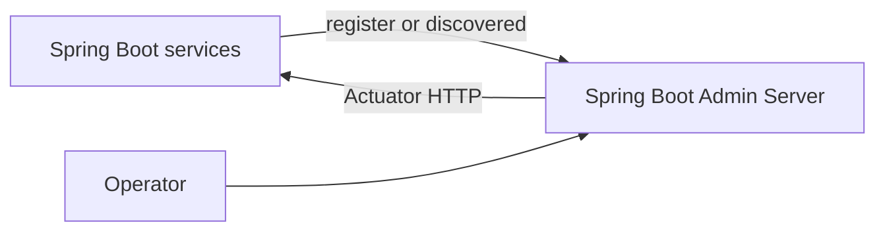

# Spring Boot Admin

> Status: Planned study material. Spring Boot Admin is not currently part of
> the Shopverse runtime stack.

Spring Boot Admin is a community project that provides a UI over Spring Boot
Actuator endpoints. It can display application health, environment,
configuration properties, loggers, JVM information, threads, and selected
metrics.

## Typical Architecture



## Dependencies

The server commonly uses:

```gradle
implementation "de.codecentric:spring-boot-admin-starter-server:<compatible-version>"
```

Clients can register directly:

```gradle
implementation "de.codecentric:spring-boot-admin-starter-client:<compatible-version>"
```

When Eureka is available, the Admin Server can discover registered services
instead of requiring a client dependency in every service.

## Security Requirements

Actuator endpoints may expose sensitive operational information. Production
use must:

- authenticate operators;
- authorize administrative actions;
- use TLS;
- restrict network access;
- avoid exposing secrets through environment/config endpoints;
- protect service Actuator endpoints from public access;
- audit logger-level changes and administrative actions.

## Relationship To Existing Tools

| Tool | Primary role |
|---|---|
| Spring Boot Admin | inspect and administer individual Spring Boot instances |
| Eureka | service registry |
| Prometheus | metric collection and alert-rule evaluation |
| Grafana | dashboards and cross-signal investigation |
| Loki | centralized log storage |
| Zipkin | distributed trace analysis |

Spring Boot Admin does not replace Prometheus, Grafana, Loki, or Zipkin.

## Shopverse Adoption Plan

1. Create a separate Admin Server service.
2. Discover services through Eureka.
3. Expose only required Actuator endpoints.
4. Add operator authentication and network restrictions.
5. Keep Prometheus/Grafana as the primary fleet-wide monitoring system.
6. Add the service to Docker Compose only after its security model is tested.

