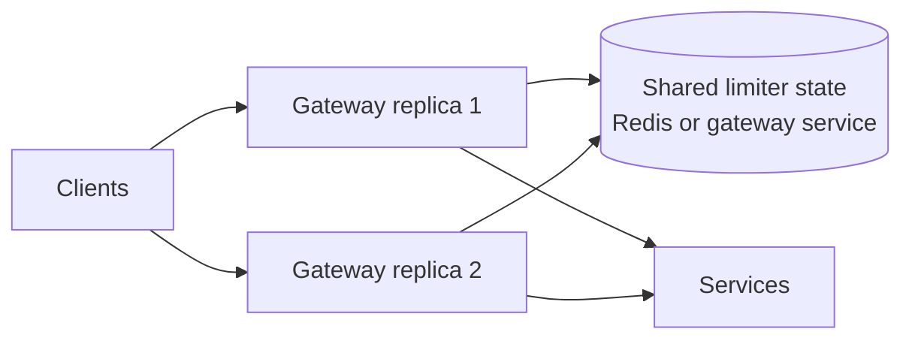

# Distributed Rate Limiting

A local rate limiter protects one process. A distributed rate limiter enforces
a shared policy across replicas, gateways, regions, users, tenants, or API
keys.



## Why Local Limits Are Not Global

If four replicas each allow 100 requests/second:

```text
effective aggregate limit can approach 4 x 100 = 400 requests/second
```

Use local limits for per-instance protection. Use shared state or deterministic
traffic ownership for global customer quotas.

## Algorithms

### Fixed Window

Count requests in a fixed interval:

```text
limit: 100 requests from 12:00:00 through 12:00:59
```

It is simple but permits a boundary burst: 100 requests at the end of one
window and 100 at the start of the next.

### Sliding Log

Store every request timestamp and remove expired entries. It is accurate but
uses more storage and work.

### Sliding Window Counter

Approximate a sliding window using weighted current and previous windows. It
offers better smoothness than fixed windows with lower cost than a full log.

### Token Bucket

Tokens refill at rate `r` up to capacity `b`. One request consumes one or more
tokens:

```text
sustained rate = r tokens/second
maximum immediate burst = b tokens
```

This is a common API choice because it supports controlled bursts.

### Leaky Bucket

Requests enter a bounded queue and leave at a controlled rate. It smooths
traffic but adds queueing delay and must reject when the bucket is full.

### Concurrency Limiter

Limits active work rather than requests per time window. It is valuable when
latency changes and each request occupies a scarce resource.

## Capacity Calculation

Start from the tightest downstream constraint:

```text
safe throughput = min(
  application capacity,
  database capacity,
  dependency quota,
  broker capacity
) x safety factor
```

Example:

```text
application tested capacity: 1,200 RPS
database safe capacity:        900 RPS
payment-provider quota:        500 RPS
safety factor:                    0.8

safe admitted rate = 500 x 0.8 = 400 RPS
```

For active requests, Little's Law gives:

```text
concurrency = throughput x average latency
```

At 400 RPS and 300 ms:

```text
400 x 0.3 = 120 active requests
```

Use percentile latency and load tests for final sizing. Average latency alone
can hide tail saturation.

## Burst Capacity

Choose burst capacity from tolerated queueing and available headroom:

```text
burst tokens = sustained rate x tolerated burst duration
```

For 400 RPS and a 500 ms burst:

```text
400 x 0.5 = 200 tokens
```

A token bucket might therefore use a 400 token/second refill and 200-token
burst capacity, subject to measured downstream behavior.

## Upstream And Downstream Limits

### Upstream

Apply at the edge:

- tenant/user/API-key quotas;
- abuse and bot protection;
- request-size limits;
- expensive endpoint limits;
- contractual customer plans.

### Downstream

Apply near the protected resource:

- payment-provider quotas;
- database concurrency;
- email/SMS provider quotas;
- Kafka producer or consumer capacity;
- per-dependency bulkheads.

Use both. An edge limit cannot fully protect a dependency from internal retry,
scheduled jobs, or other services.

## Redis Implementation Model

Use an atomic Lua script or a proven gateway implementation:

```text
key: rate-limit:{tenantId}:{route}
state: tokens and last refill timestamp
operation: refill, test, consume, return remaining
```

The read-modify-write must be atomic. Separate `GET` and `SET` calls allow
concurrent requests to exceed the limit.

Consider:

- Redis cluster key placement;
- TTL cleanup;
- clock source;
- network latency;
- limiter behavior when Redis fails;
- hot tenants and hot keys.

## Failure Policy

| Endpoint | Redis/limiter unavailable |
|---|---|
| Public login or costly write | normally fail closed or use a strict local fallback |
| Low-risk read | may fail open with local protection |
| Internal critical workflow | use explicit dependency-specific policy |

The choice is a business and security decision. Record fallback mode in logs
and metrics.

## HTTP Response

Return:

```http
HTTP/1.1 429 Too Many Requests
Retry-After: 2
```

Use `Retry-After` only when the server can provide meaningful guidance. Include
a stable error code and correlation ID.

## Metrics

Measure:

- allowed and rejected requests;
- remaining capacity;
- active requests;
- limiter decision latency;
- Redis failures;
- top limited identities/routes;
- downstream saturation;
- retry traffic after rejection.

## Shopverse Status

Shopverse currently uses Resilience4j in-process rate limiters for local service
protection. A shared distributed customer quota is **planned**. A suitable
future design is gateway-level Redis token bucket plus local service bulkheads
and dependency-specific limits.

## Related Guides

- [Spring Resilience4j](../spring/SPRING-RESILIENCE4J.md)
- [API Gateway](../development/API-GATEWAY-GENERIC.md)
- [Caching](../architecture/CACHING-GENERIC.md)
- [Prometheus](../observability/PROMETHEUS.md)

