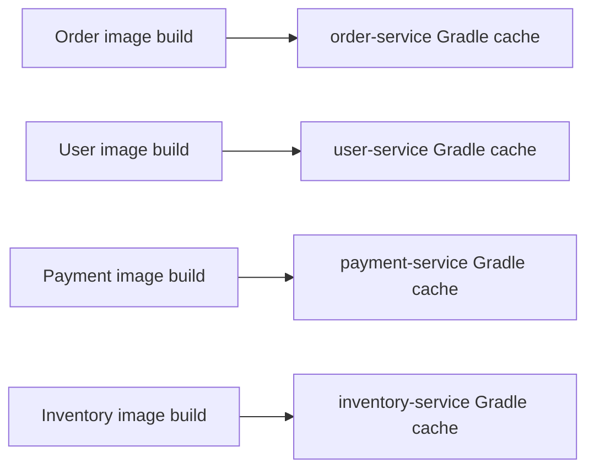
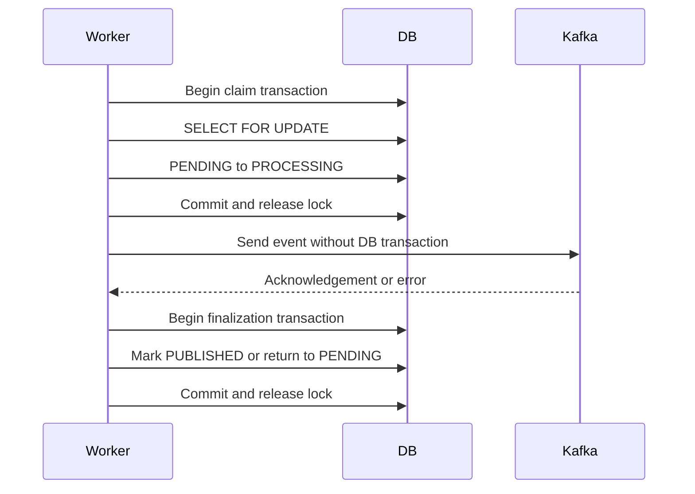
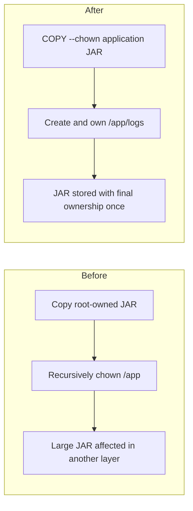
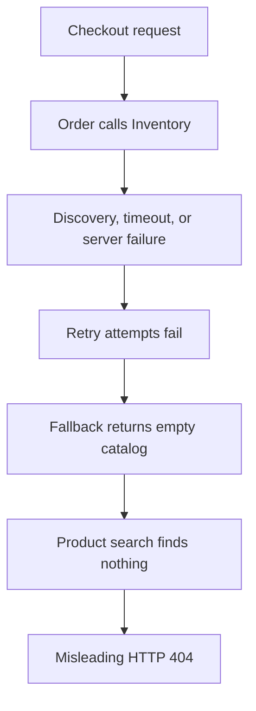
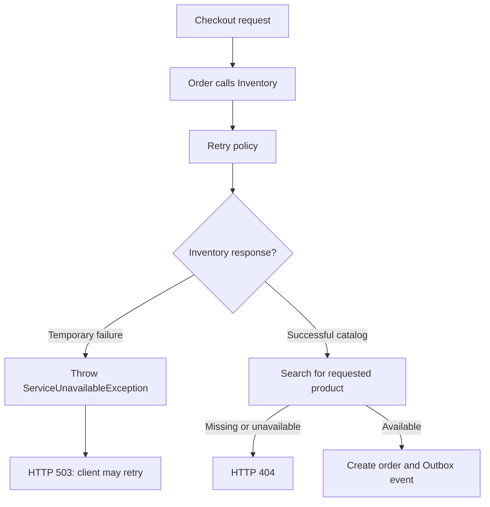

# Shopverse Problems And Solutions

This document records build and runtime problems found during Shopverse
verification, their impact, and the fixes applied to the project.

## Problem Index

| Area | Problem statement | Impact | Implemented fix | Details |
|---|---|---|---|---|
| Docker build reliability | Parallel service builds shared Gradle cache metadata | Intermittent Gradle lock failures | Assign a unique BuildKit cache ID to every service | [Gradle cache locks](#1-parallel-docker-builds-and-gradle-cache-locks) |
| Outbox runtime reliability | A database row lock could remain held while waiting for Kafka | Blocked workers, exhausted connections, and lock timeouts | Split publication into short claim and finalization transactions around an unlocked Kafka send | [Short Outbox transactions](#2-outbox-database-locks-while-waiting-for-kafka) |
| Docker image efficiency | A JAR copied as `root` was recursively changed to another owner in a later layer | The large JAR could be represented again in a copy-on-write layer | Set final ownership during `COPY` with `--chown` | [Duplicate JAR ownership layers](#3-duplicated-jar-ownership-layers) |
| Order dependency handling | An Inventory outage was converted into an empty catalog and reported as product not found | Misleading and potentially cached `404` responses | Throw a service-unavailable exception and return retryable `503` | [Inventory failure semantics](#4-inventory-failures-reported-as-product-not-found) |

The common principle is to avoid unnecessary shared mutable state, keep lock
scope narrow, and write files with their final metadata as early as possible.

## 1. Parallel Docker Builds And Gradle Cache Locks

### Problem

Docker Compose can build multiple service images concurrently:

```powershell
docker compose build --parallel
```

Previously, every Dockerfile mounted a cache at the same Gradle location
without a service-specific cache identity:

```dockerfile
RUN --mount=type=cache,target=/root/.gradle \
    ./gradlew bootJar --no-daemon --max-workers=2
```

During a parallel build, independent Gradle processes could operate on the
same BuildKit cache:

```text
Order build -----\
User build -------+--> shared /root/.gradle cache
Payment build ----+--> caches/journal-1/journal-1.lock
Inventory build --/
```

Gradle protects cache metadata with files such as
`journal-1/journal-1.lock`. Concurrent processes competing for that metadata
caused lock contention and intermittent image-build failures.

### Fix

Each service now assigns a stable, unique BuildKit cache ID while continuing
to mount it at Gradle's expected path inside the build container.

Order Service:

```dockerfile
RUN --mount=type=cache,id=shopverse-order-service-gradle,target=/root/.gradle \
    ./gradlew bootJar --no-daemon --max-workers=2
```

User Service:

```dockerfile
RUN --mount=type=cache,id=shopverse-user-service-gradle,target=/root/.gradle \
    ./gradlew bootJar --no-daemon --max-workers=2
```

The same pattern is applied to all eight Spring services:

```text
config-server     -> shopverse-config-server-gradle
discovery-server  -> shopverse-discovery-server-gradle
user-service      -> shopverse-user-service-gradle
auth-service      -> shopverse-auth-service-gradle
order-service     -> shopverse-order-service-gradle
payment-service   -> shopverse-payment-service-gradle
inventory-service -> shopverse-inventory-service-gradle
api-gateway       -> shopverse-api-gateway-gradle
```

### How The Mount Works

```dockerfile
--mount=type=cache,id=shopverse-order-service-gradle,target=/root/.gradle
```

| Option | Purpose |
|---|---|
| `type=cache` | Creates a persistent BuildKit cache reused across builds |
| `id=...` | Gives the cache a service-specific identity |
| `target=/root/.gradle` | Mounts it where Gradle expects dependencies and metadata |

The path inside each temporary build container remains `/root/.gradle`, but
the underlying BuildKit storage is isolated by cache ID.



`--no-daemon` avoids leaving a Gradle daemon in a temporary build container.
`--max-workers=2` limits the CPU and memory consumed by each concurrent build.

### Result

- services can build concurrently without cross-service Gradle cache locks;
- each service still reuses downloaded dependencies on later builds;
- repeated builds remain faster than builds with no cache mount.

## 2. Outbox Database Locks While Waiting For Kafka

### Problem

An Outbox publisher needs to prevent two workers from publishing the same row.
A direct implementation can put the database lock and Kafka call inside one
transaction:

```java
@Transactional
public void publish(Long eventId) throws Exception {
    OutboxEvent event = repository.findByIdForUpdate(eventId).orElseThrow();

    kafkaTemplate.send(
            event.getTopic(),
            event.getMessageKey(),
            event.getPayload()
    ).get(10, TimeUnit.SECONDS);

    event.markPublished();
}
```

`findByIdForUpdate(...)` uses a pessimistic write lock. Because the transaction
does not commit until the method ends, the row lock and database connection
remain occupied while Kafka performs network I/O.

```text
Begin DB transaction
  -> lock Outbox row
  -> wait for Kafka acknowledgement
  -> update row
  -> commit and release lock
```

If Kafka is slow or unavailable, this can cause:

- long-held row locks;
- database connection-pool exhaustion;
- blocked Outbox workers;
- higher deadlock and lock-timeout risk;
- database throughput becoming dependent on Kafka latency.

Increasing the database lock timeout would only hide the design problem. The
network wait should not be part of the database transaction.

### Fix: Claim, Publish, Finalize

Shopverse separates publication into three phases:

```text
1. Short transaction: claim the row
2. No DB transaction: publish to Kafka
3. Short transaction: save success or failure
```

The implementation is used by Order, Inventory, and Payment services.

### Phase 1: Claim In A Short Transaction

```java
public OutboxMessage claim(Long eventId) {
    return transactionTemplate.execute(status -> {
        OutboxEvent event = repository.findByIdForUpdate(eventId).orElse(null);
        if (event == null || event.getStatus() != OutboxStatus.PENDING) {
            return null;
        }

        event.claim();
        return OutboxMessage.from(event);
    });
}
```

The row is locked only while its state changes from `PENDING` to `PROCESSING`.
Returning from `TransactionTemplate.execute(...)` commits the transaction and
releases the lock.

`OutboxMessage` is an immutable snapshot containing the data required for
Kafka publication. Kafka does not need the managed JPA entity or an open
transaction.

### Phase 2: Publish Outside The Database Transaction

```java
private void publishRecord(OutboxMessage message) {
    try {
        var result = kafkaTemplate
                .send(message.topic(), message.messageKey(), message.payload())
                .get(sendTimeoutSeconds, TimeUnit.SECONDS);

        markPublished(message.id());
    } catch (Exception exception) {
        markFailed(message.id(), exception);
    }
}
```

The potentially slow Kafka acknowledgement wait happens after the claim
transaction has committed. No Outbox row lock or database connection is held
during this network call.

### Phase 3: Finalize In Another Short Transaction

Success:

```java
public void markPublished(Long eventId) {
    transactionTemplate.executeWithoutResult(status ->
            repository.findByIdForUpdate(eventId)
                    .filter(event -> event.getStatus() == OutboxStatus.PROCESSING)
                    .ifPresent(OutboxEvent::markPublished)
    );
}
```

Failure:

```java
public void markFailed(Long eventId, Exception exception) {
    transactionTemplate.executeWithoutResult(status ->
            repository.findByIdForUpdate(eventId)
                    .filter(event -> event.getStatus() == OutboxStatus.PROCESSING)
                    .ifPresent(event -> event.markFailed(exception))
    );
}
```

The success transaction changes `PROCESSING` to `PUBLISHED`. The failure
transaction records the error and returns the event to `PENDING` for a later
retry.



### Crash Recovery

Claiming introduces one additional failure scenario: a process can terminate
after setting `PROCESSING` but before finalization.

Shopverse stores `claimedAt` and periodically releases stale claims:

```java
worker.releaseStaleClaims(
        Instant.now().minusMillis(claimTimeoutMs)
);
```

Rows that remain `PROCESSING` beyond the configured claim timeout return to
`PENDING` and can be retried.

The claim timeout must be longer than the Kafka send timeout. Otherwise, a
healthy but slow publication could be reclaimed while it is still running.

### Delivery Semantics

This design provides at-least-once publication. A process can crash after
Kafka acknowledges the event but before `PUBLISHED` commits. The stale claim
will later be retried, potentially producing a duplicate event.

Therefore Kafka consumers must remain idempotent, using an event ID or inbox
record to reject already-processed events.

## 3. Duplicated JAR Ownership Layers

### Problem

The runtime image previously copied the application JAR as `root` and changed
the ownership of the complete application directory in a later instruction:

```dockerfile
COPY --from=build /workspace/build/libs/*.jar app.jar

RUN mkdir -p /app/logs \
    && chown -R shopverse:shopverse /app
```

Docker image layers are immutable. The `COPY` instruction created a layer
containing a root-owned JAR. The recursive `chown` then changed metadata for
that large file in a later copy-on-write layer.

```text
COPY layer   -> app.jar owned by root
chown layer  -> app.jar represented again as owned by shopverse
```

Although the application behaved correctly, the ownership-only change could
increase the final image size and the number of bytes exported, transferred,
and stored.

### Fix

Shopverse now assigns the final owner while copying the JAR:

```dockerfile
COPY --chown=shopverse:shopverse \
    --from=build /workspace/build/libs/*.jar app.jar

RUN mkdir -p /app/logs \
    && chown shopverse:shopverse /app/logs
```

`COPY --chown` creates the JAR with the required user and group in its original
layer. The following `RUN` instruction changes ownership only for the small
logs directory.

```text
COPY layer       -> app.jar owned by shopverse
directory layer  -> create and own /app/logs only
```



### Why Recursive `chown` Was Removed

This command is unnecessarily broad:

```dockerfile
chown -R shopverse:shopverse /app
```

It traverses the JAR and every future file under `/app`. The application JAR
already has the correct owner after `COPY --chown`, so only the writable
directory requires an ownership change:

```dockerfile
chown shopverse:shopverse /app/logs
```

### Non-Root Runtime Is Preserved

The optimization does not weaken container security:

```dockerfile
USER shopverse
```

The JAR and log directory remain accessible to the non-root runtime user. The
change only avoids rewriting ownership metadata in a later image layer.

### Verification

Docker history for the optimized Order Service image shows:

```text
125MB   COPY --chown=shopverse:shopverse ... app.jar
12.3kB  RUN mkdir -p /app/logs && chown shopverse:shopverse /app/logs
```

The large JAR is present in its copy layer, while the following ownership
layer is only a few kilobytes. The same Dockerfile pattern is used across all
Shopverse services.

### Result

- application JARs are stored with final ownership immediately;
- recursive changes over `/app` are avoided;
- runtime images are smaller;
- image export, transfer, and storage require fewer bytes;
- services continue running as the non-root `shopverse` user.

## 4. Inventory Failures Reported As Product Not Found

### Problem Statement

Order Service obtains current product information from Inventory Service before
creating an order:

```java
List<CatalogItemResponse> catalog = catalogService.getCatalog();
```

The catalog call is protected by retry, circuit-breaker, and cache
interceptors:

```java
@Retry(name = "inventory-client")
@CircuitBreaker(
        name = "inventory-client",
        fallbackMethod = "fallbackCatalog"
)
@Cacheable(cacheNames = "catalog")
public List<CatalogItemResponse> getCatalog() {
    return inventoryClient.getCatalog().stream()
            .map(item -> new CatalogItemResponse(
                    item.productId(),
                    item.productName(),
                    item.unitPrice(),
                    item.available()
            ))
            .toList();
}
```

The previous fallback returned an empty catalog whenever Inventory Service
could not be reached:

```java
private List<CatalogItemResponse> fallbackCatalog(Throwable throwable) {
    log.warn("Inventory catalog unavailable; returning an empty catalog", throwable);
    return List.of();
}
```

Checkout then searched that empty list:

```java
CatalogItemResponse product = catalog.stream()
        .filter(candidate -> candidate.productId().equals(item.productId()))
        .filter(CatalogItemResponse::available)
        .findFirst()
        .orElseThrow(() -> new ResourceNotFoundException(
                "Product is unavailable or does not exist: " + item.productId()
        ));
```

This converted several infrastructure failures into a business-level
`ResourceNotFoundException`:

- Inventory had not registered with Eureka yet;
- no Inventory instance was available;
- the Feign request timed out;
- Inventory returned a temporary server error;
- the circuit breaker was open.

`ResourceNotFoundException` maps to `404 Not Found`, so the client was told
that the product did not exist even when the product was present.



### Why Returning An Empty Collection Was Unsafe

An empty collection is a valid successful result. It means Inventory Service
responded and currently has no catalog entries. It must not also mean that the
service could not be contacted.

The method is also annotated with `@Cacheable`. Returning a normal empty list
creates a risk that the fallback value is treated as a successful result and
cached, depending on the active Spring interceptor ordering. Later checkouts
could continue seeing an empty catalog after Inventory recovered.

An exception keeps the failure explicit and is not stored as a successful
cache value by Spring's standard cache interceptor.

### Solution

The fallback now throws a dedicated `ServiceUnavailableException` and
preserves the original cause:

```java
List<CatalogItemResponse> fallbackCatalog(Throwable throwable) {
    log.warn(
            "Inventory catalog unavailable after retry and circuit-breaker policies",
            throwable
    );
    throw new ServiceUnavailableException(
            "Inventory catalog is temporarily unavailable",
            throwable
    );
}
```

The exception is intentionally different from `ResourceNotFoundException`:

```java
public class ServiceUnavailableException extends RuntimeException {

    public ServiceUnavailableException(String message, Throwable cause) {
        super(message, cause);
    }
}
```

The global exception handler converts it to `503 Service Unavailable`:

```java
@ExceptionHandler(ServiceUnavailableException.class)
ProblemDetail handleServiceUnavailable(
        ServiceUnavailableException exception
) {
    return ProblemDetail.forStatusAndDetail(
            HttpStatus.SERVICE_UNAVAILABLE,
            exception.getMessage()
    );
}
```

Example response:

```json
{
  "status": 503,
  "detail": "Inventory catalog is temporarily unavailable"
}
```

### Corrected Flow



The resulting HTTP semantics are:

| Condition | Response | Retry guidance |
|---|---|---|
| Inventory responds and product is missing | `404 Not Found` | Do not retry without changing the request |
| Inventory responds and product is unavailable | `404 Not Found` in the current POC | Retry only after stock changes |
| Inventory has no Eureka instance | `503 Service Unavailable` | Retry with bounded backoff |
| Inventory request times out | `503 Service Unavailable` | Retry with bounded backoff |
| Circuit breaker invokes fallback | `503 Service Unavailable` | Retry after the dependency can recover |

### Verification Behavior

The bounded Docker smoke test retries checkout only when it receives `503`:

```powershell
if ($statusCode -ne 503 -or
    [DateTimeOffset]::UtcNow -ge $checkoutDeadline) {
    throw
}

Start-Sleep -Seconds 1
```

This is deliberate:

- `503` represents a potentially transient dependency failure;
- `404` represents a business result and should not be retried blindly;
- the overall deadline prevents an unavailable dependency from making the
  verification run indefinitely.

Focused regression tests verify both parts of the contract:

```java
assertThatThrownBy(() -> service.fallbackCatalog(cause))
        .isInstanceOf(ServiceUnavailableException.class)
        .hasMessage("Inventory catalog is temporarily unavailable")
        .hasCause(cause);
```

```java
assertThat(problem.getStatus())
        .isEqualTo(HttpStatus.SERVICE_UNAVAILABLE.value());
```

### Result

- infrastructure failures are no longer represented as missing products;
- transient failures return the correct retryable `503` status;
- genuine missing products continue to return `404`;
- failed catalog lookups are not returned as cacheable empty data;
- logs retain the original Feign, discovery, timeout, or circuit-breaker cause;
- startup-time Eureka propagation can recover within the bounded smoke test.

## Summary

| Problem | Root cause | Applied fix |
|---|---|---|
| Parallel image build failures | unrelated Gradle builds shared cache metadata | unique BuildKit cache ID per service |
| Outbox database contention | Kafka network wait occurred while a database transaction and row lock remained active | short claim and finalization transactions with Kafka publication outside them |
| Oversized runtime images | the JAR ownership changed in a later immutable layer | `COPY --chown` plus ownership changes limited to `/app/logs` |
| Inventory outage returned `404` | dependency failures were represented by an empty catalog | explicit `ServiceUnavailableException` mapped to retryable `503` |

## Related Documentation

- [Shopverse SAGA and Outbox implementation](SAGA-OUTBOX.md)
- [Generic SAGA and Outbox patterns](SAGA-GENERIC.md)
- [Spring and Kafka transactions](TRANSACTIONS.md)
- [Docker guide](../../docker/README.md)
