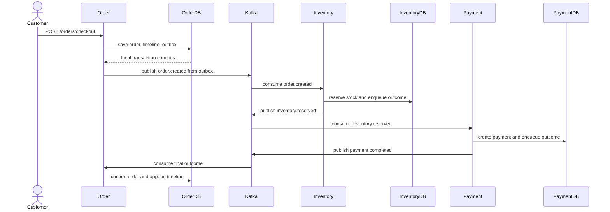
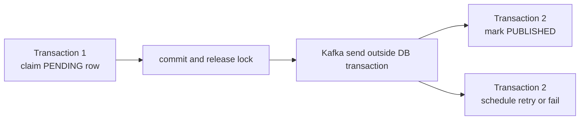

# Shopverse SAGA Code Flow

This page explains the concrete Shopverse checkout implementation. For generic
SAGA and outbox theory, see [SAGA patterns](SAGA-GENERIC.md). For the concise
architecture view, see [SAGA and outbox](SAGA-OUTBOX.md).

## Choreography Flow



No service updates another service's database. Each step commits local state
and its outgoing outbox row atomically, then a separate publisher sends the
event to Kafka.

## Trigger API

```powershell
$token = "<customer-jwt>"

curl.exe -X POST http://localhost:8080/api/v1/orders/checkout `
  -H "Authorization: Bearer $token" `
  -H "Content-Type: application/json" `
  -H "Idempotency-Key: checkout-demo-101" `
  -H "X-Correlation-Id: checkout-demo-101" `
  -d '{"items":[{"productId":101,"quantity":1}]}'
```

`Idempotency-Key` identifies the checkout command. Repeating the same command
must return the existing order rather than create another order or charge.
`X-Correlation-Id` is operational context and may be reused to search the
complete journey.

## Transaction Boundary

Inventory handles an incoming event inside one local database transaction:

```java
@Transactional
public void handleOrderCreated(OrderCreatedEvent event) {
    boolean reserved = inventoryService.reserve(
            event.orderNumber(),
            event.correlationId(),
            event.productId(),
            event.quantity()
    );

    Object outgoingEvent = reserved
            ? new InventoryReservedEvent(
                    event.orderId(), event.orderNumber(), event.correlationId(),
                    event.customerUsername(), event.productId(),
                    event.quantity(), event.amount())
            : new InventoryFailedEvent(
                    event.orderId(), event.orderNumber(), event.correlationId(),
                    "Inventory not available for product " + event.productId());

    outboxService.enqueue(
            "INVENTORY_RESERVATION",
            event.orderNumber(),
            outgoingEvent.getClass().getSimpleName(),
            reserved ? topics.inventoryReserved() : topics.inventoryFailed(),
            event.orderNumber(),
            outgoingEvent,
            event.correlationId()
    );
}
```

The transaction contains:

1. the inventory state change;
2. reservation/audit state;
3. the outgoing event serialized into the outbox table.

If any database operation fails, Spring rolls back all three. Kafka publication
does not occur inside this transaction.

## Why The Outbox Is Required

This unsafe sequence has a failure window:

```text
COMMIT inventory reservation
process crashes
KafkaTemplate.send(inventory.reserved) never runs
```

The outbox changes it to:

```text
BEGIN
  update inventory
  insert outbox row
COMMIT

publisher later sends the durable row
```

The outbox row and domain state either both commit or both roll back. Kafka can
be unavailable without losing the intent to publish.

## Short-Lived Outbox Claims

The publisher must not hold a database lock while waiting for Kafka:



A network wait while holding `SELECT ... FOR UPDATE` would block other workers,
increase lock timeouts, and couple database capacity to broker latency.
Shopverse therefore claims a small batch in a short transaction, publishes
outside it, and records the outcome in another short transaction.

## Kafka Listener And Retry

```java
@RetryableTopic(attempts = "3")
@KafkaListener(
        topics = "${shopverse.kafka.topics.payment-failed}",
        groupId = "${spring.application.name}"
)
public void onPaymentFailed(String payload) {
    PaymentFailedEvent event = readEvent(payload, PaymentFailedEvent.class);
    CorrelationContext.run(
            event.correlationId(),
            () -> handlePaymentFailed(event)
    );
}
```

`@KafkaListener` registers a method-driven consumer container. Listener methods
run on Kafka consumer threads, not the application's main startup thread.
Concurrency is bounded by listener-container configuration and the topic's
partition count. `@Async` should not be added around a listener merely to make
Kafka asynchronous; it can break offset and error-handling semantics.

`@RetryableTopic` creates retry-topic infrastructure and forwards a failed
record through the configured attempts. After exhaustion, Spring routes it to
the dead-letter topic.

## Dead-Letter Persistence

```java
@DltHandler
public void onDeadLetter(ConsumerRecord<String, String> record) {
    String sourceTopic = record.topic().replaceFirst("-dlt$", "");
    failedKafkaEventService.record(
            sourceTopic,
            record.value(),
            "Inventory listener failed after retry policy",
            3
    );
    log.error(
            "Inventory event moved to DLT sourceTopic={} payload={}",
            sourceTopic,
            record.value()
    );
}
```

`@DltHandler` handles records after retry exhaustion. Shopverse persists a
recovery record so operators can inspect and replay the failure. The
deduplication key must be protected by a database uniqueness constraint so one
poison event produces one unresolved recovery record despite repeated
callbacks or consumer restarts.

## Idempotent Consumers

Kafka delivery is at least once, so consumers must expect duplicates. The
robust pattern is an inbox/processed-event table with a unique event ID:

```text
BEGIN
  insert processed_event(event_id)  -- unique
  apply domain change
  insert outgoing outbox event
COMMIT
```

If the event ID already exists, the consumer acknowledges the duplicate
without applying the business mutation again. Business uniqueness constraints,
such as one reservation per order/product, provide an additional guard but do
not replace a stable event identity.

## Inventory Concurrency

Shopverse combines:

- optimistic versioning to detect concurrent updates;
- an atomic stock condition so quantity cannot become negative;
- a unique idempotency/business key for duplicate reservation attempts;
- short transactions and deterministic lock order;
- reservation expiry that releases unpaid stock.

This prevents overselling without a long distributed lock spanning Order,
Inventory, Payment, and Kafka.

## Success And Compensation

| Event | Consumer action | Next event/state |
|---|---|---|
| `order.created` | reserve stock | `inventory.reserved` or `inventory.failed` |
| `inventory.reserved` | create/process payment | `payment.completed`, `payment.failed`, or timeout state |
| `payment.completed` | confirm order | `ORDER_CONFIRMED` |
| `payment.failed` | fail order and release reservation | compensated inventory |
| reservation expiry | restore stock | reservation `EXPIRED` |

Payment uncertainty is persisted as domain state rather than converted
immediately into a permanent failure. A later reconciliation can resolve a
timed-out provider result.

## Correlation And Timeline

Every event carries `correlationId`. Consumers install it into MDC before
business handling, and the Order timeline persists business transitions such
as:

```text
ORDER_CREATED
INVENTORY_RESERVED
PAYMENT_PROCESSING
PAYMENT_COMPLETED
ORDER_CONFIRMED
```

The timeline is the durable business explanation. Loki is the detailed
technical explanation. Zipkin shows instrumented span latency, and Prometheus
shows aggregate health.

## Code Locations

| Area | Typical location |
|---|---|
| checkout transaction | `order-service/.../service/OrderService.java` |
| order outbox publication | `order-service/.../outbox` |
| inventory listener | `inventory-service/.../saga/InventorySagaListener.java` |
| payment listener | `payment-service/.../saga/PaymentSagaListener.java` |
| topic properties | service configuration records and cloud config |
| failed-event persistence | each consuming service's DLT/recovery package |

## Verification Checklist

1. Submit checkout with JWT, body, idempotency key, and correlation ID.
2. Query the order timeline until a terminal or pending payment state appears.
3. Confirm each service database owns only its local records.
4. Confirm outbox rows become `PUBLISHED`.
5. Search Loki by correlation ID.
6. Repeat the same idempotency key and verify no duplicate order/payment.
7. Trigger stock/payment failure and verify compensation.
8. Trigger a poison event and verify bounded retries plus one recovery record.
9. Replay the recovery record and verify replay audit fields.

## Production Guidance

- Put event schema version and event ID in every envelope.
- Use schema compatibility rules before deploying producers.
- Bound retries with exponential backoff and a terminal state.
- Monitor outbox age, pending count, DLT count, and consumer lag.
- Partition by the aggregate key when per-order ordering matters.
- Never include database work and broker network waits in one long lock scope.
- Make replay authorized, audited, rate limited, and idempotent.
