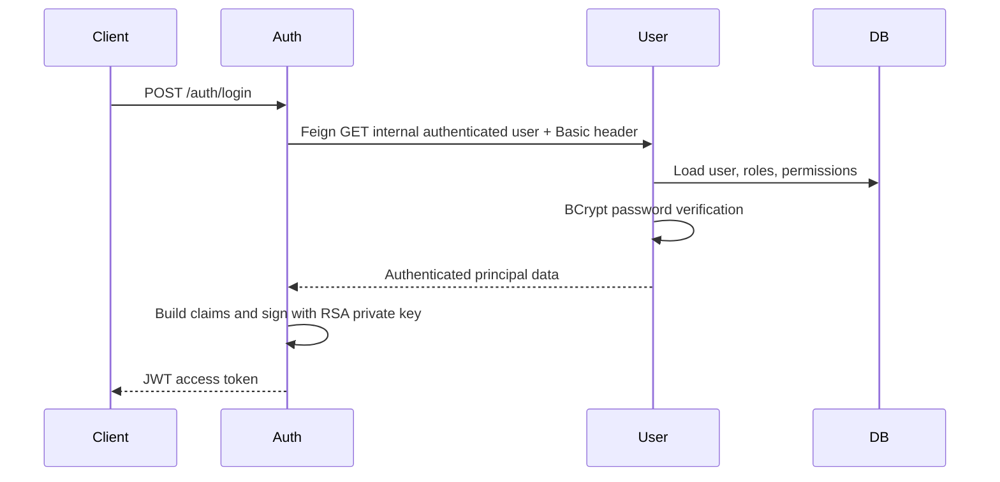

# JWT, OAuth2, And Spring Security

## What Shopverse Uses

Shopverse uses JWT bearer access tokens and Spring Security's OAuth2 Resource Server support. Auth Service performs a custom username/password login; it is not currently a full OAuth2 Authorization Server and does not implement authorization-code, client-credentials, or refresh-token grants.

## Login Flow



The Basic credentials are used only on the internal Auth-to-User endpoint. Public APIs use bearer JWTs.

## JWT Structure

```text
base64url(header).base64url(payload).base64url(signature)
```

- Header: algorithm and key ID.
- Payload: `iss`, `sub`, `iat`, `exp`, `jti`, roles, and permissions.
- Signature: RSA signature over header and payload.

JWT payloads are encoded, not encrypted. Do not place secrets in claims.

Auth Service signs with `JwtEncoder`. Resource services obtain the public RSA key from `/auth/.well-known/jwks.json` and verify with `NimbusJwtDecoder`.

## Validation

Resource services validate:

- RSA signature against JWKS;
- expiration and not-before timestamps through default validators;
- endpoint and method authorities.

User Service additionally validates issuer equal to `shopverse-auth-service`:

```java
decoder.setJwtValidator(JwtValidators.createDefaultWithIssuer(issuer));
```

API Gateway, Order, Inventory, and Payment currently configure `jwk-set-uri` but do not add an explicit issuer validator. Adding `issuer-uri` or an equivalent validator consistently is a security hardening item.

## Claims And Authorities

Auth Service emits:

- `roles`: space-separated role names;
- `permissions`: a list of permission names.

The custom `JwtAuthenticationConverter` maps these claims into Spring authorities. `hasRole("ADMIN")` checks for `ROLE_ADMIN`; `hasAuthority("USER_READ")` checks the exact permission string.

```java
@PreAuthorize("hasAuthority('USER_CREATE')")
public UserResponse createUser(...) { ... }
```

To avoid Spring's default `SCOPE_` or `ROLE_` prefix, configure the granted-authority converter explicitly and use `hasAuthority`.

## Security Context

After token validation, Spring stores a `JwtAuthenticationToken` in `SecurityContextHolder`. Controllers receive `Authentication`, and method-security interceptors evaluate `@PreAuthorize` before invoking the method.

## Why User Service Has Two Filter Chains

User Service has:

1. a higher-priority Basic-auth chain restricted to `/api/v1/internal/users/**`;
2. a JWT resource-server chain for public and administrative APIs.

`securityMatcher` chooses the first matching chain. The internal endpoint cannot accidentally fall through to the bearer policy, and the Basic policy does not apply to the rest of the API.

## Ownership Authorization

Order timeline and payment lookup allow either:

- an administrator; or
- the authenticated owner identified by token subject.

```java
@PreAuthorize("hasRole('ADMIN') or @orderAuthorization.isOwner(#id, authentication.name)")
```

This is stronger than checking only whether a caller has a generic read permission.

## OAuth2 Terms

| Term | Shopverse status |
|---|---|
| JWT access token | Implemented |
| Resource Server | Implemented |
| JWKS | Implemented |
| Custom password login | Implemented |
| OAuth2 Authorization Server | Not implemented |
| Authorization Code + PKCE | Planned for browser/mobile clients |
| Client Credentials | Planned for service identities |
| Refresh token rotation | Not implemented |
| Session/cookie login | Not used by service APIs |
| API keys | Not used |

## Security Practices

- Keep private keys and credentials outside source control.
- Use HTTPS in non-local environments.
- Use short access-token lifetime and key rotation.
- Validate issuer, audience, timestamps, and algorithm in every resource service.
- Apply least privilege through roles and permissions.
- Parameterize database access through JPA; never concatenate untrusted SQL.
- Rate-limit at the edge and service boundary.
- Use CORS allowlists; disable CSRF only for stateless bearer APIs.
- Avoid token logging and sanitize error responses.
- Protect internal service endpoints with workload identity or mTLS in production; Basic auth is a POC boundary.

## Official References

- [Spring Security OAuth2 Resource Server JWT](https://docs.spring.io/spring-security/reference/servlet/oauth2/resource-server/jwt.html)
- [Spring Security method security](https://docs.spring.io/spring-security/reference/servlet/authorization/method-security.html)
- [Spring Authorization Server](https://docs.spring.io/spring-authorization-server/reference/)
