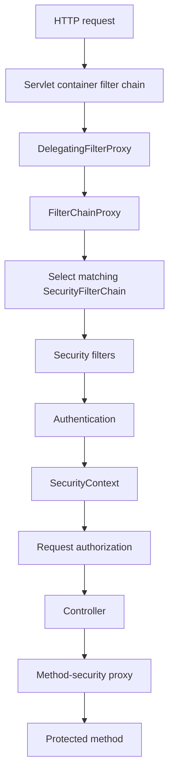
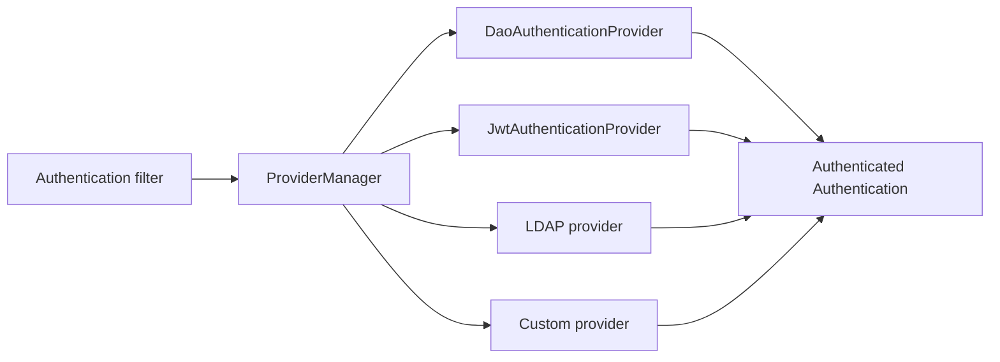
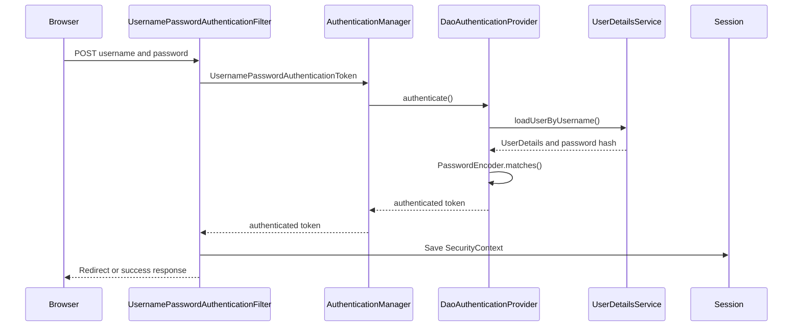
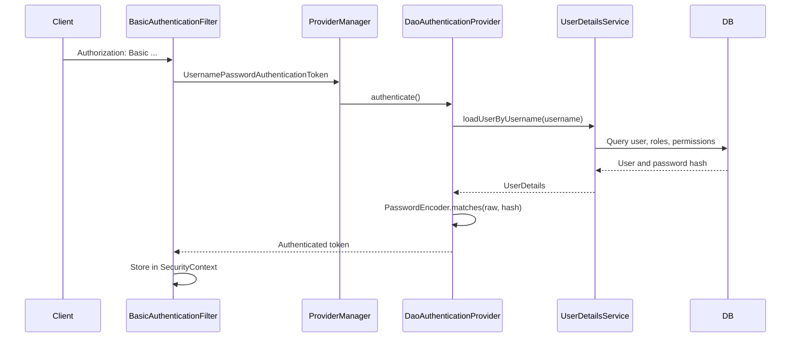
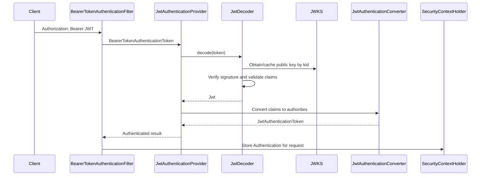
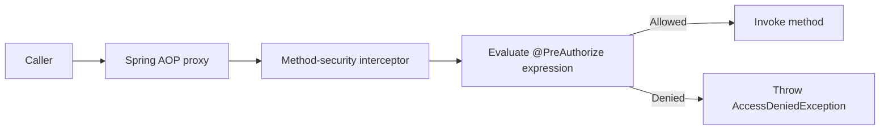
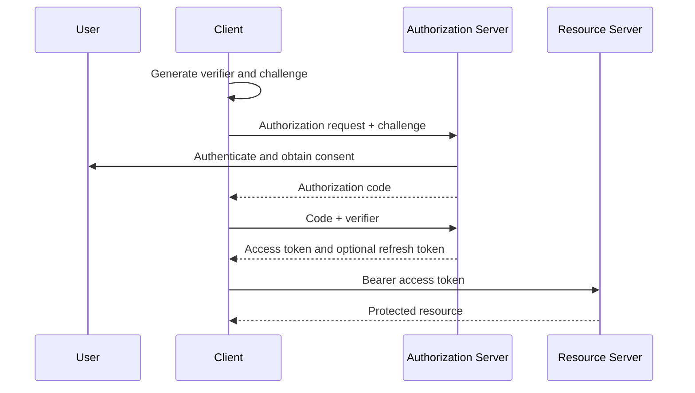

# Spring Security

Spring Security provides authentication, authorization, exploit protection,
security-context management, password encoding, OAuth2 support, and method
security for Spring applications.

This guide explains the framework generically and uses Shopverse code as a
concrete example. Features not implemented by Shopverse are identified
explicitly.

## Authentication And Authorization

Authentication answers:

```text
Who is the caller?
```

Authorization answers:

```text
What is the authenticated caller allowed to do?
```

Examples:

- username/password authenticates a user;
- a JWT authenticates the token subject;
- `USER_CREATE` authorizes user creation;
- an ownership rule authorizes a customer to read only their own order.

## Core Dependencies

Basic Spring Security:

```gradle
implementation 'org.springframework.boot:spring-boot-starter-security'
```

Servlet applications:

```gradle
implementation 'org.springframework.boot:spring-boot-starter-web'
```

Reactive applications:

```gradle
implementation 'org.springframework.boot:spring-boot-starter-webflux'
```

Database-backed users:

```gradle
implementation 'org.springframework.boot:spring-boot-starter-data-jpa'
runtimeOnly 'com.mysql:mysql-connector-j'
```

JWT Resource Server:

```gradle
implementation 'org.springframework.boot:spring-boot-starter-oauth2-resource-server'
implementation 'org.springframework.security:spring-security-oauth2-jose'
```

Method-security testing:

```gradle
testImplementation 'org.springframework.security:spring-security-test'
```

OAuth2 client login, such as Google or an enterprise OIDC provider, uses:

```gradle
implementation 'org.springframework.boot:spring-boot-starter-oauth2-client'
```

A standards-based token issuer should use Spring Authorization Server rather
than building all OAuth2 protocol endpoints manually. Shopverse does not
currently use Spring Authorization Server.

## Servlet Security Architecture



`DelegatingFilterProxy` bridges the servlet container to a Spring-managed
filter bean.

`FilterChainProxy` contains one or more `SecurityFilterChain` objects. It
selects the first chain whose matcher accepts the request.

Each chain contains ordered filters for concerns such as CSRF, sessions,
Basic authentication, bearer tokens, anonymous authentication, exception
translation, and authorization.

## Important Interfaces And Classes

| Type | Responsibility |
|---|---|
| `SecurityFilterChain` | Security rules and filters for matching requests |
| `Authentication` | Principal, credentials, authorities, and authentication state |
| `AuthenticationManager` | Entry point for authenticating an `Authentication` request |
| `ProviderManager` | Delegates authentication to compatible providers |
| `AuthenticationProvider` | Authenticates one credential/token type |
| `UserDetails` | Spring Security representation of a user |
| `UserDetailsService` | Loads a user by username |
| `PasswordEncoder` | Hashes and verifies passwords |
| `GrantedAuthority` | A role, permission, or scope used for authorization |
| `SecurityContext` | Holds the current `Authentication` |
| `SecurityContextHolder` | Access point for the current servlet security context |
| `AuthorizationManager` | Makes request or method authorization decisions |
| `AuthenticationEntryPoint` | Handles unauthenticated access, normally `401` |
| `AccessDeniedHandler` | Handles authenticated but unauthorized access, normally `403` |

## AuthenticationManager And Providers



An authentication filter creates an unauthenticated `Authentication` token
and passes it to `AuthenticationManager`.

`ProviderManager` checks its `AuthenticationProvider` instances. A provider
declares whether it supports that token type and either:

- returns an authenticated result;
- throws an authentication exception;
- returns `null` so another provider can try.

## Common Authentication Providers

### DAO/Database Provider

`DaoAuthenticationProvider` uses `UserDetailsService` and `PasswordEncoder`.
It supports username/password authentication backed by a database or another
user store.

### JWT Provider

`JwtAuthenticationProvider` uses `JwtDecoder` to verify and validate a bearer
JWT, then converts claims into an authenticated principal and authorities.

### In-Memory Provider

An `InMemoryUserDetailsManager` is useful for examples, tests, and limited
administration tools. It is not a scalable account database.

### LDAP Provider

Authenticates against LDAP or Active Directory and maps directory groups to
authorities.

### OAuth2/OIDC Login Provider

Delegates user login to an external Authorization Server or identity provider.
OIDC adds identity claims and an ID Token on top of OAuth2.

### Custom Provider

A custom `AuthenticationProvider` can validate an API key, hardware
credential, legacy token, or another protocol. Custom credentials require
careful rotation, revocation, audit, and error handling.

## Form Login

Form login is normally session-based:



Configuration:

```java
http
    .authorizeHttpRequests(auth -> auth
        .requestMatchers("/login", "/css/**").permitAll()
        .anyRequest().authenticated())
    .formLogin(Customizer.withDefaults());
```

Because browsers automatically send session cookies, CSRF protection should
normally remain enabled for state-changing form/session requests.

Shopverse APIs do not use form login.

## HTTP Basic Authentication

HTTP Basic sends:

```http
Authorization: Basic base64(username:password)
```

Base64 is encoding, not encryption. Basic authentication must use HTTPS
outside local development.

Generic flow:



### Shopverse Basic Header Creation

Auth Service creates the header:

```java
private String basicAuth(String username, String password) {
    String credentials = username + ":" + password;
    String encodedCredentials = Base64.getEncoder()
            .encodeToString(credentials.getBytes(StandardCharsets.UTF_8));

    return "Basic " + encodedCredentials;
}
```

It forwards that header through Feign:

```java
@FeignClient(name = "USER-SERVICE")
public interface UserClient {

    @GetMapping("/api/v1/internal/users/authenticated")
    User loadAuthenticatedUser(
            @RequestHeader("Authorization") String authorization
    );
}
```

This is a Shopverse POC design: Auth Service receives the login request and
User Service performs database-backed Basic authentication on one internal
endpoint.

### Shopverse Basic Security Chain

```java
@Bean
@Order(1)
public SecurityFilterChain internalUserSecurityFilterChain(
        HttpSecurity http
) throws Exception {
    http
        .securityMatcher("/api/v1/internal/users/**")
        .csrf(AbstractHttpConfigurer::disable)
        .sessionManagement(session -> session
            .sessionCreationPolicy(SessionCreationPolicy.STATELESS))
        .authorizeHttpRequests(auth -> auth
            .anyRequest().authenticated())
        .httpBasic(Customizer.withDefaults());

    return http.build();
}
```

`securityMatcher(...)` scopes this chain. `@Order(1)` gives it priority over
the general JWT chain. The first matching `SecurityFilterChain` is used.

Stateless mode prevents an authenticated HTTP session from being used for
later requests; credentials are evaluated on each Basic request.

## Database-Backed Authentication

Shopverse adapts its JPA user model to Spring Security through
`UserDetailsService`:

```java
@Service
@RequiredArgsConstructor
public class DatabaseUserDetailsService implements UserDetailsService {

    private final UserRepository userRepository;

    @Override
    @Transactional(readOnly = true)
    public UserDetails loadUserByUsername(String username) {
        User user = userRepository.findByUsername(username)
                .orElseThrow(() ->
                        new UsernameNotFoundException("User not found"));

        return org.springframework.security.core.userdetails.User
                .withUsername(user.getUsername())
                .password(user.getPassword())
                .authorities(toAuthorities(user))
                .accountExpired(!isTrue(user.getAccountNonExpired()))
                .accountLocked(!isTrue(user.getAccountNonLocked()))
                .credentialsExpired(!isTrue(user.getCredentialsNonExpired()))
                .disabled(!isTrue(user.getEnabled())
                        || user.getStatus() != UserStatus.ACTIVE)
                .build();
    }
}
```

The repository uses an entity graph:

```java
@EntityGraph(attributePaths = {"roles", "roles.permissions"})
Optional<User> findByUsername(String username);
```

This loads the user, roles, and permissions for authentication without a
separate lazy query for each relationship.

Spring Boot can assemble a DAO provider when a `UserDetailsService` and
`PasswordEncoder` are available:

```java
@Bean
PasswordEncoder passwordEncoder() {
    return PasswordEncoderFactories.createDelegatingPasswordEncoder();
}
```

`DaoAuthenticationProvider` calls:

```java
passwordEncoder.matches(rawPassword, storedPasswordHash)
```

The raw password should never be stored or logged.

## UserDetails And Authorities

`UserDetails` is a security-facing representation, not necessarily the JPA
entity itself. It contains:

- username;
- password hash;
- enabled/locked/expired state;
- granted authorities.

Shopverse maps both roles and permissions:

```java
authorities.add(new SimpleGrantedAuthority(role.getRoleName()));

role.getPermissions().forEach(permission ->
    authorities.add(
        new SimpleGrantedAuthority(permission.getPermissionName())
    )
);
```

This permits coarse role checks and finer permission checks.

## SecurityContext And SecurityContextHolder

After successful servlet authentication:

```text
SecurityContext
  -> Authentication
       -> principal
       -> authorities
       -> authenticated=true
```

Application code can access it:

```java
Authentication authentication =
        SecurityContextHolder.getContext().getAuthentication();

String username = authentication.getName();
```

In servlet applications, the holder commonly uses thread-associated context.
Async work requires explicit context propagation.

WebFlux uses `ReactiveSecurityContextHolder` and Reactor Context instead of
assuming one thread per request.

Prefer injecting `Authentication` into a controller or using method-security
expressions when possible. Direct global access makes code harder to test.

## Stateless Bearer JWT Authentication



No password lookup is required for each resource request. The token signature
and claims are the authentication evidence.

### BearerTokenResolver

`BearerTokenResolver` extracts a bearer token from an HTTP request before
`BearerTokenAuthenticationFilter` attempts authentication.

The default implementation reads the `Authorization: Bearer` header. A custom
resolver can support another trusted location or deliberately ignore bearer
headers for narrowly defined public endpoints.

Returning `null` means no bearer token was resolved. It does not itself grant
access; the later authorization rules still decide whether an anonymous
request is permitted.

Be careful when combining a custom resolver with `permitAll()`. The resolver
and authorization matchers should describe the same public surface.

## JWT Structure

JWT compact serialization has three Base64URL-encoded parts:

```text
header.payload.signature
```

### Header

```json
{
  "alg": "RS256",
  "kid": "key-1",
  "typ": "JWT"
}
```

- `alg`: signing algorithm;
- `kid`: key identifier;
- `typ`: optional media type.

### Payload

```json
{
  "iss": "shopverse-auth-service",
  "sub": "alice",
  "aud": ["shopverse-api"],
  "iat": 1781160000,
  "exp": 1781163600,
  "jti": "token-id",
  "roles": "ROLE_CUSTOMER",
  "permissions": ["ORDER_READ"]
}
```

The payload is encoded, not encrypted. Anyone holding the token can decode the
claims. Do not put passwords, secrets, or unnecessary personal data inside it.

### Signature

The signature protects integrity and authenticity:

```text
sign(
  base64url(header) + "." + base64url(payload),
  signing key
)
```

Changing the header or payload causes signature verification to fail.

## JWS, JWE, JWK, And JWKS

| Term | Meaning |
|---|---|
| JWT | Token format containing claims |
| JWS | Signed content; common bearer JWT form |
| JWE | Encrypted content |
| JWK | One cryptographic key represented as JSON |
| JWKS | A JSON Web Key Set containing one or more public keys |

Shopverse uses signed JWTs/JWS, not encrypted JWE tokens.

## Symmetric And Asymmetric JWT Signing

### Symmetric HMAC

The same secret signs and verifies:

```text
Auth Server -- shared secret --> Resource Server
```

Advantages:

- simple;
- fast.

Risks:

- every verifier that has the secret can also mint tokens;
- secret distribution and rotation become difficult across many services.

### Asymmetric RSA Or EC

The issuer signs with a private key; resource servers verify with the public
key:

```text
Private key: Auth Server only
Public key: Resource Servers
```

Advantages:

- verifiers cannot sign tokens;
- public keys can be distributed through JWKS;
- better fit for microservices.

Shopverse uses RSA.

## Shopverse JWT Encoding

Auth Service creates a signing JWK:

```java
JWK jwk = new RSAKey.Builder(rsaKeys.publicKey())
        .privateKey(rsaKeys.privateKey())
        .keyID("key-1")
        .build();

JWKSource<SecurityContext> jwks =
        new ImmutableJWKSet<>(new JWKSet(jwk));

return new NimbusJwtEncoder(jwks);
```

`NimbusJwtEncoder` selects a signing key and uses the private key to create the
signature.

Shopverse builds claims:

```java
JwtClaimsSet claims = JwtClaimsSet.builder()
        .id(UUID.randomUUID().toString())
        .issuer(issuer)
        .issuedAt(Instant.now())
        .expiresAt(Instant.now().plus(1, ChronoUnit.HOURS))
        .subject(user.username())
        .claim("roles", roles)
        .claim("permissions", permissions)
        .build();

String token = jwtEncoder.encode(
        JwtEncoderParameters.from(claims)
).getTokenValue();
```

The private key must remain only in the issuer.

## JWKS Publication

Shopverse exposes only the public JWK:

```java
@GetMapping("/.well-known/jwks.json")
public Map<String, Object> keys() {
    return new JWKSet(rsaKey.toPublicJWK()).toJSONObject();
}
```

Resource services use `kid` to find the matching public key. A production
JWKS can contain both current and retiring public keys during rotation.

Never publish a JWK containing private-key parameters.

## Shopverse JWT Decoding

User Service creates a decoder from the JWKS endpoint:

```java
NimbusJwtDecoder jwtDecoder =
        NimbusJwtDecoder.withJwkSetUri(jwkSetUri).build();

jwtDecoder.setJwtValidator(
        JwtValidators.createDefaultWithIssuer(issuer)
);
```

The decoder:

1. parses the compact token;
2. obtains the public key;
3. verifies the signature;
4. validates timestamps;
5. validates the configured issuer;
6. returns a `Jwt` containing trusted claims.

Every resource service should also validate expected audience and restrict
accepted algorithms.

## Claim Types

### Registered Claims

Standard names include:

| Claim | Purpose |
|---|---|
| `iss` | issuer |
| `sub` | subject/principal |
| `aud` | intended audience |
| `exp` | expiry |
| `nbf` | not valid before |
| `iat` | issued at |
| `jti` | unique token identifier |

### Public Claims

Names defined through shared standards or collision-resistant namespaces.

### Private Claims

Application-specific claims such as Shopverse `roles` and `permissions`.
Issuer and resource servers must agree on their type and meaning.

Keep claims small. Large tokens increase every request header and proxy limit
risk.

## Scope, Role, Group, And Authority

| Concept | Typical meaning |
|---|---|
| Scope | Capability delegated to an OAuth2 client/token |
| Role | Coarse organizational or application responsibility |
| Permission | Fine-grained action |
| Group | Identity-provider or directory membership |
| Authority | Spring Security's normalized authorization value |

Spring Security authorization ultimately evaluates `GrantedAuthority`
objects.

OAuth2 scopes commonly become authorities such as:

```text
SCOPE_orders.read
SCOPE_orders.write
```

Roles often use:

```text
ROLE_ADMIN
ROLE_CUSTOMER
```

Permissions can remain exact:

```text
USER_READ
USER_CREATE
```

## JWT Authority Conversion

Shopverse converts roles and permissions:

```java
jwtConverter.setJwtGrantedAuthoritiesConverter(jwt -> {
    LinkedHashSet<GrantedAuthority> authorities =
            new LinkedHashSet<>();

    String roles = jwt.getClaimAsString("roles");
    if (roles != null) {
        Arrays.stream(roles.split(" "))
                .filter(role -> !role.isBlank())
                .map(SimpleGrantedAuthority::new)
                .forEach(authorities::add);
    }

    var permissions = jwt.getClaimAsStringList("permissions");
    if (permissions != null) {
        permissions.stream()
                .map(SimpleGrantedAuthority::new)
                .forEach(authorities::add);
    }

    return authorities;
});
```

`hasRole("ADMIN")` checks for `ROLE_ADMIN`.

`hasAuthority("USER_CREATE")` checks the exact value.

Claims are not authorization until they are mapped into authorities and a rule
evaluates them.

For the exact Shopverse `BearerTokenResolver` and role-converter code,
including empty-prefix behavior with `hasRole`, see
[Bearer token resolution on public endpoints](JWT-OAUTH2-SPRING-SECURITY.md#bearer-token-resolution-on-public-endpoints).

## Authorization Models

### RBAC

Role-Based Access Control assigns permissions through roles:

```text
User -> Role -> Permission
```

Shopverse uses roles and permissions.

### ABAC

Attribute-Based Access Control evaluates attributes such as:

- user department;
- resource owner;
- environment;
- amount;
- time;
- device trust.

### Ownership Authorization

Shopverse combines roles with resource ownership:

```java
@PreAuthorize(
    "hasRole('ADMIN') or " +
    "@orderAuthorization.isOwner(#id, authentication.name)"
)
```

The authorization component performs a targeted query:

```java
public boolean isOwner(Long orderId, String username) {
    return username != null
            && orderRepository
                .existsByIdAndCustomerUsername(orderId, username);
}
```

### Policy Engines

External policy engines such as Open Policy Agent or Cedar can evaluate
centralized policies using identity, action, resource, and context.

They are useful when policies span many languages or services, but add network,
availability, policy-versioning, and audit complexity. Shopverse does not
currently use an external policy engine.

## Method Security

Enable it:

```java
@EnableMethodSecurity
```

Protect methods:

```java
@PreAuthorize("hasAuthority('USER_CREATE')")
public UserResponse createUser(...) {
    ...
}
```

Internal lifecycle:



The proxy intercepts calls made through the Spring bean reference. A method
calling another protected method on `this` can bypass proxy interception.

Method security is valuable because the rule remains attached to the business
operation even when another controller or scheduled path calls it.

## URL Security Versus Method Security

URL rules protect HTTP routes:

```java
.requestMatchers("/api/v1/roles/**").hasRole("ADMIN")
```

Method rules protect Java operations:

```java
@PreAuthorize("hasAuthority('ADMIN_ACCESS')")
```

Use both:

- URL security provides an early boundary;
- method security protects the operation itself;
- ownership checks often belong at method level.

## OAuth2 Roles

OAuth2 has four main actors:

| Actor | Responsibility |
|---|---|
| Resource Owner | User who owns data or grants access |
| Client | Application requesting access |
| Authorization Server | Authenticates and issues tokens |
| Resource Server | API validating tokens and protecting resources |

JWT is a token format. OAuth2 is an authorization framework. OAuth2 access
tokens can be JWTs or opaque reference tokens.

## Authorization Code With PKCE

Recommended for browser and mobile user-facing applications:



PKCE protects an intercepted authorization code from being exchanged by a
different client.

## Client Credentials

Used for machine-to-machine access where no user is involved. The token
represents the client/service identity and should have narrow scopes.

## Device Authorization

Used by devices with limited input capability. The user completes
authentication on another device.

## Refresh Tokens

Refresh tokens obtain new access tokens without asking the user to log in
again. They should be:

- stored more securely than access tokens;
- rotated on use;
- revocable;
- bound to the client;
- monitored for reuse.

Shopverse does not currently implement refresh tokens.

## OAuth2 Resource Owner Password Grant

The password grant is obsolete and should not be introduced for new systems.
Clients should not collect a user's identity-provider password.

Shopverse's custom `/auth/login` endpoint is a POC login design, not an OAuth2
password grant implementation.

## OAuth2 And OIDC

OAuth2 authorizes access to resources. OpenID Connect adds user authentication
and identity claims, including an ID Token and UserInfo endpoint.

Use OIDC when an application needs federated user login. Do not use an access
token as a substitute for an ID Token in a browser client.

## JWT Revocation And Blocking

Self-contained JWT validation is fast because a resource server does not call
the issuer for every request. The trade-off is that a valid token normally
remains usable until expiry.

Options for immediate or near-immediate blocking:

### Short-Lived Access Tokens

Limit the exposure window and use refresh-token rotation.

### `jti` Deny List

Store revoked token IDs until their expiry. This adds a lookup to resource
requests and requires shared storage.

### User Security Version

Include a version claim and compare it with current user state. Password reset,
role change, or account disable increments the version.

### Key Rotation

Remove a compromised signing key and stop accepting tokens signed with it.
This revokes many tokens at once and must be coordinated carefully.

### Opaque Tokens And Introspection

Resource servers call or cache an Authorization Server introspection result.
This supports centralized revocation but adds runtime dependency and latency.

### Gateway Deny List Only

Blocking only at the gateway is insufficient if services can be reached
directly. Enforcement must exist at every reachable security boundary.

Shopverse currently relies on token expiry and does not implement a JWT deny
list, security-version check, or opaque-token introspection.

## Multiple SecurityFilterChains

Multiple chains are appropriate when endpoints use materially different
authentication mechanisms.

Shopverse User Service uses:

```text
Order 1: /api/v1/internal/users/** -> HTTP Basic
Order 2: remaining application APIs -> JWT bearer
```

Rules:

- use narrow `securityMatcher` patterns;
- order the most specific chain first;
- ensure every request matches the intended chain;
- avoid duplicating rules unnecessarily;
- test authentication mechanism and denial behavior for each chain.

## Exceptions

Unauthenticated access normally produces `401 Unauthorized` through an
`AuthenticationEntryPoint`.

Authenticated access without permission produces `403 Forbidden` through an
`AccessDeniedHandler`.

Do not convert both into `401`; clients and operators need to distinguish
invalid identity from insufficient authorization.

Avoid returning cryptographic or account-enumeration details in error
responses.

## Session And Stateless Security

Session-based:

- authentication stored server-side;
- browser sends a session cookie;
- logout can invalidate the session immediately;
- CSRF protection is normally required.

Stateless bearer:

- each request contains a token;
- no server HTTP session is required;
- horizontal scaling is simpler;
- revocation is more complex.

`SessionCreationPolicy.STATELESS` tells Spring Security not to use an HTTP
session as the security-context repository for API authentication.

## CSRF And CORS

CSRF exploits credentials automatically attached by a browser, especially
cookies. Disabling CSRF is generally appropriate for stateless APIs that accept
only bearer tokens from headers, but not automatically for browser session
applications.

CORS controls which browser origins may call an API. It is not authentication
and does not protect non-browser clients.

Use explicit origin, method, and header allowlists in production.

## Password Security

- store only adaptive password hashes;
- use BCrypt, Argon2, PBKDF2, or scrypt through `PasswordEncoder`;
- never decrypt passwords because they should not be encrypted reversibly;
- rate-limit login attempts;
- use generic authentication errors;
- monitor credential stuffing;
- support account lock and recovery;
- rehash when encoder strength changes.

`DelegatingPasswordEncoder` stores an algorithm identifier such as
`{bcrypt}` with the hash, supporting migration between encoders.

## JWT And OAuth2 Production Practices

1. Use HTTPS everywhere.
2. keep private signing keys in a secret manager or HSM.
3. publish only public keys through JWKS.
4. rotate keys using stable `kid` values and overlap.
5. restrict accepted algorithms; never trust the token's algorithm blindly.
6. validate issuer, audience, expiry, not-before, and required claims.
7. keep access tokens short-lived.
8. minimize claims and never include secrets.
9. protect tokens from logs, URLs, browser storage exposure, and referrers.
10. use Authorization Code with PKCE for public user-facing clients.
11. use Client Credentials with narrow scopes for service identities.
12. rotate and revoke refresh tokens.
13. apply least privilege to roles, scopes, and permissions.
14. enforce authorization inside resource services, not only at the gateway.
15. audit authentication, role changes, key rotation, and denied operations.

## Shopverse Security Summary

Implemented:

- custom Auth Service username/password endpoint;
- internal Basic authentication against User Service database users;
- `UserDetailsService` with roles and permissions;
- delegated password encoding;
- RSA JWT signing;
- JWKS publication;
- JWT resource-server validation;
- custom role and permission authority mapping;
- URL and method security;
- customer ownership checks.

Not currently implemented:

- Spring Authorization Server;
- OAuth2 Authorization Code with PKCE;
- Client Credentials service identities;
- OIDC login;
- refresh-token rotation;
- JWT deny list or security version;
- external policy engine;
- consistent issuer/audience validation in every resource service.

## Related Guides

- [Shopverse JWT and OAuth2 implementation](JWT-OAUTH2-SPRING-SECURITY.md)
- [API Gateway](../development/API-GATEWAY-GENERIC.md)
- [Feign clients](../integration/FEIGN-CLIENTS.md)
- [Testing](../development/TESTING.md)

## Official References

- [Spring Security architecture](https://docs.spring.io/spring-security/reference/servlet/architecture.html)
- [Username/password authentication](https://docs.spring.io/spring-security/reference/servlet/authentication/passwords/index.html)
- [OAuth2 Resource Server JWT](https://docs.spring.io/spring-security/reference/servlet/oauth2/resource-server/jwt.html)
- [Method security](https://docs.spring.io/spring-security/reference/servlet/authorization/method-security.html)
- [Spring Authorization Server](https://docs.spring.io/spring-authorization-server/reference/)
