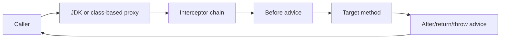

# Spring AOP

Aspect-oriented programming separates cross-cutting behavior from core
business logic. Spring AOP applies advice around eligible Spring bean method
calls through proxies.

Common proxy-based features include:

- `@Transactional`;
- `@Cacheable`;
- `@Async`;
- method security such as `@PreAuthorize`;
- Resilience4j annotations;
- custom logging, audit, and metrics aspects.

## Dependencies

For custom AspectJ-style Spring AOP aspects:

```gradle
implementation 'org.springframework.boot:spring-boot-starter-aop'
```

Some starters bring the required AOP infrastructure transitively for their own
features. Add the AOP starter explicitly when the application owns custom
aspects.

## Core Terminology

| Term | Meaning |
|---|---|
| Aspect | class containing one cross-cutting concern |
| Join point | an interceptable execution point; Spring AOP uses method execution |
| Pointcut | expression selecting join points |
| Advice | code executed before, after, or around a selected call |
| Target | underlying application object |
| Proxy | wrapper presented to callers |
| Weaving | connecting aspects to targets; Spring AOP does this at runtime through proxies |

## Internal Flow



Spring registers an `Advisor` containing a pointcut and advice.
`BeanPostProcessor` infrastructure identifies matching beans during creation
and returns a proxy. Calls entering the proxy execute the interceptor chain
before reaching the target.

JDK proxies implement target interfaces. Class-based proxies subclass the
target class. Modern Spring can choose the suitable mechanism, but proxy
limitations still matter.

## Advice Types

```java
@Aspect
@Component
public class AuditAspect {

    @Before("@annotation(Audited)")
    public void beforeAudit(JoinPoint joinPoint) {
        log.debug("Audit started method={}", joinPoint.getSignature().getName());
    }

    @AfterReturning(
            pointcut = "@annotation(Audited)",
            returning = "result"
    )
    public void afterSuccess(JoinPoint joinPoint, Object result) {
        log.info("Audit completed method={}", joinPoint.getSignature().getName());
    }

    @AfterThrowing(
            pointcut = "@annotation(Audited)",
            throwing = "exception"
    )
    public void afterFailure(JoinPoint joinPoint, Throwable exception) {
        log.error("Audit failed method={}",
                joinPoint.getSignature().getName(), exception);
    }
}
```

Advice options:

- `@Before`: before invocation;
- `@AfterReturning`: after successful return;
- `@AfterThrowing`: after an exception;
- `@After`: finally-style completion;
- `@Around`: controls invocation and can change arguments, result, exception,
  or whether the target executes.

## Custom Annotation And Around Advice

```java
@Target(ElementType.METHOD)
@Retention(RetentionPolicy.RUNTIME)
public @interface MeasuredOperation {
    String value();
}
```

```java
@Aspect
@Component
@RequiredArgsConstructor
class MeasuredOperationAspect {

    private final MeterRegistry meterRegistry;

    @Around("@annotation(measured)")
    Object measure(
            ProceedingJoinPoint joinPoint,
            MeasuredOperation measured
    ) throws Throwable {
        Timer.Sample sample = Timer.start(meterRegistry);
        try {
            return joinPoint.proceed();
        } finally {
            sample.stop(Timer.builder("application.operation.duration")
                    .tag("operation", measured.value())
                    .register(meterRegistry));
        }
    }
}
```

Keep metric tags bounded. Never use raw user IDs, order IDs, URLs, or exception
messages as tags.

## Pointcut Examples

```java
// Any public service method
@Pointcut("execution(public * com.example..service..*(..))")
void serviceOperation() {
}

// Method carrying an annotation
@Pointcut("@annotation(com.example.Audited)")
void auditedOperation() {
}

// Bean type carrying an annotation
@Pointcut("@within(org.springframework.stereotype.Service)")
void serviceBean() {
}
```

Prefer explicit annotations or narrow package/type expressions. Broad
pointcuts can intercept framework infrastructure, create noise, and increase
latency.

## Self-Invocation

```java
@Service
class OrderService {

    public void checkout() {
        reserve(); // direct call on this; proxy is bypassed
    }

    @Transactional
    public void reserve() {
    }
}
```

The external caller entered `checkout` through the proxy, but `reserve()` is a
normal Java call on the target object. Its separate advice is not invoked.

Preferred fixes:

- make the transaction boundary the public `checkout` method;
- move `reserve` to a collaborator with a real responsibility boundary;
- redesign the workflow rather than injecting the bean into itself.

## Advice Ordering

Several interceptors can apply to one method:

```text
security -> metrics -> transaction -> cache -> target
```

Use `@Order` or `Ordered` only when ordering has a defined semantic need:

```java
@Aspect
@Order(Ordered.HIGHEST_PRECEDENCE)
class CorrelationAspect {
}
```

Lower values have higher precedence on entry and lower precedence on exit.
Framework aspects may define their own order. Test critical combinations such
as retry plus transaction because ordering changes whether every retry gets a
fresh transaction.

## AOP Versus Filters And Interceptors

| Mechanism | Boundary | Best use |
|---|---|---|
| Servlet filter | raw HTTP servlet chain | correlation, security, access logs |
| MVC interceptor | controller handling | handler-aware web policy |
| Spring AOP | Spring bean methods | transactions, audit, application metrics |
| AspectJ weaving | broader JVM join points | specialized cases beyond Spring beans |

Do not use AOP to hide core domain control flow. Business decisions should
remain visible in normal code.

## Proxy Limitations

- only calls entering through the proxy are advised;
- private methods are not useful AOP entry points;
- objects created with `new` outside Spring are not managed proxies;
- constructor execution is not intercepted by Spring AOP;
- thread-local context does not automatically cross `@Async` boundaries;
- finality and proxy mechanism can affect class-based interception;
- exception advice cannot recover safely unless the contract explicitly
  supports recovery.

## Testing

Test the target class normally for business behavior. Add focused Spring
context tests when the requirement is the advice itself:

```java
@SpringBootTest
class MeasuredOperationAspectTest {

    @Autowired
    MeasuredService service;

    @Autowired
    MeterRegistry registry;

    @Test
    void recordsOperationTimer() {
        service.execute();

        assertThat(registry.find("application.operation.duration").timer())
                .isNotNull();
    }
}
```

## Do And Do Not

| Do | Do not |
|---|---|
| Use AOP for genuine cross-cutting concerns | Hide business workflow in aspects |
| Keep pointcuts narrow | Intercept every method indiscriminately |
| Keep advice fast and bounded | Perform slow remote work in advice |
| Understand proxy boundaries | Assume self-invocation is advised |
| Define ordering when semantics require it | Depend on accidental interceptor order |
| Test proxy behavior with a Spring context | Mock the proxy and assume integration works |
| Redact sensitive arguments | Log every argument and return value |

## Related Guides

- [Spring Boot Internals](../development/SPRING-BOOT-INTERNALS.md)
- [Spring Cache](SPRING-CACHE.md)
- [Spring Transactions](SPRING-TRANSACTIONS.md)
- [Spring Security](../security/SPRING-SECURITY-GENERIC.md)
- [Resilience4j](../reliability/RESILIENCE4J-GENERIC.md)
