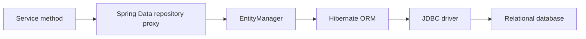

# Spring Data JPA

Spring Data JPA generates repository implementations on top of the Jakarta
Persistence API. Hibernate is commonly the JPA provider that manages entity
state, generates SQL, performs dirty checking, and communicates through JDBC.

## Core Flow



Spring Data reduces repository boilerplate. It does not remove the need to
understand SQL, indexes, transaction boundaries, fetching, locking, and
database constraints.

## Dependencies

```gradle
implementation 'org.springframework.boot:spring-boot-starter-data-jpa'
runtimeOnly 'com.mysql:mysql-connector-j'
testImplementation 'org.springframework.boot:spring-boot-starter-test'
```

Use Liquibase or Flyway to own production schema changes. Avoid relying on
Hibernate schema generation outside disposable development and test databases:

```yaml
spring:
  jpa:
    hibernate:
      ddl-auto: validate
    open-in-view: false
```

`validate` checks that mappings are compatible with the existing schema.
`open-in-view=false` keeps database access inside explicit service transaction
boundaries instead of allowing controllers or serializers to trigger queries.

## Entity Lifecycle And Persistence Context

An entity can be:

| State | Meaning |
|---|---|
| Transient | normal object not associated with persistence |
| Managed | tracked by the current persistence context |
| Detached | previously managed, but no longer tracked |
| Removed | scheduled for deletion |

Hibernate performs dirty checking on managed entities:

```java
@Transactional
public void renameProduct(Long id, String name) {
    ProductEntity product = repository.findById(id).orElseThrow();
    product.rename(name);
}
```

An explicit `save(product)` is not required for this managed entity. Hibernate
detects the change and normally issues an `UPDATE` during flush.

Flush synchronizes pending SQL with the database connection. It is not the same
as commit; the transaction can still roll back.

## Basic Entity Mapping

```java
@Entity
@Table(
        name = "products",
        uniqueConstraints = @UniqueConstraint(
                name = "uk_products_sku",
                columnNames = "sku"
        ),
        indexes = {
                @Index(
                        name = "idx_products_status_created",
                        columnList = "status, created_at"
                )
        }
)
public class ProductEntity {

    @Id
    @GeneratedValue(strategy = GenerationType.IDENTITY)
    private Long id;

    @Column(name = "sku", nullable = false, length = 64)
    private String sku;

    @Column(name = "name", nullable = false, length = 120)
    private String name;

    @Column(name = "price", nullable = false, precision = 19, scale = 2)
    private BigDecimal price;

    @Enumerated(EnumType.STRING)
    @Column(name = "status", nullable = false, length = 30)
    private ProductStatus status;

    @Version
    private long version;
}
```

### Important Entity Annotations

| Annotation | Purpose |
|---|---|
| `@Entity` | marks a persistent JPA entity |
| `@Table` | configures table, indexes, and unique constraints |
| `@Id` | marks the primary key |
| `@GeneratedValue` | configures generated-key strategy |
| `@Column` | configures column name, length, nullability, precision, and scale |
| `@Transient` | excludes a field from persistence |
| `@Version` | enables optimistic concurrency control |
| `@Enumerated` | controls enum storage |
| `@Embedded` | embeds a reusable value object |
| `@EmbeddedId` | uses an embeddable composite primary key |
| `@Convert` | applies an `AttributeConverter` |

Entity classes should:

- have a protected or public no-argument constructor;
- use stable equality semantics;
- avoid mutable IDs in `equals` and `hashCode`;
- avoid generated `toString` methods traversing relationships;
- keep domain invariants in methods rather than exposing every setter;
- avoid Lombok `@Data`, which can generate unsafe relationship-aware equality
  and string methods.

## Primary Key Strategies

### Generated Numeric ID

```java
@Id
@GeneratedValue(strategy = GenerationType.IDENTITY)
private Long id;
```

`IDENTITY` uses database-generated values and can restrict insert batching
because Hibernate may need each generated key immediately.

Sequences are often more batching-friendly on databases that support them:

```java
@Id
@GeneratedValue(
        strategy = GenerationType.SEQUENCE,
        generator = "order_sequence"
)
@SequenceGenerator(
        name = "order_sequence",
        sequenceName = "order_sequence",
        allocationSize = 50
)
private Long id;
```

MySQL commonly uses identity columns because traditional MySQL deployments do
not provide database sequences.

### Natural And External IDs

Business identifiers such as order number can be unique without being the JPA
primary key:

```java
@Column(name = "order_number", nullable = false, updatable = false)
private String orderNumber;
```

Back the invariant with a database unique constraint. An application-side
existence check alone cannot prevent concurrent duplicates.

## Embedded Value Objects

Use `@Embeddable` for a value object stored in the owning table:

```java
@Embeddable
public record Address(
        @Column(name = "address_line_1", nullable = false)
        String line1,
        @Column(name = "city", nullable = false)
        String city,
        @Column(name = "postal_code", nullable = false)
        String postalCode
) {
}
```

```java
@Embedded
private Address shippingAddress;
```

Generated table columns remain part of the owner:

```sql
select id, address_line_1, city, postal_code
from orders
where id = ?
```

Use `@AttributeOverride` when the same embeddable appears more than once:

```java
@Embedded
@AttributeOverrides({
        @AttributeOverride(
                name = "line1",
                column = @Column(name = "billing_line_1")
        ),
        @AttributeOverride(
                name = "city",
                column = @Column(name = "billing_city")
        ),
        @AttributeOverride(
                name = "postalCode",
                column = @Column(name = "billing_postal_code")
        )
})
private Address billingAddress;
```

## Composite Primary Keys

Prefer a simple surrogate primary key unless the domain and access patterns
clearly require a composite identity.

### `@EmbeddedId`

```java
@Embeddable
public record OrderItemId(
        Long orderId,
        Long productId
) implements Serializable {
}
```

```java
@Entity
@Table(name = "order_items")
public class OrderItemEntity {

    @EmbeddedId
    private OrderItemId id;

    @Column(nullable = false)
    private int quantity;
}
```

Repository:

```java
interface OrderItemRepository
        extends JpaRepository<OrderItemEntity, OrderItemId> {
}
```

### `@IdClass`

`@IdClass` keeps key fields directly on the entity:

```java
@Entity
@IdClass(OrderItemIdClass.class)
class OrderItemEntity {

    @Id
    private Long orderId;

    @Id
    private Long productId;
}
```

`@EmbeddedId` groups identity into one value object and is generally easier to
pass around. `@IdClass` can make JPQL paths simpler but duplicates key fields
between entity and ID class. Both key classes must implement stable
`equals`, `hashCode`, and `Serializable`.

## Enum Mapping

```java
@Enumerated(EnumType.STRING)
@Column(nullable = false, length = 30)
private PaymentStatus status;
```

Prefer `EnumType.STRING`. `ORDINAL` stores numeric positions, so reordering or
inserting enum constants silently changes meaning.

For an external database code, use a converter:

```java
@Converter(autoApply = true)
public class PaymentStatusConverter
        implements AttributeConverter<PaymentStatus, String> {

    @Override
    public String convertToDatabaseColumn(PaymentStatus status) {
        return status == null ? null : status.code();
    }

    @Override
    public PaymentStatus convertToEntityAttribute(String code) {
        return code == null ? null : PaymentStatus.fromCode(code);
    }
}
```

## Relationship Ownership

JPA relationships describe object navigation and foreign-key ownership. They
must reflect actual query and lifecycle requirements rather than connecting
every related table.

### One-To-One

```java
@Entity
class UserEntity {

    @OneToOne(
            mappedBy = "user",
            fetch = FetchType.LAZY,
            cascade = CascadeType.ALL,
            orphanRemoval = true
    )
    private UserProfileEntity profile;
}
```

```java
@Entity
class UserProfileEntity {

    @OneToOne(fetch = FetchType.LAZY, optional = false)
    @JoinColumn(
            name = "user_id",
            nullable = false,
            unique = true,
            foreignKey = @ForeignKey(name = "fk_profile_user")
    )
    private UserEntity user;
}
```

The side containing `@JoinColumn` owns the relationship. Typical SQL:

```sql
select u.id, u.username
from users u
where u.id = ?;

select p.id, p.user_id, p.display_name
from user_profiles p
where p.user_id = ?;
```

Accessing a lazy profile can trigger the second query. A fetch join or
projection can load both intentionally.

### Many-To-One

Many order items normally reference one order:

```java
@ManyToOne(fetch = FetchType.LAZY, optional = false)
@JoinColumn(
        name = "order_id",
        nullable = false,
        foreignKey = @ForeignKey(name = "fk_order_item_order")
)
private OrderEntity order;
```

Typical insert:

```sql
insert into order_items
    (order_id, product_id, quantity, unit_price)
values (?, ?, ?, ?);
```

Always specify `LAZY` for `@ManyToOne` and `@OneToOne` when immediate loading is
not required. Their JPA default is `EAGER`.

### One-To-Many

```java
@OneToMany(
        mappedBy = "order",
        cascade = CascadeType.ALL,
        orphanRemoval = true
)
@OrderColumn(name = "line_position")
private final List<OrderItemEntity> items = new ArrayList<>();
```

Maintain both sides:

```java
public void addItem(OrderItemEntity item) {
    items.add(item);
    item.assignTo(this);
}

public void removeItem(OrderItemEntity item) {
    items.remove(item);
    item.assignTo(null);
}
```

Loading one order and then accessing items usually produces:

```sql
select o.*
from orders o
where o.id = ?;

select i.*
from order_items i
where i.order_id = ?
order by i.line_position;
```

That is acceptable for one aggregate. It becomes N+1 when repeated across many
orders.

Avoid an unidirectional `@OneToMany` with a join column unless its generated
write behavior is understood. A child-owned `@ManyToOne` plus parent
`mappedBy` is usually clearer and more efficient.

### Many-To-Many

```java
@ManyToMany
@JoinTable(
        name = "user_roles",
        joinColumns = @JoinColumn(name = "user_id"),
        inverseJoinColumns = @JoinColumn(name = "role_id")
)
private Set<RoleEntity> roles = new HashSet<>();
```

Typical load:

```sql
select r.*
from roles r
join user_roles ur on ur.role_id = r.id
where ur.user_id = ?;
```

Use a direct many-to-many only when the join has no business attributes. If it
needs `assignedAt`, `assignedBy`, status, or audit data, map the join table as
its own entity such as `UserRoleEntity`.

## Cascades And Orphan Removal

| Cascade | Effect |
|---|---|
| `PERSIST` | persist related entity with owner |
| `MERGE` | merge related detached state |
| `REMOVE` | remove related entity |
| `REFRESH` | refresh related entity |
| `DETACH` | detach related entity |
| `ALL` | applies all cascade operations |

Cascade is an object-lifecycle rule, not a database cascade. Do not use
`CascadeType.ALL` automatically, especially across shared entities or
many-to-many relationships.

`orphanRemoval=true` deletes a child removed from the parent's collection. It
fits privately owned children such as order lines, not shared references.

Database foreign keys and `ON DELETE` behavior must still be defined in
Liquibase.

## Fetch Types And Fetch Plans

JPA defaults:

| Relationship | Default |
|---|---|
| `@OneToMany` | `LAZY` |
| `@ManyToMany` | `LAZY` |
| `@ManyToOne` | `EAGER` |
| `@OneToOne` | `EAGER` |

Treat mapping-level fetch type as a default, not a query plan. Keep
relationships lazy where practical and choose the required graph per use case.

Fetching strategies:

- JPQL `join fetch`;
- `@EntityGraph`;
- interface or DTO projection;
- batch fetching;
- separate bounded queries assembled by the service.

Do not make every relationship eager. Large eager graphs can create cartesian
products, duplicate rows, excessive memory use, and N+1 queries in other
contexts.

## Repository Interfaces

```java
public interface OrderRepository
        extends JpaRepository<OrderEntity, Long>,
                JpaSpecificationExecutor<OrderEntity> {
}
```

Useful base interfaces:

| Interface | Capability |
|---|---|
| `Repository` | marker with explicitly declared methods |
| `CrudRepository` | basic CRUD |
| `ListCrudRepository` | CRUD returning lists |
| `PagingAndSortingRepository` | pagination and sorting |
| `JpaRepository` | JPA CRUD, paging, flush, batch-oriented methods |
| `JpaSpecificationExecutor` | dynamic criteria specifications |

Expose only operations the domain needs. Extending `JpaRepository` is
convenient but also exposes broad mutation methods.

## Derived Queries

Spring Data parses method names:

```java
List<OrderEntity> findTop20ByCustomerUsernameAndStatusOrderByCreatedAtDesc(
        String customerUsername,
        OrderStatus status
);
```

Conceptual SQL:

```sql
select *
from orders
where customer_username = ?
  and status = ?
order by created_at desc
limit 20;
```

Derived methods work well for simple predicates. Use explicit queries when a
method name becomes difficult to understand.

## Custom JPQL Queries

JPQL operates on entities and entity attributes:

```java
@Query("""
        select o
        from OrderEntity o
        where o.customerUsername = :username
          and o.status in :statuses
        order by o.createdAt desc
        """)
List<OrderEntity> findCustomerOrders(
        @Param("username") String username,
        @Param("statuses") Set<OrderStatus> statuses
);
```

Parameters are bound values, not concatenated into the query.

### Modifying Queries

```java
@Modifying(clearAutomatically = true, flushAutomatically = true)
@Query("""
        update InventoryItemEntity item
           set item.availableQuantity = item.availableQuantity - :quantity
         where item.productId = :productId
           and item.availableQuantity >= :quantity
        """)
int reserveIfAvailable(
        @Param("productId") Long productId,
        @Param("quantity") int quantity
);
```

Call modifying queries inside a transaction. The returned row count provides
an atomic success signal:

```java
if (repository.reserveIfAvailable(productId, quantity) != 1) {
    throw new InsufficientInventoryException(productId);
}
```

Bulk JPQL updates bypass normal entity dirty checking and lifecycle callbacks.
Clear or refresh affected managed entities to avoid stale persistence-context
state.

## Native SQL Queries

```java
@Query(
        value = """
                select o.id, o.order_number, sum(i.quantity * i.unit_price)
                from orders o
                join order_items i on i.order_id = o.id
                where o.created_at >= :from
                group by o.id, o.order_number
                """,
        nativeQuery = true
)
List<OrderTotalView> findOrderTotals(@Param("from") Instant from);
```

Use native SQL for database-specific features, carefully optimized reports, or
queries that are clearer in SQL. Native queries increase coupling to the
database dialect and can require explicit count queries for pagination.

## Projections

Projections load only the fields required by a use case and avoid exposing
entities.

### Closed Interface Projection

```java
public interface OrderSummary {
    Long getId();
    String getOrderNumber();
    OrderStatus getStatus();
    BigDecimal getTotalAmount();
}
```

```java
Page<OrderSummary> findByCustomerUsername(
        String customerUsername,
        Pageable pageable
);
```

For a closed projection, Spring Data can select only referenced properties:

```sql
select id, order_number, status, total_amount
from orders
where customer_username = ?
limit ? offset ?;
```

### Open Interface Projection

```java
public interface OrderDisplay {

    String getOrderNumber();

    @Value("#{target.orderNumber + ' - ' + target.status}")
    String getLabel();
}
```

Open projections use SpEL and may require loading more entity state. Prefer
closed or DTO projections for predictable query performance.

### Record Or Class DTO Projection

```java
public record OrderSummaryResponse(
        Long id,
        String orderNumber,
        OrderStatus status,
        BigDecimal totalAmount
) {
}
```

JPQL constructor projection:

```java
@Query("""
        select new com.example.order.api.OrderSummaryResponse(
                o.id,
                o.orderNumber,
                o.status,
                o.totalAmount
        )
        from OrderEntity o
        where o.customerUsername = :username
        """)
Page<OrderSummaryResponse> findSummaries(
        @Param("username") String username,
        Pageable pageable
);
```

DTO projections provide an explicit contract and work well for read APIs.

### Dynamic Projection

```java
<T> Optional<T> findByOrderNumber(
        String orderNumber,
        Class<T> projectionType
);
```

```java
OrderSummary summary = repository.findByOrderNumber(
        orderNumber,
        OrderSummary.class
).orElseThrow();
```

Dynamic projections reduce repository method duplication but can hide which
query shape a use case expects. Use them selectively.

### Nested Projections

Nested interface projections can traverse relationships:

```java
interface OrderWithCustomer {
    String getOrderNumber();
    CustomerView getCustomer();
}
```

They can still produce joins or additional loading. Inspect generated SQL
rather than assuming the projection is efficient.

## Specifications And Dynamic Queries

Specifications compose optional predicates without unsafe SQL construction:

```java
public static Specification<OrderEntity> hasStatus(OrderStatus status) {
    return (root, query, builder) ->
            status == null
                    ? builder.conjunction()
                    : builder.equal(root.get("status"), status);
}
```

```java
Specification<OrderEntity> specification =
        Specification.where(hasStatus(status))
                .and(createdAfter(from))
                .and(ownedBy(username));

return repository.findAll(specification, pageable);
```

For complex read models, Querydsl, Criteria API, jOOQ, or explicit SQL may be
clearer than a large specification tree. Choose one approach consistently.

## SQL Injection Risks And Prevention

This is safe because values are bound:

```java
@Query("select u from UserEntity u where u.username = :username")
Optional<UserEntity> findByUsername(@Param("username") String username);
```

Hibernate sends SQL similar to:

```sql
select *
from users
where username = ?;
```

The username remains data and cannot change the SQL structure.

This is unsafe:

```java
String sql = "select * from users where username = '" + username + "'";
entityManager.createNativeQuery(sql).getResultList();
```

An input such as:

```text
' OR '1'='1
```

can alter query meaning.

### Dynamic Sort Injection

Values can be parameterized; identifiers and SQL keywords generally cannot.
Never concatenate an arbitrary client sort field:

```java
String sql = "select * from orders order by " + requestedSort;
```

Use an allow-list:

```java
private static final Map<String, String> ALLOWED_SORTS = Map.of(
        "createdAt", "created_at",
        "status", "status",
        "totalAmount", "total_amount"
);
```

Better still, map client values to typed Spring `Sort` properties validated
against known entity attributes.

### Injection Safety Checklist

- bind every external value with repository parameters;
- use Criteria API, specifications, or Querydsl for dynamic predicates;
- allow-list dynamic identifiers, operators, and sort fields;
- never accept raw JPQL, SQL fragments, or SpEL from clients;
- use least-privilege database users;
- validate lengths and formats as defense in depth;
- do not expose database errors or generated SQL to clients;
- review stored procedures and custom JDBC code under the same rules.

ORM use does not automatically make every query safe. String concatenation can
reintroduce injection into JPQL and native SQL.

## The N+1 Query Problem

N+1 occurs when one query loads parent rows and another query runs for each
parent relationship:

```java
List<OrderEntity> orders = repository.findAll();

for (OrderEntity order : orders) {
    log.info("items={}", order.getItems().size());
}
```

Generated pattern:

```sql
select * from orders;                    -- 1 query
select * from order_items where order_id = 1;
select * from order_items where order_id = 2;
select * from order_items where order_id = 3;
-- one query for every order
```

For 100 orders this becomes 101 queries.

### Solution 1: Fetch Join

```java
@Query("""
        select distinct o
        from OrderEntity o
        left join fetch o.items
        where o.id = :id
        """)
Optional<OrderEntity> findWithItems(@Param("id") Long id);
```

Generated shape:

```sql
select o.*, i.*
from orders o
left join order_items i on i.order_id = o.id
where o.id = ?;
```

Use `distinct` at the JPQL entity level because one order appears once per
joined item in the SQL result.

Avoid paginating a collection fetch join. The SQL row count represents joined
rows rather than parent entities, and Hibernate may paginate in memory or
produce incorrect expectations.

### Solution 2: Entity Graph

```java
@EntityGraph(attributePaths = {"items"})
Optional<OrderEntity> findWithItemsById(Long id);
```

An entity graph describes the relationships required for this repository
method without embedding the fetch join in JPQL.

Named graph:

```java
@NamedEntityGraph(
        name = "Order.summary",
        attributeNodes = {
                @NamedAttributeNode("items")
        }
)
@Entity
class OrderEntity {
}
```

```java
@EntityGraph(value = "Order.summary")
Optional<OrderEntity> findDetailedById(Long id);
```

### Solution 3: DTO Projection

If the endpoint needs a report rather than mutable aggregates, query the exact
shape:

```java
@Query("""
        select new com.example.OrderLineView(
                o.orderNumber,
                i.productId,
                i.quantity
        )
        from OrderEntity o
        join o.items i
        where o.customerUsername = :username
        """)
List<OrderLineView> findOrderLines(String username);
```

This avoids entity graph hydration and lazy traversal.

### Solution 4: Batch Fetching

```yaml
spring:
  jpa:
    properties:
      hibernate:
        default_batch_fetch_size: 50
```

Or per relationship:

```java
@BatchSize(size = 50)
@OneToMany(mappedBy = "order")
private List<OrderItemEntity> items;
```

Hibernate groups lazy loads:

```sql
select *
from order_items
where order_id in (?, ?, ?, ..., ?);
```

Batch fetching reduces N+1 to roughly `1 + ceil(N / batchSize)`. It is a useful
safety net, not a substitute for intentional query design.

### Solution 5: Two-Step Pagination

For paginated parents with child collections:

1. page only parent IDs;
2. fetch parents and children using those IDs;
3. restore the requested order in application code.

```java
Page<Long> ids = repository.findPageIds(username, pageable);
List<OrderEntity> orders = repository.findAllWithItemsByIdIn(ids.getContent());
```

This preserves database pagination while avoiding one child query per parent.

### Detecting N+1

- enable SQL and bind-parameter logging only in controlled development;
- inspect Hibernate statistics;
- use datasource-proxy or P6Spy in tests;
- assert query counts for critical repository methods;
- inspect APM traces and database query-rate spikes;
- run integration tests with realistic parent and child counts.

Do not solve N+1 by enabling `EAGER` everywhere.

## JDBC Batching

Batching groups similar insert or update statements into fewer network
round-trips:

```yaml
spring:
  jpa:
    properties:
      hibernate:
        jdbc:
          batch_size: 50
        order_inserts: true
        order_updates: true
        batch_versioned_data: true
```

MySQL JDBC commonly benefits from:

```text
jdbc:mysql://mysql:3306/orders?rewriteBatchedStatements=true
```

Exact driver behavior should be verified for the deployed connector version.

### Batched Inserts

```java
@Transactional
public void importProducts(List<CreateProductCommand> commands) {
    int batchSize = 50;

    for (int index = 0; index < commands.size(); index++) {
        entityManager.persist(toEntity(commands.get(index)));

        if ((index + 1) % batchSize == 0) {
            entityManager.flush();
            entityManager.clear();
        }
    }
}
```

`flush` sends the current batch. `clear` detaches managed entities so a large
import does not retain every object in the first-level cache.

`saveAll` does not guarantee efficient JDBC batching by itself. Efficiency
depends on ID strategy, Hibernate configuration, statement similarity, flush
behavior, and driver support.

### Batching Limitations

- `IDENTITY` generation can prevent insert batching;
- interleaved entity types can split batches;
- cascades can produce unexpected statement order;
- very large transactions consume memory, locks, undo logs, and connections;
- bulk JPQL or database-native operations may be better for large updates.

Use bounded chunks and define restart or idempotency behavior for imports.

## Transactions

Repository calls participate in the surrounding Spring transaction:

```java
@Transactional
public OrderResponse checkout(...) {
    OrderEntity order = repository.save(...);
    outboxService.enqueue(...);
    return mapper.toResponse(order);
}
```

The order and its outbox event commit or roll back together because both use
the same transaction manager and database.

Use `@Transactional(readOnly = true)` for read service methods. It communicates
intent and may enable provider optimizations, but it is not an authorization
or database-write prohibition.

## Locking And Concurrency

### Optimistic Locking

```java
@Version
private long version;
```

Generated update:

```sql
update inventory_items
set available_quantity = ?, version = version + 1
where id = ? and version = ?;
```

If no row matches, another transaction changed the version. Hibernate raises
an optimistic-locking exception. Retry only the complete idempotent operation
with freshly loaded state.

### Pessimistic Locking

```java
@Lock(LockModeType.PESSIMISTIC_WRITE)
@Query("select item from InventoryItemEntity item where item.productId = :id")
Optional<InventoryItemEntity> findByProductIdForUpdate(
        @Param("id") Long productId
);
```

Typical SQL:

```sql
select *
from inventory_items
where product_id = ?
for update;
```

Keep locked transactions short, access rows in a consistent order, and never
wait for remote HTTP or Kafka operations while holding locks.

### Atomic Conditional Update

For a simple invariant, one update may be safer and faster than read-modify-write:

```java
@Modifying
@Query("""
        update InventoryItemEntity item
           set item.availableQuantity = item.availableQuantity - :quantity
         where item.productId = :productId
           and item.availableQuantity >= :quantity
        """)
int reserve(Long productId, int quantity);
```

The database evaluates the condition and update atomically.

## Auditing

Enable auditing:

```java
@Configuration
@EnableJpaAuditing
class JpaAuditConfiguration {
}
```

```java
@MappedSuperclass
@EntityListeners(AuditingEntityListener.class)
public abstract class AuditedEntity {

    @CreatedDate
    @Column(nullable = false, updatable = false)
    private Instant createdAt;

    @LastModifiedDate
    @Column(nullable = false)
    private Instant updatedAt;

    @CreatedBy
    private String createdBy;

    @LastModifiedBy
    private String updatedBy;
}
```

Provide an `AuditorAware<String>` that reads the authenticated identity. Use a
stable system identity for background jobs. Database defaults and Liquibase
constraints must remain compatible with application auditing.

## Deleting Entities

`delete(entity)` loads and removes an entity, applying cascades and callbacks.
A bulk delete executes directly:

```java
@Modifying(clearAutomatically = true)
@Query("delete from ExpiredReservationEntity r where r.expiresAt < :now")
int deleteExpired(@Param("now") Instant now);
```

Bulk deletion bypasses per-entity callbacks and cascades. Ensure foreign keys
and dependent cleanup are handled deliberately.

Soft deletion adds complexity to every query, uniqueness rule, index, cache,
and relationship. Use it only when business recovery or audit requirements
justify it; an append-only history or archive table may be clearer.

## Pagination And Sorting

```java
Page<OrderSummary> findByCustomerUsername(
        String username,
        Pageable pageable
);
```

`Page` normally executes a data query and a count query. For expensive queries:

- provide an optimized `countQuery`;
- use `Slice` when the total is unnecessary;
- use cursor/keyset pagination for deep pages;
- allow-list sort fields;
- include a unique tie-breaker such as ID.

Never expose unbounded `findAll()` operations over production tables.

## Query Hints And Timeouts

```java
@QueryHints({
        @QueryHint(
                name = "jakarta.persistence.query.timeout",
                value = "2000"
        )
})
@Query("select o from OrderEntity o where o.orderNumber = :number")
Optional<OrderEntity> findTimed(@Param("number") String number);
```

Timeout support and units can vary by provider and driver. Apply an end-to-end
request deadline as well; a query timeout alone does not bound queueing or
connection acquisition.

## Testing Repository Behavior

Use `@DataJpaTest` for mappings and queries:

```java
@DataJpaTest
class OrderRepositoryTest {

    @Autowired
    OrderRepository repository;

    @Test
    void projectsCustomerOrders() {
        Page<OrderSummary> result = repository.findByCustomerUsername(
                "alice",
                PageRequest.of(0, 20)
        );

        assertThat(result.getContent()).allSatisfy(summary ->
                assertThat(summary.getOrderNumber()).isNotBlank()
        );
    }
}
```

Use Testcontainers with the production database engine for:

- native queries;
- locking and isolation;
- generated-key behavior;
- indexes and execution plans;
- Liquibase migrations;
- case sensitivity and database-specific SQL.

In-memory databases can differ materially from MySQL.

## Query Optimization Workflow

1. Identify the slow API or business operation.
2. Record query count and total database time.
3. Inspect generated SQL and bound values.
4. Run `EXPLAIN` or `EXPLAIN ANALYZE`.
5. check indexes against filters, joins, and ordering.
6. reduce selected columns with projections.
7. eliminate N+1 and unbounded result sets.
8. validate connection-pool and lock wait behavior.
9. test with production-like row counts and distributions.
10. compare metrics before and after the change.

An index can accelerate reads but increases storage and write cost. Index
actual access patterns rather than every column.

## Production Do And Do Not

| Do | Do not |
|---|---|
| Put transaction boundaries in services | Open transactions in controllers |
| Use migrations for constraints and indexes | Depend on `ddl-auto=update` |
| Keep associations lazy and query intentionally | Mark every relation eager |
| Use projections for read models | Return entities from REST APIs |
| Bind query parameters | Concatenate external values into JPQL or SQL |
| Cap pages and batches | Load entire production tables |
| Use database uniqueness for invariants | Rely only on existence checks |
| Keep locks and transactions short | Perform remote calls while holding locks |
| Inspect generated SQL and plans | Assume repository names imply efficient SQL |
| Test with the production database engine | Trust an in-memory database for dialect behavior |

## Related Guides

- [Hibernate ORM](../data/HIBERNATE.md)
- [Database Engineering](../data/DATABASE-ENGINEERING.md)
- [Spring Transactions](SPRING-TRANSACTIONS.md)
- [Liquibase](../data/LIQUIBASE-GENERIC.md)
- [Spring REST APIs](../development/SPRING-REST-APIS.md)
- [Spring Boot Testing](SPRING-BOOT-TESTING.md)
