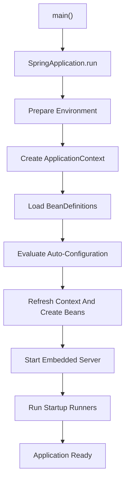

# Spring Ecosystem Interview Questions

This guide covers practical Spring Framework and Spring Boot questions expected
from experienced backend engineers. Strong answers should explain both the
public API and the internal mechanism, then mention production trade-offs.

## Core Spring And Spring Boot

### What Are The Main Features Of Spring Boot?

- opinionated auto-configuration based on the classpath and application state;
- starter dependencies with compatible dependency management;
- embedded servlet or reactive servers;
- externalized and type-safe configuration;
- production endpoints through Actuator;
- executable JAR packaging;
- testing support and test slices;
- logging, metrics, tracing, health, and graceful-shutdown integration;
- developer tooling and sensible defaults with explicit override points.

Spring Boot does not replace Spring Framework. It configures and packages
Spring applications with less manual setup.

### How Does A Spring Application Start?

```java
@SpringBootApplication
public class Application {
    public static void main(String[] args) {
        SpringApplication.run(Application.class, args);
    }
}
```

`SpringApplication.run(...)` broadly:

1. determines whether the application is servlet, reactive, or non-web;
2. prepares the environment and property sources;
3. creates the appropriate `ApplicationContext`;
4. applies initializers and publishes startup events;
5. loads bean definitions from the primary configuration class;
6. performs component scanning and auto-configuration;
7. refreshes the context and creates non-lazy singleton beans;
8. starts the embedded web server;
9. runs `ApplicationRunner` and `CommandLineRunner`;
10. publishes readiness events and accepts traffic.



See [Spring Boot internals](../development/SPRING-BOOT-INTERNALS.md) for the
complete lifecycle.

### What Does `@SpringBootApplication` Contain?

It combines:

```java
@SpringBootConfiguration
@EnableAutoConfiguration
@ComponentScan
```

- `@SpringBootConfiguration` identifies the primary configuration class.
- `@EnableAutoConfiguration` imports conditional Boot configuration.
- `@ComponentScan` discovers application components below the package of the
  annotated class.

Place the application class in a root package so intended components are found
without broad or fragile scan declarations.

### What Is A Spring Boot Starter?

A starter is a curated dependency descriptor for one capability. It pulls in
the usual libraries and participates in Spring Boot dependency management.

```gradle
implementation 'org.springframework.boot:spring-boot-starter-web'
implementation 'org.springframework.boot:spring-boot-starter-validation'
testImplementation 'org.springframework.boot:spring-boot-starter-test'
```

There is no single starter for every Boot application. Choose starters by
capability: web, data JPA, security, actuator, Kafka, validation, and so on.

### How Do You Disable An Auto-Configuration?

Exclude it from the application:

```java
@SpringBootApplication(exclude = DataSourceAutoConfiguration.class)
public class Application {
}
```

Or configure it externally:

```yaml
spring:
  autoconfigure:
    exclude:
      - org.springframework.boot.autoconfigure.jdbc.DataSourceAutoConfiguration
```

Before excluding it, inspect the condition report and determine why it matched.
An exclusion can hide a dependency or configuration mistake.

### How Does Auto-Configuration Back Off?

Auto-configuration classes use conditions such as:

```text
@ConditionalOnClass
@ConditionalOnMissingBean
@ConditionalOnProperty
@ConditionalOnWebApplication
```

For example, a default bean guarded by `@ConditionalOnMissingBean` is created
only when the application has not supplied its own bean. This is how Boot
provides defaults without preventing customization.

## Dependency Injection And Beans

### Constructor Versus Setter Injection

| Constructor injection | Setter injection |
|---|---|
| Best for required dependencies | Useful for optional dependencies |
| Supports `final` fields | Makes the dependency mutable |
| Object cannot be created incomplete | Object may exist before setter call |
| Easy plain-Java unit testing | Test must remember optional configuration |
| Exposes circular dependencies immediately | Can conceal dependency cycles |

Use constructor injection by default.

### What Is The Difference Between `@Bean` And `@Component`?

`@Component` marks a class for component scanning:

```java
@Component
class TaxCalculator {
}
```

`@Bean` marks a factory method, usually inside `@Configuration`:

```java
@Bean
Clock applicationClock() {
    return Clock.systemUTC();
}
```

Use `@Component` for application-owned classes and `@Bean` for third-party
types or explicit infrastructure construction. Both create container-managed
beans.

### How Do You Resolve Bean Ambiguity?

Ambiguity occurs when multiple beans match one injection point:

```java
interface NotificationSender {
    void send(String message);
}
```

Select the intended bean:

```java
public AlertService(
        @Qualifier("emailSender") NotificationSender sender
) {
    this.sender = sender;
}
```

Or mark one default:

```java
@Primary
@Component
class EmailSender implements NotificationSender {
}
```

Use `@Qualifier` for semantic selection. Use `@Primary` for a genuine default.
If all implementations are required, inject `List<NotificationSender>` or
`Map<String, NotificationSender>`.

### How Do You Give A Bean The Highest Preference?

For single-value injection, use `@Primary`. For ordering a collection,
interceptor, filter, or strategy chain, use `@Order` or `Ordered`:

```java
@Component
@Order(Ordered.HIGHEST_PRECEDENCE)
class CorrelationFilter implements Filter {
}
```

`@Primary` resolves candidate selection. `@Order` controls sequence. They are
not interchangeable.

### How Do You Resolve A Circular Dependency?

```text
OrderService -> PaymentService -> OrderService
```

Preferred solutions:

1. extract coordination into a third service;
2. publish an event instead of making a callback;
3. move shared logic into a smaller dependency;
4. reverse the dependency through a focused interface;
5. pass required data as a method argument.

`@Lazy` or `ObjectProvider` can defer lookup when the cycle reflects an
intentional lifecycle relationship, but they should not be the default fix.
Do not enable circular references merely to make startup succeed.

### What Is `@Order`?

`@Order` supplies relative precedence when Spring processes multiple ordered
components, such as filters, aspects, runners, exception resolvers, or injected
strategy collections.

Lower numbers run earlier:

```java
@Order(1)
class AuthenticationFilter {
}

@Order(2)
class RequestLoggingFilter {
}
```

Ordering support depends on the consuming framework. `@Order` does not control
ordinary bean initialization order; use explicit dependencies when one bean
must be created before another.

## Web And REST

### `@Controller` Versus `@RestController`

`@Controller` commonly returns view names. Use `@ResponseBody` when a method
should write a serialized response body.

`@RestController` combines:

```java
@Controller
@ResponseBody
```

Its methods are therefore serialized through an `HttpMessageConverter`,
normally Jackson for JSON.

### What Is The Purpose Of `@ComponentScan`?

It discovers stereotype-annotated classes and registers bean definitions:

```text
@Component
@Service
@Repository
@Controller
@RestController
@Configuration
```

Scanning begins from configured base packages. Scanning the entire classpath is
slow and can accidentally register test, library, or unrelated configuration.

### How Do You Log Every Request And Exclude Health Checks?

For a servlet application, use `OncePerRequestFilter`:

```java
@Component
@Order(Ordered.HIGHEST_PRECEDENCE)
class RequestLoggingFilter extends OncePerRequestFilter {

    @Override
    protected boolean shouldNotFilter(HttpServletRequest request) {
        return request.getRequestURI().startsWith("/actuator/health");
    }

    @Override
    protected void doFilterInternal(
            HttpServletRequest request,
            HttpServletResponse response,
            FilterChain chain
    ) throws ServletException, IOException {
        long started = System.nanoTime();
        try {
            chain.doFilter(request, response);
        } finally {
            long durationMs =
                    TimeUnit.NANOSECONDS.toMillis(System.nanoTime() - started);
            log.info("Request completed method={} path={} status={} durationMs={}",
                    request.getMethod(),
                    request.getRequestURI(),
                    response.getStatus(),
                    durationMs);
        }
    }
}
```

Do not log credentials, bearer tokens, request bodies by default, or sensitive
query parameters. Use route templates rather than raw IDs in metric labels.
Reactive applications require a `WebFilter`, not a servlet filter.

### Why Does `LazyInitializationException` Occur?

A JPA lazy association is a proxy that needs an open persistence context to
load data. The exception occurs when code accesses it after the transaction or
session has closed:

```java
Order order = orderRepository.findById(id).orElseThrow();
return order.getItems().size(); // fails if items are lazy and context is closed
```

Preferred solutions:

- fetch exactly the required graph inside a transaction;
- use a DTO projection;
- use `join fetch` or `@EntityGraph` for a specific use case;
- map entities to response DTOs inside the service transaction.

Do not make every association eager or rely on Open Session in View to hide
query ownership. Those choices often produce excessive queries and unstable
API performance.

### What Is Spring Boot Actuator?

Actuator exposes operational endpoints and health contributors:

```text
/actuator/health
/actuator/info
/actuator/metrics
/actuator/prometheus
/actuator/loggers
```

Expose only required endpoints and secure sensitive ones. Actuator is an
operational interface, not an administration API for business data.

## Important Annotations

| Annotation | Purpose | Typical example |
|---|---|---|
| `@SpringBootApplication` | Boot entry configuration | application main class |
| `@Configuration` | Declares configuration and bean methods | infrastructure config |
| `@Bean` | Registers a factory-method result | `Clock`, client, mapper |
| `@Component` | Generic scanned component | reusable infrastructure |
| `@Service` | Business service stereotype | checkout service |
| `@Repository` | Persistence stereotype and exception translation | custom DAO |
| `@Controller` | MVC controller, often returning views | HTML application |
| `@RestController` | Controller with response-body serialization | JSON API |
| `@Autowired` | Requests dependency injection | setter or multi-constructor case |
| `@Qualifier` | Selects one candidate | named payment gateway |
| `@Primary` | Marks the default candidate | primary provider |
| `@Order` | Controls ordered-component precedence | filters and rules |
| `@Value` | Injects one expression or property | isolated value |
| `@ConfigurationProperties` | Binds a typed property group | payment settings |
| `@Profile` | Activates a bean for named environments | local stub |
| `@ConditionalOnProperty` | Activates configuration from a property | optional integration |
| `@Transactional` | Defines a transaction boundary | service command |
| `@Async` | Dispatches a proxy-invoked method to an executor | independent background work |
| `@Cacheable` | Reads or stores a method result in cache | product catalog |
| `@Scheduled` | Runs a method according to a schedule | reservation expiry |
| `@Valid` | Cascades Bean Validation | request body |
| `@Validated` | Enables method or configuration validation | property records |
| `@ControllerAdvice` | Centralizes MVC exception handling | API error mapper |

## Tricky Senior-Level Questions

### Why Can `@Transactional` Fail On Self-Invocation?

Spring usually applies transactions through an external proxy. A call from one
method to another method on `this` does not pass through that proxy, so the
second method's transaction annotation is not intercepted. Move the boundary
to another bean or redesign the public transaction entry point.

### Why Can `@Async` Fail Even When The Annotation Is Present?

Common causes:

- asynchronous execution was not enabled;
- the method is called through self-invocation;
- the method is not eligible for proxy interception;
- the executor is saturated or misconfigured;
- the caller expects thread-local transaction, security, or MDC state to move
  automatically.

Use a bounded, named executor and propagate required context explicitly.

### Are Singleton Beans Thread-Safe?

No. Singleton means one bean instance per application context, not automatic
thread safety. Keep singleton services stateless or protect mutable state with
an appropriate concurrency design.

### What Is The Difference Between Bean Scope And Object Lifetime?

Scope tells Spring how instances are obtained, for example singleton,
prototype, request, or session. A prototype bean injected into a singleton is
resolved once during singleton construction unless a provider or scoped proxy
is used.

### What Is The Difference Between A Filter, Interceptor, And Aspect?

| Mechanism | Boundary | Typical use |
|---|---|---|
| Servlet `Filter` | before/after servlet processing | correlation, security, request logging |
| MVC `HandlerInterceptor` | around controller handling | handler-specific policy |
| Spring AOP aspect | Spring bean method calls | transactions, audit, application cross-cutting logic |

### Why Avoid Calling Remote Services Inside A Database Transaction?

The transaction can hold connections and locks while waiting on an unreliable
network. This increases contention and makes rollback behavior ambiguous. Use
short local transactions and patterns such as transactional outbox for
reliable asynchronous publication.

### What Happens If Two `SecurityFilterChain` Beans Match?

Spring Security uses the first matching chain according to chain order. Each
chain must have a clear `securityMatcher`, and ordering must be explicit.
Overlapping matchers can apply unexpected authentication or authorization.

### How Should Configuration Secrets Be Injected?

Use environment-specific secret stores or orchestrator secrets, expose them as
configuration, bind them to narrow property classes, and avoid logging them.
Do not commit production secrets or package them inside the application image.

## Related Guides

- [Spring ecosystem](SPRING-ECOSYSTEM.md)
- [Spring Boot internals](../development/SPRING-BOOT-INTERNALS.md)
- [Spring REST APIs](../development/SPRING-REST-APIS.md)
- [Spring AOP](SPRING-AOP.md)
- [Spring Cache](SPRING-CACHE.md)
- [Spring Transactions](SPRING-TRANSACTIONS.md)
- [Spring Security](../security/SPRING-SECURITY-GENERIC.md)
- [Spring Data JPA](SPRING-DATA-JPA.md)
- [Spring Boot Testing](SPRING-BOOT-TESTING.md)
