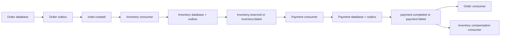
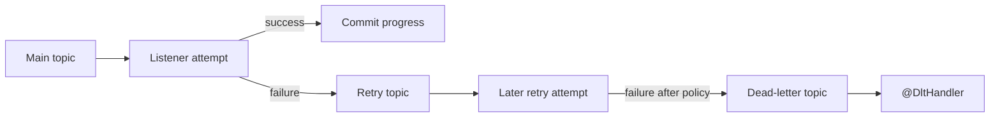

# Spring Kafka

Spring Kafka integrates Java applications with Apache Kafka. Kafka is
Shopverse's asynchronous event transport. Order, Inventory, and
Payment services exchange SAGA events without holding an HTTP request or a
database transaction open across services.

Apache Kafka broker architecture and platform concepts are documented in
[Apache Kafka](../integration/APACHE-KAFKA.md). This page focuses on Spring
Boot configuration, `KafkaTemplate`, listeners, acknowledgment, retry, DLT,
transactions, concurrency, and Shopverse implementation.

## Dependencies

The event-driven services use Spring Boot's Kafka starter:

```gradle
implementation 'org.springframework.boot:spring-boot-starter-kafka'
```

It provides Spring Kafka, Kafka client libraries, `KafkaTemplate`, listener
containers, serializers, consumer infrastructure, retry-topic support, health
information, metrics, and Spring Boot configuration.

## Kafka Concepts Used By Spring

| Concept | Purpose |
|---|---|
| Broker | Kafka server that stores partitions and serves producers/consumers |
| Cluster | One or more brokers acting as one Kafka system |
| Topic | Named stream of related records |
| Partition | Ordered append-only log and unit of consumer parallelism |
| Record | Key, value, headers, timestamp, partition, and offset |
| Offset | Record position inside one partition |
| Producer | Writes records to topics |
| Consumer | Polls and processes records |
| Consumer group | Consumers cooperating to process a topic |
| Group offset | Last committed processing position for a group |
| Replication | Copies partitions across brokers for fault tolerance |

Ordering is guaranteed only within one partition, not across an entire topic.

## Shopverse Event Flow



The transactional outbox closes the database/Kafka dual-write window. Domain
state and an outbox row commit together, then a scheduled publisher sends the
event to Kafka.

## Publishing With `KafkaTemplate`

Shopverse publishers call:

```java
var result = kafkaTemplate
        .send(event.getTopic(), event.getMessageKey(), event.getPayload())
        .get(10, TimeUnit.SECONDS);
```

`KafkaTemplate` is Spring's producer abstraction. It obtains a Kafka producer,
serializes the key and value, selects a partition, sends the record, and
returns a future containing broker metadata.

Shopverse waits up to ten seconds for broker acknowledgement before marking the
outbox row `PUBLISHED`. If sending fails, the row remains recoverable for a
later attempt.

The order number is used as the message key:

```text
key = ORD-1003
```

Kafka hashes a key to a partition. Events with the same order key normally go
to the same partition, preserving per-order ordering while allowing different
orders to be processed concurrently.

### Producer Configuration

Central configuration includes:

```yaml
spring:
  kafka:
    producer:
      acks: all
      properties:
        enable.idempotence: true
        max.in.flight.requests.per.connection: 5
```

- `acks=all` waits for all in-sync replicas required by the topic's durability
  policy.
- `enable.idempotence=true` prevents duplicate broker writes caused by
  supported producer retries during one producer session.
- bounded in-flight requests retain safe ordering behavior with idempotence.

Producer idempotence does not deduplicate two application calls, consumer
database updates, DLT replay, or an outbox event sent again after a crash.

## Kafka Uses A Pull Model

Kafka consumers pull data by repeatedly calling `poll()` on their assigned
partitions:

```text
Broker partition
      ^
      | poll records
      |
Consumer thread
      |
      +-- invoke listener
      +-- process record
      +-- commit offset
```

Spring's listener container owns the polling loop. Application code only
implements the listener method.

Pulling allows the consumer to control its processing rate and batch size.
Kafka does not invoke the Java method directly from a broker thread. Records
remain stored according to topic retention even after consumption; committed
offsets only record group progress.

If processing takes longer than the configured maximum poll interval, Kafka
can consider the consumer unhealthy, rebalance its partitions, and redeliver
records. Poll and processing settings must therefore match real workload.

## Consuming With `@KafkaListener`

```java
@KafkaListener(
        topics = "${shopverse.kafka.topics.payment-failed}",
        groupId = "${spring.application.name}"
)
public void onPaymentFailed(String payload) {
    PaymentFailedEvent event = readEvent(payload, PaymentFailedEvent.class);
    CorrelationContext.run(
            event.correlationId(),
            () -> handlePaymentFailed(event)
    );
}
```

`@KafkaListener` marks the method as the endpoint for a Spring-managed message
listener container. Spring Boot supplies the default container factory from
`spring.kafka.*` properties.

At startup Spring:

1. finds the annotation;
2. creates a listener endpoint and container;
3. creates a Kafka consumer;
4. subscribes it to the topic using the group ID;
5. starts a polling thread;
6. converts each record to the method arguments;
7. invokes the listener on the consumer-container thread.

`topics` selects the input topic. `groupId` identifies independent processing
progress. Property placeholders keep names in centralized configuration.

Use `ConsumerRecord<K,V>` when topic, key, partition, offset, timestamp, or
headers are needed:

```java
@KafkaListener(topics = "orders", groupId = "inventory-service")
public void consume(ConsumerRecord<String, String> record) {
    log.info(
            "Kafka record received topic={} partition={} offset={} key={}",
            record.topic(),
            record.partition(),
            record.offset(),
            record.key()
    );
}
```

Do not log sensitive payloads by default.

## Consumer Groups

Consumers with the same group ID cooperate. One partition is assigned to at
most one consumer in that group:

```text
Topic: 3 partitions

inventory-service group
  consumer A -> partition 0
  consumer B -> partition 1
  consumer C -> partition 2

analytics group
  consumer X -> partitions 0, 1, 2
```

The Inventory and Analytics groups both receive the records because their
group IDs differ. Within Inventory, each partition is handled by one member.

When a consumer starts, stops, or becomes unhealthy, Kafka rebalances
partitions across surviving group members. Rebalances temporarily pause
processing and may expose duplicates when completed work was not yet committed.

Shopverse uses `${spring.application.name}` as the group ID, so each service
receives the event types it subscribes to while replicas of that service share
the work.

## Acknowledgments And Delivery Semantics

Shopverse central configuration uses:

```yaml
spring:
  kafka:
    consumer:
      enable-auto-commit: false
      auto-offset-reset: earliest
    listener:
      ack-mode: record
```

- auto-commit is disabled, so the container controls offset commits;
- `RECORD` commits the offset after a record listener completes successfully;
- `earliest` applies only when a group has no valid committed offset.

A failure before a successful commit can cause redelivery. A crash after the
database commit but before the offset commit can also redeliver the record.
Shopverse therefore has at-least-once consumption and must make business
effects idempotent.

Manual acknowledgment is useful only when application-controlled offset timing
is genuinely required:

```java
@KafkaListener(topics = "orders", groupId = "worker")
public void consume(String payload, Acknowledgment acknowledgment) {
    process(payload);
    acknowledgment.acknowledge();
}
```

It requires a manual acknowledgment mode. It does not itself make database
work and offset commits atomic.

### Manual Acknowledgment Modes

```yaml
spring:
  kafka:
    listener:
      ack-mode: manual
```

Common container modes include:

| Mode | General behavior |
|---|---|
| `RECORD` | commit after each successfully handled record |
| `BATCH` | commit after records returned by one poll are processed |
| `MANUAL` | listener acknowledges; commit is queued by container semantics |
| `MANUAL_IMMEDIATE` | attempt commit immediately when acknowledgment occurs on the consumer thread |

Exact behavior depends on record versus batch listeners and transaction
configuration. Manual acknowledgment should not be used merely because it
looks more controlled. It adds responsibility for every success, failure, and
threading path.

## Spring Kafka Transactions

Configure a transactional producer ID prefix:

```yaml
spring:
  kafka:
    producer:
      transaction-id-prefix: ${spring.application.name}-${INSTANCE_ID:local}-
```

Each running instance requires unique transactional IDs.

Spring can execute several Kafka sends atomically:

```java
kafkaTemplate.executeInTransaction(operations -> {
    operations.send("order.created", orderNumber, createdPayload);
    operations.send("order.audit", orderNumber, auditPayload);
    return null;
});
```

Either both records become visible to `read_committed` consumers or neither
does.

For a consume-process-produce flow, a Kafka-aware listener container can bind
the consumed offsets and outgoing records to one Kafka transaction:

```text
poll input record
  -> begin Kafka transaction
  -> invoke listener
  -> publish output record
  -> send consumed offset to transaction
  -> commit Kafka transaction
```

Kafka transactions provide exactly-once semantics within Kafka boundaries.
They do not make a MySQL transaction and Kafka transaction one atomic commit.

Unsafe dual write:

```java
@Transactional
public void createOrder() {
    orderRepository.save(order);
    kafkaTemplate.send("order.created", payload);
}
```

Use a transactional outbox when database state and event publication must
survive independent failures:

```java
@Transactional
public void createOrder() {
    orderRepository.save(order);
    outboxRepository.save(OutboxEvent.orderCreated(order));
}
```

Non-blocking retry topics and container transactions have compatibility
constraints. Select retry and transaction semantics together rather than
combining annotations without verifying behavior.

## Is Kafka A Queue?

Kafka can model competing work by using one consumer group:

```text
one topic + one consumer group
  -> each partition record handled by one group member
```

But Kafka retains records after processing and supports multiple groups and
replay, so its fundamental model is a distributed log rather than a
traditional destructive queue.

Use separate topics or explicit routing when different work types require
independent retry, retention, ownership, or scaling.

## Listener Threads

Kafka listeners do not run on Spring Boot's main startup thread. Each running
listener container owns one or more consumer threads and invokes its listener
on those threads.

With default concurrency:

```text
application main thread
  starts Spring
  starts listener containers

listener container thread
  poll -> listener -> offset handling -> poll
```

Multiple `@KafkaListener` endpoints create separate listener containers. Retry
topics also require listener infrastructure. Thread count is therefore based
on listener containers and configured concurrency, not one global application
thread.

The Kafka consumer client is not thread-safe. Spring confines each consumer
instance to its container thread.

## Concurrency And Multithreading

Listener concurrency can be configured on the annotation:

```java
@KafkaListener(
        topics = "orders-topic",
        groupId = "order-processing-group",
        concurrency = "${shopverse.kafka.order-concurrency:3}"
)
public void listenToOrders(String message) {
    process(message);
}
```

Spring creates up to three child consumer containers. Effective parallelism is
limited by the number of assigned partitions:

| Partitions | Consumers in group | Active parallel consumers |
|---:|---:|---:|
| 1 | 3 | 1 |
| 3 | 3 | 3 |
| 6 | 3 | 3 |
| 3 | 6 | 3 |

Across service replicas:

```text
total group consumers = replicas x concurrency
useful consumers <= topic partitions
```

For a topic with six partitions, two replicas with concurrency three can use
all six partitions. Adding more consumers produces idle members unless the
partition count also increases.

Records from one partition remain sequential. Slow processing of one key can
block later records in that partition.

### Should A Listener Use `@Async`?

Usually no:

```java
@Async
@KafkaListener(...)
public void consume(String payload) {
    process(payload);
}
```

Handing work to another executor can let the listener return and commit the
offset before asynchronous work succeeds. It also weakens partition ordering,
retry behavior, MDC context, backpressure, and graceful shutdown.

Use listener concurrency and partitions for Kafka parallelism. If work must be
handed off, design explicit acknowledgment, bounded queues, failure recovery,
context propagation, and shutdown behavior.

## Determining Partition And Consumer Counts

There is no fixed producer-to-consumer ratio. Producers are normally cheap and
can send to all partitions. Consumer capacity depends on processing time and
target throughput.

Estimate one consumer's capacity:

```text
records per second per consumer
    approximately 1000 / average processing time in milliseconds
```

If average processing takes 50 ms, one sequential consumer handles roughly
20 records/second before database, network, and poll overhead.

Estimate required consumers:

```text
required consumers
    = ceiling(target records per second / measured records per consumer)
```

Then choose:

```text
partition count >= required active consumers
```

Also account for peak traffic, key skew, ordering, broker capacity, database
connection limits, downstream rate limits, retry traffic, and desired recovery
time after an outage.

Measure under production-like load. Do not set concurrency higher than the
database connection pool or downstream system can support.

## Non-Blocking Retry With `@RetryableTopic`

Shopverse uses:

```java
@RetryableTopic(attempts = "3")
@KafkaListener(
        topics = "${shopverse.kafka.topics.payment-failed}",
        groupId = "${spring.application.name}"
)
public void onPaymentFailed(String payload) {
    PaymentFailedEvent event = readEvent(payload, PaymentFailedEvent.class);
    CorrelationContext.run(
            event.correlationId(),
            () -> handlePaymentFailed(event)
    );
}
```

`@RetryableTopic` creates non-blocking retry infrastructure. When the listener
throws, Spring publishes the failed record to a retry topic. A retry consumer
later invokes the listener again. After attempts are exhausted, Spring
publishes the record to a dead-letter topic.



`attempts = "3"` means three total delivery attempts in this policy, including
the original attempt. Backoff should be explicit in production so transient
dependencies have time to recover:

```java
@RetryableTopic(
        attempts = "3",
        backoff = @Backoff(delay = 1000, multiplier = 2.0, maxDelay = 10000)
)
```

Classify failures:

- retry transient database, broker, or dependency failures;
- do not repeatedly retry malformed JSON or permanently invalid business data;
- use bounded attempts and delay;
- monitor retry volume and retry-topic lag;
- keep retry duration compatible with business deadlines.

Non-blocking retry topics change cross-record ordering because later records on
the main topic can progress while an earlier record waits on a retry topic.
Do not use this pattern where strict partition ordering across failures is a
hard requirement.

Spring Kafka non-blocking retries are not compatible with batch listeners or
container transactions. Choose the retry and transaction model deliberately.

## `@DltHandler`

`@DltHandler` marks the method that Spring Retry Topic infrastructure invokes
after the configured attempts are exhausted:

```java
@DltHandler
public void onDeadLetter(ConsumerRecord<String, String> record) {
    String sourceTopic = record.topic().replaceFirst("-dlt$", "");

    failedKafkaEventService.record(
            sourceTopic,
            record.value(),
            "Inventory listener failed after retry policy",
            3
    );

    log.error(
            "Inventory event moved to DLT sourceTopic={} partition={} offset={}",
            sourceTopic,
            record.partition(),
            record.offset()
    );
}
```

The handler:

1. receives the record from the DLT;
2. determines the logical source topic;
3. persists an unresolved recovery record;
4. increments a DLT metric;
5. logs the terminal transport failure;
6. leaves replay as an explicit administrative action.

The DLT is a Kafka topic. Shopverse additionally persists a database record so
operators can query failures, retain replay audit fields, and replay through
the transactional outbox.

Prefer metadata from retry/DLT headers or a durable event envelope over
deriving the original topic by removing a suffix. Topic naming strategies can
change, and one listener can subscribe to multiple topics.

## What "One Poison Event Produces One Recovery Record" Means

A poison event is a record that fails every attempt, commonly because its
payload is malformed or its state violates a permanent rule.

This sequence should represent one unresolved incident:

```text
original attempt fails
retry attempt fails
final attempt fails
DLT handler runs
one failed_kafka_events row is created
```

Retry callbacks are delivery attempts, not separate incidents. Persisting a
row on every attempt would create three operator records for one event and
could trigger duplicate replay.

Shopverse currently checks:

```java
if (repository.existsBySourceTopicAndPayloadAndReplayedFalse(topic, payload)) {
    return;
}
repository.save(new FailedKafkaEvent(topic, payload, reason, retries));
```

This suppresses ordinary repeated DLT callbacks for the same unresolved topic
and payload. It is not a strict exactly-once guarantee: concurrent handlers
can both pass the existence check because the database has no matching unique
constraint, and identical payload text is not an ideal event identity.

A production-grade design should include an immutable `eventId` in every event
envelope and enforce:

```text
unique(service, consumer_group, event_id, recovery_state)
```

Alternatively, use a processed-event/inbox table with a unique event ID and
insert it in the same local transaction as the business effect. Database
uniqueness is the final race-safe guarantee.

Therefore, the precise current status is:

- **Implemented:** application-level suppression of common duplicate unresolved
  recovery records.
- **Not fully guaranteed under concurrency:** exactly one row without a unique
  event identity and database constraint.

## Idempotent Consumers

At-least-once delivery means listener code must tolerate duplicates.
Shopverse currently uses:

- stable order numbers as message keys and aggregate identifiers;
- unique checkout idempotency keys;
- unique order/payment relationships;
- state checks before applying transitions;
- optimistic locking for concurrent inventory updates;
- idempotent release behavior bounded by reserved quantity;
- outbox records for durable outgoing events;
- application-level DLT record suppression;
- audited replay through the outbox.

The strongest general pattern is a transactional inbox:

```java
@Transactional
public void handle(OrderCreatedEvent event) {
    if (!processedEventRepository.tryInsert(event.eventId(), "inventory-service")) {
        return;
    }

    inventoryService.reserve(event);
    outboxService.enqueue(...);
}
```

`tryInsert` must rely on a database unique constraint. The processed event,
business update, and outgoing outbox record must commit together.

## Replaying Failed Events

Shopverse administrator APIs load the persisted failure, enqueue its payload
through the local outbox, and record:

- replay count;
- replayed flag;
- replaying user;
- replay timestamp.

Replay only after fixing the permanent cause. Replaying unchanged poison data
creates another retry/DLT cycle.

Replay must use the original event ID and consumer idempotency rules when those
are introduced. An operator action should never bypass normal validation,
authorization, outbox, logging, or metrics.

## Are Messages Being Lost?

Kafka issues often look like message loss while the record is actually in a
different stage.

### Producer Investigation

1. Find the source domain change and outbox row.
2. Check whether the outbox status is pending, failed, or published.
3. Inspect publish attempts and the last error.
4. Confirm `KafkaTemplate.send()` received broker metadata.
5. Verify the destination topic and message key.
6. Check broker availability, topic existence, replication, and disk state.
7. Confirm the producer did not mark the row published before acknowledgement.

### Broker Investigation

1. Describe the topic and partition count.
2. Verify leaders and in-sync replicas.
3. Inspect retention and cleanup policies.
4. Confirm the event was not sent to a similarly named environment/topic.
5. Check retry and DLT topics.

### Consumer Investigation

1. Confirm the expected consumer group is active.
2. Compare current offset, log-end offset, and lag.
3. Inspect listener exceptions and retry-topic lag.
4. Check whether the record is already committed but the database transaction
   failed due to incorrect acknowledgment design.
5. Check DLT persistence and replay audit.
6. Verify deserialization and event-schema compatibility.
7. Inspect rebalances and `max.poll.interval.ms` violations.

Do not reset offsets or replay a topic until the business duplication impact is
understood.

## Consumer Lag

Lag is approximately:

```text
log end offset - consumer group's committed offset
```

Growing lag means records arrive faster than the group commits them. Lag can
result from slow processing, failures, too few partitions/consumers, a stopped
group, key skew, database contention, or rebalance loops.

Inspect all groups:

```powershell
docker compose exec kafka kafka-consumer-groups.sh `
  --bootstrap-server localhost:9092 `
  --describe --all-groups
```

Inspect one group:

```powershell
docker compose exec kafka kafka-consumer-groups.sh `
  --bootstrap-server localhost:9092 `
  --describe `
  --group INVENTORY-SERVICE
```

Important columns include topic, partition, current offset, log-end offset,
lag, consumer ID, host, and client ID.

One instantaneous lag value is not enough. Alert on lag trend, age of the
oldest unprocessed event, and business SAGA duration.

## Slow Consumer Response

1. Measure listener processing time by event type.
2. Identify slow database queries, lock waits, pool exhaustion, remote calls,
   serialization, and excessive logging.
3. Separate permanent poison records through bounded retry and DLT.
4. Check whether one hot key dominates a partition.
5. Make the handler transaction smaller.
6. Add partitions and matching group consumers when work is parallelizable.
7. Increase concurrency only within database and downstream capacity.
8. Tune poll size and maximum poll interval using measured processing time.
9. Use batching only when ordering, retry, and transaction semantics permit it.
10. Apply backpressure instead of creating unbounded executor queues.

Scaling consumers does not fix a locked database or slow downstream service.
It can amplify the failure by increasing concurrent pressure.

## Useful Kafka Commands

List topics:

```powershell
docker compose exec kafka kafka-topics.sh `
  --bootstrap-server localhost:9092 `
  --list
```

Describe a topic:

```powershell
docker compose exec kafka kafka-topics.sh `
  --bootstrap-server localhost:9092 `
  --describe `
  --topic shopverse.order.created
```

Read records for debugging:

```powershell
docker compose exec kafka kafka-console-consumer.sh `
  --bootstrap-server localhost:9092 `
  --topic shopverse.order.created `
  --from-beginning `
  --property print.key=true `
  --property print.partition=true `
  --property print.offset=true
```

Use a temporary group or console consumer carefully. A consumer using the
application's group ID participates in that group and can take partitions away
from the service.

## Observability

Shopverse enables Kafka observation:

```yaml
spring:
  kafka:
    template:
      observation-enabled: true
    listener:
      observation-enabled: true
```

Monitor:

- producer send rate, errors, retries, and latency;
- consumer records rate and processing duration;
- consumer lag and oldest-event age;
- group rebalances;
- retry-topic and DLT volume;
- outbox pending count and oldest pending age;
- DLT persistence and replay counters;
- end-to-end SAGA completion time.

Current application metrics include:

```text
shopverse.kafka.dlt.events
shopverse.kafka.dlt.replays
shopverse.outbox.publish
```

Logs should include event ID when available, aggregate/order number,
correlation ID, topic, partition, offset, event type, attempt, and outcome.
Avoid putting order numbers, payloads, or correlation IDs into metric labels
because they create unbounded cardinality.

## Event Design Practices

- Use a stable event name and explicit schema version.
- Include immutable `eventId`, `occurredAt`, `correlationId`, aggregate ID, and
  aggregate version.
- Keep business events immutable.
- Use backward-compatible schema evolution.
- Avoid exposing JPA entities as event contracts.
- Use the aggregate ID as key when per-aggregate ordering matters.
- Validate payloads at the consumer boundary.
- Do not log secrets or full personal/payment payloads.
- Define retention, partition, replication, and replay policies per topic.
- Keep listeners thin and delegate transactional work to services.

Example envelope:

```json
{
  "eventId": "a7bd1ec4-31b1-4bb0-8bb7-a172bcfa7467",
  "eventType": "InventoryReserved",
  "schemaVersion": 1,
  "occurredAt": "2026-06-11T12:30:00Z",
  "correlationId": "checkout-9001",
  "aggregateId": "ORD-1003",
  "aggregateVersion": 2,
  "data": {
    "productId": 101,
    "quantity": 1
  }
}
```

The event ID and aggregate version are recommended hardening items; current
Shopverse event records do not consistently expose both.

## Production Checklist

1. Use explicit topic ownership, partitions, replication, and retention.
2. Require stable event IDs and versioned schemas.
3. Use keys for required ordering.
4. Use `acks=all` and idempotent producers.
5. Keep database/Kafka consistency behind a transactional outbox.
6. Keep listeners thin and transactional handlers idempotent.
7. Use bounded, classified retries with backoff.
8. Persist terminal failures and audit replay.
9. Enforce inbox/recovery deduplication with database uniqueness.
10. Scale consumers according to partitions and measured capacity.
11. Avoid arbitrary `@Async` listener handoff.
12. Monitor lag, oldest-event age, retry traffic, DLTs, and outbox backlog.
13. Test malformed events, duplicates, broker outages, crashes, and rebalances.
14. Secure brokers with authentication, authorization, and encryption outside
    local POC environments.

## Related Guides

- [SAGA and outbox implementation](../reliability/SAGA-OUTBOX.md)
- [Generic SAGA and outbox patterns](../reliability/SAGA-GENERIC.md)
- [Spring Transactions](../spring/SPRING-TRANSACTIONS.md)
- [MDC and correlation](../observability/MDC-CORRELATION-TRACING.md)
- [Prometheus queries](../observability/PROMETHEUS.md)
- [Debugging](../development/DEBUGGING.md)

## Official References

- [Spring Kafka `@KafkaListener`](https://docs.spring.io/spring-kafka/reference/kafka/receiving-messages/listener-annotation.html)
- [Spring Kafka non-blocking retries](https://docs.spring.io/spring-kafka/reference/retrytopic.html)
- [Apache Kafka documentation](https://kafka.apache.org/documentation/)
