# Spring Cloud OpenFeign

OpenFeign provides declarative synchronous HTTP clients. Shopverse uses logical Eureka service names instead of hard-coded instance URLs.

## Dependency

```gradle
implementation 'org.springframework.cloud:spring-cloud-starter-openfeign'
```

Use the Spring Cloud BOM compatible with the application's Spring Boot
generation:

```gradle
dependencyManagement {
    imports {
        mavenBom "org.springframework.cloud:spring-cloud-dependencies:${springCloudVersion}"
    }
}
```

Enable client discovery:

```java
@SpringBootApplication
@EnableFeignClients
public class OrderServiceApplication {
}
```

## Implemented Clients

- Auth Service calls User Service through `@FeignClient(name = "USER-SERVICE")`.
- Order Service reads the public inventory catalog through `@FeignClient(name = "INVENTORY-SERVICE")`.
- Spring Cloud LoadBalancer resolves a healthy registered instance.

```java
@FeignClient(name = "USER-SERVICE", configuration = FeignCorrelationConfig.class)
public interface UserClient {
    @GetMapping("/api/v1/internal/users/authenticated")
    UserResponse authenticatedUser();
}
```

## Why Feign

- The Java interface is the client contract.
- Spring MVC annotations describe method, path, and parameters.
- Eureka and LoadBalancer handle service location.
- Micrometer observation can create client spans.
- Interceptors consistently add internal authentication or correlation headers.
- encoders and decoders integrate with Spring's message conversion;
- error decoders centralize non-success response mapping;
- configuration can be applied per client.

## Internal Working

Spring Cloud OpenFeign does not call `RestTemplate` or `WebClient` by default.
It creates a runtime proxy backed by Feign's own request pipeline:

```mermaid
flowchart LR
    Caller --> Proxy["Feign interface proxy"]
    Proxy --> Contract["Parse Spring MVC annotations"]
    Contract --> Template["Build RequestTemplate"]
    Template --> Interceptors["RequestInterceptors"]
    Interceptors --> Encoder["Encode body and parameters"]
    Encoder --> LB["Spring Cloud LoadBalancer"]
    LB --> Client["Feign Client implementation"]
    Client --> Server["Remote HTTP service"]
    Server --> Decoder["Decoder or ErrorDecoder"]
    Decoder --> Caller
```



At startup:

1. `@EnableFeignClients` scans `@FeignClient` interfaces;
2. Spring registers a factory bean for each interface;
3. Feign parses method annotations into method metadata;
4. a proxy is registered in the application context;
5. calling a method builds an HTTP request;
6. interceptors add headers;
7. LoadBalancer resolves a service instance when a logical name is used;
8. the selected Feign client sends the request;
9. the decoder converts the response or the error decoder raises an exception.

## Which HTTP Client Does Feign Use?

Feign defines a `feign.Client` abstraction. The concrete transport depends on
classpath and configuration:

| Client | When used |
|---|---|
| Feign default client | simple fallback using JDK URL connection behavior |
| Apache HttpClient 5 | when the Feign HC5 integration is present and enabled |
| OkHttp | when the Feign OkHttp integration is present and enabled |
| Load-balancing wrapper | delegates to the selected client after choosing a service instance |

Do not claim one transport without checking the dependency tree and effective
configuration. Feign is the declarative proxy layer; the selected
`feign.Client` is the network transport.

## Request And Response Example

```java
@FeignClient(
        name = "inventory-service",
        path = "/api/v1/inventory",
        configuration = InventoryFeignConfiguration.class
)
public interface InventoryClient {

    @GetMapping("/{productId}")
    InventoryResponse getInventory(
            @PathVariable long productId,
            @RequestHeader("X-Correlation-Id") String correlationId
    );

    @PostMapping("/reservations")
    ReservationResponse reserve(
            @RequestHeader("Idempotency-Key") String idempotencyKey,
            @Valid @RequestBody ReservationRequest request
    );
}
```

Keep client interfaces narrow and consumer-oriented. Do not mirror every
controller of the remote service.

## Timeouts

```yaml
spring:
  cloud:
    openfeign:
      client:
        config:
          inventory-service:
            connectTimeout: 2000
            readTimeout: 3000
            loggerLevel: basic
```

- connect timeout bounds connection establishment;
- read timeout bounds waiting for response data;
- the caller still needs an overall business deadline.

Timeouts must be shorter than upstream request deadlines. Retries multiply
latency, so calculate the complete worst-case duration.

Service-name resolution and instance selection are explained in
[Load balancing](../architecture/LOAD-BALANCING-GENERIC.md).

## Correlation Propagation

```java
@Bean
RequestInterceptor correlationIdRequestInterceptor() {
    return template -> {
        String correlationId = MDC.get("correlationId");
        if (correlationId != null && !correlationId.isBlank()) {
            template.header("X-Correlation-Id", correlationId);
        }
    };
}
```

Micrometer propagates W3C trace headers independently. The interceptor preserves the business correlation ID.

The full request-filter, MDC, Feign, Kafka, and trace flow is documented in
[MDC, correlation IDs, and tracing](../observability/MDC-CORRELATION-TRACING.md#end-to-end-propagation).

## Error And Resilience Rules

- Put `@Retry` and `@CircuitBreaker` on the service method that owns the remote operation, not on the Feign interface.
- Retry only safe or idempotent calls.
- Bound retries and define a fallback that returns an explicit degraded response.
- Do not log passwords, Basic credentials, JWTs, or full sensitive response bodies.
- Configure connection and read timeouts centrally.

Order's catalog call uses annotation-based Retry and CircuitBreaker with a fallback. Authentication failures are deliberately not hidden behind a fallback.

## Error Decoder

```java
@Bean
ErrorDecoder inventoryErrorDecoder() {
    return (methodKey, response) -> switch (response.status()) {
        case 404 -> new ProductNotFoundException();
        case 409 -> new InventoryConflictException();
        case 503 -> new InventoryUnavailableException();
        default -> new ErrorDecoder.Default()
                .decode(methodKey, response);
    };
}
```

Do not convert every failure into a generic `500`. Preserve whether the error
is validation, authentication, conflict, missing data, throttling, or temporary
unavailability.

## Feign Versus Other Spring Clients

| Client | Best fit |
|---|---|
| OpenFeign | declarative Spring Cloud clients with discovery/load balancing |
| `RestClient` | explicit synchronous imperative HTTP |
| `WebClient` | reactive, streaming, and non-blocking composition |
| HTTP interface client | declarative Spring client without Spring Cloud Feign |

Use Feign when the declarative contract and Spring Cloud integration provide
real value. For a one-method external integration, `RestClient` may be simpler.

## Testing

Test the interface against a stub HTTP server such as WireMock:

```java
stubFor(get(urlEqualTo("/api/v1/inventory/101"))
        .willReturn(okJson("""
                {
                  "productId": 101,
                  "availableQuantity": 5
                }
                """)));
```

This verifies path, headers, serialization, status handling, and decoding.
Mocking the Java interface in a service unit test does not prove the HTTP
contract.

## Do And Do Not

| Do | Do not |
|---|---|
| Configure explicit timeouts | Depend on defaults |
| Keep interfaces small | Mirror a whole remote service |
| Propagate approved context with interceptors | Copy tokens and headers manually everywhere |
| Map errors deliberately | Hide every failure behind a fallback |
| Retry only safe/idempotent calls | Retry payment charges blindly |
| Verify the selected HTTP transport | Assume Feign uses `RestTemplate` |
| Test against a stub server | Test only a mocked Java interface |
| Use service discovery for internal names | Hard-code changing instance addresses |

## Related Guides

- [Spring REST APIs](../development/SPRING-REST-APIS.md)
- [Load Balancing](../architecture/LOAD-BALANCING-GENERIC.md)
- [Resilience4j](../reliability/RESILIENCE4J-GENERIC.md)
- [MDC And Correlation](../observability/MDC-CORRELATION-TRACING.md)
