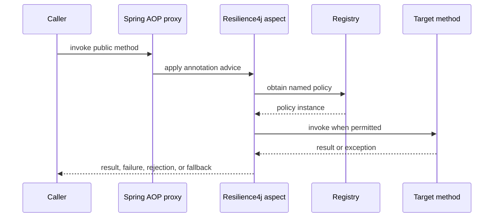

# Resilience With Spring Boot And Resilience4j

Resilience4j integrates fault-tolerance policies with Spring-managed beans.
Spring AOP intercepts annotated method calls and obtains the named policy from
a Resilience4j registry.

## Dependencies

```gradle
implementation "io.github.resilience4j:resilience4j-spring-boot4:${resilience4jVersion}"
implementation "org.springframework:spring-aop"
implementation "org.aspectj:aspectjweaver"
implementation "org.springframework.boot:spring-boot-starter-actuator"
runtimeOnly "io.micrometer:micrometer-registry-prometheus"
```

For Spring Cloud Gateway:

```gradle
implementation "org.springframework.cloud:spring-cloud-starter-circuitbreaker-reactor-resilience4j"
```

Use versions compatible with the Spring Boot and Spring Cloud release train.

## Annotation Flow



Calls made through `this.someAnnotatedMethod()` normally bypass the proxy.
Move the protected operation to another Spring bean or use programmatic
decoration when self-invocation cannot be avoided.

## Annotation Reference

All annotation `name` values select a configuration instance under the
corresponding `resilience4j.*.instances` section.

| Annotation | Purpose | Important annotation attributes |
|---|---|---|
| `@Retry` | repeats a classified transient failure | `name`, `fallbackMethod` |
| `@CircuitBreaker` | rejects calls while a dependency is considered unhealthy | `name`, `fallbackMethod` |
| `@RateLimiter` | controls call admission per time period | `name`, `fallbackMethod` |
| `@Bulkhead` | limits concurrent calls or isolates work in a thread pool | `name`, `type`, `fallbackMethod` |
| `@TimeLimiter` | applies a deadline to supported async/reactive return types | `name`, `fallbackMethod` |

```java
@Retry(name = "inventory-client", fallbackMethod = "catalogFallback")
@CircuitBreaker(name = "inventory-client", fallbackMethod = "catalogFallback")
public CatalogResponse loadCatalog(String category) {
    return inventoryClient.getCatalog(category);
}

private CatalogResponse catalogFallback(
        String category,
        Throwable failure
) {
    return CatalogResponse.unavailable(category);
}
```

The fallback must return a compatible type. It receives original arguments in
the same order and a compatible exception as its final argument.

## Retry Parameters

| Parameter | One-line description |
|---|---|
| `max-attempts` | total calls including the original attempt |
| `wait-duration` | base delay between attempts |
| `retry-exceptions` | exception classes explicitly eligible for retry |
| `ignore-exceptions` | exception classes that must not be retried |
| `retry-exception-predicate` | custom class deciding whether an exception is retryable |
| `retry-on-result-predicate` | custom class deciding whether a returned value should be retried |
| `fail-after-max-attempts` | controls whether max-attempt exhaustion raises a retry-specific failure |
| `enable-exponential-backoff` | multiplies delay after each failed attempt |
| `exponential-backoff-multiplier` | factor used to grow exponential delay |
| `enable-randomized-wait` | randomizes wait to reduce synchronized retry waves where supported |
| `randomized-wait-factor` | controls random variation around the wait duration |

## Constant Retry

```java
@Retry(name = "inventory-client")
public CatalogResponse loadCatalog() {
    return inventoryClient.getCatalog();
}
```

```yaml
resilience4j:
  retry:
    instances:
      inventory-client:
        max-attempts: 3
        wait-duration: 250ms
```

`max-attempts` includes the first call. This configuration performs one initial
attempt and at most two retries, each separated by 250 ms.

Constant delay is suitable for a small, controlled retry budget. It can create
synchronized retry waves when many callers fail at the same time.

## Exponential Backoff

```yaml
resilience4j:
  retry:
    instances:
      inventory-client:
        max-attempts: 4
        wait-duration: 200ms
        enable-exponential-backoff: true
        exponential-backoff-multiplier: 2
```

Approximate delays:

```text
attempt 1 -> immediate
attempt 2 -> 200 ms
attempt 3 -> 400 ms
attempt 4 -> 800 ms
```

The full operation budget includes connection acquisition, network timeouts,
method execution, and retry waits.

## Jitter

Jitter randomizes delays so many instances do not retry together:

```text
delay = exponential delay +/- randomization
```

When configuration support differs by Resilience4j version, define an interval
function programmatically and keep the rest of the policy in configuration:

```java
IntervalFunction interval = IntervalFunction
        .ofExponentialRandomBackoff(
                Duration.ofMillis(200),
                2.0,
                0.5
        );
```

Prefer configuration-only policies unless a custom interval or exception
classifier is genuinely required.

## Exception Classification

Retry transient technical failures:

```yaml
resilience4j:
  retry:
    instances:
      inventory-client:
        retry-exceptions:
          - java.net.SocketTimeoutException
          - org.springframework.web.client.ResourceAccessException
        ignore-exceptions:
          - com.shopverse.inventory.ProductNotFoundException
```

Do not retry validation, authentication, authorization, insufficient stock, or
other permanent business outcomes.

## Safe Retry Rules

Retry only when the operation is:

- read-only;
- naturally idempotent;
- protected by a stable idempotency key;
- recoverable through result lookup after an ambiguous timeout.

Never blindly retry a payment charge. The first request may have committed even
when its response was lost.

## Complete Policy Example

```java
@TimeLimiter(name = "payment-provider")
@CircuitBreaker(
        name = "payment-provider",
        fallbackMethod = "paymentUnavailable"
)
@Retry(name = "payment-provider")
public CompletionStage<PaymentResult> authorize(
        PaymentCommand command
) {
    return paymentClient.authorize(command);
}
```

```yaml
resilience4j:
  retry:
    instances:
      payment-provider:
        max-attempts: 3
        wait-duration: 200ms
        enable-exponential-backoff: true
        exponential-backoff-multiplier: 2
  circuitbreaker:
    instances:
      payment-provider:
        sliding-window-size: 20
        minimum-number-of-calls: 10
        failure-rate-threshold: 50
        slow-call-duration-threshold: 1s
        slow-call-rate-threshold: 50
        wait-duration-in-open-state: 15s
  timelimiter:
    instances:
      payment-provider:
        timeout-duration: 2s
```

Annotation ordering is controlled by configured aspect order. Test the effective
composition instead of assuming source-code order.

## Circuit Breaker Parameters

| Parameter | One-line description |
|---|---|
| `sliding-window-type` | uses `COUNT_BASED` calls or a `TIME_BASED` interval |
| `sliding-window-size` | number of calls or seconds retained in the evaluation window |
| `minimum-number-of-calls` | observations required before thresholds can open the circuit |
| `failure-rate-threshold` | failed-call percentage that opens the circuit |
| `slow-call-rate-threshold` | slow-call percentage that opens the circuit |
| `slow-call-duration-threshold` | duration after which a call is considered slow |
| `wait-duration-in-open-state` | time before OPEN can transition to HALF_OPEN |
| `permitted-number-of-calls-in-half-open-state` | trial calls allowed during HALF_OPEN |
| `max-wait-duration-in-half-open-state` | maximum HALF_OPEN duration before reevaluation |
| `automatic-transition-from-open-to-half-open-enabled` | schedules transition without requiring a new caller |
| `record-exceptions` | exceptions counted as failures |
| `ignore-exceptions` | exceptions excluded from failure calculation |
| `record-failure-predicate` | custom failure classifier |

## Rate Limiter Parameters

| Parameter | One-line description |
|---|---|
| `limit-for-period` | permissions created during each refresh period |
| `limit-refresh-period` | interval at which the permission budget refreshes |
| `timeout-duration` | maximum wait for permission before rejection |
| `register-health-indicator` | exposes policy health when supported/configured |
| `event-consumer-buffer-size` | number of recent events retained for event consumers |

`timeout-duration: 0` fails fast instead of occupying request threads while
waiting for the next permission window.

## Bulkhead Types

### Semaphore Bulkhead

```java
@Bulkhead(
        name = "inventory-api",
        type = Bulkhead.Type.SEMAPHORE
)
```

A semaphore bulkhead executes on the caller thread and limits simultaneous
method executions.

| Parameter | One-line description |
|---|---|
| `max-concurrent-calls` | maximum calls allowed to execute at once |
| `max-wait-duration` | maximum wait for a semaphore permit |

Use it for synchronous controller/service calls where only concurrency must be
bounded.

### Thread-Pool Bulkhead

```java
@Bulkhead(
        name = "report-provider",
        type = Bulkhead.Type.THREADPOOL
)
public CompletionStage<Report> generateReport() {
    return CompletableFuture.supplyAsync(this::loadReport);
}
```

Thread-pool bulkhead isolates execution in a dedicated executor and bounded
queue.

| Parameter | One-line description |
|---|---|
| `core-thread-pool-size` | baseline worker thread count |
| `max-thread-pool-size` | maximum worker thread count |
| `queue-capacity` | waiting tasks accepted before rejection |
| `keep-alive-duration` | idle time before excess threads terminate |
| `writable-stack-trace-enabled` | controls rejection-exception stack traces |

Use it when dedicated executor isolation is required. It adds queueing,
context-propagation, cancellation, and thread-management concerns.

### Choosing The Type

| Semaphore | Thread pool |
|---|---|
| low overhead | stronger executor isolation |
| caller thread executes | dedicated worker executes |
| natural for synchronous methods | natural for async return types |
| no queue unless permit wait is configured | bounded queue available |
| MDC/security context remains on caller thread | context must be propagated |

Virtual threads reduce thread cost but do not replace a bulkhead. The
downstream connection pool and service capacity are still finite.

## Time Limiter Parameters

| Parameter | One-line description |
|---|---|
| `timeout-duration` | maximum permitted asynchronous execution time |
| `cancel-running-future` | requests cancellation when timeout occurs |

Cancellation is cooperative. A timed-out remote request or database operation
may continue unless the underlying client supports cancellation and has its own
network/query timeout.

## Capacity-Aware Bulkheads

An upper estimate for concurrent work is:

```text
concurrency = arrival rate per second x average service time in seconds
```

At 80 requests/second and 250 ms:

```text
80 x 0.25 = 20 concurrent requests
```

Add measured headroom, but keep the bulkhead below downstream limits such as
the datasource pool or HTTP connection pool.

## HTTP Mapping

```java
@RestControllerAdvice
class ResilienceExceptionHandler {

    @ExceptionHandler(RequestNotPermitted.class)
    ResponseEntity<ProblemDetail> rateLimited() {
        var problem = ProblemDetail.forStatus(429);
        problem.setDetail("Request rate limit exceeded");
        return ResponseEntity.status(429).body(problem);
    }

    @ExceptionHandler({
            BulkheadFullException.class,
            CallNotPermittedException.class
    })
    ResponseEntity<ProblemDetail> unavailable() {
        var problem = ProblemDetail.forStatus(503);
        problem.setDetail("Service capacity is temporarily unavailable");
        return ResponseEntity.status(503).body(problem);
    }
}
```

## Production Practices

1. Establish deadlines before adding retries.
2. Keep retries at one owning layer where possible.
3. Use exponential backoff and jitter for shared remote dependencies.
4. Classify retryable exceptions.
5. Protect side effects with idempotency.
6. Size bulkheads from measured downstream capacity.
7. Keep rejection immediate or tightly bounded.
8. Make fallbacks truthful and observable.
9. Export Actuator/Micrometer metrics.
10. Test outage, recovery, saturation, and half-open behavior.

## Do And Do Not

| Do | Do not |
|---|---|
| configure named policies centrally | create policy beans for every endpoint without need |
| retry idempotent transient work | retry validation, authorization, or permanent business failure |
| use backoff and jitter | retry immediately across every architecture layer |
| set HTTP/database timeouts too | assume `@TimeLimiter` stops all underlying work |
| map rejection to `429`/`503` | expose generic `500` for expected capacity rejection |
| measure limits with load tests | copy arbitrary permit and pool numbers |
| keep fallback truthful | return empty data that looks authoritative |
| call annotated methods through a proxy | rely on self-invocation |
| monitor retries, rejections, and breaker state | hide degradation from operators |
| test the composed order | infer execution order from annotation placement |

## Related Guides

- [Generic Resilience4j Patterns](../reliability/RESILIENCE4J-GENERIC.md)
- [Distributed Rate Limiting](../reliability/DISTRIBUTED-RATE-LIMITING.md)
- [Shopverse Resilience4j](../reliability/RESILIENCE4J.md)
- [Micrometer Metrics](../observability/MICROMETER-METRICS.md)
