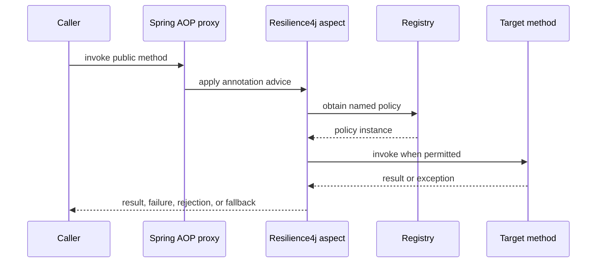

# Resilience With Spring Boot And Resilience4j

Resilience4j integrates fault-tolerance policies with Spring-managed beans.
Spring AOP intercepts annotated method calls and obtains the named policy from
a Resilience4j registry.

## Dependencies

```gradle
implementation "io.github.resilience4j:resilience4j-spring-boot4:${resilience4jVersion}"
implementation "org.springframework:spring-aop"
implementation "org.aspectj:aspectjweaver"
implementation "org.springframework.boot:spring-boot-starter-actuator"
runtimeOnly "io.micrometer:micrometer-registry-prometheus"
```

For Spring Cloud Gateway:

```gradle
implementation "org.springframework.cloud:spring-cloud-starter-circuitbreaker-reactor-resilience4j"
```

Use versions compatible with the Spring Boot and Spring Cloud release train.

## Annotation Flow



Calls made through `this.someAnnotatedMethod()` normally bypass the proxy.
Move the protected operation to another Spring bean or use programmatic
decoration when self-invocation cannot be avoided.

## Constant Retry

```java
@Retry(name = "inventory-client")
public CatalogResponse loadCatalog() {
    return inventoryClient.getCatalog();
}
```

```yaml
resilience4j:
  retry:
    instances:
      inventory-client:
        max-attempts: 3
        wait-duration: 250ms
```

`max-attempts` includes the first call. This configuration performs one initial
attempt and at most two retries, each separated by 250 ms.

Constant delay is suitable for a small, controlled retry budget. It can create
synchronized retry waves when many callers fail at the same time.

## Exponential Backoff

```yaml
resilience4j:
  retry:
    instances:
      inventory-client:
        max-attempts: 4
        wait-duration: 200ms
        enable-exponential-backoff: true
        exponential-backoff-multiplier: 2
```

Approximate delays:

```text
attempt 1 -> immediate
attempt 2 -> 200 ms
attempt 3 -> 400 ms
attempt 4 -> 800 ms
```

The full operation budget includes connection acquisition, network timeouts,
method execution, and retry waits.

## Jitter

Jitter randomizes delays so many instances do not retry together:

```text
delay = exponential delay +/- randomization
```

When configuration support differs by Resilience4j version, define an interval
function programmatically and keep the rest of the policy in configuration:

```java
IntervalFunction interval = IntervalFunction
        .ofExponentialRandomBackoff(
                Duration.ofMillis(200),
                2.0,
                0.5
        );
```

Prefer configuration-only policies unless a custom interval or exception
classifier is genuinely required.

## Exception Classification

Retry transient technical failures:

```yaml
resilience4j:
  retry:
    instances:
      inventory-client:
        retry-exceptions:
          - java.net.SocketTimeoutException
          - org.springframework.web.client.ResourceAccessException
        ignore-exceptions:
          - com.shopverse.inventory.ProductNotFoundException
```

Do not retry validation, authentication, authorization, insufficient stock, or
other permanent business outcomes.

## Safe Retry Rules

Retry only when the operation is:

- read-only;
- naturally idempotent;
- protected by a stable idempotency key;
- recoverable through result lookup after an ambiguous timeout.

Never blindly retry a payment charge. The first request may have committed even
when its response was lost.

## Complete Policy Example

```java
@TimeLimiter(name = "payment-provider")
@CircuitBreaker(
        name = "payment-provider",
        fallbackMethod = "paymentUnavailable"
)
@Retry(name = "payment-provider")
public CompletionStage<PaymentResult> authorize(
        PaymentCommand command
) {
    return paymentClient.authorize(command);
}
```

```yaml
resilience4j:
  retry:
    instances:
      payment-provider:
        max-attempts: 3
        wait-duration: 200ms
        enable-exponential-backoff: true
        exponential-backoff-multiplier: 2
  circuitbreaker:
    instances:
      payment-provider:
        sliding-window-size: 20
        minimum-number-of-calls: 10
        failure-rate-threshold: 50
        slow-call-duration-threshold: 1s
        slow-call-rate-threshold: 50
        wait-duration-in-open-state: 15s
  timelimiter:
    instances:
      payment-provider:
        timeout-duration: 2s
```

Annotation ordering is controlled by configured aspect order. Test the effective
composition instead of assuming source-code order.

## Capacity-Aware Bulkheads

An upper estimate for concurrent work is:

```text
concurrency = arrival rate per second x average service time in seconds
```

At 80 requests/second and 250 ms:

```text
80 x 0.25 = 20 concurrent requests
```

Add measured headroom, but keep the bulkhead below downstream limits such as
the datasource pool or HTTP connection pool.

## HTTP Mapping

```java
@RestControllerAdvice
class ResilienceExceptionHandler {

    @ExceptionHandler(RequestNotPermitted.class)
    ResponseEntity<ProblemDetail> rateLimited() {
        var problem = ProblemDetail.forStatus(429);
        problem.setDetail("Request rate limit exceeded");
        return ResponseEntity.status(429).body(problem);
    }

    @ExceptionHandler({
            BulkheadFullException.class,
            CallNotPermittedException.class
    })
    ResponseEntity<ProblemDetail> unavailable() {
        var problem = ProblemDetail.forStatus(503);
        problem.setDetail("Service capacity is temporarily unavailable");
        return ResponseEntity.status(503).body(problem);
    }
}
```

## Production Practices

1. Establish deadlines before adding retries.
2. Keep retries at one owning layer where possible.
3. Use exponential backoff and jitter for shared remote dependencies.
4. Classify retryable exceptions.
5. Protect side effects with idempotency.
6. Size bulkheads from measured downstream capacity.
7. Keep rejection immediate or tightly bounded.
8. Make fallbacks truthful and observable.
9. Export Actuator/Micrometer metrics.
10. Test outage, recovery, saturation, and half-open behavior.

## Related Guides

- [Generic Resilience4j Patterns](../reliability/RESILIENCE4J-GENERIC.md)
- [Distributed Rate Limiting](../reliability/DISTRIBUTED-RATE-LIMITING.md)
- [Shopverse Resilience4j](../reliability/RESILIENCE4J.md)
- [Micrometer Metrics](../observability/MICROMETER-METRICS.md)

