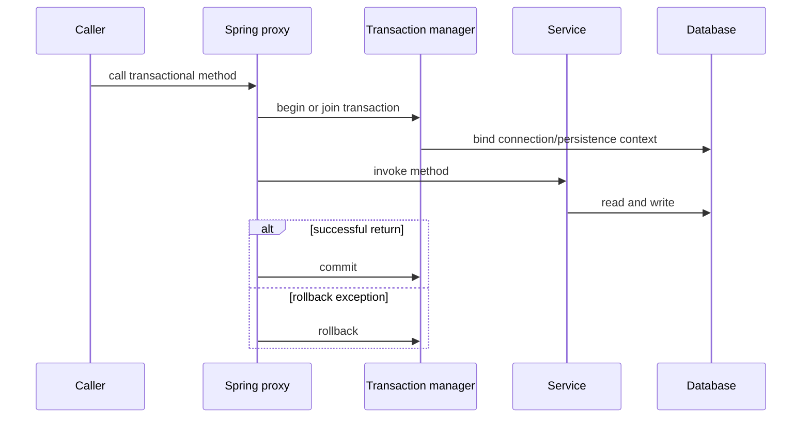
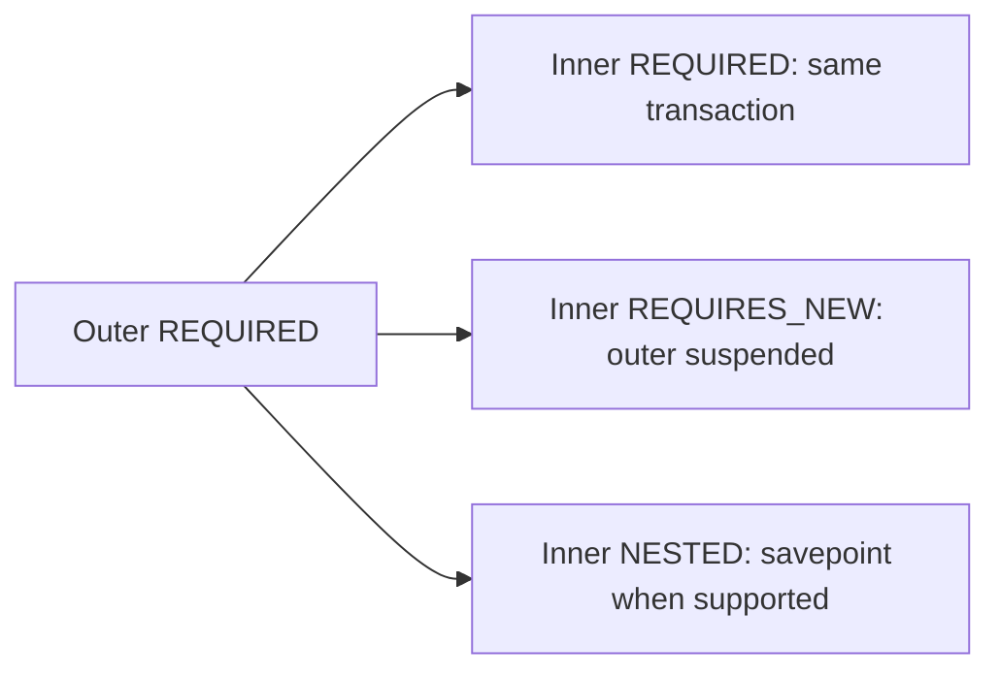

# Spring Transactions

A transaction groups operations into one atomic unit: either its changes
commit or they roll back. This guide focuses on Spring's transaction
abstraction, declarative `@Transactional` behavior, JPA transaction boundaries,
propagation, isolation, rollback, locking, and testing.

Distributed workflows and Kafka consistency require separate patterns. See
[SAGA and outbox](../reliability/SAGA-GENERIC.md), [Spring Kafka](SPRING-KAFKA.md),
and [Shopverse transactions](../reliability/TRANSACTIONS.md).

## ACID

| Property | Meaning |
|---|---|
| Atomicity | all changes commit or none do |
| Consistency | constraints and application rules remain valid |
| Isolation | concurrent transactions have controlled visibility |
| Durability | committed data survives process failure |

ACID applies to resources controlled by one transaction manager. A local MySQL
transaction does not automatically include Kafka or another service's
database.

## How `@Transactional` Works

Spring normally applies transactions through an AOP proxy:



`TransactionInterceptor` reads transaction metadata and delegates to a
`PlatformTransactionManager`. With JPA, `JpaTransactionManager` coordinates the
`EntityManager` and JDBC connection for the current execution context.

The persistence context tracks managed entities. Hibernate usually flushes
pending SQL before commit, but flush is not commit: database constraints can
still fail and the transaction can still roll back.

## Basic Use

```java
@Service
@Transactional(readOnly = true)
class OrderService {

    public OrderResponse find(Long id) {
        return map(repository.findById(id).orElseThrow());
    }

    @Transactional
    public OrderResponse create(CreateOrder command) {
        return map(repository.save(toEntity(command)));
    }
}
```

Class-level read-only behavior makes the default explicit. Write methods
override it.

## Annotation Parameters

```java
@Transactional(
        propagation = Propagation.REQUIRED,
        isolation = Isolation.READ_COMMITTED,
        timeout = 5,
        readOnly = false,
        rollbackFor = IOException.class,
        noRollbackFor = ExpectedBusinessException.class,
        transactionManager = "transactionManager",
        label = "checkout"
)
```

| Parameter | Purpose |
|---|---|
| `propagation` | how the method relates to an existing transaction |
| `isolation` | database visibility guarantees |
| `timeout` | maximum transaction duration where supported |
| `readOnly` | optimization and intent hint; not a security boundary |
| `rollbackFor` | checked or custom exceptions that trigger rollback |
| `noRollbackFor` | exceptions that should not trigger rollback |
| `transactionManager` | selects a manager when multiple resources exist |
| `label` | descriptive labels available to transaction infrastructure |

Use `value` or `transactionManager` to select a manager, not both for different
meanings.

## Rollback Rules

By default, Spring rolls back for:

- `RuntimeException`;
- `Error`.

Checked exceptions do not trigger rollback unless configured:

```java
@Transactional(rollbackFor = IOException.class)
public void importFile() throws IOException {
    // ...
}
```

Do not catch and suppress an exception when the unit must roll back:

```java
@Transactional
public void update() {
    try {
        repository.save(...);
    } catch (DataAccessException exception) {
        log.error("Update failed", exception);
        throw exception;
    }
}
```

After a participating operation marks a transaction rollback-only, catching
the exception does not restore the transaction. A later commit can throw
`UnexpectedRollbackException`.

## Manual And Programmatic Rollback

Declarative rollback is preferred. When the method cannot throw:

```java
TransactionAspectSupport.currentTransactionStatus().setRollbackOnly();
```

Use this sparingly because it hides rollback control inside business code.

`TransactionTemplate` provides an explicit boundary:

```java
transactionTemplate.executeWithoutResult(status -> {
    repository.save(entity);
    if (!isValid(entity)) {
        status.setRollbackOnly();
    }
});
```

Programmatic transactions are useful for loops, tests, or code requiring
precise begin/commit scope. Do not mix several styles in one workflow without a
clear reason.

## Propagation

| Propagation | Behavior |
|---|---|
| `REQUIRED` | join current transaction or create one; default |
| `REQUIRES_NEW` | suspend current transaction and create an independent one |
| `MANDATORY` | require an existing transaction or fail |
| `SUPPORTS` | join when present; otherwise run without one |
| `NOT_SUPPORTED` | suspend current transaction and run without one |
| `NEVER` | fail when a transaction exists |
| `NESTED` | create a savepoint inside the current physical transaction |

`REQUIRES_NEW` needs another database connection while the outer transaction
is suspended. Size the connection pool for expected concurrency and avoid
deep nesting.

`NESTED` depends on savepoint support and transaction-manager capabilities. It
is not the same as an independent transaction.



## Isolation Levels

| Isolation | Dirty reads | Non-repeatable reads | Phantom reads |
|---|---:|---:|---:|
| `READ_UNCOMMITTED` | possible | possible | possible |
| `READ_COMMITTED` | prevented | possible | possible |
| `REPEATABLE_READ` | prevented | prevented | database-dependent |
| `SERIALIZABLE` | prevented | prevented | prevented |
| `DEFAULT` | use database default | use database default | use database default |

Stronger isolation reduces concurrency and can increase blocking or
serialization failures. Select it for a demonstrated invariant, not as a
general safety switch.

Isolation alone does not solve every lost-update problem. Use optimistic
versions, conditional updates, uniqueness constraints, or explicit locks for
the aggregate invariant.

## Optimistic And Pessimistic Locking

Optimistic locking detects a concurrent update:

```java
@Version
private long version;
```

The update includes the previous version. If no row matches, JPA throws an
optimistic locking exception and the transaction rolls back. Retry only a
complete, idempotent operation with fresh state.

Pessimistic locking reserves a row:

```java
@Lock(LockModeType.PESSIMISTIC_WRITE)
@Query("select event from OutboxEvent event where event.id = :id")
Optional<OutboxEvent> findByIdForUpdate(Long id);
```

Keep locked transactions short and access rows in a consistent order to reduce
deadlocks.

## Proxy Limitations

- Calls through `this.someTransactionalMethod()` bypass the proxy.
- `private` methods are not useful transactional entry points.
- final methods/classes can restrict proxying depending on proxy mechanism.
- object construction is not a transactional method invocation.
- transaction context does not automatically move to another thread.
- `@Async` starts separate execution and requires its own transaction boundary.

Move a method needing distinct propagation into another Spring bean or invoke
it through a deliberately designed proxied collaborator.

## Read-Only Transactions

`readOnly=true` communicates intent and can enable driver or ORM optimization.
It does not reliably prevent every database write. Security and correctness
must come from authorization, service design, and database permissions.

For JPA reads, it also scopes the persistence context and lazy access. Keep
`spring.jpa.open-in-view=false` and map required data inside the service
boundary.

## Timeouts And Long Operations

Transactions should contain database work, not:

- HTTP/Feign calls;
- waiting for user input;
- long Kafka sends;
- file uploads;
- arbitrary sleeps;
- CPU-heavy report generation.

Remote calls inside an open transaction extend lock and connection occupancy.
Use an outbox, asynchronous workflow, or a separate pre/post-transaction step.

## Multiple Transaction Managers

An application can define separate managers for different datasources or
Kafka:

```java
@Transactional(transactionManager = "ordersTransactionManager")
```

This selects one manager; it does not make different resources atomic.
JTA/XA can coordinate supported resources through two-phase commit but adds
coupling, operational cost, and failure modes. Microservices commonly prefer
local transactions plus SAGA/outbox consistency.

## Transaction Synchronization

Code sometimes needs to act only after a successful commit, for example
invalidating a cache or scheduling independent work:

```java
@TransactionalEventListener(phase = TransactionPhase.AFTER_COMMIT)
public void onProductChanged(ProductChangedEvent event) {
    cacheEvictor.evict(event.productId());
}
```

The event must be published while a transaction is active. `AFTER_COMMIT`
avoids acting on state that later rolls back, but it is not durable messaging:
a process crash after commit can still lose in-memory follow-up work. Use a
transactional outbox when delivery must survive crashes.

## Deadlocks

A deadlock occurs when transactions wait on each other's locks. The database
rolls back one victim.

Production controls:

- update resources in a consistent order;
- keep transactions short;
- index predicates used by updates and locks;
- avoid user or network waiting inside transactions;
- use bounded batches;
- monitor lock wait and deadlock metrics;
- retry only the complete idempotent unit with bounded backoff and jitter.

Do not retry indefinitely or retry a partial non-idempotent side effect.

## Testing Transactions

- Unit tests verify business decisions without relying on rollback behavior.
- Repository integration tests verify constraints, locking, and query behavior.
- Testcontainers provides the same database engine used by production.
- Commit-sensitive behavior should be tested without relying solely on a
  test-managed transaction that automatically rolls back.
- Concurrency tests should use separate transactions and connections.
- Outbox tests should verify domain and event rows commit or roll back together.

## Production Practices

1. Put boundaries in service-layer methods.
2. Keep one local transaction within one service-owned database.
3. Keep transactions short and free of remote waits.
4. use database constraints as the final invariant.
5. use optimistic locking for normal aggregate contention.
6. use pessimistic locks only for narrow, measured critical sections.
7. define explicit rollback behavior for checked exceptions.
8. avoid proxy self-invocation assumptions.
9. use outbox/SAGA when work crosses database or service boundaries.
10. make retries and consumers idempotent.
11. monitor pool use, transaction time, lock waits, and deadlocks.
12. test failure between every durable step.

## Related Guides

- [Shopverse transactions](../reliability/TRANSACTIONS.md)
- [SAGA and outbox patterns](../reliability/SAGA-GENERIC.md)
- [Liquibase](../data/LIQUIBASE-GENERIC.md)
- [Spring Kafka](SPRING-KAFKA.md)
- [Spring AOP](SPRING-AOP.md)
