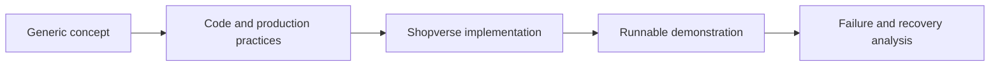

import {KnowledgeHome, ReadingGuide} from '@site/src/components/DocumentationLanding';

<KnowledgeHome />

## How To Use This Library

<ReadingGuide>

Use a generic guide to understand a reusable concept, then open the matching
Shopverse page to inspect a concrete implementation. Implementation pages are
explicitly marked as **Implemented**, **Partial**, or **Planned** so study
material is not confused with current runtime behavior.

</ReadingGuide>

| Goal | Recommended entry point |
|---|---|
| Learn in dependency order | [Backend engineering learning path](reference/LEARNING-PATH.mdx) |
| Understand one complete platform | [Shopverse case study](case-study/SHOPVERSE.mdx) |
| Find operational commands quickly | [Operations cheat sheet](operations/OPERATIONS-CHEATSHEET.md) |
| Prepare for interviews | Use the interview sections in Java, Spring, data, Kafka, and distributed-system guides |
| Diagnose a running Shopverse stack | [Debugging runbook](development/DEBUGGING.md) |
| Modify or deploy this portal | [Docusaurus documentation portal](operations/DOCUSAURUS.md) |

## Documentation Model

Reusable theory stays independent from Shopverse. Project-specific APIs,
configuration, code paths, and operating instructions remain in the case-study
track.
