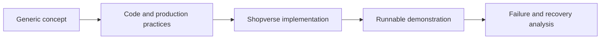

import {KnowledgeHome, ReadingGuide} from '@site/src/components/DocumentationLanding';

<KnowledgeHome />

## How To Use This Library

<ReadingGuide>

Use a generic guide to understand a reusable concept, then open the matching
Shopverse page to inspect a concrete implementation. Implementation pages are
explicitly marked as **Implemented**, **Partial**, or **Planned** so study
material is not confused with current runtime behavior.

</ReadingGuide>

| Goal | Recommended entry point |
|---|---|
| Learn in dependency order | [Backend engineering learning path](reference/LEARNING-PATH.mdx) |
| Understand one complete platform | [Shopverse case study](case-study/SHOPVERSE.mdx) |
| Use shared platform modules | [Platform infrastructure](platform/README.md) |
| Review fixes and measurements | [Problems and solutions index](reliability/problems/README.md) |
| Find operational commands quickly | [Operations cheat sheet](operations/OPERATIONS-CHEATSHEET.md) |
| Prepare for interviews | Use the interview sections in Java, Spring, data, Kafka, and distributed-system guides |
| Diagnose a running Shopverse stack | [Debugging runbook](development/DEBUGGING.md) |
| Modify or deploy this portal | [Docusaurus documentation portal](operations/DOCUSAURUS.md) |

## Quick Routes

| Route | Start here |
|---|---|
| Security | [Security principles](security/principles/SECURITY-PRINCIPLES.md) -> [JWT fundamentals](security/jwt/JWT-FUNDAMENTALS.md) -> [OAuth2 fundamentals](security/oauth/OAUTH2-FUNDAMENTALS.md) -> [SSO and OpenID Connect](security/oauth/SSO-AND-OPENID-CONNECT.md) -> [Google authentication](security/oauth/GOOGLE-AUTHENTICATION-SPRING.md) |
| Microservices | [Microservices and distributed systems](architecture/MICROSERVICES-DISTRIBUTED-SYSTEMS.md) -> [Architecture patterns](architecture/MICROSERVICES-PATTERNS.md) -> [API Gateway](development/API-GATEWAY-GENERIC.md) -> [Spring Kafka](spring/SPRING-KAFKA.md) |
| Reliability | [SAGA pattern](reliability/SAGA-GENERIC.md) -> [Transactional outbox](reliability/OUTBOX-PATTERN.md) -> [Problems and solutions](reliability/PROBLEMS-AND-SOLUTIONS.md) |
| Platform | [Platform infrastructure](platform/README.md) -> [Duplicate logic solutions](platform/DUPLICATE-LOGIC.md) -> [Migration checklist](platform/MIGRATION-CHECKLIST.md) |
| Optimization | [Optimization solutions](reliability/problems/OPTIMIZATION-SOLUTIONS.md) -> [Runtime optimization](reliability/problems/optimization/RUNTIME-OPTIMIZATION.md) -> [Verification](reliability/problems/optimization/VERIFICATION-AND-DOCUMENTATION.md) |
| Observability | [Structured logging](observability/STRUCTURED-LOGGING.md) -> [MDC and tracing](observability/MDC-CORRELATION-TRACING.md) -> [Micrometer metrics](observability/MICROMETER-METRICS.md) |
| Caching | [Cache umbrella](architecture/CACHE-UMBRELLA.md) -> [Spring Cache](spring/SPRING-CACHE.md) -> [Distributed and hybrid cache](architecture/DISTRIBUTED-HYBRID-CACHE.md) -> [Hibernate caching](data/hibernate/HIBERNATE-CACHING.md) |
| Cloud and AWS | [Cloud fundamentals](cloud/CLOUD-FUNDAMENTALS.md) -> [AWS umbrella](cloud/aws/AWS-UMBRELLA.md) -> [CloudWatch monitoring](cloud/aws/AWS-CLOUDWATCH.md) |
| Demo | [Shopverse case study](case-study/SHOPVERSE.mdx) -> [Complete demo](case-study/COMPLETE-DEMO.mdx) -> [Features and demos](reference/FEATURES-AND-DEMOS.md) |

## Documentation Model

Reusable theory stays independent from Shopverse. Project-specific APIs,
configuration, code paths, and operating instructions remain in the case-study
track.

## Status Discipline

Generic pages describe how production systems are usually designed, operated,
and reviewed. They are not implementation claims for Shopverse by themselves.
When a generic practice is applied to Shopverse, the matching case-study page
or [Features and demos](reference/FEATURES-AND-DEMOS.md) entry should say
whether it is `Implemented`, `Implemented baseline`, `Partial`, or `Planned`.

Use this rule when reading or editing the docs:

| Page type | Expected content |
|---|---|
| Generic guide | Concepts, trade-offs, examples, checklists, production practices |
| Shopverse case study | Current runtime behavior, code/config evidence, demo path, known gaps |
| Problem analysis | Observed issue, impact, current mitigation, target design |
| Roadmap | Future work explicitly marked as not current runtime behavior |
