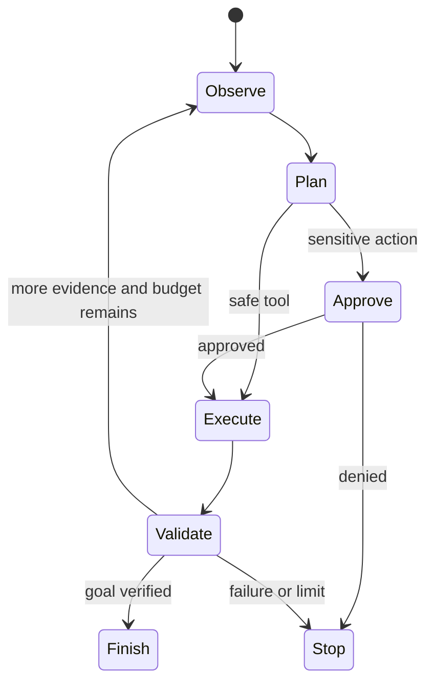

# Agents And Tool Calling

An agent lets a model choose steps and tools dynamically. A deterministic workflow
chooses transitions in trusted code. Prefer the workflow for payments, authorization,
fixed compliance processes and high-volume predictable work.

## Control Plane

Set maximum steps, wall-clock deadline, token/tool/cost budget, concurrency, allowed
tools and termination conditions. Persist workflow state and tool identities for
long-running tasks. Cancellation must propagate to tool calls where possible.

Tool schemas are security boundaries. Validate type, range, enum, ownership and
current business state. Tool results are untrusted input and can contain indirect
prompt injection. Minimize returned data and separate machine status from text.

## Side Effects

Read-only tools are safest. Mutations require server-side authorization, stable
idempotency identity, confirmation for high-impact actions, conditional state
transitions, audit and reconciliation after ambiguous timeouts. Model narration
does not prove the effect occurred.

## Evaluation

Measure tool selection, argument validity, authorization decisions, task completion,
step count, retries, cost, latency and unsafe-action rate. Replay deterministic tool
fixtures; do not call production systems from evaluation datasets.

## When Not To Use An Agent

- the sequence is known and expressible as a state machine;
- no reliable verifier can confirm success;
- the critical path has a strict low-latency SLO;
- tools expose excessive privilege or unbounded data;
- errors affect money, safety or access without human approval/reconciliation.

## Official References

- [Spring AI tool calling](https://docs.spring.io/spring-ai/reference/api/tools.html)
- [Model Context Protocol tools](https://modelcontextprotocol.io/specification/2025-11-25/server/tools)
- [OWASP LLM06:2025 — Excessive Agency](https://genai.owasp.org/llmrisk/llm062025-excessive-agency/)

## Recommended Next Page

Continue with [AI Evaluation And Operations](./AI-EVALUATION-OPERATIONS.md).
