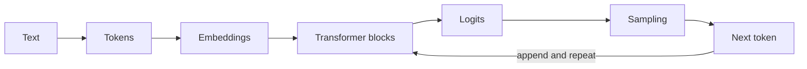

# AI Model Internals And Selection

## From Text To Output

A tokenizer maps text to integer tokens; token boundaries vary by model and affect
cost, context use and truncation. Embeddings turn tokens into vectors. Transformer
blocks combine self-attention, feed-forward layers, normalization and residual
connections. Attention lets each position mix information from permitted earlier
positions; positional information preserves sequence order.

Training adjusts weights to predict data. Instruction tuning and preference
optimization shape behavior. Inference repeatedly computes next-token logits and
selects output. A model does not query a factual database unless the application
provides retrieval or tools.

## Sampling

- **temperature** reshapes probability concentration;
- **top-p** limits selection to a probability-mass nucleus;
- greedy/low-temperature output is more repeatable but not guaranteed deterministic;
- seeds, hardware, batching, provider changes and model revisions can still differ.

Use strict schemas and validation for machine-consumed output. Sampling settings
cannot guarantee truth, authorization or business correctness.

## Context And Inference

Context includes instructions, conversation, retrieved documents, tool definitions
and outputs. Longer context increases compute/cost and can reduce attention quality.
Budget by priority, remove duplication, retrieve narrowly and preserve critical
instructions. KV caching accelerates repeated autoregressive attention but consumes
memory proportional to sequence/model characteristics.

Quantization reduces weight precision and memory, often improving local throughput
at possible quality/compatibility cost. Measure the exact task and hardware.

## Selection Scorecard

| Criterion | Evidence |
|---|---|
| task quality | versioned representative evaluation set |
| structured/tool behavior | valid schema and tool-argument rate |
| latency | time to first token and total p95/p99 |
| context | useful supported window, not advertised maximum alone |
| privacy/residency | retention, training use, region and contractual controls |
| reliability | rate limits, availability, fallback and version policy |
| cost | input/output/cache/tool/retry cost per successful task |
| operations | observability, quotas, safety controls and support |

Start with the smallest model meeting the quality gate, then validate a fallback.
Do not silently switch models when output semantics affect correctness.

## Exercise

Evaluate two models on 50 versioned examples. Record schema validity, correctness,
refusal behavior, p95 latency, tokens and cost. Reject a winner that fails a
mandatory security or residency gate regardless of aggregate score.

## Official References

- [Attention Is All You Need](https://arxiv.org/abs/1706.03762)
- [Hugging Face Transformers documentation](https://huggingface.co/docs/transformers/)
- [Spring AI model API](https://docs.spring.io/spring-ai/reference/api/index.html)

## Recommended Next Page

Continue with [Prompt Engineering And Structured Output](./PROMPT-ENGINEERING-STRUCTURED-OUTPUT.md).
