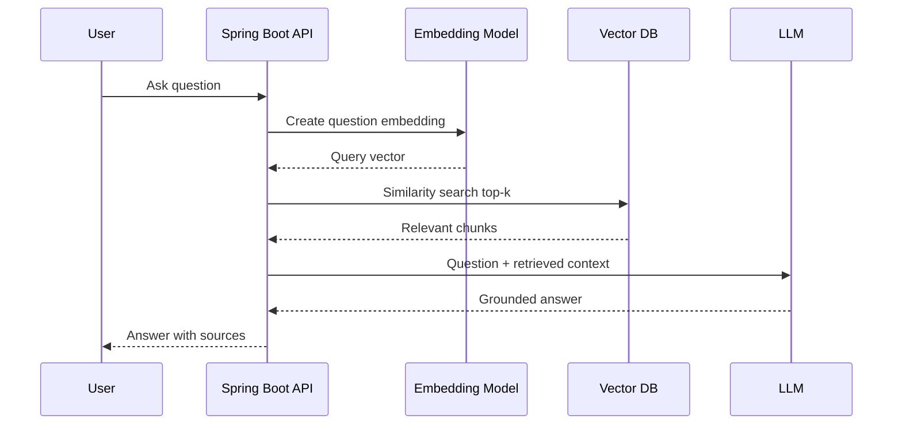

# Embeddings, Vector DB And RAG


## Embeddings

An embedding is a numeric vector that represents the meaning of text.

Example:

```text
"return policy" -> [0.12, -0.45, 0.88, ...]
```

Texts with similar meaning should have nearby vectors.

You do not read the vector directly. The value is useful because mathematical
distance between vectors can approximate semantic similarity.

## Embedding Mental Model

Imagine every text is placed on a map of meaning:

- return policy and refund policy are close
- laptop and gaming laptop are close
- shipping delay and delivery timeline are close
- payment failure and password reset are far apart

Vector search finds nearby items on that map.

## Why Embeddings Are Useful

Normal keyword search matches words. Semantic search matches meaning.

Example:

| User asks | Relevant document may say |
|---|---|
| Can I send back a damaged item? | Return policy for defective products |
| When will my package arrive? | Shipping timelines |
| Do you refund online payments? | Refunds are issued to the original payment method |

These may not share exact keywords, but embeddings can still find related text.

## Similarity Search

Common similarity measures:

| Measure | Simple meaning |
|---|---|
| cosine similarity | compares direction of vectors |
| dot product | compares vector alignment and magnitude |
| Euclidean distance | compares physical distance between points |

For interviews, it is enough to say:

> We convert text into embeddings and use similarity search to find chunks with
> nearby meaning.

## Vector Database

A vector database stores:

- text chunk
- embedding vector
- metadata
- source document
- optional tenant or user scope
- optional created time or version

Example record:

```json
{
  "id": "return-policy-003",
  "text": "Defective products can be returned within 7 days.",
  "embedding": [0.12, -0.45, 0.88],
  "metadata": {
    "source": "return-policy.md",
    "section": "Defective products"
  }
}
```

## What Metadata Is For

Metadata helps restrict retrieval.

| Metadata | Example use |
|---|---|
| `source` | show citations in the answer |
| `documentType` | search only policy documents |
| `tenantId` | prevent cross-tenant data leakage |
| `language` | search only English documents |
| `version` | prefer latest policy version |
| `visibility` | separate public FAQ from admin docs |

Common options:

| Vector DB | Good for |
|---|---|
| PGVector | Simple Postgres-based POC |
| Qdrant | Dedicated vector database, easy local Docker |
| Pinecone | Managed cloud vector DB |
| Elasticsearch/OpenSearch | Hybrid keyword plus vector search |
| Chroma | Local experiments and prototypes |

## RAG

RAG means Retrieval Augmented Generation.


It solves this problem:

> The LLM does not know your private Shopverse documents, latest policies, or
> database state.

RAG flow:



## Why RAG Works

RAG gives the model two things:

1. The user's question.
2. The most relevant trusted context found by retrieval.

The model still generates the answer, but the answer is grounded in documents
that your application selected.

## RAG Ingestion vs Runtime

| Phase | Happens when | Work done |
|---|---|---|
| Ingestion | before questions, or when docs change | load docs, split chunks, embed chunks, store vectors |
| Runtime | when user asks | embed question, search vector DB, build prompt, call LLM |

## Chunking


Chunking means splitting long documents into smaller parts before embedding.

Bad chunk:

```text
Entire 20-page policy document
```

Better chunk:

```text
One section or 300-800 tokens around one topic
```

Chunking rules:

- keep related content together
- avoid tiny chunks with no meaning
- avoid huge chunks that waste context
- add overlap for paragraphs that depend on previous text
- store metadata like source, title, and section

## Chunking Example

Original document:

```text
# Return Policy
Customers may return defective products within 7 days after delivery.
Products must include invoice and original packaging.

# Refund Policy
Refunds are issued to the original payment method after inspection.
```

Possible chunks:

```text
Chunk 1:
Title: Return Policy
Text: Customers may return defective products within 7 days after delivery.
Products must include invoice and original packaging.

Chunk 2:
Title: Refund Policy
Text: Refunds are issued to the original payment method after inspection.
```

Why this is better:

- the return question retrieves only return rules
- the refund question retrieves only refund rules
- citations are clearer
- prompt context stays smaller

## Retrieval Settings

| Setting | Meaning |
|---|---|
| top-k | how many chunks to retrieve |
| similarity threshold | minimum relevance score |
| metadata filter | search only selected document type or tenant |
| hybrid search | combine keyword and vector search |

For a basic POC, start with `topK = 4` or `topK = 5`.

## Retrieval Quality Problems

| Problem | Symptom | Fix |
|---|---|---|
| chunks too large | irrelevant text included | split by headings |
| chunks too small | answer misses context | include neighboring paragraphs or overlap |
| poor metadata | wrong document category retrieved | add filters |
| low-quality documents | vague answers | improve source docs |
| no threshold | weak matches included | require minimum similarity |
| only vector search | misses exact terms like SKU | add hybrid keyword search |

## RAG Limitations

RAG is not automatically correct. Quality depends on:

- document quality
- chunking strategy
- embedding model
- retrieval relevance
- prompt quality
- answer validation

## RAG Prompt Template

```text
You are the Shopverse support assistant.
Use only the context below.
If the answer is missing, say: "I do not know from the provided Shopverse documents."
Return a short answer and list source names.

Context:
{context}

Question:
{question}
```

## Example RAG Response

Question:

```text
Can I return a broken item?
```

Retrieved context:

```text
Source: return-policy.md
Defective products can be returned within 7 days after delivery.
```

Answer:

```text
Yes. Based on the Shopverse return policy, defective products can be returned
within 7 days after delivery.

Sources: return-policy.md
```

## RAG vs Fine-Tuning

| RAG | Fine-tuning |
|---|---|
| Adds external knowledge at request time | Changes model behavior through training |
| Good for private or changing data | Good for style, format, or repeated task behavior |
| Easier to update documents | Harder and costlier to update |
| Common for enterprise Q&A | Not the first choice for simple knowledge updates |

Interview answer:

> I would use RAG when the app needs to answer from private or frequently
> changing data. I would consider fine-tuning when I need the model to follow a
> specialized style or task behavior consistently.

## Interview Diagram To Draw

Draw this quickly on a whiteboard:

```text
Docs -> chunks -> embeddings -> vector DB

User question -> question embedding -> vector search -> context -> LLM -> answer
```

Then explain:

> The first line is ingestion. The second line is runtime question answering.
