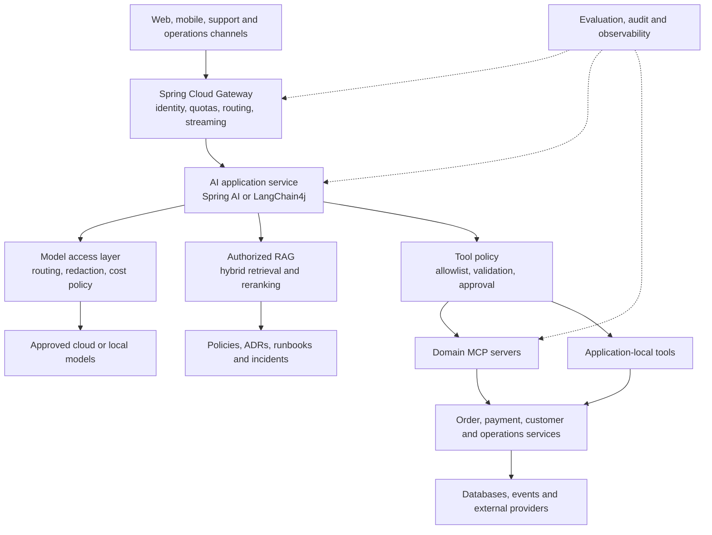
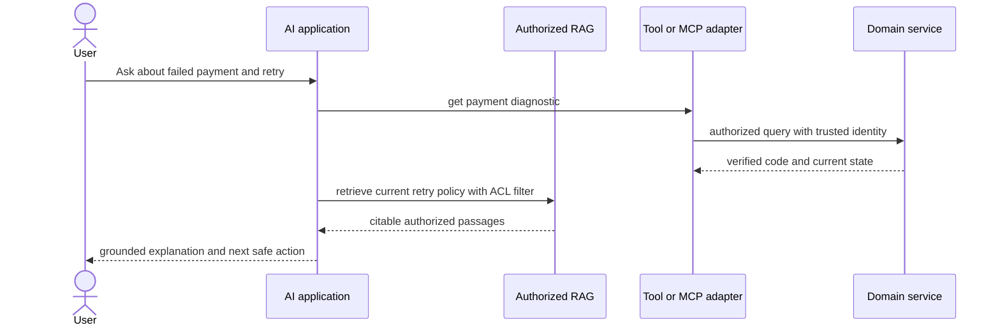

# Enterprise AI Architecture With Spring

This is the umbrella for designing AI-enabled Java and Spring microservices. It
connects LLM fundamentals, prompting, RAG, tools, MCP, Spring AI, Spring Cloud,
LangChain4j, security, evaluation and performance into one production mental
model.


## The Architectural Contract

```text
LLM understands ambiguous intent and explains results.
RAG supplies authorized documentary evidence.
Tools supply current state and narrow actions.
MCP standardizes reusable AI-facing capabilities.
Domain services enforce authorization, invariants and transactions.
Spring Cloud handles distribution, resilience and operational policy.
Humans approve consequential actions.
```

An LLM is not a database, policy engine, authorization server, workflow engine
or transaction manager. Use deterministic code for rules and an LLM where
language or evidence is ambiguous.

## Complete System Map



## Capability Ladder

| Level | Capability | Best first use | Main control |
|---|---|---|---|
| 1 | model invocation | summary or rewrite | input/output limits |
| 2 | structured output | classification and extraction | schema plus domain validation |
| 3 | RAG | answers from private documents | authorization before retrieval |
| 4 | tool calling | live order or payment state | narrow typed tools |
| 5 | controlled workflow | investigate then recommend | transitions owned by code |
| 6 | bounded agent | adaptive investigation | step, time, tool and cost budgets |

Do not advance because a higher level sounds more intelligent. Advance when a
measured use case needs the additional freedom and has a reliable verifier.

## Choose The Right Mechanism

| Requirement | Use | Why |
|---|---|---|
| explain a policy | RAG | documentary, changing and citable knowledge |
| check an order | read tool | current system state |
| calculate refund eligibility | domain service | exact business policy |
| explain eligibility | LLM over verified result | useful language generation |
| reuse a capability across AI hosts | MCP | discovery and protocol interoperability |
| execute a known sequence | workflow/state machine | predictable and testable |
| choose the next investigation from evidence | bounded agent | adaptive path has value |
| enforce access | Spring Security and domain authorization | model output is untrusted |

## The Dedicated Tracks

### Foundations And Retrieval

1. [LLM And Generative AI Fundamentals](./LLM-GENERATIVE-AI-FUNDAMENTALS.md)
2. [Prompt Engineering And Structured Output](./PROMPT-ENGINEERING-STRUCTURED-OUTPUT.md)
3. [RAG Engineering](./RAG-ENGINEERING.md)
4. [Embeddings, Vector Databases And RAG](./EMBEDDINGS-VECTOR-DB-RAG.md)

### Java Frameworks

- [Spring AI Track](./SPRING-AI-UMBRELLA.md) covers `ChatClient`, models,
  advisors, RAG, tools, structured output and observability.
- [LangChain4j Track](./LANGCHAIN4J-UMBRELLA.md) covers AI Services, tools,
  memory, advanced RAG, Spring integration and MCP clients.
- [Spring AI Versus LangChain4j](./SPRING-AI-VS-LANGCHAIN4J.md) is the framework
  decision guide. Prefer one framework within one AI application service.

### Distributed Integration

- [Spring Cloud AI And MCP Ecosystem](./SPRING-CLOUD-AI-MCP-ECOSYSTEM.md)
  places Gateway, Config, Stream, discovery, resilience and observability around
  the AI runtime.
- [Model Context Protocol Track](./MCP-UMBRELLA.md) covers lifecycle,
  primitives, transports, authorization and a Shopverse lab.
- [Agents And Tool Calling](./AGENTS-TOOL-CALLING.md) explains when adaptive
  execution is justified.

### Trust, Quality And Speed

- [Secure AI Agents, Data And Fast Accurate Delivery](./SECURE-AI-AGENTS-DATA-PERFORMANCE.md)
  combines abuse prevention, tenant isolation, secure RAG, MCP controls,
  accuracy gates and latency design.
- [AI Security And Guardrails](./AI-SECURITY-GUARDRAILS.md) provides the
  implementation-level security reference.
- [AI Evaluation And Operations](./AI-EVALUATION-OPERATIONS.md) defines
  retrieval, generation, tool and workflow evaluation.

## Recommended Shopverse Boundary

Do not add model credentials and prompts to every microservice. Build an AI
application service for intent, retrieval and orchestration; expose selected
read-only domain capabilities through application-local tools or domain-owned
MCP adapters; retain authorization and business truth in the existing services.



## Adoption Roadmap

1. Start with summaries, classifications and structured extraction.
2. Add one authorized, bounded RAG corpus with citations and evaluation.
3. Add read-only tools for live state.
4. Add confirmed, idempotent write requests—not autonomous approvals.
5. Introduce MCP when multiple AI clients need reusable capabilities.
6. Add bounded agents only where evidence must determine the next step.

## Definition Of Production Ready

A feature is not production ready until it has authenticated identity,
pre-retrieval authorization, minimized model context, typed outputs, tool
allowlists, hard execution budgets, safe logs, evaluation fixtures, failure
fallbacks, cost ownership and an incident kill switch.

## Official References

- [Spring AI reference](https://docs.spring.io/spring-ai/reference/)
- [Java And Spring MCP](https://docs.spring.io/spring-ai-mcp/reference/overview.html)
- [LangChain4j tutorials](https://docs.langchain4j.dev/category/tutorials/)
- [MCP specification](https://modelcontextprotocol.io/specification/2025-11-25)
- [OWASP GenAI Security Project](https://genai.owasp.org/)

