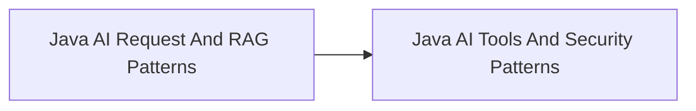

<!-- split-guide-index -->
# Java AI Code Cookbook

<DocLabels items={[{label: 'Focused guides', tone: 'advanced'}, {label: 'Shopverse', tone: 'shopverse'}, {label: 'Architect route', tone: 'production'}]} />

Production-oriented Java patterns for model integration, RAG, tools, and safety. The original long-form material is preserved without duplication across the focused pages below.

<TopicCards items={[
  {title: 'Java AI Request And RAG Patterns', href: '/ai/JAVA-AI-REQUEST-RAG-PATTERNS', description: 'Part 1 of the focused Java AI Code Cookbook learning route.', icon: 'route', tags: ['Focused', 'Advanced']},
  {title: 'Java AI Tools And Security Patterns', href: '/ai/JAVA-AI-TOOLS-SECURITY-PATTERNS', description: 'Part 2 of the focused Java AI Code Cookbook learning route.', icon: 'security', tags: ['Focused', 'Advanced']},
]} />

<DocCallout type="tip" title="Use the index as the stable entry point">

Each focused page owns one concern. Cross-links point to the canonical explanation instead of repeating the same material.

</DocCallout>

## Recommended Learning Order

1. [Java AI Request And RAG Patterns](./JAVA-AI-REQUEST-RAG-PATTERNS.md)
2. [Java AI Tools And Security Patterns](./JAVA-AI-TOOLS-SECURITY-PATTERNS.md)

## Reading Strategy

Use **Java AI Code Cookbook** as a decision and verification guide inside **Java AI Code Cookbook**. Start by naming the invariant or operational outcome, then follow the runtime flow and identify the owning component. For every example, record the expected success evidence, the most important failure mode, and the metric or test that proves recovery. This keeps the material useful for implementation reviews, production incidents, and architect interviews instead of treating it as isolated syntax.

Within **Java AI Code Cookbook**, apply the Shopverse guidance incrementally: verify the current behavior, introduce one bounded change, test the unhappy path, and preserve a rollback or reconciliation route. Follow links to canonical pages when a concept belongs to another track; do not copy that explanation into this page. This ownership rule keeps the focused guides short while retaining technical depth and traceability.

## Official References

- [LangChain4j documentation](https://docs.langchain4j.dev/)
- [Spring AI reference](https://docs.spring.io/spring-ai/reference/)
